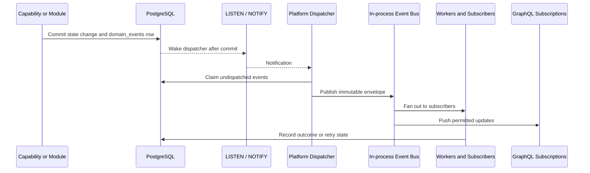

<!--
File: docs/engineering/guides/meg-002-event-driven-runtime/20-v2-event-backbone.md
Document: MEG-002
Status: Draft
-->

# v2 Event Backbone

> **Current direction:** Mosaic uses a PostgreSQL transactional outbox, PostgreSQL `LISTEN`/`NOTIFY` as a wake-up signal, an in-process Go Event Bus for fan-out and GraphQL subscriptions for connected clients.

## Ownership

The Platform owns event transport, envelopes, routing, durability, delivery, retry, replay, observability and subscription lifecycle.

Modules own domain event meaning, payloads, visibility, versioning and the business transitions that produce facts. Modules do not coordinate directly with one another or create parallel event buses.

## Event Path

`LISTEN`/`NOTIFY` is only a wake-up mechanism. It is not the source of truth and losing a notification must not lose an event. The dispatcher always queries PostgreSQL for undispatched rows.

## Transactional Outbox

Any state transition that creates a domain fact must write the state change and its `domain_events` row in the same PostgreSQL transaction.

This prevents the dual-write failure in which state commits without an event or an event is published for state that later rolls back.

An outbox record should include:

- immutable event envelope;
- event status;
- attempt count;
- next-attempt timestamp;
- first and last dispatch timestamps;
- last failure reason; and
- optional dead-letter reference.

Undispatched records remain recoverable after process failure. The Supervisor may restart the Platform, after which the dispatcher resumes from durable rows.

## Delivery Semantics

Mosaic uses at-least-once delivery. Consumers MUST be idempotent and MUST use the event identifier or an equivalent deduplication key when applying side effects.

Exactly-once business effects are not promised by the Event Bus. A subscriber should commit its state change and its consumer checkpoint or deduplication record atomically where correctness requires it.

Ordering is scoped. The Platform may preserve ordering for a declared aggregate or partition key, but consumers must tolerate duplicates, retries, restarts and unrelated events arriving first.

## Retry And Dead Letters

Transient subscriber failures are retried with bounded backoff and jitter. Permanent failures, exhausted retry budgets and invalid payloads move to dead-letter handling.

Dead-letter records remain inspectable and replayable by authorised operators. Replay must use the original immutable event and the current subscriber policy; it must not mutate event history.

## Event Classes

The backbone carries:

- domain facts such as `NodeImported`, `PartHealthChanged` and `UserProgressUpdated`;
- Platform lifecycle facts such as Module activation and configuration changes; and
- internal worker or projection events where visibility is explicitly private.

CRUD-shaped row notifications are not domain events. A domain event describes a meaningful fact that downstream capabilities can understand.

## GraphQL And Client Updates

GraphQL subscriptions may consume permitted events from the in-process bus. The GraphQL layer projects those events into semantic client updates; it does not expose the outbox or database notification channel directly.

The same event may therefore drive background work, projections and live Shell updates without requiring separate notification systems.

## Background Jobs

Long-running or retryable work uses the Platform-owned PostgreSQL jobs table and worker pool. Jobs are claimed with transactional locking, carry retry state and become dead-letter work after bounded exhaustion.

Modules request jobs through SDK contracts. They do not create unmanaged worker loops or bypass Platform scheduling and observability.

## Required Guarantees

- state changes and their required domain events commit atomically;
- losing a notification never loses a durable event;
- delivery is at least once;
- subscribers are idempotent;
- retry and dead-letter state is observable;
- event history is immutable;
- Module event meaning remains Module-owned; and
- one Platform event backbone serves built-in and Module capabilities.

