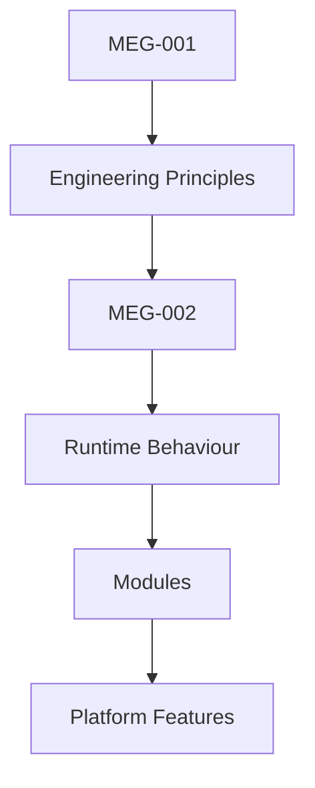
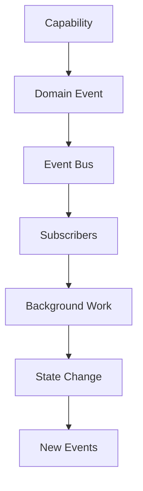

<!--
File: docs/engineering/guides/meg-002-event-driven-runtime/index.md
Document: MEG-002
Status: Draft
-->

# MEG-002 — Event-Driven Runtime

> *Software should not ask what happened. It should be told.*

> **Current v2 direction:** The event backbone is defined by [20 — v2 Event Backbone](20-v2-event-backbone.md) and the envelope/ownership rules in [MIP-001 — Event Protocol](../../protocols/mip-001-event-protocol/index.md).

---

# Purpose

The Mosaic Runtime is built upon an event-driven architecture. Rather than components communicating directly through tightly coupled service calls, the runtime is composed of autonomous capabilities that communicate through events, and that indirection is what enables loose coupling, high cohesion, horizontal scalability, module interoperability, background processing, reactive workflows, independent deployment and progressive capability growth. Unlike traditional request-driven architectures, the Mosaic Runtime therefore treats events as the primary mechanism through which the platform coordinates work.

---

# Relationship to MEG



[MEG-001](../meg-001-go-engineering-standards/index.md) defines **how software is engineered**, whereas MEG-002 defines **how software behaves once it is running**. Together they establish the engineering foundation of the Mosaic platform.

---

# Scope

This specification defines event philosophy, runtime lifecycle, event contracts, event naming, event versioning, publishers, subscribers, the event bus, worker lifecycle, scheduling, retry strategy, idempotency, event ordering, correlation IDs, backpressure, observability, runtime resilience, and the PostgreSQL transactional outbox and dispatcher wake-up.

It intentionally does **not** define business domains, HTTP APIs, storage architecture, the Module SDK, deployment or infrastructure. These concerns are defined by later MEG specifications.

---

# Guiding Question

MEG-002 exists to answer one question.

> **How should independently developed capabilities coordinate work within the Mosaic Runtime?**

---

# Runtime Statement

Within Mosaic:

> **Capabilities publish facts. Other capabilities decide whether they care.**

A capability should never need to know who consumes an event, how many consumers exist, what work those consumers perform, or whether any consumer exists at all. This separation allows the platform to evolve without creating unnecessary coupling between capabilities.

---

# Runtime Hierarchy

The Mosaic Runtime intentionally separates event processing into conceptual layers.



Every layer owns exactly one responsibility, and future chapters define each layer in detail.

---

# Expected Outcome

After reading MEG-002 contributors should understand why Mosaic is event-driven, when events should be published, how events are named, how subscribers behave, how retries work, how failures are handled, how background workers integrate with the runtime, and how independent modules cooperate without direct dependencies — all without discussing any individual business domain.

---

# Repository Structure

```text
docs/
└── engineering/guides/
    └── meg-002-event-driven-runtime/
        index.md
        00-document-control.md
        01-runtime-philosophy.md
        02-why-events.md
        03-event-model.md
        04-event-naming.md
        05-event-schema.md
        06-event-versioning.md
        07-event-bus.md
        08-publishers.md
        09-subscribers.md
        10-worker-lifecycle.md
        11-scheduling.md
        12-idempotency.md
        13-retry-strategy.md
        14-event-ordering.md
        15-backpressure.md
        16-correlation-and-observability.md
        17-runtime-shutdown.md
        18-adrs.md
        19-contributor-guidance.md
        20-v2-event-backbone.md
        references.md
        glossary.md
```

---

# Dependencies

Required reading:

- [MEG-001 — Go Engineering Standards](../meg-001-go-engineering-standards/index.md)
- [MDL-002 — Principles](../../../design/language/mdl-002-principles/index.md)
- [MDL-003 — Mental Model](../../../design/language/mdl-003-mental-model/index.md)

Companion specifications:

- [MEG-003 — Domain-Driven Design](../meg-003-domain-driven-design/index.md)
- [MEG-004 — Hexagonal Architecture](../meg-004-hexagonal-architecture/index.md)
- [MEG-005 — Runtime Architecture](../meg-005-runtime-architecture/index.md)
- [MEG-006 — Module Platform](../meg-006-module-platform/index.md)

---

# Design Goals

The Event-Driven Runtime is intended to produce a platform that is reactive, decoupled, observable, resilient, extensible, scalable, testable, deterministic and fault tolerant. The runtime should encourage independent capability evolution while preserving architectural consistency across the entire Mosaic ecosystem.
