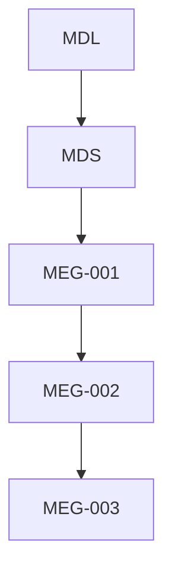
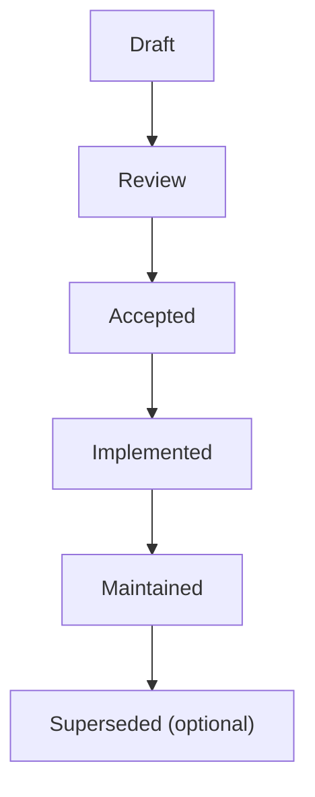

<!--
File: docs/engineering/guides/meg-003-domain-driven-design/00-document-control.md
Document: MEG-003
Status: Draft
Version: 0.4
-->

# Document Control

---

# Document Information

| Field | Value |
|---------|--------|
| Document ID | MEG-003 |
| Title | Domain-Driven Design |
| File | 00-document-control.md |
| Status | Draft |
| Version | 0.4 |
| Owner | AdamNi-7080 |
| Classification | Internal Architecture Specification |

---

# Purpose

This document establishes the governance, authority and lifecycle of the Mosaic Domain-Driven Design specification.

MEG-003 defines the canonical approach to modelling business domains throughout the Mosaic platform.

Unlike implementation documentation, this specification defines how business complexity is understood, organised and communicated.

It intentionally separates business thinking from implementation thinking.

---

# Authority

MEG-003 is the authoritative specification governing business modelling within the Mosaic ecosystem.

This specification applies to:

- Mosaic Platform
- First-party Modules
- Third-party Modules
- SDK Development
- Runtime Capabilities
- Future Platform Features

Every business capability introduced into Mosaic SHOULD align with the modelling principles defined within this specification.

---

# Relationship to Other Specifications

MEG specifications intentionally build upon one another.

Specifically:

- **MDL** defines product philosophy.
- **MDS** defines presentation.
- **[MEG-001](../meg-001-go-engineering-standards/index.md)** defines engineering practices.
- **[MEG-002](../meg-002-event-driven-runtime/index.md)** defines runtime behaviour.
- **MEG-003** defines business modelling.

Future specifications use the domain model established here as the foundation for architectural boundaries.

---

# Normative Language

Unless explicitly stated otherwise, the following keywords are interpreted according to RFC 2119.

| Keyword | Meaning |
|----------|---------|
| **MUST** | Mandatory requirement. |
| **MUST NOT** | Prohibited behaviour. |
| **SHOULD** | Strong recommendation. Deviation requires architectural justification. |
| **SHOULD NOT** | Discouraged except where clearly justified. |
| **MAY** | Optional behaviour based upon engineering judgement. |

Examples and diagrams are informative unless explicitly identified as normative.

---

# Domain Principles

The Mosaic domain model is built upon several foundational principles.

- Business language comes first.
- Software reflects the business.
- Every concept has one meaning within one context.
- Contexts own their own models.
- Business behaviour belongs inside the domain.
- Technical concerns remain outside the domain.
- Domain models evolve continuously as understanding improves.
- Simplicity is preferred over theoretical completeness.

Every subsequent chapter expands one or more of these principles.

---

# Document Lifecycle

MEG specifications evolve alongside the platform.

Each document progresses through the following lifecycle.

Accepted specifications become part of the canonical Mosaic architecture.

Historical versions SHOULD remain available for future reference.

---

# Domain Evolution

Business understanding is expected to evolve.

Consequently, the domain model will evolve.

Changes affecting:

- bounded contexts
- ubiquitous language
- aggregates
- business ownership
- domain relationships
- core business concepts

SHOULD be accompanied by an Architectural Decision Record (ADR).

The evolution of the business model should remain deliberate and historically traceable.

---

# Compliance

All business capabilities SHOULD comply with MEG-003.

Where deviation becomes necessary, the repository SHOULD document:

- the reason
- business motivation
- architectural implications
- migration strategy

Temporary deviations should eventually be removed.

Permanent deviations should generally result in updates to this specification.

---

# Design Philosophy

MEG-003 intentionally favours:

- business-first thinking
- explicit ownership
- cohesive models
- bounded complexity
- expressive language
- evolutionary modelling

The domain model should become deeper as the platform matures.

It should never become more technical.

This follows the central ideas of Domain-Driven Design: focusing on the Platform foundation domain, collaborating around a ubiquitous language and modelling within explicitly bounded contexts.  [Google Books](https://books.google.com/books/about/Domain_Driven_Design_Reference.html?id=ccRsBgAAQBAJ)

---

# Scope of Authority

MEG-003 governs business modelling.

It does **not** define:

- runtime execution
- event delivery
- scheduling
- transport protocols
- storage technologies
- deployment architecture

Those concerns belong to other MEG specifications.

Separating business modelling from technical implementation allows each to evolve independently.
