<!--
File: docs/engineering/guides/meg-003-domain-driven-design/01-domain-philosophy.md
Document: MEG-003
Status: Draft
Version: 0.4
-->

# Domain Philosophy

> *Software exists to solve business problems. The domain exists before the software, and should continue to make sense without it.*

---

# Purpose

The purpose of Domain-Driven Design is not to introduce architectural patterns.

It is to build software that accurately reflects how the business understands itself.

Within Mosaic, the business is not:

- HTTP
- PostgreSQL
- Events
- Modules
- Workers

The business is:

- Libraries
- Media
- Playback
- Metadata
- Collections
- Users
- Devices

Everything else exists to support those concepts.

This document establishes the philosophical foundation upon which every future domain model within Mosaic will be built.

---

# Philosophy

Within Mosaic:

> **The business defines the software. The software must never define the business.**

Engineers should resist the temptation to model implementation details.

Instead they should model the concepts that exist regardless of technology.

If Mosaic were rewritten tomorrow in another language, the domain should remain recognisable.

The implementation changes.

The business does not.

---

# What Is A Domain?

A domain is the area of knowledge the software exists to support.

Examples include:

```

Banking
```

```

Healthcare
```

```

Retail
```

For Mosaic:

```

Media Management
```

The domain includes every concept required to organise, discover, consume and manage personal media.

Everything else supports that purpose.

---

# Business Before Technology

One of the easiest mistakes engineers make is allowing technology to shape the domain.

Poor.

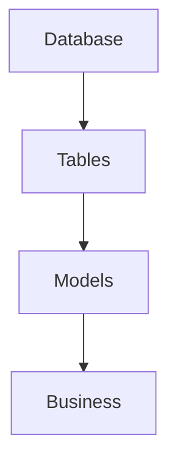

Preferred.

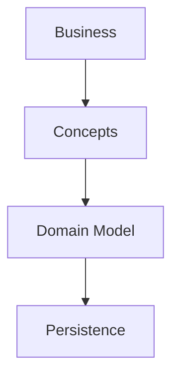

The database stores the domain.

It does not define it.

Likewise:

- APIs expose the domain.
- Events describe the domain.
- Modules extend the domain.

None of them create it.

---

# The Domain Is The Product

Within Mosaic, the domain **is** the product.

Users do not care that:

- PostgreSQL exists
- DuckDB exists
- Workers exist
- Event buses exist

They care about:

- their library
- watch history
- recommendations
- metadata
- collections

The architecture should therefore optimise for expressing those concepts clearly.

---

# Deep Models

A domain model should become deeper over time.

Early understanding.

```

Media
```

Later understanding.

```

Movie

Series

Episode

Season

Collection
```

Even later.

```

Watched

In Progress

Abandoned

Favourite

Continue Watching
```

The model should evolve as understanding grows.

It should never be considered complete.

Eric Evans describes Domain-Driven Design as an iterative process where the model and the ubiquitous language continuously evolve together.  [Google Books](https://books.google.com/books/about/Domain_Driven_Design_Reference.html?id=ccRsBgAAQBAJ)

---

# The Cost Of Technical Thinking

Many systems accidentally model implementation rather than business.

Examples.

```

MediaDTO
```

```

MediaEntity
```

```

MediaRecord
```

```

MediaRow
```

None of these describe the business.

They describe implementation.

The domain should instead contain:

```

Media
```

Technical concerns belong elsewhere.

---

# Software Should Read Like The Business

A business expert should recognise domain terminology.

For example.

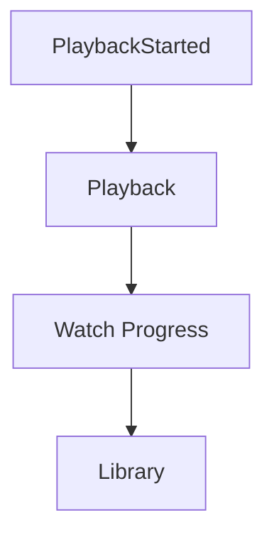

These concepts make sense to a product owner.

Contrast with:

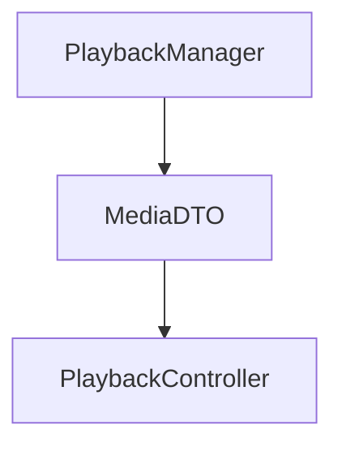

These names primarily communicate implementation.

The software should speak the language of the business wherever possible.

---

# The Domain Is Not CRUD

Many applications begin with CRUD.

```

Create

Read

Update

Delete
```

CRUD describes data manipulation.

It does not describe business behaviour.

For example:

```

PlaybackCompleted
```

is far richer than:

```

Update Playback Record
```

Business behaviour should drive modelling.

CRUD naturally follows.

Not the other way around.

---

# The Domain Is Not The Database

A common mistake is equating domain models with persistence models.

Example.

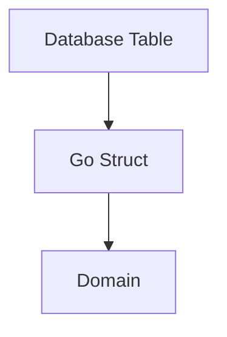

Instead.

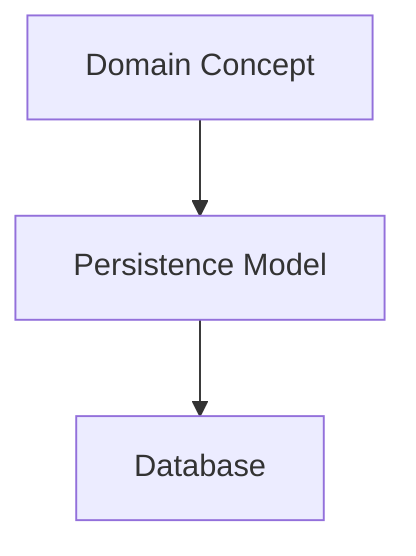

Persistence exists to support the domain.

It should never constrain it unnecessarily.

---

# The Domain Is Not The UI

Likewise:

User interfaces should project the domain.

They should not define it.

Example.

```

Continue Watching
```

is a business concept.

It may appear:

- on the Web
- on Android
- on iOS
- on TV

The UI presents it.

The domain owns it.

---

# Business Behaviour Lives In The Domain

Business rules belong with business concepts.

Example.

Poor.

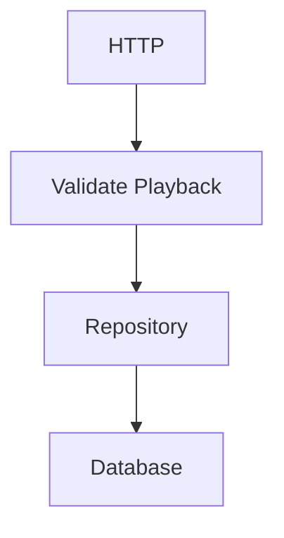

Preferred.

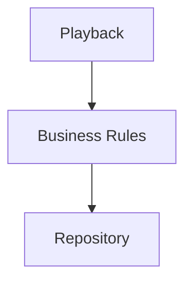

The domain should enforce its own rules.

Infrastructure merely supports them.

---

# Model Behaviour

Many systems model data.

Mosaic models behaviour.

Instead of:

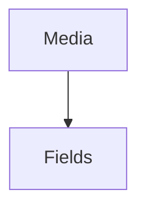

Think:

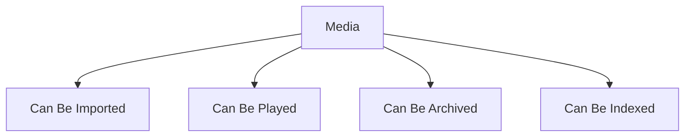

The domain is defined by what concepts **do**, not merely what they contain.

---

# Business Concepts Have Owners

Every concept belongs somewhere.

Examples.

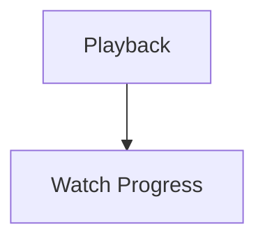

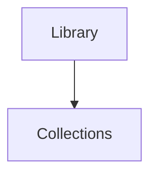

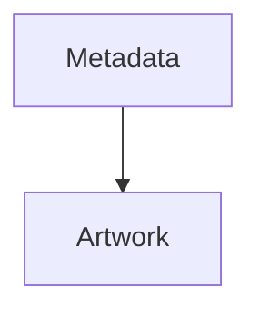

Ownership should remain explicit.

If multiple capabilities own the same concept, the model requires refinement.

---

# Evolution Is Expected

The first domain model is rarely correct.

Understanding improves through:

- implementation
- discussion
- user feedback
- operational experience

The domain should therefore evolve continuously.

Changing the domain model is not failure.

It is evidence that understanding has improved.

---

# Simplicity

Domain models should remain as simple as possible.

Avoid modelling:

- hypothetical futures
- technical abstractions
- unnecessary hierarchies

Every concept should justify its existence through business value.

Complexity should emerge from the business.

Never from the architecture.

---

# Mosaic Principles

Within Mosaic:

- Business concepts come before technical concepts.
- The domain defines the software.
- The domain is independent of infrastructure.
- Behaviour is more important than data.
- Models evolve continuously.
- Business ownership remains explicit.
- The software should speak the language of the business.
- Simplicity should always be preferred over unnecessary sophistication.

These principles guide every future modelling decision within the platform.

---

# Relationship to MEG

The previous specifications established:

- how software is written
- how software executes

MEG-003 begins answering a different question.

> **What exactly is the software modelling?**

Everything that follows builds upon this philosophical foundation.

The remaining chapters explain how that philosophy becomes an explicit, maintainable domain model.

---

# Summary

The purpose of Domain-Driven Design is not to introduce Entities, Aggregates or Repositories.

Those are merely tools.

The true objective is much simpler.

> **Create software that speaks the language of the business so naturally that the code itself becomes a model of the domain.**

When the software reflects the business rather than the technology, understanding becomes easier, change becomes cheaper and architecture becomes significantly more resilient.
