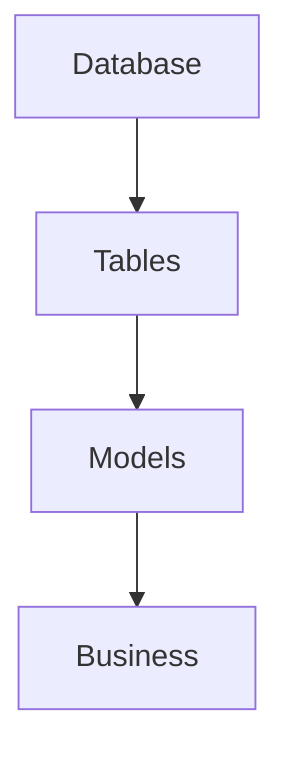
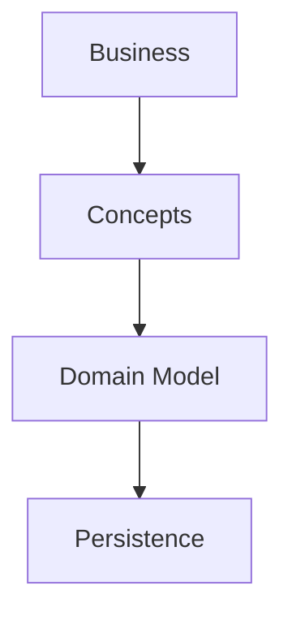
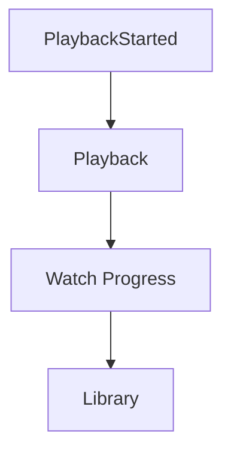
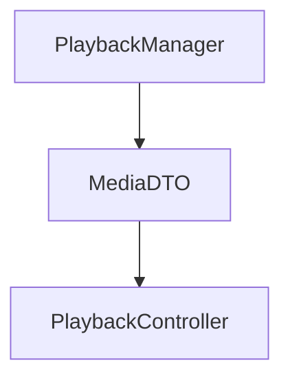
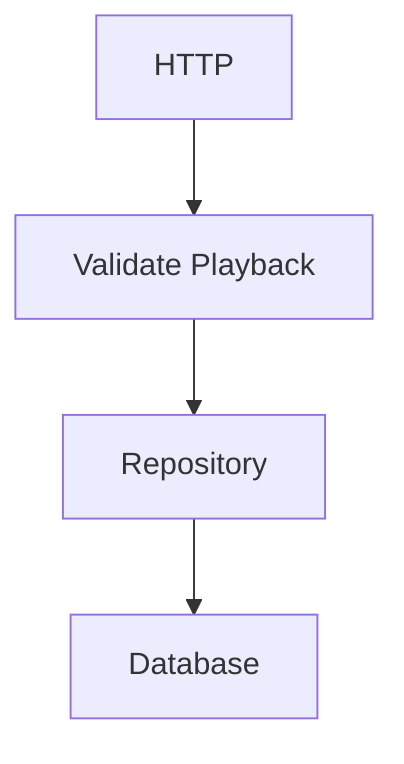
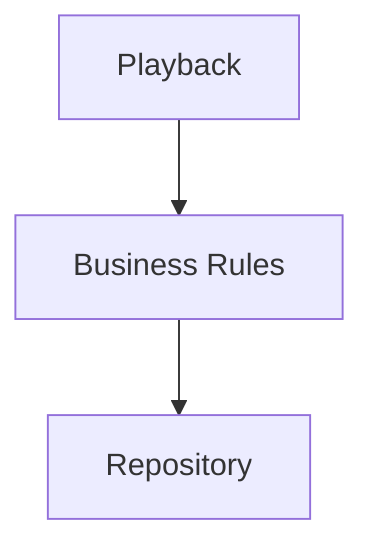
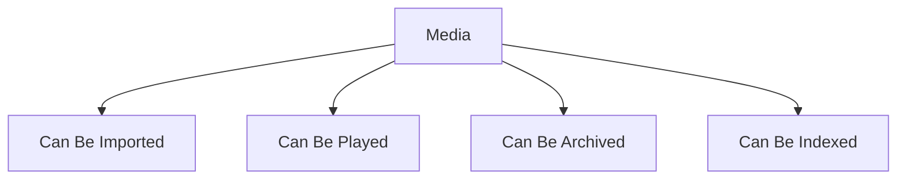

<!--
File: docs/engineering/guides/meg-003-domain-driven-design/01-domain-philosophy.md
Document: MEG-003
Status: Draft
-->

# Domain Philosophy

> *Software exists to solve business problems. The domain exists before the software, and should continue to make sense without it.*

---

# Purpose

The purpose of Domain-Driven Design is not to introduce architectural patterns. It is to build software that accurately reflects how the business understands itself, which begins with being honest about what the business actually is. Within Mosaic the business is not HTTP, PostgreSQL, Events, Modules or Workers. The business is:

- Libraries
- Media
- Playback
- Metadata
- Collections
- Users
- Devices

Everything else exists to support those concepts.

This document establishes the philosophical foundation upon which every future domain model within Mosaic will be built.

---

# Philosophy

Within Mosaic:

> **The business defines the software. The software must never define the business.**

Engineers should resist the temptation to model implementation details, and should instead model the concepts that exist regardless of technology. The test is straightforward: if Mosaic were rewritten tomorrow in another language, the domain should remain recognisable.

The implementation changes. The business does not.

---

# What Is A Domain?

A domain is the area of knowledge the software exists to support, and other industries make the idea concrete — Banking, Healthcare and Retail are all domains in exactly this sense. For Mosaic the domain is Media Management. It includes every concept required to organise, discover, consume and manage personal media, and everything else supports that purpose.

---

# Business Before Technology

One of the easiest mistakes engineers make is allowing technology to shape the domain. The poor arrangement begins at the storage layer and works outwards.

The preferred arrangement reverses the direction entirely, starting from the business and reaching persistence last.

The database stores the domain; it does not define it. The same holds for everything else that touches the model: APIs expose the domain, events describe it and Modules extend it, but none of them create it.

---

# The Domain Is The Product

Within Mosaic, the domain **is** the product. Users do not care that PostgreSQL exists, that DuckDB exists, that workers exist or that event buses exist. They care about:

- their library
- watch history
- recommendations
- metadata
- collections

The architecture should therefore optimise for expressing those concepts clearly.

---

# Deep Models

A domain model should become deeper over time. Early understanding might recognise nothing more specific than Media. Later understanding separates that into Movie, Series, Episode, Season and Collection, and later still the model gains the states a viewer actually experiences — Watched, In Progress, Abandoned, Favourite and Continue Watching. None of these refinements arrived from a technical requirement; each arrived because the business was understood better than before.

The model should evolve as understanding grows, and it should never be considered complete. Eric Evans describes Domain-Driven Design as an iterative process where the model and the ubiquitous language continuously evolve together.  [Google Books](https://books.google.com/books/about/Domain_Driven_Design_Reference.html?id=ccRsBgAAQBAJ)

---

# The Cost Of Technical Thinking

Many systems accidentally model implementation rather than business, and the symptom is usually visible in the names. MediaDTO, MediaEntity, MediaRecord and MediaRow describe none of the business; they describe the mechanism that happens to be carrying it. The domain should instead contain Media, and technical concerns belong elsewhere.

---

# Software Should Read Like The Business

A business expert should recognise domain terminology, so the flow from a started playback through to the library reads as a description of what the product does.

These concepts make sense to a product owner. Contrast them with a chain assembled out of implementation vocabulary.

These names primarily communicate implementation, and a product owner reading them learns nothing about the product. The software should speak the language of the business wherever possible.

---

# The Domain Is Not CRUD

Many applications begin with Create, Read, Update and Delete. CRUD describes data manipulation, but it does not describe business behaviour, which is why PlaybackCompleted is a far richer statement than Update Playback Record. The first names something that happened in the business; the second names something that happened to a row.

Business behaviour should drive modelling, and CRUD naturally follows from it rather than the other way around.

---

# The Domain Is Not The Database

A common mistake is equating domain models with persistence models: a database table becomes a Go struct, and the Go struct is then treated as the domain. The dependency should run the other way, from domain concept to persistence model to database. Persistence exists to support the domain, and it should never constrain it unnecessarily.

---

# The Domain Is Not The UI

The same argument applies to the surfaces users touch. User interfaces should project the domain, not define it, because a concept is not created by the screen that happens to display it. Continue Watching is a business concept, and it may appear:

- on the Web
- on Android
- on iOS
- on TV

The UI presents it. The domain owns it.

---

# Business Behaviour Lives In The Domain

Business rules belong with business concepts. Where they do not, validation drifts outwards until it sits beside the transport layer.

The preferred arrangement keeps the rules where the concept lives.

The domain should enforce its own rules, and infrastructure merely supports them.

---

# Model Behaviour

Many systems model data, describing Media as a set of Fields and stopping there. Mosaic models behaviour instead, which produces a very different picture of the same concept.

The domain is defined by what concepts **do**, not merely what they contain.

---

# Business Concepts Have Owners

Every concept belongs somewhere, and the ownership is usually obvious once it is stated: Playback owns Watch Progress, Library owns Collections, and Metadata owns Artwork. Ownership should remain explicit, because if multiple capabilities own the same concept the model requires refinement.

---

# Evolution Is Expected

The first domain model is rarely correct. Understanding improves through:

- implementation
- discussion
- user feedback
- operational experience

The domain should therefore evolve continuously. Changing the domain model is not failure. It is evidence that understanding has improved.

---

# Simplicity

Domain models should remain as simple as possible, which means avoiding the modelling of hypothetical futures, technical abstractions and unnecessary hierarchies. Every concept should justify its existence through business value. Complexity should emerge from the business and never from the architecture.

---

# Mosaic Principles

Within Mosaic:

- Business concepts come before technical concepts.
- The domain defines the software.
- The domain is independent of infrastructure.
- Behaviour is more important than data.
- Models evolve continuously.
- Business ownership remains explicit.
- The software should speak the language of the business.
- Simplicity should always be preferred over unnecessary sophistication.

These principles guide every future modelling decision within the platform.

---

# Relationship to MEG

The previous specifications established how software is written and how software executes. MEG-003 begins answering a different question.

> **What exactly is the software modelling?**

Everything that follows builds upon this philosophical foundation. The remaining chapters explain how that philosophy becomes an explicit, maintainable domain model.

---

# Summary

The purpose of Domain-Driven Design is not to introduce Entities, Aggregates or Repositories, because those are merely tools. The true objective is much simpler.

> **Create software that speaks the language of the business so naturally that the code itself becomes a model of the domain.**

When the software reflects the business rather than the technology, understanding becomes easier, change becomes cheaper and architecture becomes significantly more resilient.
