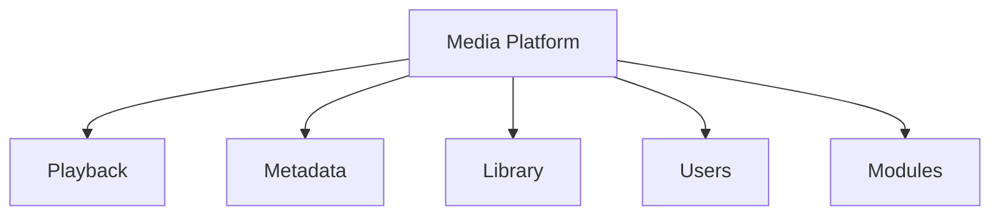
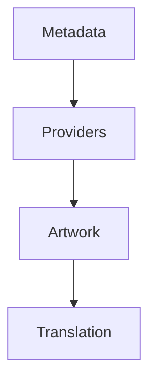
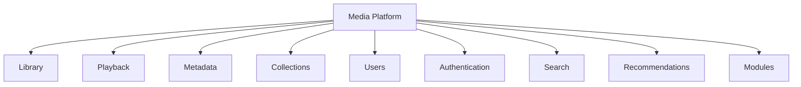

<!--
File: docs/engineering/guides/meg-003-domain-driven-design/03-subdomains.md
Document: MEG-003
Status: Draft
-->

# Subdomains

> *Not every part of the business deserves the same architectural attention. Great software invests where it creates the greatest business value.*

---

# Purpose

The Mosaic platform encompasses many different business capabilities, among them Media Libraries, Metadata, Playback, Authentication, Search, Recommendations, Modules, Users and Analytics. Treating every capability as equally important inevitably wastes engineering effort, so Domain-Driven Design instead encourages identifying different categories of business capability based upon their strategic value. This document defines how Mosaic identifies, categorises and prioritises its subdomains.

---

# Philosophy

Within Mosaic:

> **Engineering effort should reflect business importance.**

Some capabilities define the identity of the platform whereas others simply support it, and recognising this distinction allows engineering effort to be invested where it provides the greatest long-term value.

---

# What Is A Subdomain?

A subdomain is an identifiable area of business responsibility within the overall domain. The Mosaic domain is Media Management, and within that domain exist many subdomains: Playback, Metadata, Libraries, Users, Search, Collections, Recommendations and Modules. Each subdomain owns one coherent business capability.

---

# Why Subdomains Exist

Without subdomains a media platform becomes one huge model in which everything is interconnected, understanding decreases and coupling increases. Partitioning the platform instead gives every capability a place of its own.

Complexity becomes naturally partitioned, and each area evolves independently.

---

# Strategic Design

Domain-Driven Design distinguishes between different kinds of subdomains, and within Mosaic these categories determine engineering investment, architectural ownership, implementation quality and module opportunities. Not every capability deserves the same level of sophistication. This classification is a key part of Evans' strategic design, helping teams focus effort on the areas that provide the greatest competitive advantage. ([books.google.com](https://books.google.com/books/about/Domain_Driven_Design_Reference.html?id=ccRsBgAAQBAJ))

---

# Core Domain

The Core Domain represents the primary reason Mosaic exists and defines the platform's competitive advantage, so Core Domains should receive the strongest architecture, the highest engineering quality, the greatest testing investment and the clearest business modelling. These capabilities should rarely be delegated to external systems.

---

# Mosaic Core Domains

Three subdomains are currently considered Core Domains, and each one is a capability the user experience depends upon directly.

Library is responsible for organising media, media ownership, media identity and user collections.

---

Playback is responsible for media playback, progress tracking, playback state and synchronisation.

---

Metadata is responsible for metadata ownership, artwork, external providers and metadata enrichment. These three domains define the user experience, and they therefore define the platform.

---

# Supporting Domains

Supporting Domains enable the Core Domain. They remain important; they simply do not define Mosaic's unique value. Authentication, Notifications, Search and Import are examples, and each should remain cohesive, independent and replaceable. Engineering quality remains important, but architectural complexity should remain proportional to the value the capability carries.

---

# Generic Domains

Generic Domains solve common technical problems, such as Logging, Metrics, Configuration, Blob Storage and Scheduling. These capabilities rarely differentiate Mosaic, so whenever practical they should leverage existing libraries, established standards and proven implementations, which keeps engineering effort focused upon the Core Domain instead.

---

# Strategic Investment

Engineering effort should roughly follow the priority Core Domain, then Supporting Domain, then Generic Domain. Core Domains deserve custom solutions and Generic Domains usually do not, and observing that ordering is what prevents unnecessary engineering effort.

---

# Domain Ownership

Every subdomain must have a clearly defined owner, so Playback belongs to the Playback Team and Metadata to the Metadata Team. Ownership answers who evolves the model, who defines terminology, who owns events and who owns invariants. Shared ownership generally indicates unclear boundaries.

---

# Independent Evolution

Subdomains should evolve independently, so if Recommendations changes dramatically, Playback should require little or no modification. Boundaries should naturally isolate change, and that isolation is what reduces maintenance costs.

---

# Capability Alignment

Within Mosaic, every capability should align with exactly one primary subdomain: a Metadata Module aligns with the Metadata Domain, rather than with Metadata plus Playback plus Users at once. Cross-domain capabilities usually indicate unclear responsibilities.

---

# Event Ownership

Subdomains own their own events, so Playback owns PlaybackStarted and Metadata owns MetadataFetched. Other subdomains may subscribe to those events, but they should never redefine ownership of them.

---

# Storage Ownership

Likewise, every subdomain owns its own business state. It is poor practice for Playback to modify Metadata tables; Playback should instead publish an event, after which Metadata updates itself. State ownership follows domain ownership.

---

# Module Alignment

Modules should extend domains rather than replace them, so a Recommendation Module aligns with the Recommendation Domain. Modules integrate naturally because the domain boundaries already exist, and the module model therefore reinforces the domain model.

---

# Domain Boundaries

Every subdomain should answer:

> **What business capability do I own?**

Equally important:

> **What business capability do I explicitly not own?**

Good boundaries define both.

---

# Signs Of Poor Subdomains

Poor boundaries are easiest to recognise by their symptoms, and the following usually indicate poor modelling.

- Constant cross-domain modifications.
- Shared business state.
- Shared terminology.
- Circular dependencies.
- Multiple owners.
- Frequent architectural disagreement.

These symptoms usually indicate boundaries require refinement.

---

# Evolving Subdomains

Subdomains are expected to evolve, because understanding naturally increases. Metadata began as a single subdomain, and later concerns emerged within it.

Subdomains may split, but they should rarely merge, because growing understanding generally produces more precise boundaries.

---

# Example Mosaic Domain Map

Taken together, the subdomains identified so far produce the following map of the platform.

This is **not** the implementation architecture; it is the business architecture, and implementation follows later.

---

# Mosaic Guidelines

Within Mosaic:

- Every capability must belong to a subdomain.
- Every subdomain must own one business capability.
- Core Domains should receive the greatest engineering investment.
- Supporting Domains should enable Core Domains.
- Generic Domains should leverage existing solutions where practical.
- Business state must remain owned by its domain.
- Events must follow domain ownership.
- Domain boundaries should evolve as business understanding improves.

---

# Relationship to MEG

Subdomains partition the business, and the next chapter introduces the mechanism that allows each subdomain to maintain its own independent model. Those mechanisms are known as **Bounded Contexts**. Subdomains answer:

> **What business capabilities exist?**

Bounded Contexts answer:

> **Where does each business model begin and end?**

---

# Summary

Subdomains divide complexity into meaningful business capabilities, which allows Mosaic to invest engineering effort intelligently, isolate change, define ownership, scale development and grow through modules. The platform becomes easier to evolve because every capability has a clearly defined place within the business, and architecture becomes a reflection of the business itself.
