<!--
File: docs/engineering/guides/meg-003-domain-driven-design/03-subdomains.md
Document: MEG-003
Status: Draft
Version: 0.4
-->

# Subdomains

> *Not every part of the business deserves the same architectural attention. Great software invests where it creates the greatest business value.*

---

# Purpose

The Mosaic platform encompasses many different business capabilities.

Examples include:

- Media Libraries
- Metadata
- Playback
- Authentication
- Search
- Recommendations
- Modules
- Users
- Analytics

Treating every capability as equally important inevitably wastes engineering effort.

Domain-Driven Design instead encourages identifying different categories of business capability based upon their strategic value.

This document defines how Mosaic identifies, categorises and prioritises its subdomains.

---

# Philosophy

Within Mosaic:

> **Engineering effort should reflect business importance.**

Some capabilities define the identity of the platform.

Others simply support it.

Recognising this distinction allows engineering effort to be invested where it provides the greatest long-term value.

---

# What Is A Subdomain?

A subdomain is an identifiable area of business responsibility within the overall domain.

The Mosaic domain is:

```

Media Management
```

Within that domain exist many subdomains.

Examples include:

```

Playback

Metadata

Libraries

Users

Search

Collections

Recommendations

Modules
```

Each subdomain owns one coherent business capability.

---

# Why Subdomains Exist

Without subdomains:

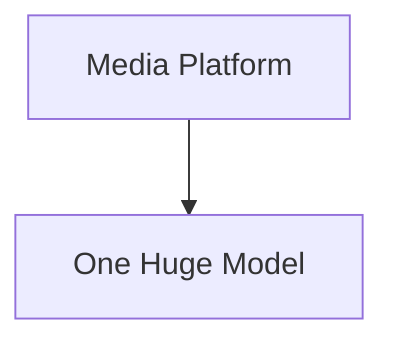

Everything becomes interconnected.

Understanding decreases.

Coupling increases.

Instead:

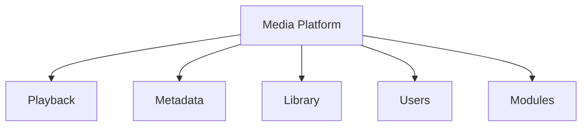

Complexity becomes naturally partitioned.

Each area evolves independently.

---

# Strategic Design

Domain-Driven Design distinguishes between different kinds of subdomains.

Within Mosaic these categories determine:

- engineering investment
- architectural ownership
- implementation quality
- module opportunities

Not every capability deserves the same level of sophistication.

This classification is a key part of Evans' strategic design, helping teams focus effort on the areas that provide the greatest competitive advantage. ([books.google.com](https://books.google.com/books/about/Domain_Driven_Design_Reference.html?id=ccRsBgAAQBAJ))

---

# Core Domain

The Core Domain represents the primary reason Mosaic exists.

It defines the platform's competitive advantage.

Core Domains should receive:

- the strongest architecture
- the highest engineering quality
- the greatest testing investment
- the clearest business modelling

These capabilities should rarely be delegated to external systems.

---

# Mosaic Core Domains

The following are currently considered Core Domains.

```

Library
```

Responsible for:

- organising media
- media ownership
- media identity
- user collections

---

```

Playback
```

Responsible for:

- media playback
- progress tracking
- playback state
- synchronisation

---

```

Metadata
```

Responsible for:

- metadata ownership
- artwork
- external providers
- metadata enrichment

These domains define the user experience.

They therefore define the platform.

---

# Supporting Domains

Supporting Domains enable the Core Domain.

They remain important.

They simply do not define Mosaic's unique value.

Examples include:

```

Authentication
```

```

Notifications
```

```

Search
```

```

Import
```

Supporting domains should remain:

- cohesive
- independent
- replaceable

Engineering quality remains important.

Architectural complexity should remain proportional.

---

# Generic Domains

Generic Domains solve common technical problems.

Examples include:

```

Logging
```

```

Metrics
```

```

Configuration
```

```

Blob Storage
```

```

Scheduling
```

These capabilities rarely differentiate Mosaic.

Whenever practical they should leverage:

- existing libraries
- established standards
- proven implementations

Engineering effort should remain focused upon the Core Domain instead.

---

# Strategic Investment

Engineering effort should roughly follow this priority.

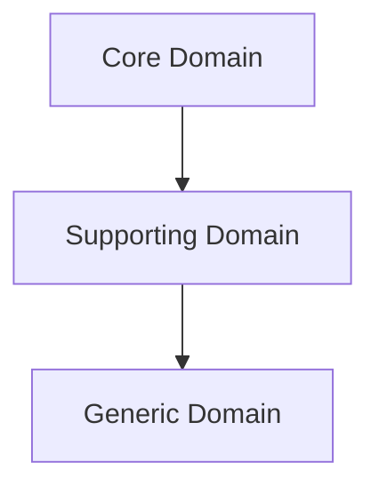

Core Domains deserve custom solutions.

Generic Domains usually do not.

This principle prevents unnecessary engineering effort.

---

# Domain Ownership

Every subdomain MUST have a clearly defined owner.

Example.

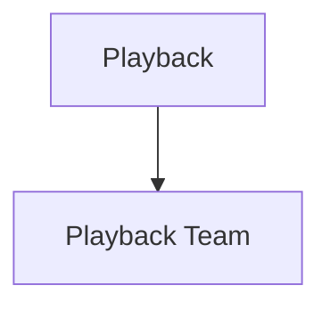

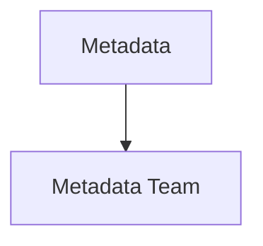

Ownership answers:

- who evolves the model
- who defines terminology
- who owns events
- who owns invariants

Shared ownership generally indicates unclear boundaries.

---

# Independent Evolution

Subdomains should evolve independently.

Suppose:

```

Recommendations
```

changes dramatically.

```

Playback
```

should require little or no modification.

Boundaries should naturally isolate change.

This reduces maintenance costs.

---

# Capability Alignment

Within Mosaic:

Every capability should align with exactly one primary subdomain.

Example.

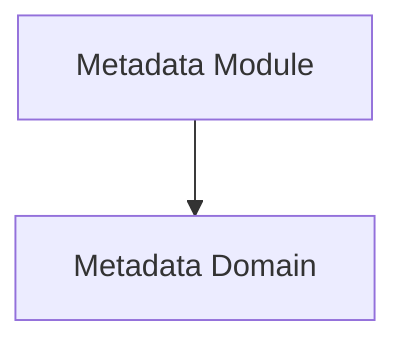

Not:

```

Metadata

+

Playback

+

Users
```

Cross-domain capabilities usually indicate unclear responsibilities.

---

# Event Ownership

Subdomains own their own events.

Examples.

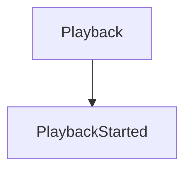

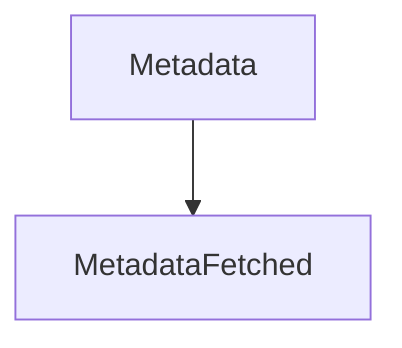

Other subdomains may subscribe.

They should never redefine ownership.

---

# Storage Ownership

Likewise:

Every subdomain owns its own business state.

Poor.

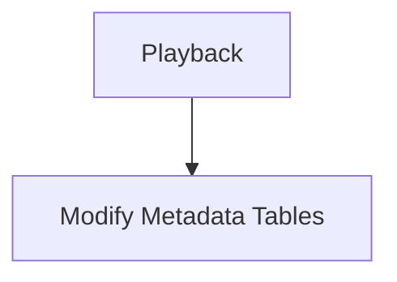

Preferred.

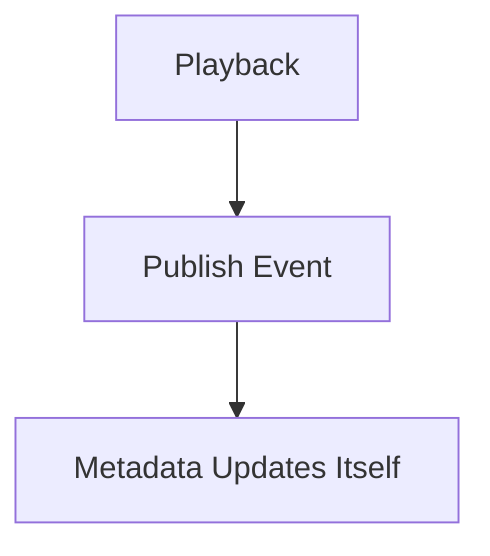

State ownership follows domain ownership.

---

# Module Alignment

Modules should extend domains.

Not replace them.

Example.

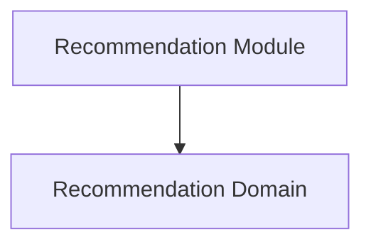

Modules integrate naturally because the domain boundaries already exist.

The module model therefore reinforces the domain model.

---

# Domain Boundaries

Every subdomain should answer:

> **What business capability do I own?**

Equally important:

> **What business capability do I explicitly not own?**

Good boundaries define both.

---

# Signs Of Poor Subdomains

The following usually indicate poor modelling.

- Constant cross-domain modifications.
- Shared business state.
- Shared terminology.
- Circular dependencies.
- Multiple owners.
- Frequent architectural disagreement.

These symptoms usually indicate boundaries require refinement.

---

# Evolving Subdomains

Subdomains are expected to evolve.

Example.

Initially.

```

Metadata
```

Later.

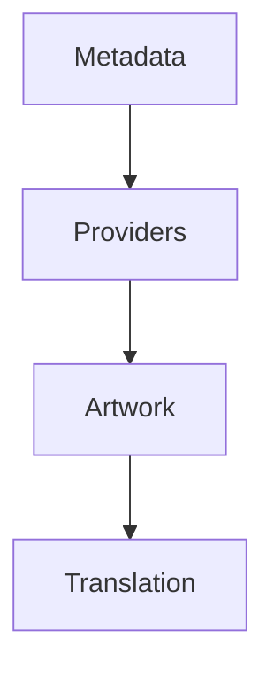

Understanding naturally increases.

Subdomains may split.

They should rarely merge.

Growing understanding generally produces more precise boundaries.

---

# Example Mosaic Domain Map

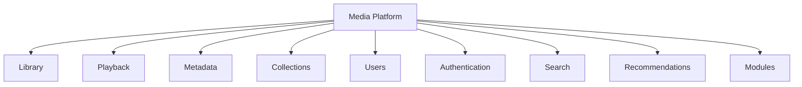

This is **not** the implementation architecture.

It is the business architecture.

Implementation follows later.

---

# Mosaic Guidelines

Within Mosaic:

- Every capability MUST belong to a subdomain.
- Every subdomain MUST own one business capability.
- Core Domains SHOULD receive the greatest engineering investment.
- Supporting Domains SHOULD enable Core Domains.
- Generic Domains SHOULD leverage existing solutions where practical.
- Business state MUST remain owned by its domain.
- Events MUST follow domain ownership.
- Domain boundaries SHOULD evolve as business understanding improves.

---

# Relationship to MEG

Subdomains partition the business.

The next chapter introduces the mechanism that allows each subdomain to maintain its own independent model.

Those mechanisms are known as **Bounded Contexts**.

Subdomains answer:

> **What business capabilities exist?**

Bounded Contexts answer:

> **Where does each business model begin and end?**

---

# Summary

Subdomains divide complexity into meaningful business capabilities.

They allow Mosaic to:

- invest engineering effort intelligently
- isolate change
- define ownership
- scale development
- grow through modules

The platform becomes easier to evolve because every capability has a clearly defined place within the business.

Architecture becomes a reflection of the business itself.
