<!--
File: docs/engineering/guides/meg-003-domain-driven-design/04-bounded-contexts.md
Document: MEG-003
Status: Draft
-->

# Bounded Contexts

> *A model only makes sense within the boundary in which its language is valid.*

---

# Purpose

As software grows, different areas of the business naturally develop different models.

The word:

```

Library
```

may mean one thing to media management.

It may mean something entirely different to recommendation generation.

Attempting to force every part of a system to share a single universal model inevitably produces ambiguity, coupling and increasing complexity.

Bounded Contexts solve this problem.

They define the explicit boundaries within which a domain model remains valid.

This document establishes how Bounded Contexts are identified, designed and maintained throughout the Mosaic platform.

---

# Philosophy

Within Mosaic:

> **Every business model is correct within its own boundary.**

There is no single "global domain model."

Instead, Mosaic consists of many independently evolving models.

Each model exists only within the context that owns it.

Outside that context, translation may be required.

---

# What Is A Bounded Context?

A Bounded Context is an explicit boundary around a domain model.

Inside the boundary:

- terminology has one meaning
- business rules are consistent
- ownership is unambiguous

Outside the boundary:

Those assumptions no longer apply.

The boundary therefore protects the integrity of the model.

---

# Why Bounded Contexts Exist

Imagine modelling the entire Mosaic platform as one domain.

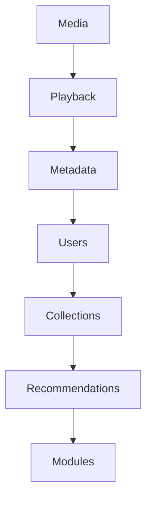

Eventually:

- concepts collide
- ownership becomes unclear
- changes ripple everywhere

Instead:

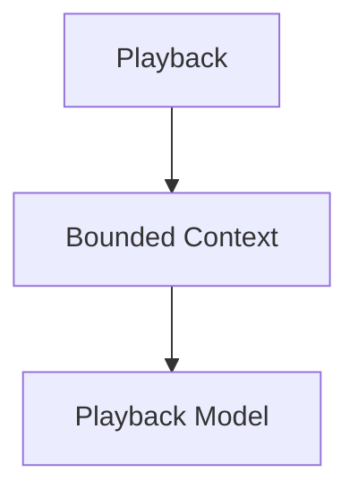

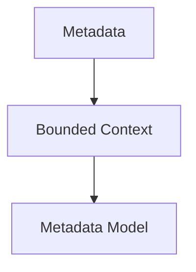

Each model evolves independently.

---

# Context Defines Meaning

Consider the word:

```

Library
```

Within the Library Context it means:

> A user's organised collection of media.

Within a hypothetical Module Marketplace it might mean:

> A repository of installable capabilities.

Both meanings are correct.

Because they exist in different contexts.

Context gives language meaning.

Without context, language becomes ambiguous.

---

# One Model Per Context

Every Bounded Context owns exactly one canonical domain model.

Example.

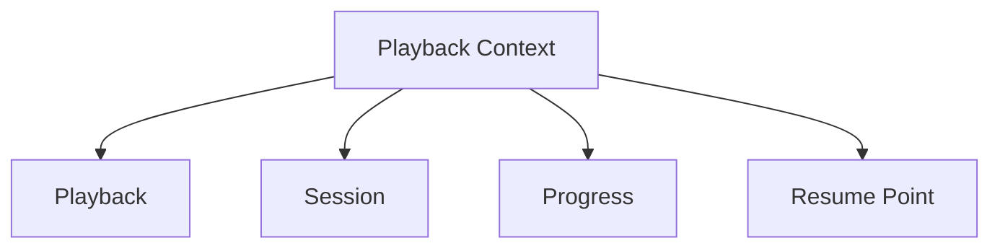

Those concepts belong exclusively to Playback.

Metadata should never redefine them.

---

# Context Ownership

Every Bounded Context has exactly one owner.

Examples.

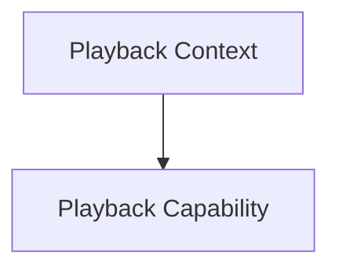

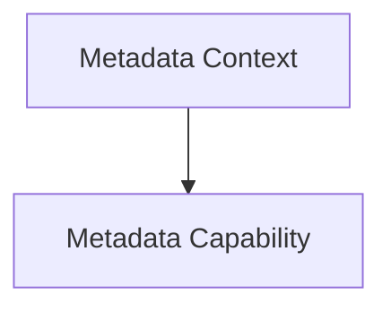

Ownership answers:

- who defines terminology
- who owns business rules
- who owns persistence
- who publishes events

Shared ownership usually indicates poorly defined boundaries.

---

# Independence

Contexts should evolve independently.

Suppose:

```

Metadata
```

changes provider strategy.

Playback should remain unaffected.

The boundary prevents implementation details from leaking between contexts.

Reducing this coupling is one of the principal goals of bounded contexts in Domain-Driven Design. ([martinfowler.com](https://martinfowler.com/bliki/BoundedContext.html))

---

# Context Boundaries

Every Bounded Context owns:

- language
- business rules
- entities
- value objects
- aggregates
- repositories
- domain events

Everything inside the boundary belongs to that context.

Everything outside belongs elsewhere.

---

# Context Interaction

Contexts communicate through well-defined contracts.

Within Mosaic those contracts are typically:

- domain events
- public interfaces
- module APIs

Contexts SHOULD NOT communicate through:

- shared databases
- shared models
- direct knowledge of internal state

Boundaries should remain explicit.

---

# Shared Database Does Not Mean Shared Context

Two contexts may use the same physical database.

They do **not** therefore share a model.

Poor.

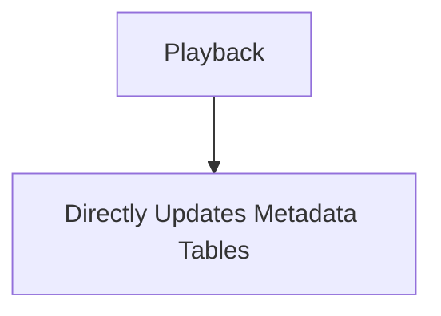

Preferred.

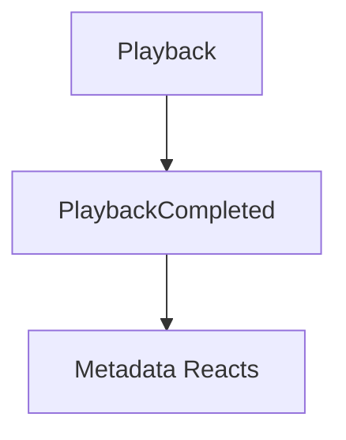

Database topology should never define architectural boundaries.

---

# Context Translation

Sometimes concepts must cross boundaries.

Example.

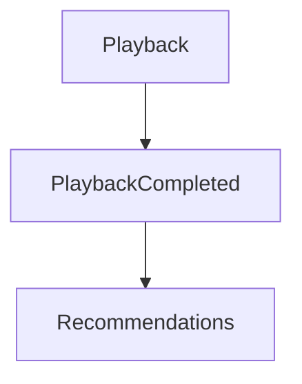

Recommendations should interpret the event using its own model.

It should not adopt Playback's internal concepts.

Translation protects both contexts from unnecessary coupling.

---

# Context Autonomy

Each context should be capable of evolving independently.

Examples.

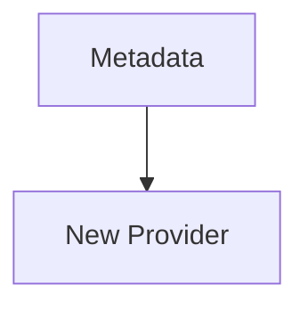

Should not require:

```

Playback Changes
```

Likewise:

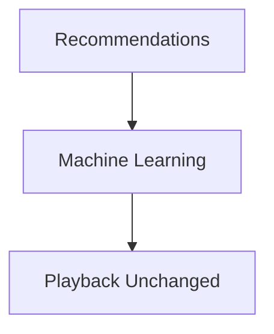

Autonomy enables long-term evolution.

---

# Context Size

Contexts should remain cohesive.

Poor.

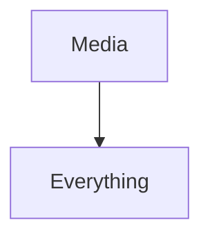

Better.

```

Playback
```

```

Metadata
```

```

Library
```

Too-large contexts become mini-monoliths.

Too-small contexts create unnecessary complexity.

The boundary should reflect genuine business responsibility.

---

# Context Language

Within a Bounded Context:

Every concept has exactly one meaning.

Example.

Playback.

```

Resume Point
```

Metadata should not define:

```

Resume Point
```

unless it genuinely owns the concept.

Language follows ownership.

---

# Domain Events Cross Boundaries

Events are the preferred mechanism for communicating between contexts.

Example.

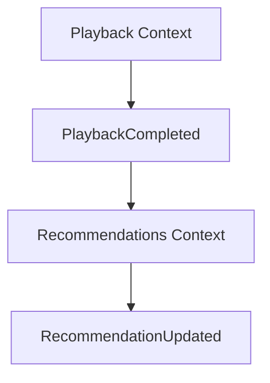

Neither context understands the other's internal model.

Events become the contract.

---

# Modules And Contexts

Modules should align with one primary Bounded Context.

Example.

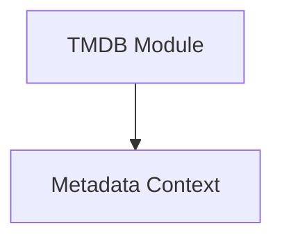

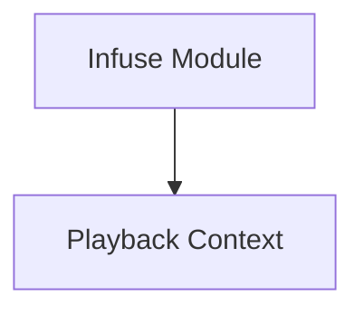

Modules should not simultaneously own multiple unrelated business models.

If they do, their responsibilities should be reconsidered.

---

# Context Boundaries Are Stronger Than Packages

A package is a code organisation mechanism.

A Bounded Context is a business boundary.

One Bounded Context may contain many packages.

Those packages should all describe the same business model.

Implementation follows the context.

Not the other way around.

---

# Signs Of A Healthy Context

Healthy contexts exhibit:

- clear ownership
- cohesive terminology
- independent evolution
- explicit contracts
- minimal coupling
- stable boundaries

Engineers should be able to explain the responsibility of a context in one sentence.

---

# Signs Of A Weak Context

The following usually indicate boundary problems.

- shared entities
- shared repositories
- direct database access
- duplicated ownership
- circular dependencies
- constantly changing terminology

When these symptoms appear, revisit the business model before changing the implementation.

---

# Example Mosaic Context Map

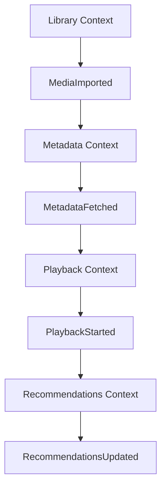

Notice:

Every context owns its own model.

Communication occurs through events.

Not shared objects.

---

# Mosaic Guidelines

Within Mosaic:

- Every domain model MUST belong to one Bounded Context.
- Every Bounded Context MUST have one owner.
- Language MUST remain consistent within the context.
- Business rules MUST remain inside the owning context.
- Contexts SHOULD communicate through events.
- Shared models SHOULD be avoided.
- Shared databases MUST NOT imply shared ownership.
- Context boundaries SHOULD evolve only through deliberate architectural review.

---

# Relationship to MEG

Subdomains identify:

> **What business capabilities exist?**

Bounded Contexts define:

> **Where each business model is valid.**

The next chapter introduces **Context Maps**, which describe how those independent contexts relate to one another across the Mosaic platform.

---

# Summary

Bounded Contexts are one of the most important concepts in Domain-Driven Design.

They protect the integrity of business models by ensuring that:

- language remains consistent
- ownership remains explicit
- change remains isolated
- architecture remains understandable

Within Mosaic, every capability grows safely because every domain model has a clearly defined boundary.

Without boundaries, there is only one large model.

With boundaries, there is a platform.
