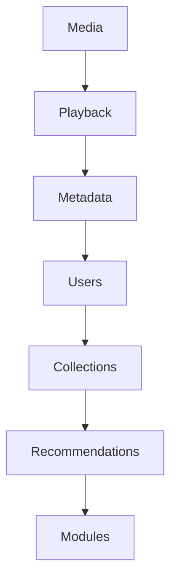
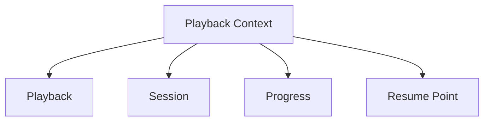
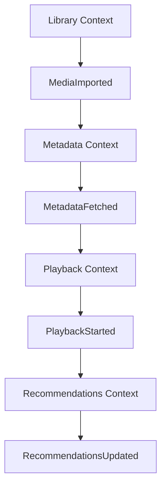

<!--
File: docs/engineering/guides/meg-003-domain-driven-design/04-bounded-contexts.md
Document: MEG-003
Status: Draft
-->

# Bounded Contexts

> *A model only makes sense within the boundary in which its language is valid.*

---

# Purpose

As software grows, different areas of the business naturally develop different models. The word Library may mean one thing to media management and something entirely different to recommendation generation, and neither meaning is wrong. Attempting to force every part of a system to share a single universal model inevitably produces ambiguity, coupling and increasing complexity.

Bounded Contexts solve this problem by defining the explicit boundaries within which a domain model remains valid. This document establishes how they are identified, designed and maintained throughout the Mosaic platform.

---

# Philosophy

Within Mosaic:

> **Every business model is correct within its own boundary.**

There is no single "global domain model." Mosaic instead consists of many independently evolving models, each existing only within the context that owns it, so translation may be required outside that context.

---

# What Is A Bounded Context?

A Bounded Context is an explicit boundary around a domain model. Inside the boundary:

- terminology has one meaning
- business rules are consistent
- ownership is unambiguous

Outside the boundary those assumptions no longer apply, which is precisely why the boundary matters: it protects the integrity of the model by declaring where its guarantees stop.

---

# Why Bounded Contexts Exist

Imagine modelling the entire Mosaic platform as one domain.

Eventually concepts collide, ownership becomes unclear and changes ripple everywhere. Drawing a boundary instead gives Playback its own Bounded Context holding the Playback model, and Metadata its own Bounded Context holding the Metadata model, so each model evolves independently rather than dragging the others along with it.

---

# Context Defines Meaning

Consider the word Library once more. Within the Library Context it means:

> A user's organised collection of media.

Within a hypothetical Module Marketplace it might mean:

> A repository of installable capabilities.

Both meanings are correct, because they exist in different contexts. Context is what gives language meaning, and without it language becomes ambiguous.

---

# One Model Per Context

Every Bounded Context owns exactly one canonical domain model, which is what allows a term to be resolved without asking who is speaking.

Those concepts belong exclusively to Playback, so Metadata should never redefine them.

---

# Context Ownership

Every Bounded Context has exactly one owner: the Playback Context is owned by the Playback Capability, and the Metadata Context by the Metadata Capability. Ownership answers:

- who defines terminology
- who owns business rules
- who owns persistence
- who publishes events

Shared ownership usually indicates poorly defined boundaries, because a boundary that two capabilities both claim cannot answer any of those four questions consistently.

---

# Independence

Contexts should evolve independently. Suppose Metadata changes provider strategy — Playback should remain unaffected, because the boundary prevents implementation details from leaking between contexts. Reducing this coupling is one of the principal goals of bounded contexts in Domain-Driven Design. ([martinfowler.com](https://martinfowler.com/bliki/BoundedContext.html))

---

# Context Boundaries

Every Bounded Context owns:

- language
- business rules
- entities
- value objects
- aggregates
- repositories
- domain events

Everything inside the boundary belongs to that context and everything outside belongs elsewhere, which makes the boundary a statement of ownership rather than a suggestion about code layout.

---

# Context Interaction

Contexts communicate through well-defined contracts. Within Mosaic those contracts are typically:

- domain events
- public interfaces
- module APIs

Contexts should not communicate through shared databases, shared models or direct knowledge of internal state, because each of those mechanisms lets one context's internal decisions become another context's constraints. Boundaries should therefore remain explicit.

---

# Shared Database Does Not Mean Shared Context

Two contexts may use the same physical database, but they do **not** therefore share a model. It is poor practice for Playback to directly update Metadata tables; Playback should instead publish PlaybackCompleted and let Metadata react to it. Database topology should never define architectural boundaries.

---

# Context Translation

Sometimes concepts must cross boundaries — Playback publishes PlaybackCompleted, and Recommendations consumes it. Recommendations should interpret that event using its own model rather than adopting Playback's internal concepts, because translation at the boundary protects both contexts from unnecessary coupling.

---

# Context Autonomy

Each context should be capable of evolving independently. Adding a new provider to Metadata should not require Playback changes, and Recommendations adopting Machine Learning should leave Playback unchanged. Autonomy of this kind is what enables long-term evolution.

---

# Context Size

Contexts should remain cohesive. A single Media context that owns everything is poor; Playback, Metadata and Library as separate contexts is better. Too-large contexts become mini-monoliths and too-small contexts create unnecessary complexity, so the boundary should reflect genuine business responsibility rather than a preferred number of contexts.

---

# Context Language

Within a Bounded Context every concept has exactly one meaning. Resume Point belongs to Playback, so Metadata should not define Resume Point unless it genuinely owns the concept. Language follows ownership.

---

# Domain Events Cross Boundaries

Events are the preferred mechanism for communicating between contexts. The Playback Context publishes PlaybackCompleted, the Recommendations Context consumes it and subsequently publishes RecommendationUpdated, and neither context understands the other's internal model. The events become the contract.

---

# Modules And Contexts

Modules should align with one primary Bounded Context: the TMDB Module belongs to the Metadata Context and the Infuse Module to the Playback Context. Modules should not simultaneously own multiple unrelated business models, and if they do their responsibilities should be reconsidered.

---

# Context Boundaries Are Stronger Than Packages

A package is a code organisation mechanism whereas a Bounded Context is a business boundary. One Bounded Context may contain many packages, but those packages should all describe the same business model. Implementation follows the context, not the other way around.

---

# Signs Of A Healthy Context

Healthy contexts exhibit:

- clear ownership
- cohesive terminology
- independent evolution
- explicit contracts
- minimal coupling
- stable boundaries

These properties share a single practical test: engineers should be able to explain the responsibility of a context in one sentence.

---

# Signs Of A Weak Context

The following usually indicate boundary problems.

- shared entities
- shared repositories
- direct database access
- duplicated ownership
- circular dependencies
- constantly changing terminology

When these symptoms appear, revisit the business model before changing the implementation, because each of them describes a boundary drawn in the wrong place rather than code written badly.

---

# Example Mosaic Context Map

Notice that every context owns its own model and that communication occurs through events rather than shared objects.

---

# Mosaic Guidelines

Within Mosaic:

- Every domain model must belong to one Bounded Context.
- Every Bounded Context must have one owner.
- Language must remain consistent within the context.
- Business rules must remain inside the owning context.
- Contexts should communicate through events.
- Shared models should be avoided.
- Shared databases must not imply shared ownership.
- Context boundaries should evolve only through deliberate architectural review.

---

# Relationship to MEG

Subdomains identify:

> **What business capabilities exist?**

Bounded Contexts define:

> **Where each business model is valid.**

The next chapter introduces **Context Maps**, which describe how those independent contexts relate to one another across the Mosaic platform.

---

# Summary

Bounded Contexts are one of the most important concepts in Domain-Driven Design. They protect the integrity of business models by ensuring that:

- language remains consistent
- ownership remains explicit
- change remains isolated
- architecture remains understandable

Within Mosaic, every capability grows safely because every domain model has a clearly defined boundary. Without boundaries there is only one large model; with boundaries there is a platform.
