<!--
File: docs/engineering/guides/meg-003-domain-driven-design/05-context-maps.md
Document: MEG-003
Status: Draft
Version: 0.4
-->

# Context Maps

> *Bounded Contexts define where models are valid. Context Maps define how those models collaborate.*

---

# Purpose

A Mosaic platform consists of many independent Bounded Contexts.

Examples include:

- Library
- Metadata
- Playback
- Recommendations
- Authentication
- Modules

Although each context evolves independently, they rarely exist in complete isolation.

Business capabilities inevitably collaborate.

Without explicitly modelling those relationships, dependencies gradually become informal, undocumented and increasingly difficult to maintain.

Context Maps make those relationships explicit.

---

# Philosophy

Within Mosaic:

> **Contexts collaborate through defined relationships. They never depend upon accidental ones.**

Every relationship between two Bounded Contexts should be:

- intentional
- documented
- understandable
- independently evolvable

No context should become tightly coupled simply because implementation made it convenient.

---

# What Is A Context Map?

A Context Map describes the relationships between Bounded Contexts.

It answers questions such as:

- Which context owns this concept?
- Which context depends upon another?
- How do they communicate?
- Who translates between models?
- Where are architectural boundaries?

Context Maps describe architecture.

Not implementation.

---

# Why Context Maps Matter

Without explicit relationships:

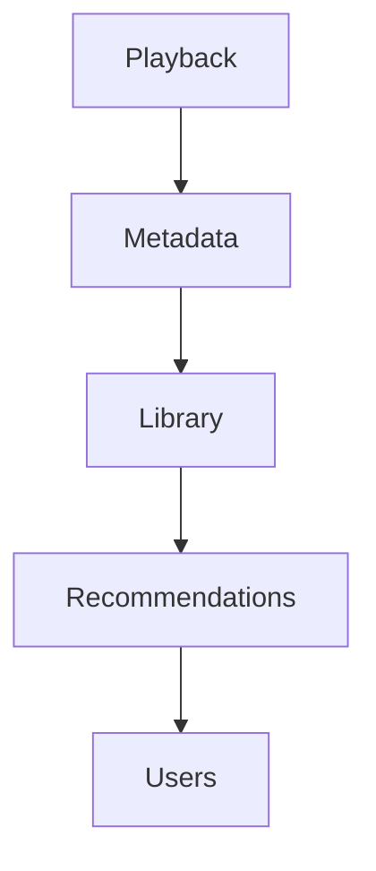

Dependencies slowly become:

- circular
- implicit
- undocumented

Eventually:

Nobody understands why changing one context affects another.

Context Maps prevent this.

---

# Context Relationships

Every relationship should answer:

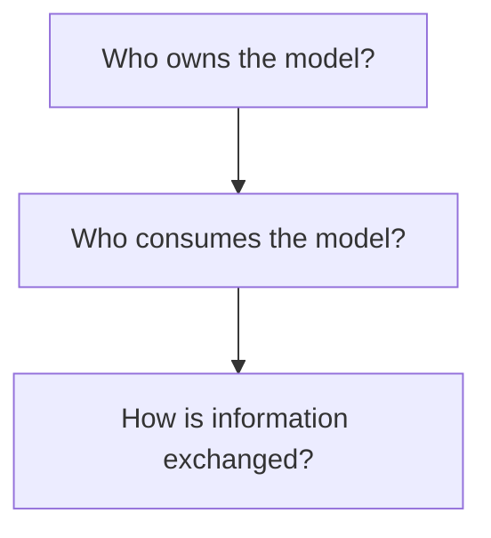

Ownership should always remain obvious.

Consumers should never redefine another context's business concepts.

---

# Mosaic Context Map

At a high level, the Mosaic platform resembles:

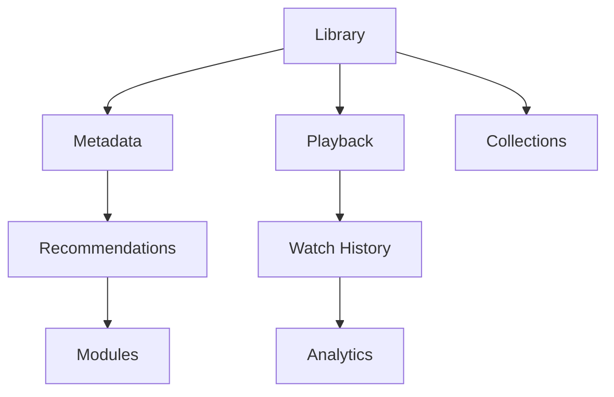

This diagram represents business relationships.

Not package dependencies.

---

# Direction Of Knowledge

Knowledge should always flow in one direction.

Example.

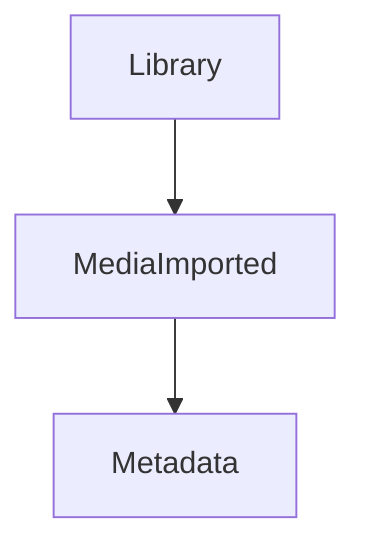

Metadata learns:

A media item was imported.

Library does **not** learn:

How metadata is fetched.

Dependencies remain one directional.

---

# Relationship Types

Domain-Driven Design defines several relationship patterns.

Within Mosaic, the following are recognised.

- Partnership
- Customer / Supplier
- Conformist
- Open Host Service
- Published Language
- Anti-Corruption Layer

Not every relationship appears within every project.

Understanding them allows engineers to choose the most appropriate collaboration model.

---

# Published Language

The preferred relationship within Mosaic.

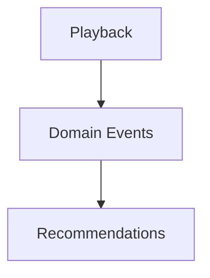

Playback publishes a stable business language.

Recommendations consume it.

Neither context understands the other's internal implementation.

Published Language naturally complements the event-driven runtime established in [MEG-002](../meg-002-event-driven-runtime/index.md).

---

# Open Host Service

Some contexts expose stable public interfaces.

Example.

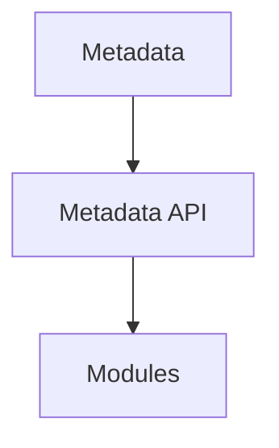

Modules interact through published contracts.

They do not depend upon internal implementation.

The interface remains stable even if the implementation evolves.

---

# Anti-Corruption Layer

External systems frequently use different models.

Example.

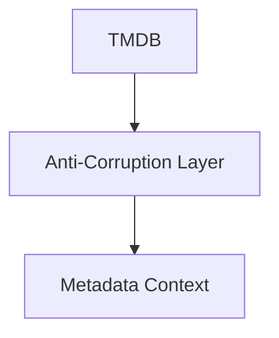

The translation layer prevents external terminology from leaking into the Mosaic domain.

Examples include:

- Jellyfin
- Plex
- Stremio
- TMDB
- AniList
- Trakt

Every external integration SHOULD terminate at an Anti-Corruption Layer.

This is one of the defining tactical patterns in Domain-Driven Design for protecting an internal model from external concepts. ([martinfowler.com](https://martinfowler.com/bliki/AntiCorruptionLayer.html))

---

# Conformist

Sometimes the cost of translation outweighs the benefit.

Example.

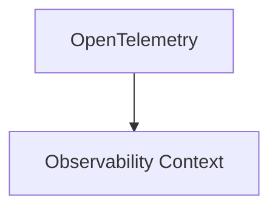

Rather than inventing new terminology, Mosaic simply adopts the external standard.

Conformist relationships should remain rare.

The Core Domain should never become conformist to an external product.

---

# Customer / Supplier

One context depends upon another.

Example.

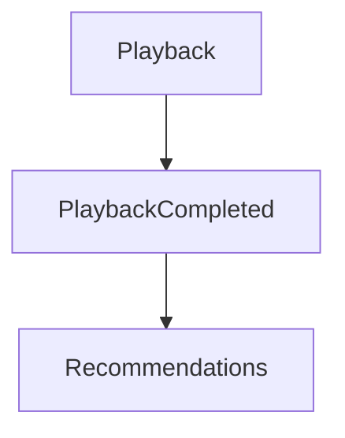

Playback supplies business facts.

Recommendations consumes them.

Playback should remain unaware of Recommendations.

Recommendations depends upon Playback.

Not the reverse.

---

# Partnership

Occasionally two contexts evolve together.

Example.

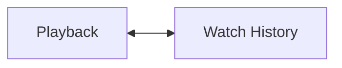

Both contexts share significant business knowledge.

Partnerships should be introduced cautiously.

They naturally increase coupling.

---

# Shared Kernel

Within Mosaic:

Shared Kernels SHOULD generally be avoided.

A Shared Kernel creates:

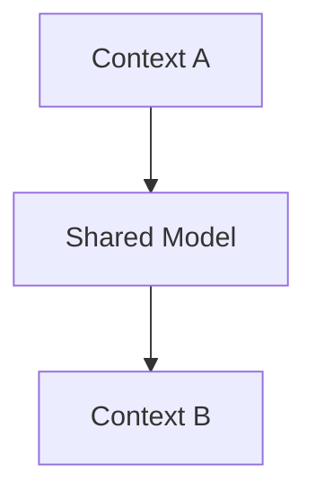

Both contexts now evolve together.

This increases coupling.

Instead, prefer:

- events
- published contracts
- anti-corruption layers

Shared Kernels should remain exceptional.

---

# Context Translation

Translation occurs at boundaries.

Example.

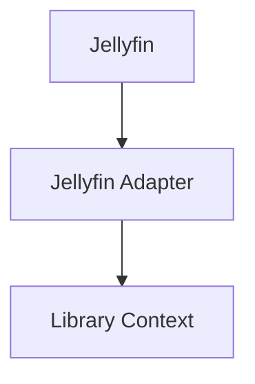

Library never understands:

- Jellyfin models
- Jellyfin terminology
- Jellyfin identifiers

Adapters translate.

Contexts remain pure.

---

# Event Relationships

Events naturally define Context Maps.

Example.

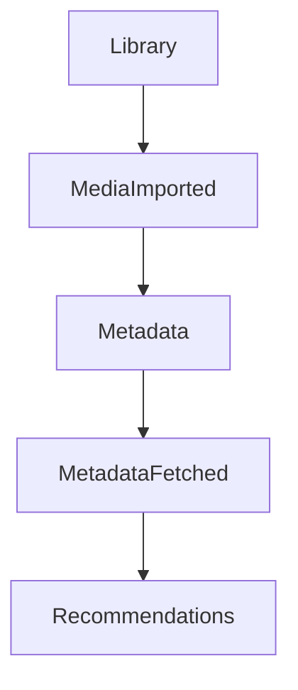

Each event communicates:

- ownership
- dependency direction
- collaboration

The event graph effectively becomes the Context Map.

---

# Module Relationships

Modules participate as independent contexts.

Example.

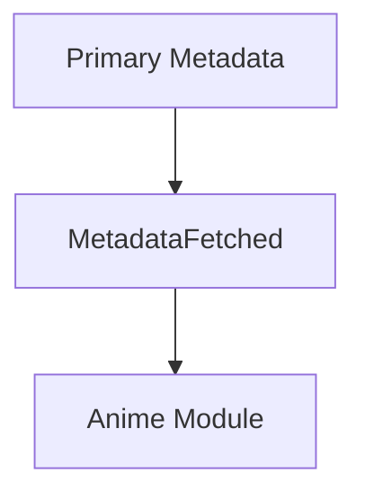

The module consumes published language.

It never modifies the Platform foundation.

This allows modules to remain isolated while participating fully within the platform.

---

# Avoid Bidirectional Dependencies

Poor.

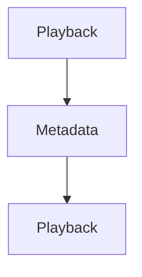

Bidirectional dependencies rapidly increase complexity.

Instead.

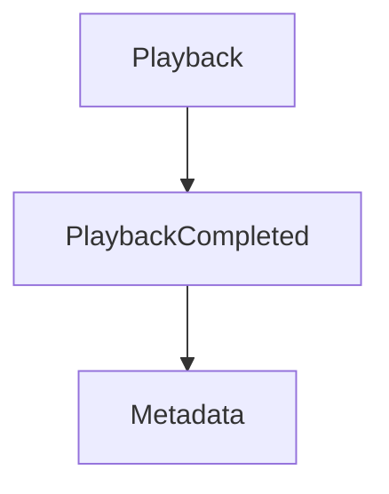

The dependency direction remains clear.

---

# Context Independence

Every context should be removable.

Ask:

> **If this context disappeared tomorrow, what would break?**

Ideally:

Only published contracts fail.

Other contexts remain internally consistent.

This is a useful test of architectural coupling.

---

# Evolution

Context relationships evolve.

Initially.

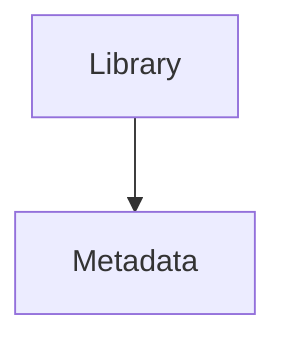

Later.

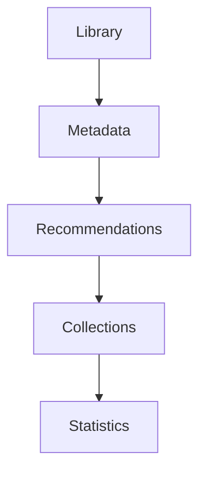

Growth should occur through new relationships.

Existing relationships should remain stable wherever practical.

---

# Context Ownership

Every Context Map SHOULD identify:

- owning context
- consuming context
- communication mechanism
- translation boundary

Ambiguous ownership is an architectural smell.

---

# Anti-Patterns

The following practices are prohibited.

## Shared Domain Models

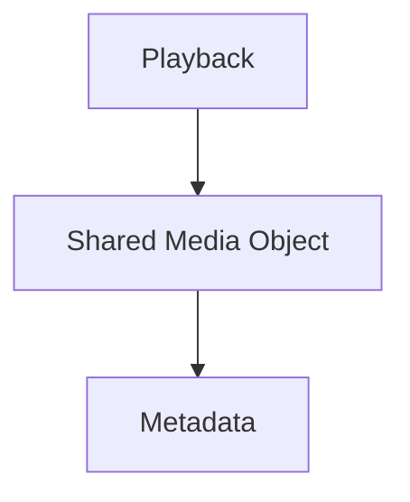

Contexts should own their own models.

---

## Shared Database Ownership

Multiple contexts directly modifying the same business tables.

---

## Circular Relationships


---

## Leaking External Models

Allowing:

```mermaid
flowchart TD

N1["TMDB"]
N2["Metadata Context"]

N1 --> N2
```

without translation.

---

## Hidden Dependencies

Relationships that exist only in implementation.

Every significant relationship should appear within the Context Map.

---

# Mosaic Guidelines

Within Mosaic:

- Every Bounded Context SHOULD appear within a Context Map.
- Relationships MUST have explicit ownership.
- Published Language SHOULD be the preferred collaboration model.
- Anti-Corruption Layers SHOULD protect Core Domains.
- Shared Kernels SHOULD be avoided.
- Event relationships SHOULD define dependency direction.
- Contexts SHOULD remain independently evolvable.
- Context Maps SHOULD evolve alongside the business.

---

# Relationship to MEG

Bounded Contexts establish:

> **Where models are valid.**

Context Maps establish:

> **How those models collaborate.**

The next chapter begins exploring the building blocks that exist *inside* those contexts, beginning with **Entities**.

---

# Summary

Context Maps transform a collection of isolated Bounded Contexts into a coherent platform architecture.

They make dependencies:

- explicit
- understandable
- intentional

Within Mosaic, they also reinforce one of the platform's most important architectural goals:

> **Capabilities collaborate without becoming coupled.**

When every relationship is explicit, the platform can continue growing without sacrificing architectural clarity.
