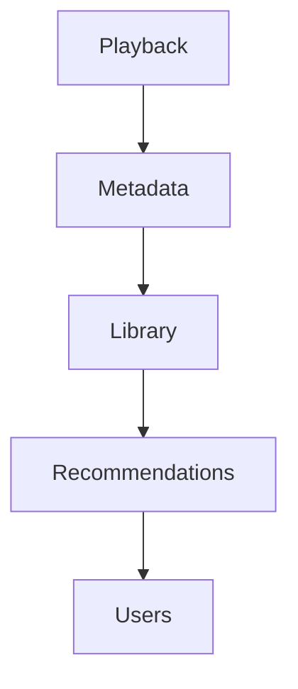
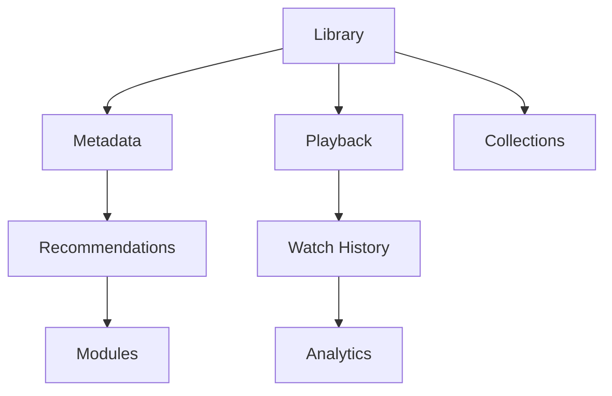
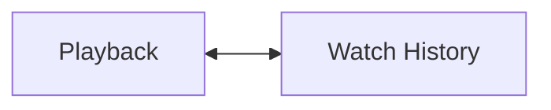
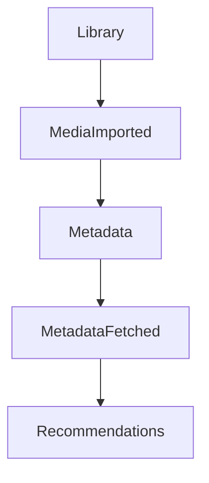
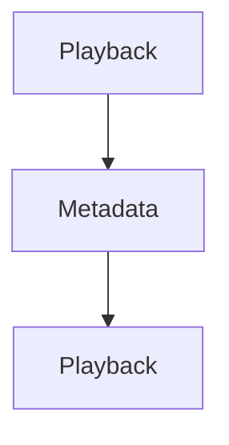
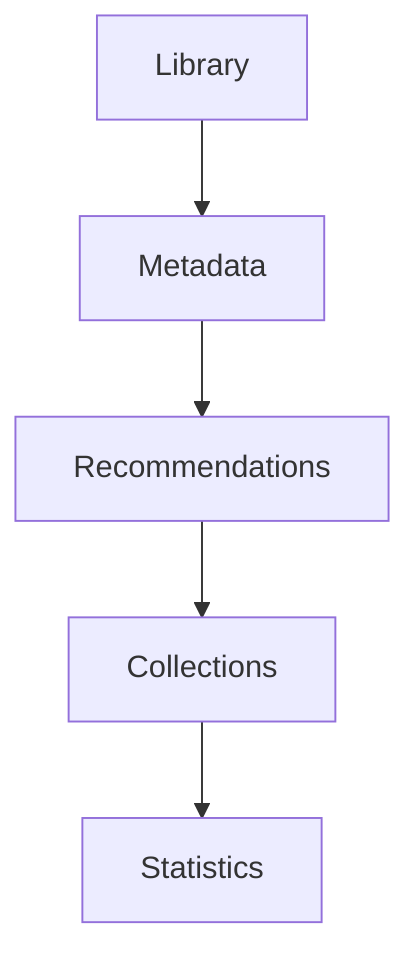

<!--
File: docs/engineering/guides/meg-003-domain-driven-design/05-context-maps.md
Document: MEG-003
Status: Draft
-->

# Context Maps

> *Bounded Contexts define where models are valid. Context Maps define how those models collaborate.*

---

# Purpose

A Mosaic platform consists of many independent Bounded Contexts. Examples include:

- Library
- Metadata
- Playback
- Recommendations
- Authentication
- Modules

Although each context evolves independently, they rarely exist in complete isolation, because business capabilities inevitably collaborate. Without explicitly modelling those relationships, dependencies gradually become informal, undocumented and increasingly difficult to maintain. Context Maps make those relationships explicit.

---

# Philosophy

Within Mosaic:

> **Contexts collaborate through defined relationships. They never depend upon accidental ones.**

Every relationship between two Bounded Contexts should be:

- intentional
- documented
- understandable
- independently evolvable

No context should become tightly coupled simply because implementation made it convenient.

---

# What Is A Context Map?

A Context Map describes the relationships between Bounded Contexts, answering questions such as:

- Which context owns this concept?
- Which context depends upon another?
- How do they communicate?
- Who translates between models?
- Where are architectural boundaries?

Every one of those questions is architectural, which is the point: Context Maps describe architecture, not implementation.

---

# Why Context Maps Matter

Without explicit relationships:

Dependencies slowly become circular, implicit and undocumented, until eventually nobody understands why changing one context affects another. Context Maps prevent this by recording the relationship at the point it is created rather than leaving it to be reconstructed later.

---

# Context Relationships

Every relationship should answer who owns the model, who consumes it, and how information is exchanged between them. Ownership should always remain obvious, and consumers should never redefine another context's business concepts.

---

# Mosaic Context Map

At a high level, the Mosaic platform resembles:

This diagram represents business relationships, not package dependencies.

---

# Direction Of Knowledge

Knowledge should always flow in one direction. When Library publishes MediaImported, Metadata learns that a media item was imported, but Library does **not** learn how metadata is fetched. Dependencies remain one directional.

---

# Relationship Types

Domain-Driven Design defines several relationship patterns. Within Mosaic, the following are recognised.

- Partnership
- Customer / Supplier
- Conformist
- Open Host Service
- Published Language
- Anti-Corruption Layer

Not every relationship appears within every project, but understanding them allows engineers to choose the most appropriate collaboration model rather than defaulting to whichever one the implementation suggests.

---

# Published Language

Published Language is the preferred relationship within Mosaic. Playback publishes a stable business language as Domain Events and Recommendations consumes it, so neither context understands the other's internal implementation. Published Language naturally complements the event-driven runtime established in [MEG-002](../meg-002-event-driven-runtime/index.md).

---

# Open Host Service

Some contexts expose stable public interfaces. Metadata offers a Metadata API through which Modules interact using published contracts rather than depending upon internal implementation, which means the interface remains stable even if the implementation evolves.

---

# Anti-Corruption Layer

External systems frequently use different models, so an integration with TMDB reaches the Metadata Context only through an Anti-Corruption Layer. The translation layer prevents external terminology from leaking into the Mosaic domain. Examples include:

- Jellyfin
- Plex
- Stremio
- TMDB
- AniList
- Trakt

Every external integration should terminate at an Anti-Corruption Layer. This is one of the defining tactical patterns in Domain-Driven Design for protecting an internal model from external concepts. ([martinfowler.com](https://martinfowler.com/bliki/AntiCorruptionLayer.html))

---

# Conformist

Sometimes the cost of translation outweighs the benefit, as when the Observability Context adopts OpenTelemetry directly rather than inventing new terminology for the same concepts. Conformist relationships should nonetheless remain rare, and the Core Domain should never become conformist to an external product.

---

# Customer / Supplier

One context depends upon another. Playback supplies business facts through PlaybackCompleted and Recommendations consumes them, so Recommendations depends upon Playback and not the reverse. Playback should remain unaware of Recommendations entirely.

---

# Partnership

Occasionally two contexts evolve together.

Both contexts share significant business knowledge, and because a partnership naturally increases coupling in both directions it should be introduced cautiously.

---

# Shared Kernel

Within Mosaic, Shared Kernels should generally be avoided. A Shared Kernel places a Shared Model between Context A and Context B, which means both contexts now evolve together and coupling increases. Prefer instead:

- events
- published contracts
- anti-corruption layers

Shared Kernels should remain exceptional.

---

# Context Translation

Translation occurs at boundaries. Jellyfin reaches the Library Context only through a Jellyfin Adapter, so Library never understands:

- Jellyfin models
- Jellyfin terminology
- Jellyfin identifiers

Adapters translate and contexts remain pure.

---

# Event Relationships

Events naturally define Context Maps.

Each event communicates ownership, dependency direction and collaboration, which means the event graph effectively becomes the Context Map.

---

# Module Relationships

Modules participate as independent contexts. An Anime Module consumes MetadataFetched from Primary Metadata, so it depends upon published language and never modifies the Platform foundation. This allows modules to remain isolated while participating fully within the platform.

---

# Avoid Bidirectional Dependencies

Poor.

Bidirectional dependencies rapidly increase complexity. Where Playback instead publishes PlaybackCompleted and Metadata consumes it, the dependency direction remains clear.

---

# Context Independence

Every context should be removable. Ask:

> **If this context disappeared tomorrow, what would break?**

Ideally only published contracts fail while other contexts remain internally consistent, which makes the question a useful test of architectural coupling.

---

# Evolution

Context relationships evolve. Library may initially depend upon Metadata alone, and later the map grows.

Growth should occur through new relationships, whereas existing relationships should remain stable wherever practical.

---

# Context Ownership

Every Context Map should identify the owning context, the consuming context, the communication mechanism and the translation boundary. Ambiguous ownership is an architectural smell.

---

# Anti-Patterns

The following practices are prohibited.

## Shared Domain Models

Playback and Metadata both reaching for one Shared Media Object. Contexts should own their own models.

## Shared Database Ownership

Multiple contexts directly modifying the same business tables.

## Circular Relationships

## Leaking External Models

Allowing TMDB to reach the Metadata Context without translation.

## Hidden Dependencies

Relationships that exist only in implementation. Every significant relationship should appear within the Context Map.

---

# Mosaic Guidelines

Within Mosaic:

- Every Bounded Context should appear within a Context Map.
- Relationships must have explicit ownership.
- Published Language should be the preferred collaboration model.
- Anti-Corruption Layers should protect Core Domains.
- Shared Kernels should be avoided.
- Event relationships should define dependency direction.
- Contexts should remain independently evolvable.
- Context Maps should evolve alongside the business.

---

# Relationship to MEG

Bounded Contexts establish:

> **Where models are valid.**

Context Maps establish:

> **How those models collaborate.**

The next chapter begins exploring the building blocks that exist *inside* those contexts, beginning with **Entities**.

---

# Summary

Context Maps transform a collection of isolated Bounded Contexts into a coherent platform architecture. They make dependencies:

- explicit
- understandable
- intentional

Within Mosaic, they also reinforce one of the platform's most important architectural goals:

> **Capabilities collaborate without becoming coupled.**

When every relationship is explicit, the platform can continue growing without sacrificing architectural clarity.
