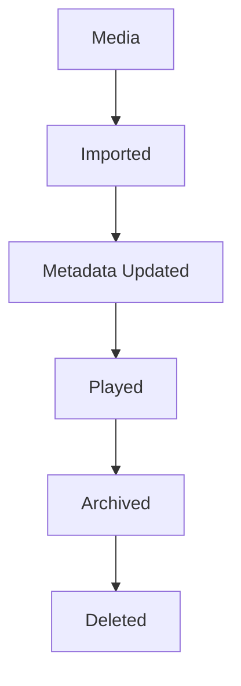
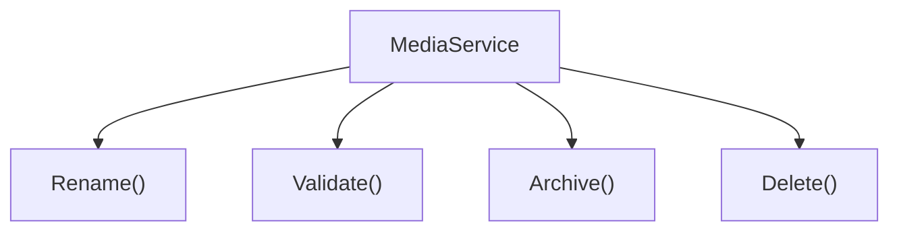
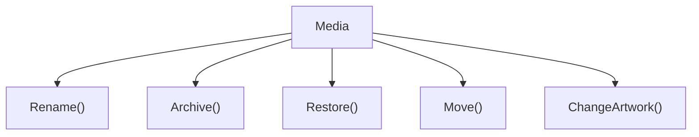

<!--
File: docs/engineering/guides/meg-003-domain-driven-design/06-entities.md
Document: MEG-003
Status: Draft
-->

# Entities

> *An Entity is defined by its identity. Its attributes may change throughout its lifetime, but it remains the same conceptual thing.*

---

# Purpose

Many business concepts evolve over time. Media is renamed, artwork changes, playback progresses, users update preferences and metadata improves, yet in every case the business still considers the concept to be the same thing. Domain-Driven Design models these concepts as **Entities**, and this document defines how Entities should be identified, designed and maintained throughout the Mosaic platform.

---

# Philosophy

Within Mosaic:

> **Identity defines an Entity. State merely describes it.**

An Entity exists because the business recognises it as something with a continuous lifecycle, so changing its attributes does not create a new Entity — its identity remains constant while its state moves on.

---

# What Is An Entity?

An Entity is a business object whose identity remains stable throughout its lifetime. Media, User, Collection and Playback Session are all examples, and each has:

- identity
- lifecycle
- behaviour
- mutable state

The Entity continues to exist even as that state evolves, because none of those changing attributes are what make it the thing it is.

---

# Identity

Identity is the defining characteristic of an Entity. A Media Entity keeps its Media ID while its title changes, its artwork changes and its metadata changes, and after all of that it is still the same Media. Everything except identity may change, which is precisely why identity must remain stable.

---

# Identity Is Not Storage

Entity identity belongs to the business, not the database. It is poor practice to let a database row and its primary key define the Entity; the preferred direction runs the other way, from business concept to business identity, with persistence following afterwards. The database stores identity — it does not create it.

---

# Business Identity

Identity should represent something meaningful to the business, which is why MediaID, UserID and CollectionID are appropriate identifiers and why infrastructure concepts such as RowNumber or AutoIncrement should never be exposed. The business should not depend upon database implementation.

---

# Lifecycle

Every Entity has a lifecycle, and the Entity remains the same throughout it while only its state changes.



Each transition moves the Entity into a new state rather than producing a different Entity.

---

# Mutable State

Entities naturally contain mutable state. A Playback Entity tracks its position, its watched percentage and whether it has completed, but changing any of those values does not create a new Playback Entity because the identity remains constant.

---

# Behaviour

Entities are not merely data containers; they should own business behaviour. Assigning a field directly says nothing about the business operation being performed:

```go
media.Title = title
```

Naming the operation is better, because the Entity then decides what renaming means:

```go
media.Rename(title)
```

Or:

```go
playback.Resume(position)
```

Business rules belong inside the Entity, not inside services manipulating it. This aligns with Domain-Driven Design's emphasis on rich domain models that encapsulate behaviour alongside state. ([martinfowler.com](https://martinfowler.com/bliki/AnemicDomainModel.html))

---

# Invariants

Entities are responsible for protecting their own invariants. A Playback Entity should never allow progress to reach 120%, nor should it accept a negative duration, because invalid state should be impossible through the Entity's public behaviour. Future chapters discuss invariants in greater detail.

---

# Entity Ownership

Every Entity belongs to exactly one Bounded Context, so the Playback Context owns the Playback Entity and the Metadata Context owns the Metadata Entity. Entities should never belong simultaneously to multiple contexts; if another context requires similar concepts, it should model its own Entity.

---

# Entity References

Entities should reference other Entities by identity, which means a Playback holds a MediaID rather than an entire Media object. Referencing identities rather than object graphs reduces coupling between aggregates and bounded contexts.

---

# Equality

Entities are equal if their identities are equal, so two representations of Media carrying ID = 123 remain the same Entity even where title differs, artwork differs and metadata differs. State does not determine identity; identity determines identity.

---

# Creation

Entities should be created in a valid state. Allocating an empty Entity is poor practice:

```go
media := &Media{}
```

because the fields must then be populated and validated later, leaving a window in which the Entity exists but means nothing. A constructor closes that window:

```go
media := NewMedia(...)
```

The constructor establishes valid business state immediately, so invalid Entities should never exist.

---

# Persistence

Repositories persist Entities, but Entities themselves should remain unaware of:

- SQL
- PostgreSQL
- DuckDB
- HTTP
- JSON

Persistence is infrastructure, whereas identity and behaviour belong to the domain.

---

# Events

Entities frequently publish Domain Events. When a Playback Entity completes through its Complete() behaviour, a PlaybackCompleted event naturally follows, because the Entity owns the business transition and publishing the corresponding Domain Event is part of that transition. This keeps business behaviour and business facts closely aligned.

---

# Avoid Anemic Entities

An Entity reduced to a bare collection of fields carries no business meaning:

```go
type Media struct {
    Title string
}
```

Its behaviour then accumulates in a service beside it, where the Entity cannot enforce anything.



At that point the Entity has become little more than a database record. The operations belong on the concept itself instead:

```go
media.Rename()
media.Archive()
media.Restore()
```

Behaviour belongs with the concept that owns it.

---

# Entity Size

Entities should remain cohesive. If an Entity begins owning:

- playback
- metadata
- recommendations
- collections
- analytics

it has probably become multiple business concepts, and its behaviour should be split according to business responsibility.

---

# Entity Relationships

Entities collaborate, but they should not become deeply nested object graphs. A Collection holds a MediaID and the Media itself is retrieved through a Repository only when it is needed, which avoids loading the entire domain into memory unnecessarily. Relationships should remain explicit.

---

# Entity Evolution

Entity behaviour should evolve as understanding improves. Initially a Media Entity may hold little more than a Title, and later it acquires the operations the business actually talks about.



Behaviour grows alongside business understanding, so Entities should become richer rather than larger.

---

# What Is Not An Entity?

The following are usually **not** Entities.

- Duration
- Resolution
- Rating
- Language
- Genre

These have no meaningful identity, so they are better modelled as **Value Objects**. The next chapter explores this distinction.

---

# Mosaic Examples

Examples of Entities within Mosaic include Media, User, Collection, PlaybackSession and Library. Each represents a business concept with:

- stable identity
- evolving state
- business behaviour

---

# Anti-Patterns

The following practices are prohibited.

## Anemic Entities

Entities containing only fields. Behaviour then migrates into the services manipulating the Entity, which is exactly the arrangement this chapter exists to prevent.

---

## Mutable Identity

Changing an Entity's identity after creation. Identity is the one thing about an Entity that may not change, so mutating it destroys the continuity the business recognises.

---

## Infrastructure Dependencies

Entities importing:

- SQL
- HTTP
- JSON
- Logging

Persistence and transport are infrastructure, so an Entity that depends upon them can no longer be reasoned about as a business concept.

---

## Shared Ownership

Entities belonging to multiple Bounded Contexts, rather than each context modelling the Entity it needs.

---

## Behaviour In Services

Business behaviour implemented entirely outside the Entity, leaving the Entity unable to enforce its own invariants.

---

# Mosaic Guidelines

Within Mosaic:

- Every Entity must have stable identity.
- Identity must represent business concepts.
- Entities should own business behaviour.
- Entities must enforce their own invariants.
- Entities must belong to one Bounded Context.
- Equality must be based upon identity.
- Entities should reference other Entities by identity.
- Entities must remain independent of infrastructure.

---

# Relationship to MEG

Entities are the first building block inside a Bounded Context. However, not every business concept has identity, and many concepts are defined entirely by their value. The next chapter introduces **Value Objects**, which complement Entities by modelling concepts that have meaning without requiring identity, and together the two form the foundation of every rich domain model.

---

# Summary

Entities represent the enduring concepts of the business, and they are recognised not because of what they contain, but because of **who they are**. Within Mosaic, Entities:

- own identity
- own behaviour
- protect invariants
- evolve over time

By placing behaviour alongside business concepts, the domain model becomes more expressive, more maintainable and significantly closer to the language of the business itself.
