<!--
File: docs/engineering/guides/meg-003-domain-driven-design/06-entities.md
Document: MEG-003
Status: Draft
-->

# Entities

> *An Entity is defined by its identity. Its attributes may change throughout its lifetime, but it remains the same conceptual thing.*

---

# Purpose

Many business concepts evolve over time.

For example:

- media is renamed
- artwork changes
- playback progresses
- users update preferences
- metadata improves

Although their attributes change, the business still considers them to be the same thing.

Domain-Driven Design models these concepts as **Entities**.

This document defines how Entities should be identified, designed and maintained throughout the Mosaic platform.

---

# Philosophy

Within Mosaic:

> **Identity defines an Entity. State merely describes it.**

An Entity exists because the business recognises it as something with a continuous lifecycle.

Changing its attributes does not create a new Entity.

Its identity remains constant.

---

# What Is An Entity?

An Entity is a business object whose identity remains stable throughout its lifetime.

Examples include:

```

Media
```

```

User
```

```

Collection
```

```

Playback Session
```

Each has:

- identity
- lifecycle
- behaviour
- mutable state

The Entity continues to exist even as that state evolves.

---

# Identity

Identity is the defining characteristic of an Entity.

Example.

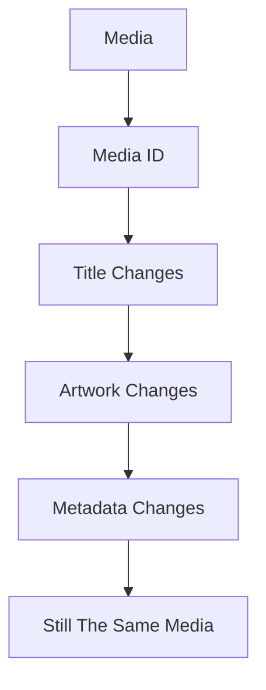

Everything except identity may change.

Identity must remain stable.

---

# Identity Is Not Storage

Entity identity belongs to the business.

Not the database.

Poor.

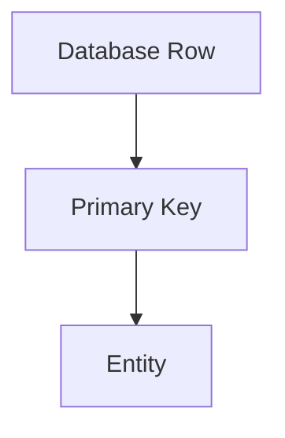

Preferred.

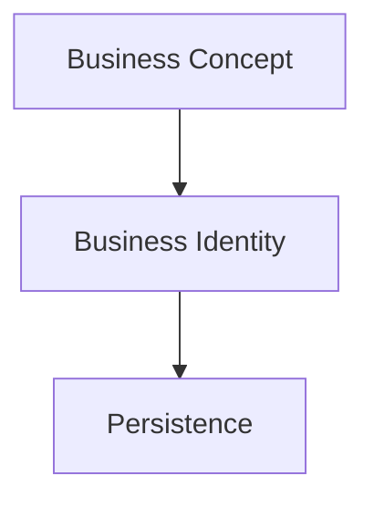

The database stores identity.

It does not create it.

---

# Business Identity

Identity should represent something meaningful to the business.

Examples.

```

MediaID
```

```

UserID
```

```

CollectionID
```

Avoid exposing infrastructure concepts such as:

```

RowNumber
```

```

AutoIncrement
```

The business should not depend upon database implementation.

---

# Lifecycle

Every Entity has a lifecycle.

Example.

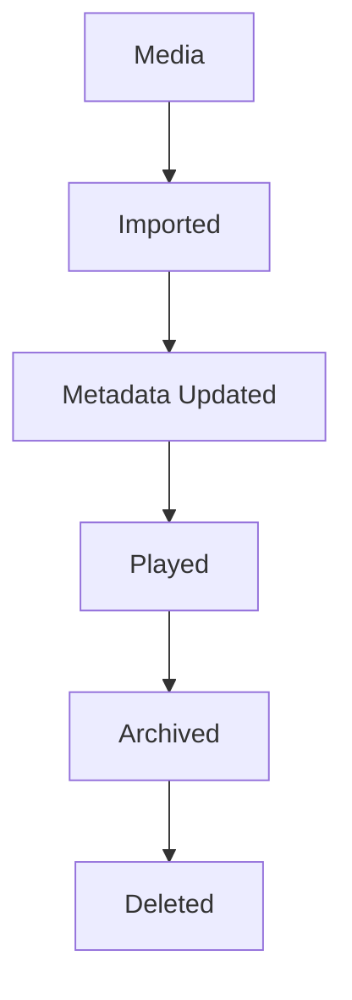

The Entity remains the same throughout.

Only its state changes.

---

# Mutable State

Entities naturally contain mutable state.

Example.

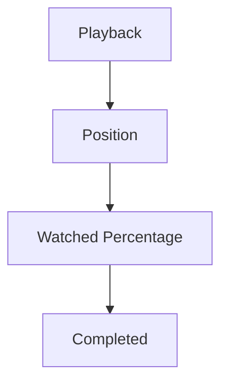

Changing these values does not create a new Playback Entity.

The identity remains constant.

---

# Behaviour

Entities are not merely data containers.

They should own business behaviour.

Poor.

```go
media.Title = title
```

Better.

```go
media.Rename(title)
```

Or:

```go
playback.Resume(position)
```

Business rules belong inside the Entity.

Not inside services manipulating it.

This aligns with Domain-Driven Design's emphasis on rich domain models that encapsulate behaviour alongside state. ([martinfowler.com](https://martinfowler.com/bliki/AnemicDomainModel.html))

---

# Invariants

Entities are responsible for protecting their own invariants.

Example.

A Playback Entity should never allow:

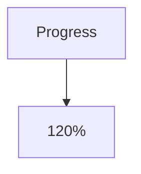

Or:

```

Negative Duration
```

Invalid state should be impossible through the Entity's public behaviour.

Future chapters discuss invariants in greater detail.

---

# Entity Ownership

Every Entity belongs to exactly one Bounded Context.

Example.

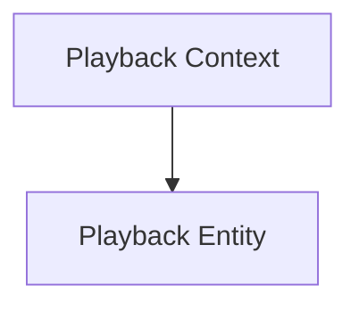

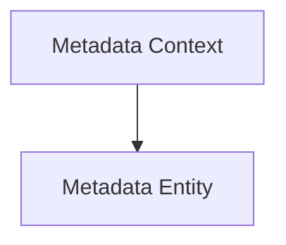

Entities should never belong simultaneously to multiple contexts.

If another context requires similar concepts, it should model its own Entity.

---

# Entity References

Entities should reference other Entities by identity.

Preferred.

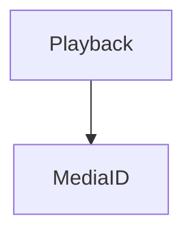

Not.

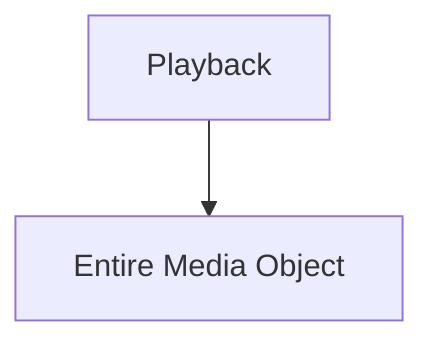

Referencing identities rather than object graphs reduces coupling between aggregates and bounded contexts.

---

# Equality

Entities are equal if their identities are equal.

Example.

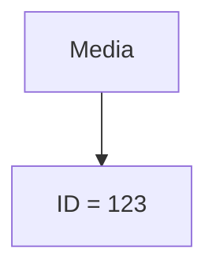

Even if:

- title differs
- artwork differs
- metadata differs

the business still considers them the same Entity.

State does not determine identity.

Identity determines identity.

---

# Creation

Entities should be created in a valid state.

Poor.

```go
media := &Media{}
```

Later.

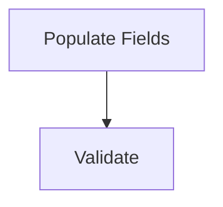

Preferred.

```go
media := NewMedia(...)
```

The constructor establishes valid business state immediately.

Invalid Entities should never exist.

---

# Persistence

Repositories persist Entities.

Entities should remain unaware of:

- SQL
- PostgreSQL
- DuckDB
- HTTP
- JSON

Persistence is infrastructure.

Identity and behaviour belong to the domain.

---

# Events

Entities frequently publish Domain Events.

Example.

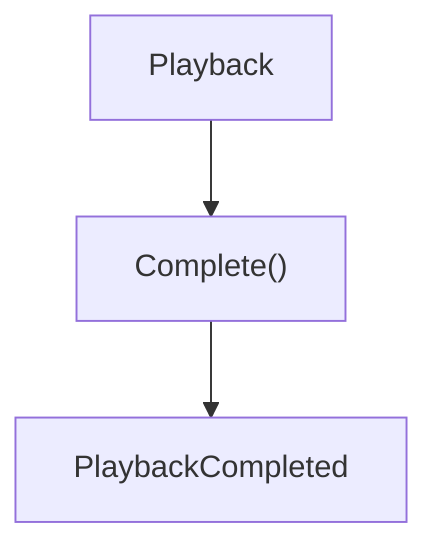

The Entity owns the business transition.

Publishing the corresponding Domain Event naturally follows.

This keeps business behaviour and business facts closely aligned.

---

# Avoid Anemic Entities

Poor.

```go
type Media struct {
    Title string
}
```

Followed by:

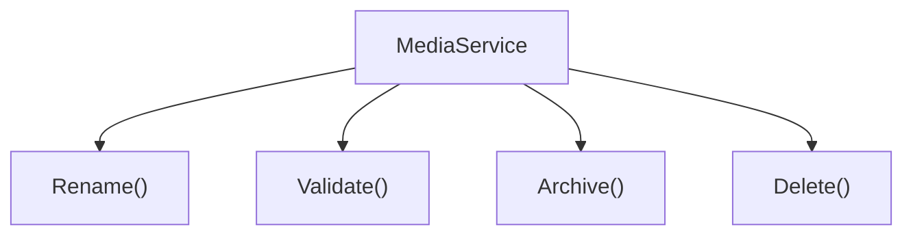

The Entity has become little more than a database record.

Instead:

```go
media.Rename()

media.Archive()

media.Restore()
```

Behaviour belongs with the concept that owns it.

---

# Entity Size

Entities should remain cohesive.

If an Entity begins owning:

- playback
- metadata
- recommendations
- collections
- analytics

it has probably become multiple business concepts.

Split behaviour according to business responsibility.

---

# Entity Relationships

Entities collaborate.

They should not become deeply nested object graphs.

Example.

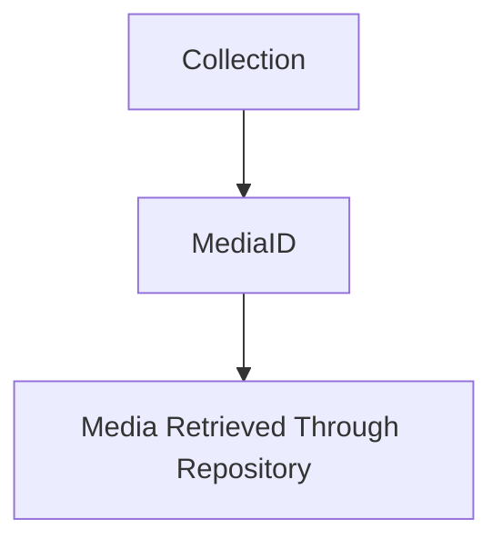

Avoid loading the entire domain into memory unnecessarily.

Relationships should remain explicit.

---

# Entity Evolution

Entity behaviour should evolve as understanding improves.

Initially.

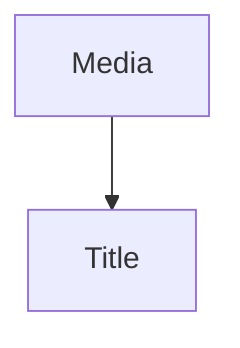

Later.

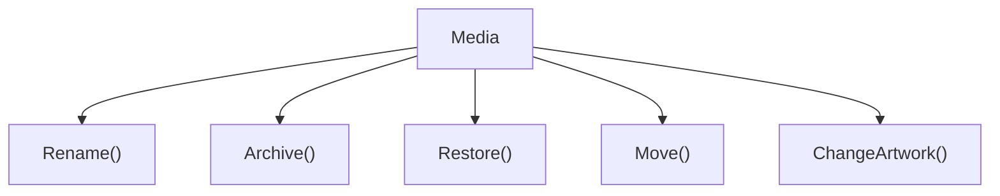

Behaviour grows alongside business understanding.

Entities should become richer.

Not larger.

---

# What Is Not An Entity?

The following are usually **not** Entities.

- Duration
- Resolution
- Rating
- Language
- Genre

These have no meaningful identity.

They are better modelled as **Value Objects**.

The next chapter explores this distinction.

---

# Mosaic Examples

Examples of Entities within Mosaic include:

```

Media
```

```

User
```

```

Collection
```

```

PlaybackSession
```

```

Library
```

Each represents a business concept with:

- stable identity
- evolving state
- business behaviour

---

# Anti-Patterns

The following practices are prohibited.

## Anemic Entities

Entities containing only fields.

---

## Mutable Identity

Changing an Entity's identity after creation.

---

## Infrastructure Dependencies

Entities importing:

- SQL
- HTTP
- JSON
- Logging

---

## Shared Ownership

Entities belonging to multiple Bounded Contexts.

---

## Behaviour In Services

Business behaviour implemented entirely outside the Entity.

---

# Mosaic Guidelines

Within Mosaic:

- Every Entity MUST have stable identity.
- Identity MUST represent business concepts.
- Entities SHOULD own business behaviour.
- Entities MUST enforce their own invariants.
- Entities MUST belong to one Bounded Context.
- Equality MUST be based upon identity.
- Entities SHOULD reference other Entities by identity.
- Entities MUST remain independent of infrastructure.

---

# Relationship to MEG

Entities are the first building block inside a Bounded Context.

However, not every business concept has identity.

Many concepts are defined entirely by their value.

The next chapter introduces **Value Objects**, which complement Entities by modelling concepts that have meaning without requiring identity.

Together, Entities and Value Objects form the foundation of every rich domain model.

---

# Summary

Entities represent the enduring concepts of the business.

They are recognised not because of what they contain, but because of **who they are**.

Within Mosaic, Entities:

- own identity
- own behaviour
- protect invariants
- evolve over time

By placing behaviour alongside business concepts, the domain model becomes more expressive, more maintainable and significantly closer to the language of the business itself.
