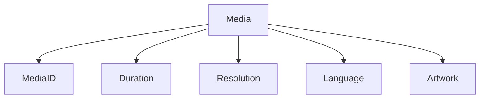
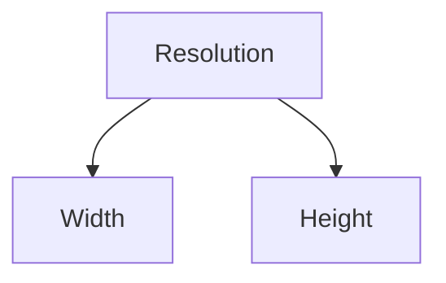
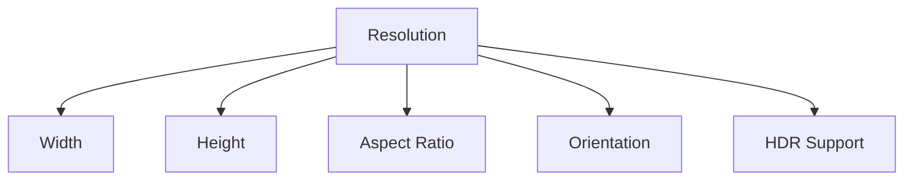

<!--
File: docs/engineering/guides/meg-003-domain-driven-design/07-value-objects.md
Document: MEG-003
Status: Draft
-->

# Value Objects

> *A Value Object is defined entirely by what it is, not by who it is.*

---

# Purpose

Not every business concept requires identity, because many concepts exist purely because of the information they represent. Examples include:

- Duration
- Resolution
- Language
- Rating
- Position
- File Size

The business does not distinguish between two identical durations, nor does it care whether one language object was created before another. These concepts are modelled as **Value Objects**, and this document defines how Value Objects should be designed and used throughout the Mosaic platform.

---

# Philosophy

Within Mosaic:

> **If identity is irrelevant, model the concept as a Value Object.**

Value Objects exist because of their value, so two Value Objects containing identical values represent exactly the same business concept. Unlike Entities, they possess no lifecycle or identity.

---

# What Is A Value Object?

A Value Object is a business concept whose identity is irrelevant. Duration, Resolution, Aspect Ratio, Language and Watch Position are all examples, and although each represents a meaningful business concept, none of them require identity.

---

# Value Defines Equality

Unlike Entities, Value Objects are equal when all of their values are equal. A Duration of 01:30:00 equals any other Duration of 01:30:00 because there is no business distinction between them, which means creating another identical Value Object simply creates the same concept again.

---

# No Identity

Value Objects must not possess business identity. Identifiers such as ResolutionID, LanguageID or DurationID communicate nothing useful, because the value itself already defines the concept.

---

# Immutability

Value Objects should be immutable. Changing a Duration from 90 Minutes to 95 Minutes therefore does not modify the existing Value Object; the old Value Object is left untouched and a new Value Object takes its place. Immutability greatly simplifies reasoning, testing and concurrent execution, and it also aligns naturally with Go's preference for immutable value semantics where practical.

---

# Behaviour

Value Objects may contain behaviour, and that behaviour should naturally belong with the concept:

```go
duration.Add(other)
position.Progress(total)
resolution.IsHDR()
```

Avoid reducing Value Objects to passive data containers, because a concept that cannot do anything offers little more than the primitive it wraps.

---

# Rich Concepts

Prefer a Watch Position over a bare `int64`, and a Media Duration over a bare `time.Duration`. The standard library type may still be used internally; however, wrapping important business concepts inside explicit Value Objects communicates intent more clearly.

---

# Primitive Obsession

One of the most common modelling mistakes is representing business concepts using primitive types:

```go
type Media struct {
    Duration int
}
```

Questions immediately arise about what that Duration measures — seconds, milliseconds or frames — and nothing in the type answers them. Naming the concept does:

```go
type Media struct {
    Duration Duration
}
```

The domain becomes significantly clearer as a result. Martin Fowler refers to overuse of primitive types in place of richer domain concepts as **Primitive Obsession**, a common code smell. ([martinfowler.com](https://martinfowler.com/bliki/ValueObject.html))

---

# Validation

Value Objects should validate themselves during construction, which is why creation runs through a constructor:

```go
duration := NewDuration(seconds)
```

Validation may include:

- non-negative values
- valid ranges
- supported formats

Invalid Value Objects should never exist, so constructors should enforce correctness immediately rather than leaving it to the caller.

---

# Side Effects

Value Objects must not have side effects. They should never:

- publish events
- persist state
- call external systems
- modify repositories

They simply represent business concepts, so their behaviour should remain deterministic.

---

# Ownership

Value Objects belong to the Entity or Aggregate that owns them, which is why a Media Entity owns its Duration, its Resolution and its Language rather than the other way around. The Value Objects have no independent lifecycle, so if the Media Entity disappears, so do its associated Value Objects.

---

# Persistence

Repositories persist Value Objects as part of their owning Entity or Aggregate, and Value Objects should never have independent repositories. A ResolutionRepository should not exist unless Resolution has itself become a business concept with identity — at which point it would no longer be a Value Object.

---

# Reuse

Value Objects should be reused whenever the same business concept appears. A single Duration should represent duration consistently throughout:

- Playback
- Metadata
- Library
- Video Analysis

The ubiquitous language should remain consistent, and a concept modelled twice is a concept that will eventually mean two different things.

---

# Value Object Composition

Value Objects may contain other Value Objects, so a Video Format can be composed of a Resolution, a Frame Rate and an Aspect Ratio. This produces richer, more expressive models without introducing identity.

---

# Entities Use Value Objects

Entities should compose Value Objects.



Notice that only one concept possesses identity while everything else represents value, which naturally produces smaller, more focused Entities.

---

# Avoid Shared Mutable State

Because Value Objects are immutable, they may safely be shared: a single English Language value can be held by Media A, Media B and Media C at once. Sharing immutable values introduces no coupling, and immutability greatly simplifies concurrent systems.

---

# Avoid Generic Types

Avoid modelling business concepts using `string`, `int` or `bool` where richer concepts exist. Rather than declaring:

```go
Rating int
```

prefer the named concept:

```go
Rating Rating
```

The additional type communicates business meaning, and the compiler also prevents accidental misuse.

---

# Business Language

Value Objects should reinforce the ubiquitous language. Names such as WatchProgress, PlaybackPosition and ArtworkType are good because they describe business concepts, whereas ProgressDTO, PositionValue and ImageInfo are poor because they describe implementation instead.

---

# Evolution

Value Objects often become richer over time. Initially a Resolution may carry only its width and height.



Later the same concept absorbs everything the business has learned to ask of it.



Business understanding evolves, and Value Objects should evolve alongside it.

---

# What Is Not A Value Object?

Media, User, Collection and Playback Session are usually **not** Value Objects. These possess identity, and they are therefore Entities.

---

# Mosaic Examples

Examples of Value Objects within Mosaic include Duration, Resolution, AspectRatio, Language, PlaybackPosition, MediaRating, ArtworkType and FileHash. Each is recognised because of its value, not because of an independent identity.

---

# Anti-Patterns

The following practices are prohibited.

## Mutable Value Objects

Changing the internal state of an existing Value Object, rather than replacing it with a new one.

---

## Identity

Assigning identifiers to Value Objects, when the value itself already defines the concept.

---

## Primitive Obsession

Representing business concepts entirely using primitive types, which leaves the domain unable to say what a number means.

---

## Infrastructure Dependencies

Importing:

- SQL
- HTTP
- Logging
- Runtime

into Value Objects, which are business concepts and should remain infrastructure independent.

---

## Side Effects

Publishing events or modifying repositories, either of which makes a Value Object's behaviour non-deterministic.

---

## Independent Persistence

Persisting Value Objects independently from their owning Entity, despite their having no independent lifecycle.

---

# Mosaic Guidelines

Within Mosaic:

- Value Objects must be defined by value.
- Value Objects should be immutable.
- Value Objects must not possess identity.
- Value Objects should validate themselves during construction.
- Value Objects may contain behaviour.
- Value Objects must remain infrastructure independent.
- Entities should compose Value Objects.
- Business concepts should be preferred over primitive types.

---

# Relationship to MEG

Entities answer:

> **Who is this?**

Value Objects answer:

> **What is this?**

Together they form the fundamental vocabulary of every rich domain model. The next chapter introduces **Aggregates**, which define how multiple Entities and Value Objects collaborate while preserving business consistency.

---

# Summary

Value Objects are one of the simplest yet most powerful modelling tools within Domain-Driven Design. By representing business concepts through immutable values rather than primitive types, the Mosaic domain becomes:

- more expressive
- more type-safe
- easier to understand
- easier to test
- naturally thread-safe

Most importantly, the software begins speaking the language of the business rather than the language of the implementation.
