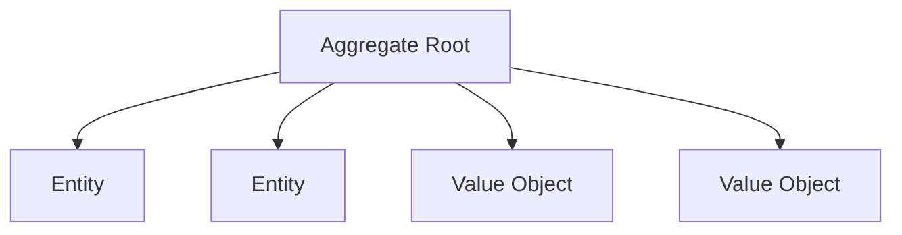
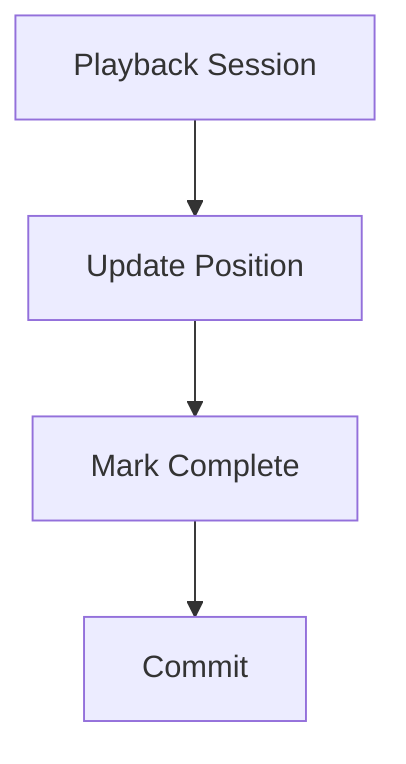
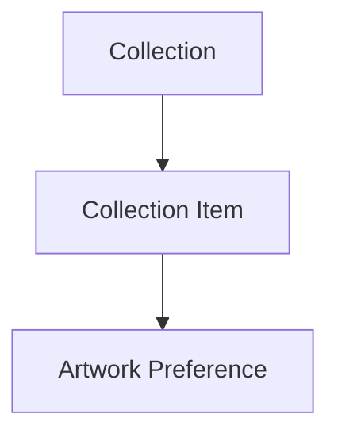
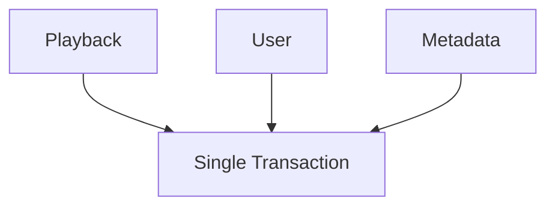
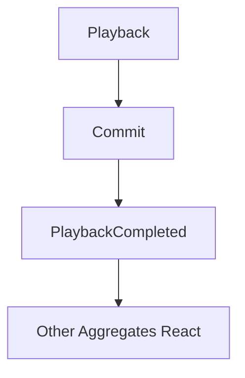
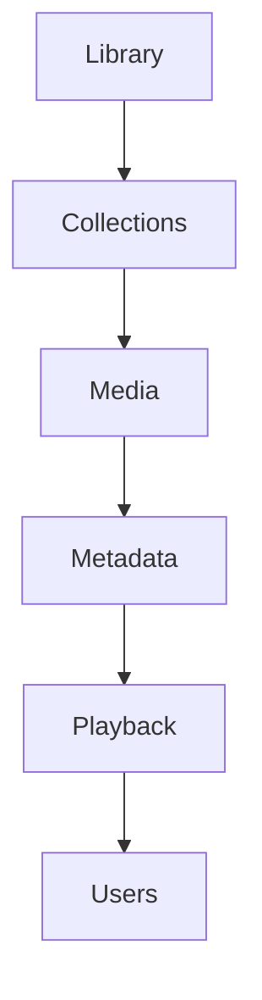

<!--
File: docs/engineering/guides/meg-003-domain-driven-design/08-aggregates.md
Document: MEG-003
Status: Draft
-->

# Aggregates

> *An Aggregate is not a collection of objects. It is the consistency boundary of the business.*

---

# Purpose

Business rules rarely apply to a single Entity in isolation. A Library owns many Media items, a Collection owns many references to Media, a Playback Session owns Watch Progress, and a User owns Preferences. In each case the related concepts must remain internally consistent, because a rule that spans two objects cannot be enforced by either one alone. Domain-Driven Design models these consistency boundaries as **Aggregates**, and this document defines how Aggregates should be identified, designed and maintained throughout the Mosaic platform.

---

# Philosophy

Within Mosaic:

> **Aggregates own business consistency.**

An Aggregate exists to protect business invariants rather than to provide a convenient grouping of related objects. Every Aggregate should therefore answer one question.

> **Which business rules must always remain true together?**

---

# What Is An Aggregate?

An Aggregate is a cluster of related domain objects treated as a single consistency boundary. Its membership is decided by the business rules it must protect rather than by how its objects happen to be related. It consists of:

- one Aggregate Root
- zero or more Entities
- zero or more Value Objects

Everything inside the Aggregate participates in maintaining one coherent business concept. That is also why the whole cluster is loaded and saved together rather than piece by piece.

---

# Why Aggregates Exist

Suppose a Playback Session contains a current position, a watched duration and a completion state. These values cannot evolve independently, because if playback reaches 100% the session must also become completed. Without an Aggregate, playback can have its position updated while completion is forgotten, and the business becomes inconsistent. Aggregates prevent this by making the two changes inseparable.

---

# Consistency Boundary

The Aggregate defines the boundary within which business consistency is guaranteed, which means the business rules held inside an Aggregate are always consistent whenever the Aggregate is observed. Outside the Aggregate only eventual consistency should generally be assumed, and that distinction aligns naturally with Mosaic's event-driven runtime.

---

# Aggregate Structure

Every Aggregate follows the same conceptual model, in which one Root sits above the Entities and Value Objects that make up the concept.

The Aggregate Root controls every modification. Nothing else may mutate Aggregate state directly, which is what makes the boundary enforceable rather than merely drawn.

---

# Aggregate Size

Aggregates should remain small. A Library modelled to own everything is a poor Aggregate, whereas separate Library, Collection and Playback Aggregates each represent one coherent business concept. Large Aggregates reduce concurrency, increase coupling and become increasingly difficult to evolve. Evans emphasises keeping Aggregates as small as practical while still protecting business invariants. ([dddcommunity.org](https://dddcommunity.org/wp-content/uploads/files/pdf_articles/Vernon_2011_1.pdf))

---

# One Transaction

Business consistency is guaranteed only inside one Aggregate, so a Playback Session that updates its position, marks itself complete and commits does so as a single unit.

Everything succeeds or nothing succeeds. Across Aggregates, consistency is eventual.

---

# Aggregate Boundaries

Aggregates should be identified through business rules, which means the question to ask is:

> **Which information must always change together?**

Not:

> **Which objects reference each other?**

Relationships alone do not justify an Aggregate. Consistency does, because two objects that merely point at one another can be saved separately without breaking any rule.

---

# Aggregate Ownership

Every Aggregate belongs to exactly one Bounded Context: the Playback Aggregate belongs to the Playback Context, and the Library Aggregate belongs to the Library Context. Aggregates must never span multiple Bounded Contexts, because context boundaries remain stronger than Aggregate boundaries.

---

# Aggregate Behaviour

Business behaviour belongs inside the Aggregate. It is poor practice for a PlaybackService to update position, validate it and then complete the session from outside, because the rules then live where nothing guarantees they are applied; Playback should instead expose `Advance()` and `Complete()` and enforce its own rules. Services coordinate and Aggregates decide.

---

# Aggregate State

Internal state should never become invalid. A Playback whose progress can be set to 120% is a modelling failure, whereas `Playback.Advance()` performs validation before allowing progress to reach 100%. Invalid state should never be observable.

---

# Aggregate References

Aggregates should reference other Aggregates by identity, so a Collection holds a MediaID rather than the entire Media Aggregate. Identity references reduce coupling, and loading large object graphs should be avoided.

---

# Aggregate Communication

Aggregates communicate through:

- Domain Events
- identities
- repositories

They should not directly modify another Aggregate. Playback modifying the User Aggregate is poor practice; Playback should raise `PlaybackCompleted` and let the User Context react to it. The runtime coordinates, which allows Aggregates to remain autonomous.

---

# Aggregate Lifetime

The Aggregate Root owns the lifetime of everything inside it, so a Collection owns its Collection Item, which in turn owns its Artwork Preference.

Removing the Aggregate removes its internal concepts. Internal Entities should not outlive their owning Aggregate, because once the Root is gone nothing remains to enforce the rules they were part of.

---

# Transactions

One transaction should modify one Aggregate. Committing Playback, User and Metadata together in a single transaction is poor practice.

Preferred instead is a commit confined to Playback, after which the resulting event allows other Aggregates to react.

This naturally complements the Event-Driven Runtime defined in [MEG-002](../meg-002-event-driven-runtime/index.md).

---

# Aggregate Invariants

Aggregates enforce business invariants. Each Aggregate carries the specific rules that its own state must always satisfy, and Playback protects rules such as:

- Progress cannot exceed duration.
- Completion requires reaching the end.
- Resume position cannot be negative.

Collection protects rules such as:

- Duplicate media references prohibited.
- Collection name required.

Business rules belong inside the Aggregate rather than inside controllers or repositories. A rule enforced at the edge is a rule that can be reached around, which is precisely what the consistency boundary exists to prevent.

---

# Domain Events

Aggregates are the primary source of Domain Events: the Playback Aggregate calling `Complete()` is what produces `PlaybackCompleted`. Business events originate from business behaviour, not infrastructure.

---

# Persistence

Repositories persist entire Aggregates. Splitting persistence into a PlaybackPositionRepository and a PlaybackProgressRepository is poor practice; a single PlaybackRepository is preferred, because repositories persist consistency boundaries rather than individual implementation details.

---

# Avoid Large Object Graphs

Large Aggregates often indicate poor modelling. A Library that reaches through Collections into Media, Metadata, Playback and Users is the shape to avoid.

A Library holding Collection IDs and a Playback holding a Media ID are better. Small Aggregates naturally improve scalability, because each one can be loaded and committed without dragging the rest of the model along with it.

---

# Aggregate Design Checklist

Before defining an Aggregate, work through the questions that separate a real consistency boundary from a convenient one:

- What business rule am I protecting?
- What must always remain consistent?
- Can this Aggregate become smaller?
- Does another Aggregate own this concept?
- Am I modelling consistency or convenience?

If the answer is convenience, reconsider the boundary.

---

# Mosaic Examples

Examples of Aggregates within Mosaic include Library, which is responsible for:

- media ownership
- import state
- source configuration

---

The Playback Session Aggregate is responsible for:

- playback progress
- completion state
- resume position

---

The Collection Aggregate is responsible for:

- collection membership
- ordering
- user ownership

Each Aggregate protects one coherent set of business rules. None of them reaches into another, because each one is reachable only by identity or through an event.

---

# Anti-Patterns

The following practices are prohibited.

## Giant Aggregates

Modelling the entire Media Platform as one Aggregate that owns everything. Such an Aggregate reduces concurrency, increases coupling and becomes increasingly difficult to evolve.

---

## Cross-Aggregate Transactions

One transaction updating multiple Aggregates. Consistency across Aggregates is eventual, so a transaction that spans them claims a guarantee the model does not offer.

---

## Shared Mutable Entities

Entities simultaneously belonging to multiple Aggregates. Shared ownership leaves no single Root able to guarantee the Entity's state, so no invariant covering it can be enforced.

---

## Aggregate Bypass

Repositories modifying internal Entities directly. This bypasses the Aggregate Root, which is the only object permitted to change Aggregate state.

---

## Technical Aggregates

Grouping objects because they share a database table rather than a business invariant. A boundary drawn from storage models convenience, not consistency, and it protects nothing.

---

# Mosaic Guidelines

Within Mosaic:

- Every Aggregate must protect one consistency boundary.
- Every Aggregate must have one Aggregate Root.
- Aggregate behaviour must enforce business invariants.
- Aggregates should remain small.
- Aggregates must communicate through identities or events.
- Cross-Aggregate consistency should be eventual.
- Repositories must persist Aggregates rather than individual Entities.
- Aggregate boundaries should follow business rules rather than object relationships.

---

# Relationship to MEG

Entities answer:

> **Who is this?**

Value Objects answer:

> **What is this?**

Aggregates answer:

> **What must always remain consistent together?**

The next chapter introduces the **Aggregate Root**, the only object permitted to expose and protect that consistency boundary.

---

# Summary

Aggregates are the mechanism through which Domain-Driven Design preserves business correctness without sacrificing scalability. They achieve both because the boundary is drawn where the rules are, and no wider. Within Mosaic they provide:

- explicit consistency boundaries
- protected business invariants
- clear ownership
- small transactional units
- natural integration with the Event-Driven Runtime

Every Aggregate should exist because it protects an important business rule. If it does not, it probably should not exist.
