<!--
File: docs/engineering/guides/meg-003-domain-driven-design/08-aggregates.md
Document: MEG-003
Status: Draft
-->

# Aggregates

> *An Aggregate is not a collection of objects. It is the consistency boundary of the business.*

---

# Purpose

Business rules rarely apply to a single Entity in isolation.

For example:

- a Library owns many Media items
- a Collection owns many references to Media
- a Playback Session owns Watch Progress
- a User owns Preferences

These related concepts must remain internally consistent.

Domain-Driven Design models these consistency boundaries as **Aggregates**.

This document defines how Aggregates should be identified, designed and maintained throughout the Mosaic platform.

---

# Philosophy

Within Mosaic:

> **Aggregates own business consistency.**

An Aggregate exists to protect business invariants.

It is not simply a convenient grouping of related objects.

Every Aggregate should answer one question.

> **Which business rules must always remain true together?**

---

# What Is An Aggregate?

An Aggregate is a cluster of related domain objects treated as a single consistency boundary.

It consists of:

- one Aggregate Root
- zero or more Entities
- zero or more Value Objects

Everything inside the Aggregate participates in maintaining one coherent business concept.

---

# Why Aggregates Exist

Suppose a Playback Session contains:

- current position
- watched duration
- completion state

These values cannot evolve independently.

If playback reaches 100%, the session must also become completed.

Without an Aggregate:

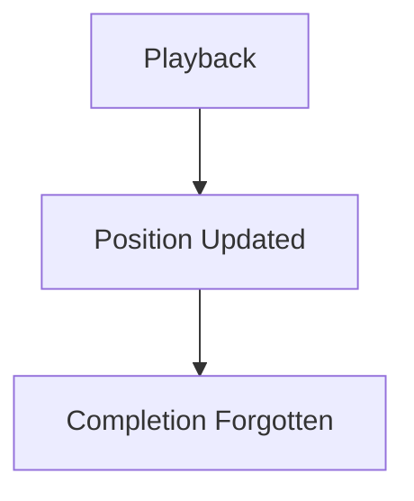

The business becomes inconsistent.

Aggregates prevent this.

---

# Consistency Boundary

The Aggregate defines the boundary within which business consistency is guaranteed.

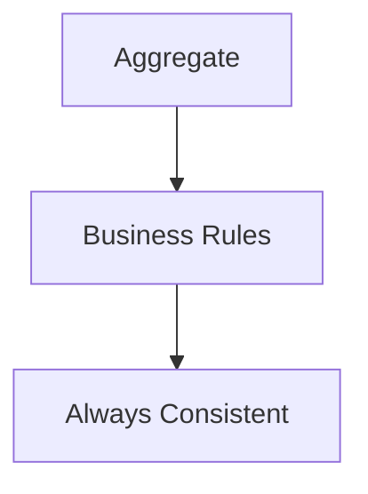

Outside the Aggregate:

Only eventual consistency should generally be assumed.

This distinction aligns naturally with Mosaic's event-driven runtime.

---

# Aggregate Structure

Every Aggregate follows the same conceptual model.

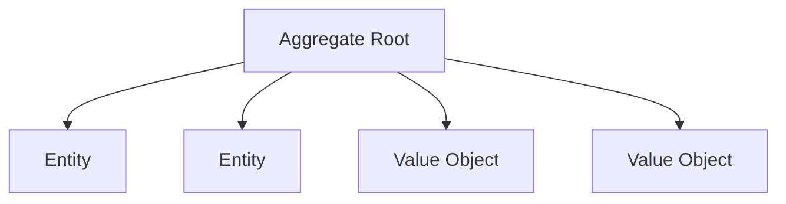

The Aggregate Root controls every modification.

Nothing else may mutate Aggregate state directly.

---

# Aggregate Size

Aggregates SHOULD remain small.

Poor.

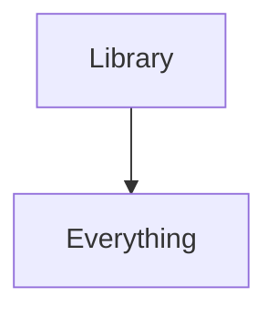

Better.

```

Library
```

```

Collection
```

```

Playback
```

Each Aggregate should represent one coherent business concept.

Large Aggregates reduce concurrency, increase coupling and become increasingly difficult to evolve.

Evans emphasises keeping Aggregates as small as practical while still protecting business invariants. ([dddcommunity.org](https://dddcommunity.org/wp-content/uploads/files/pdf_articles/Vernon_2011_1.pdf))

---

# One Transaction

Business consistency is guaranteed only inside one Aggregate.

Example.

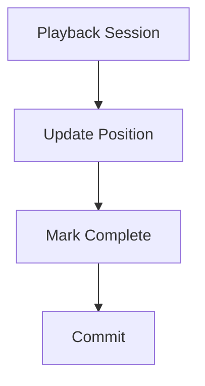

Everything succeeds.

Or nothing succeeds.

Across Aggregates:

Consistency is eventual.

---

# Aggregate Boundaries

Aggregates should be identified through business rules.

Ask:

> **Which information must always change together?**

Not:

> **Which objects reference each other?**

Relationships alone do not justify an Aggregate.

Consistency does.

---

# Aggregate Ownership

Every Aggregate belongs to exactly one Bounded Context.

Example.

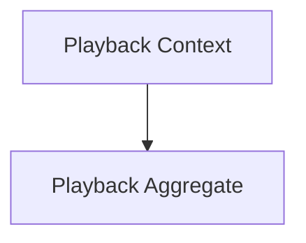

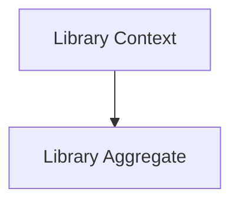

Aggregates must never span multiple Bounded Contexts.

Context boundaries remain stronger than Aggregate boundaries.

---

# Aggregate Behaviour

Business behaviour belongs inside the Aggregate.

Poor.

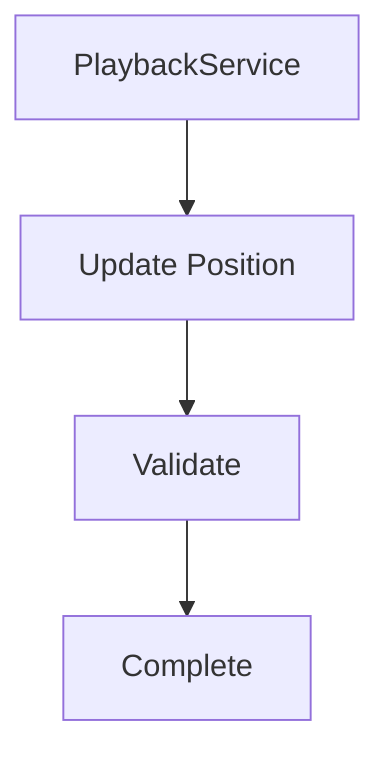

Preferred.

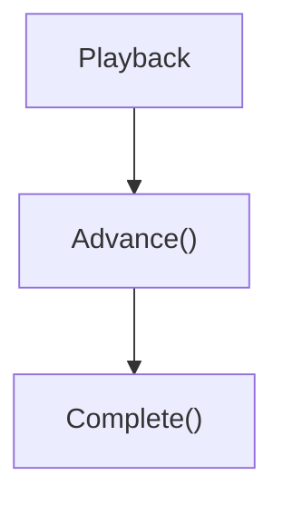

The Aggregate enforces its own rules.

Services coordinate.

Aggregates decide.

---

# Aggregate State

Internal state should never become invalid.

Example.

Poor.

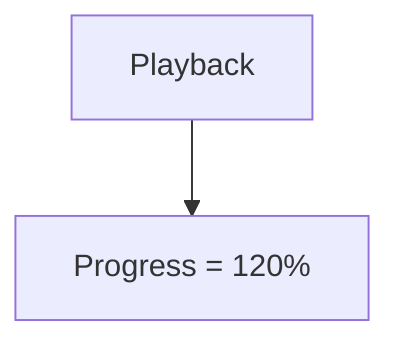

Preferred.

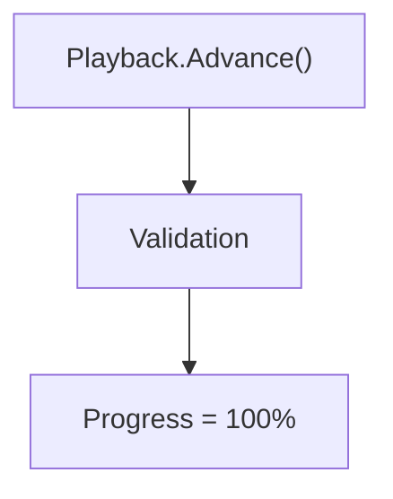

Invalid state should never be observable.

---

# Aggregate References

Aggregates SHOULD reference other Aggregates by identity.

Example.

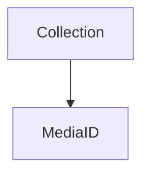

Not.

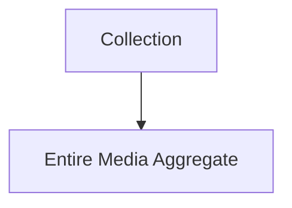

Identity references reduce coupling.

Loading large object graphs should be avoided.

---

# Aggregate Communication

Aggregates communicate through:

- Domain Events
- identities
- repositories

They SHOULD NOT directly modify another Aggregate.

Example.

Poor.

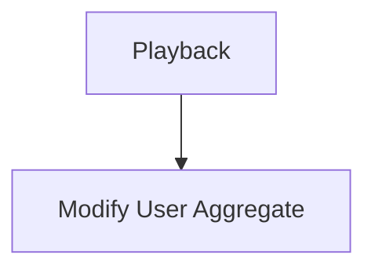

Preferred.

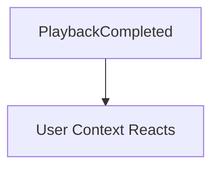

The runtime coordinates.

Aggregates remain autonomous.

---

# Aggregate Lifetime

The Aggregate Root owns the lifetime of everything inside it.

Example.

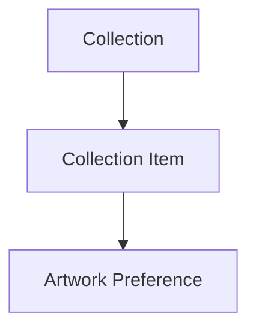

Removing the Aggregate removes its internal concepts.

Internal Entities should not outlive their owning Aggregate.

---

# Transactions

One transaction should modify one Aggregate.

Poor.

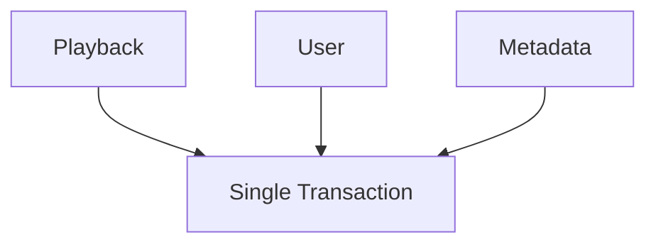

Preferred.

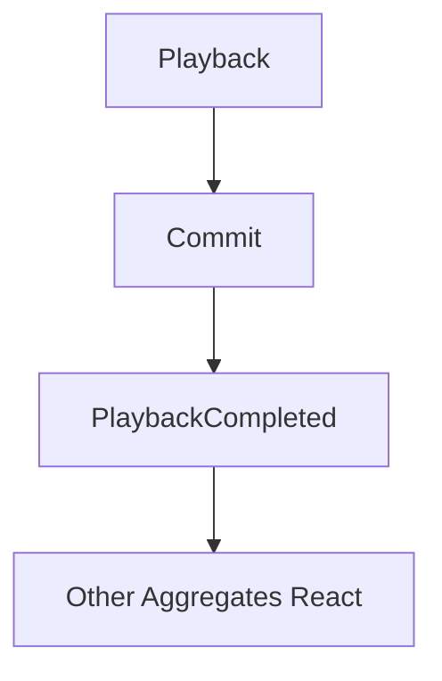

This naturally complements the Event-Driven Runtime defined in [MEG-002](../meg-002-event-driven-runtime/index.md).

---

# Aggregate Invariants

Aggregates enforce business invariants.

Examples.

Playback.

- Progress cannot exceed duration.
- Completion requires reaching the end.
- Resume position cannot be negative.

Collection.

- Duplicate media references prohibited.
- Collection name required.

Business rules belong inside the Aggregate.

Not inside controllers or repositories.

---

# Domain Events

Aggregates are the primary source of Domain Events.

Example.

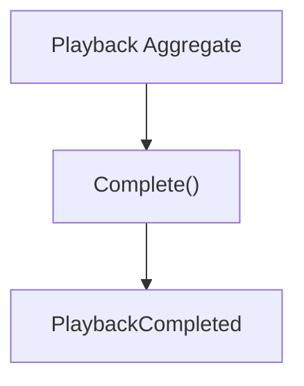

Business events originate from business behaviour.

Not infrastructure.

---

# Persistence

Repositories persist entire Aggregates.

Poor.

```

PlaybackPositionRepository
```

```

PlaybackProgressRepository
```

Preferred.

```

PlaybackRepository
```

Repositories persist consistency boundaries.

Not individual implementation details.

---

# Avoid Large Object Graphs

Large Aggregates often indicate poor modelling.

Poor.

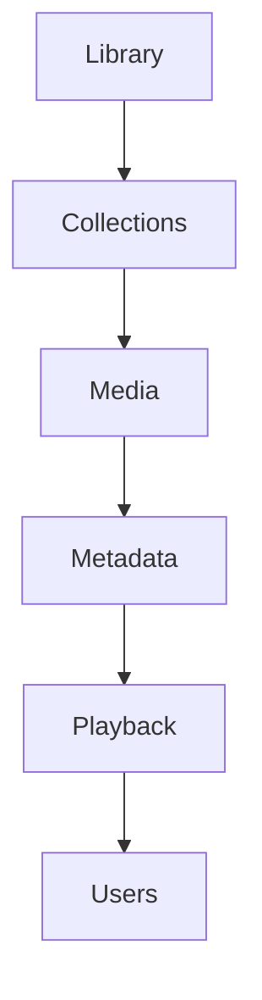

Better.

```mermaid
flowchart TD

N1["Library"]
N2["Collection IDs"]

N1 --> N2
```

```mermaid
flowchart TD

N1["Playback"]
N2["Media ID"]

N1 --> N2
```

Small Aggregates naturally improve scalability.

---

# Aggregate Design Checklist

Before defining an Aggregate ask:

- What business rule am I protecting?
- What must always remain consistent?
- Can this Aggregate become smaller?
- Does another Aggregate own this concept?
- Am I modelling consistency or convenience?

If the answer is convenience, reconsider the boundary.

---

# Mosaic Examples

Examples of Aggregates within Mosaic include:

```

Library
```

Responsible for:

- media ownership
- import state
- source configuration

---

```

Playback Session
```

Responsible for:

- playback progress
- completion state
- resume position

---

```

Collection
```

Responsible for:

- collection membership
- ordering
- user ownership

Each Aggregate protects one coherent set of business rules.

---

# Anti-Patterns

The following practices are prohibited.

## Giant Aggregates

```mermaid
flowchart TD

N1["Media Platform"]
N2["Everything"]

N1 --> N2
```

---

## Cross-Aggregate Transactions

One transaction updating multiple Aggregates.

---

## Shared Mutable Entities

Entities simultaneously belonging to multiple Aggregates.

---

## Aggregate Bypass

Repositories modifying internal Entities directly.

---

## Technical Aggregates

Grouping objects because they share a database table rather than a business invariant.

---

# Mosaic Guidelines

Within Mosaic:

- Every Aggregate MUST protect one consistency boundary.
- Every Aggregate MUST have one Aggregate Root.
- Aggregate behaviour MUST enforce business invariants.
- Aggregates SHOULD remain small.
- Aggregates MUST communicate through identities or events.
- Cross-Aggregate consistency SHOULD be eventual.
- Repositories MUST persist Aggregates rather than individual Entities.
- Aggregate boundaries SHOULD follow business rules rather than object relationships.

---

# Relationship to MEG

Entities answer:

> **Who is this?**

Value Objects answer:

> **What is this?**

Aggregates answer:

> **What must always remain consistent together?**

The next chapter introduces the **Aggregate Root**, the only object permitted to expose and protect that consistency boundary.

---

# Summary

Aggregates are the mechanism through which Domain-Driven Design preserves business correctness without sacrificing scalability.

Within Mosaic they provide:

- explicit consistency boundaries
- protected business invariants
- clear ownership
- small transactional units
- natural integration with the Event-Driven Runtime

Every Aggregate should exist because it protects an important business rule.

If it does not, it probably should not exist.
