<!--
File: docs/engineering/guides/meg-003-domain-driven-design/09-aggregate-roots.md
Document: MEG-003
Status: Draft
-->

# Aggregate Roots

> *Every Aggregate has one guardian. Every business rule enters through it.*

---

# Purpose

An Aggregate defines a business consistency boundary.

However, something must protect that boundary.

Without a single entry point:

- business rules become duplicated
- invariants become inconsistent
- internal entities become exposed
- external code bypasses business behaviour

Domain-Driven Design solves this by introducing the **Aggregate Root**.

Every Aggregate has exactly one Aggregate Root.

Every modification to the Aggregate passes through it.

This document defines how Aggregate Roots should be designed throughout the Mosaic platform.

---

# Philosophy

Within Mosaic:

> **The Aggregate Root protects the consistency of the Aggregate.**

The Aggregate Root is not merely the "first entity."

It is the only object responsible for maintaining the business integrity of the Aggregate.

Nothing outside the Aggregate should ever modify internal state directly.

---

# What Is An Aggregate Root?

The Aggregate Root is the public entry point into an Aggregate.

Example.

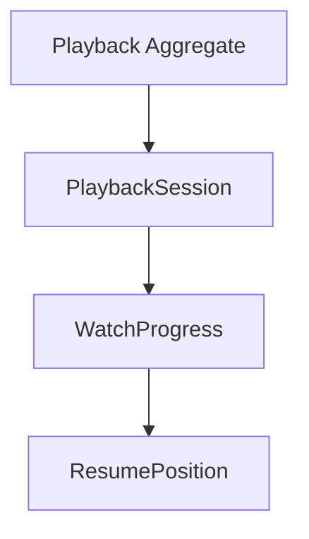

Only:

```

PlaybackSession
```

is visible outside the Aggregate.

Everything else remains internal.

The Aggregate Root therefore acts as both:

- public API
- consistency guardian

---

# One Root Per Aggregate

Every Aggregate MUST contain exactly one Aggregate Root.

Poor.

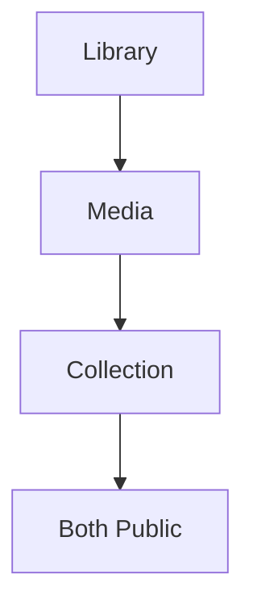

Better.

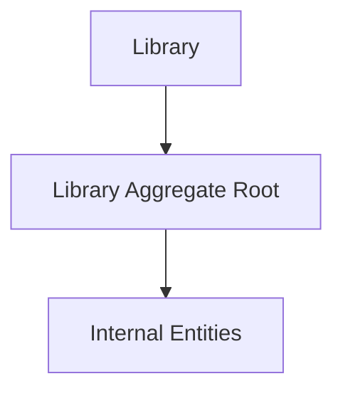

Multiple Aggregate Roots create ambiguous ownership.

Ownership should always be singular.

Martin Fowler summarises this rule succinctly: external references should point only to the Aggregate Root, which is responsible for maintaining the integrity of the Aggregate.  [martinfowler.com](https://martinfowler.com/bliki/DDD_Aggregate.html)

---

# Entry Point

Every modification to an Aggregate MUST occur through its Aggregate Root.

Poor.

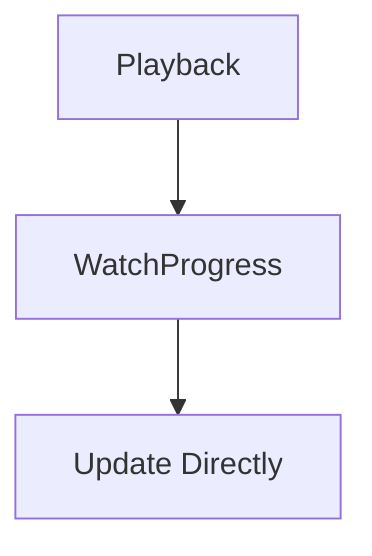

Preferred.

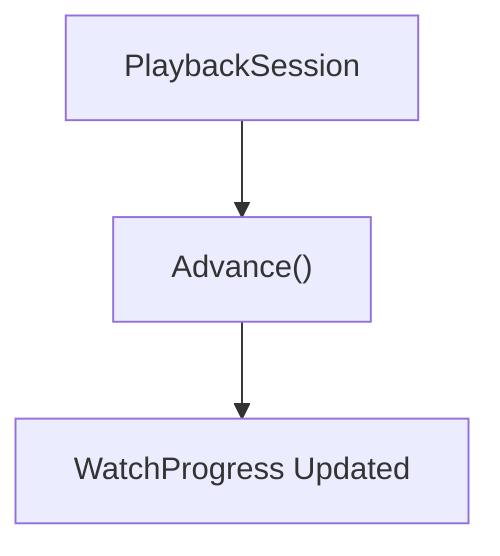

Internal objects should never become publicly mutable.

---

# Aggregate Boundary

The Aggregate Root defines the boundary between:

```

External World
```

and

```

Internal Business Rules
```

Everything outside the Aggregate sees only the Root.

Everything inside the Aggregate remains an implementation detail.

---

# Business Authority

The Aggregate Root owns business authority.

Example.

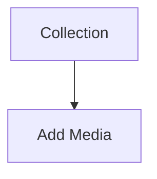

The Collection decides:

- duplicates
- ordering
- ownership
- limits

External code simply requests the operation.

The Aggregate Root decides whether it is valid.

---

# Protecting Invariants

Aggregate Roots exist primarily to protect invariants.

Example.

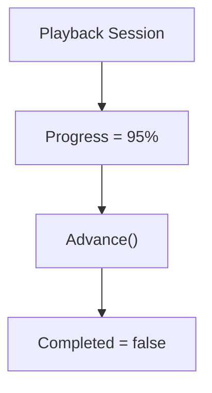

Later.

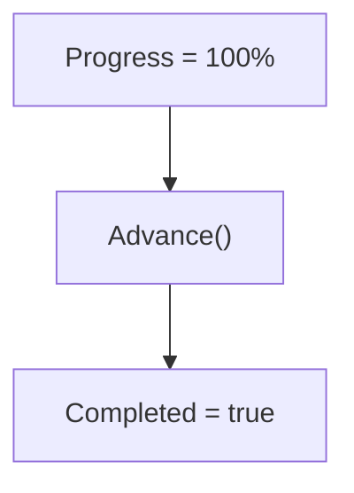

The Aggregate Root guarantees these business rules always remain true.

Callers should never need to enforce them manually.

---

# Internal Entities

Entities inside an Aggregate are implementation details.

Example.

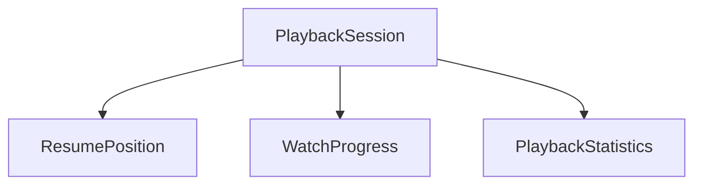

External components should never hold references to these internal objects.

They interact only through:

```

PlaybackSession
```

---

# References

Other Aggregates SHOULD reference only the Aggregate Root.

Example.

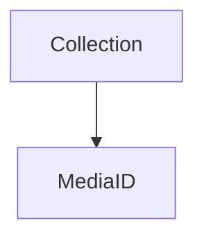

Not.

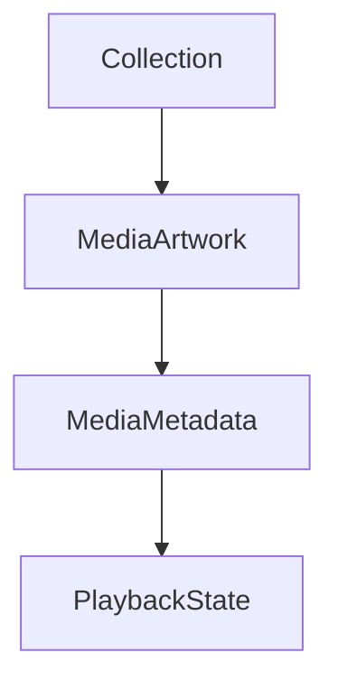

Cross-Aggregate references should always use identity.

Never internal object references.

This rule reduces coupling and preserves Aggregate boundaries.  [martinfowler.com](https://martinfowler.com/bliki/DDD_Aggregate.html)

---

# Aggregate API

Aggregate Roots should expose business behaviour.

Good.

```go
collection.AddMedia(mediaID)
```

```go
playback.Resume(position)
```

Poor.

```go
collection.Items = append(...)
```

Public setters bypass business rules.

Business behaviour should always remain explicit.

---

# Rich Behaviour

Aggregate Roots should become richer over time.

Initially.

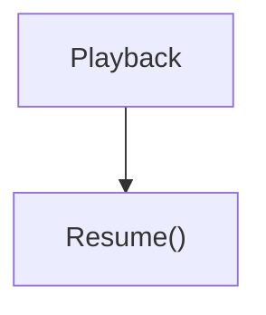

Later.

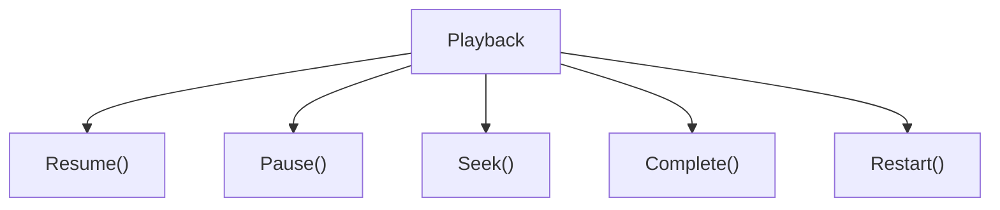

As business understanding grows, behaviour should naturally accumulate.

Data alone rarely represents the business.

---

# Persistence

Repositories persist Aggregate Roots.

Example.

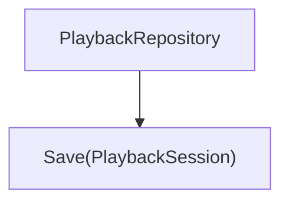

Not.

```

PlaybackProgressRepository
```

Repositories should never persist internal Entities independently.

The Aggregate Root represents the transactional boundary.

---

# Transactions

Every transaction should begin with the Aggregate Root.

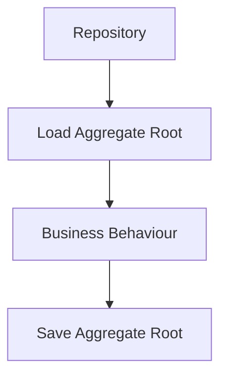

Internal Entities participate naturally.

The caller never coordinates them individually.

---

# Domain Events

Aggregate Roots are the canonical source of Domain Events.

Example.

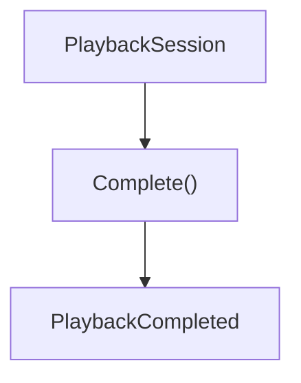

The Domain Event is emitted because the Aggregate Root knows:

- the business transition occurred
- invariants remain satisfied
- state has become consistent

Infrastructure should not invent business events.

---

# Validation

Aggregate Roots should validate every externally visible operation.

Example.

```go
collection.AddMedia(mediaID)
```

Internally.

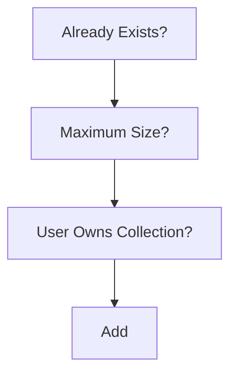

Validation belongs inside the Aggregate.

Callers should not duplicate business rules.

---

# Aggregate Root Size

Aggregate Roots should remain cohesive.

Poor.

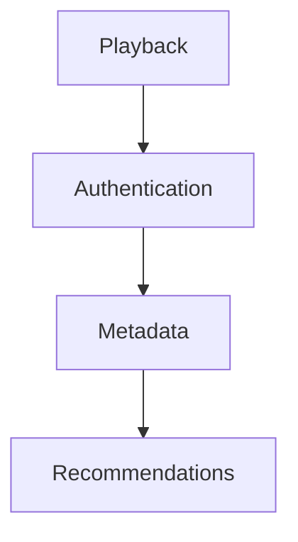

Good.

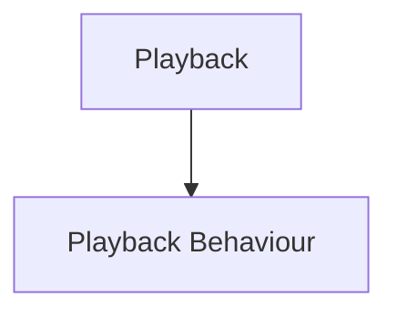

The Aggregate Root should own one business concept.

Nothing more.

---

# Constructors

Aggregate Roots SHOULD be created through constructors or factories.

Poor.

```go
PlaybackSession{}
```

Preferred.

```go
NewPlaybackSession(...)
```

Construction should establish a valid Aggregate immediately.

Invalid Aggregates should never exist.

---

# Identity

The identity of the Aggregate is the identity of its Root.

Example.

```

PlaybackSessionID
```

Internal Entities may possess local identities if required.

Those identities should never escape the Aggregate boundary.

The Aggregate Root alone has global identity.  [Baeldung on Kotlin](https://www.baeldung.com/cs/aggregate-root-ddd)

---

# Aggregate Root Checklist

Before introducing an Aggregate Root ask:

- Does it own business consistency?
- Does every modification pass through it?
- Are internal Entities hidden?
- Does it expose business behaviour?
- Does it enforce invariants?
- Does it own Domain Events?

If any answer is "no", reconsider the Aggregate boundary.

---

# Mosaic Examples

Examples of Aggregate Roots include:

```

Library
```

Responsible for:

- importing media
- source ownership
- library consistency

---

```

PlaybackSession
```

Responsible for:

- playback lifecycle
- progress
- completion
- resume position

---

```

Collection
```

Responsible for:

- membership
- ordering
- ownership
- duplicate prevention

Each Aggregate Root owns one coherent business consistency boundary.

---

# Anti-Patterns

The following practices are prohibited.

## Public Internal Entities

Allowing callers to modify child Entities directly.

---

## Public Setters

Exposing Aggregate state without business validation.

---

## Repository Per Internal Entity

Persisting child Entities independently.

---

## Cross-Aggregate Object References

Holding references to another Aggregate's internal Entities.

---

## Aggregate Root As Data Container

Aggregate Roots should own behaviour.

Not merely fields.

---

## Business Rules Outside The Aggregate

Controllers, services or repositories enforcing Aggregate invariants.

The Aggregate Root owns those rules.

---

# Mosaic Guidelines

Within Mosaic:

- Every Aggregate MUST have exactly one Aggregate Root.
- All modifications MUST pass through the Aggregate Root.
- Aggregate Roots MUST protect business invariants.
- Aggregate Roots MUST expose business behaviour.
- Internal Entities MUST remain hidden.
- Repositories MUST persist Aggregate Roots.
- Other Aggregates MUST reference Aggregate Roots by identity only.
- Aggregate Roots SHOULD publish Domain Events representing completed business transitions.

---

# Relationship to MEG

Aggregates define:

> **What must remain consistent together?**

Aggregate Roots define:

> **Who is responsible for protecting that consistency?**

The next chapter introduces **Domain Services**, which model important business behaviour that belongs to the domain but naturally exists outside any single Aggregate.

---

# Summary

Aggregate Roots are the guardians of business consistency.

They protect:

- invariants
- identity
- transactional boundaries
- business behaviour

Within Mosaic, every Aggregate Root exists for one reason:

> **To ensure the business can never place the Aggregate into an invalid state.**

Everything else inside the Aggregate exists to support that responsibility.
