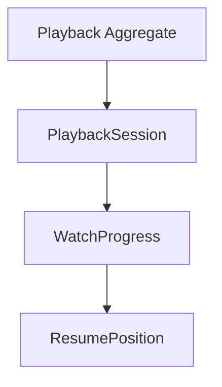
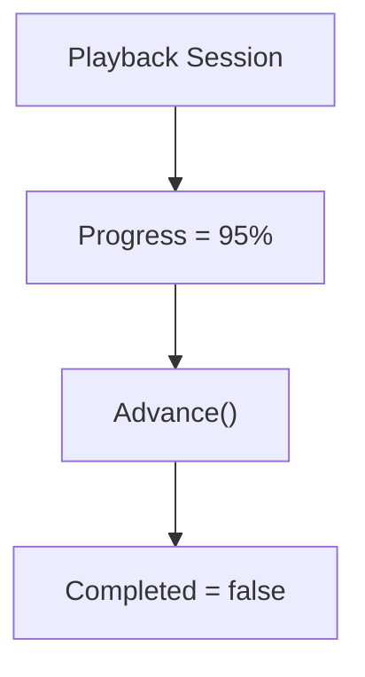
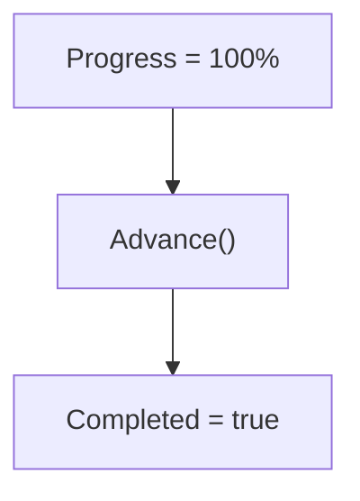
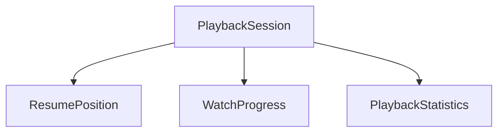
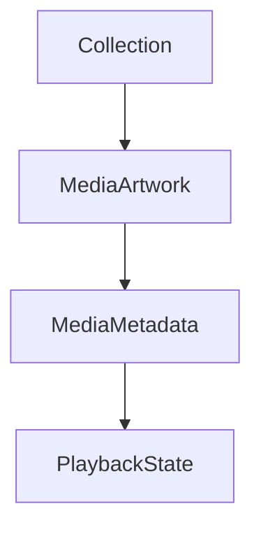
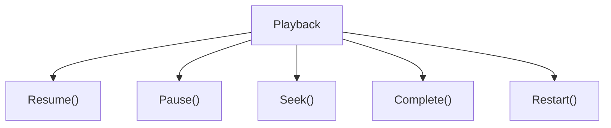
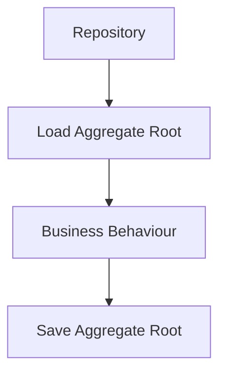
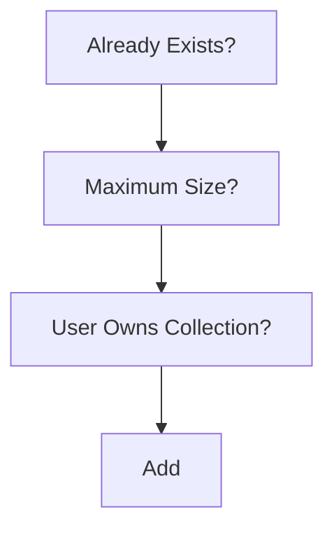

<!--
File: docs/engineering/guides/meg-003-domain-driven-design/09-aggregate-roots.md
Document: MEG-003
Status: Draft
-->

# Aggregate Roots

> *Every Aggregate has one guardian. Every business rule enters through it.*

---

# Purpose

An Aggregate defines a business consistency boundary, but something must protect that boundary. A boundary nothing enforces is only a description of intent. Without a single entry point:

- business rules become duplicated
- invariants become inconsistent
- internal entities become exposed
- external code bypasses business behaviour

Domain-Driven Design solves this by introducing the **Aggregate Root**. Every Aggregate has exactly one Aggregate Root and every modification to the Aggregate passes through it, which is what makes the boundary enforceable rather than merely declared. This document defines how Aggregate Roots should be designed throughout the Mosaic platform.

---

# Philosophy

Within Mosaic:

> **The Aggregate Root protects the consistency of the Aggregate.**

The Aggregate Root is not merely the "first entity" of the cluster. It is the only object responsible for maintaining the business integrity of the Aggregate, so nothing outside the Aggregate should ever modify internal state directly.

---

# What Is An Aggregate Root?

The Aggregate Root is the public entry point into an Aggregate, and in the Playback Aggregate that entry point is PlaybackSession.



Only PlaybackSession is visible outside the Aggregate. Everything else remains internal. The Aggregate Root therefore acts as both:

- public API
- consistency guardian

---

# One Root Per Aggregate

Every Aggregate must contain exactly one Aggregate Root. A Library that exposes both Media and Collection as public roots is poor practice, because multiple Aggregate Roots create ambiguous ownership; better is a Library with a single Library Aggregate Root standing in front of its Internal Entities. Ownership should always be singular. Martin Fowler summarises this rule succinctly: external references should point only to the Aggregate Root, which is responsible for maintaining the integrity of the Aggregate.  [martinfowler.com](https://martinfowler.com/bliki/DDD_Aggregate.html)

---

# Entry Point

Every modification to an Aggregate must occur through its Aggregate Root. Reaching into Playback to update WatchProgress directly is poor practice, because the rules attached to that change are then skipped; preferred is calling `Advance()` on PlaybackSession and letting WatchProgress be updated as a consequence. Internal objects should never become publicly mutable.

---

# Aggregate Boundary

The Aggregate Root defines the boundary between the External World and the Internal Business Rules. Everything outside the Aggregate sees only the Root, so everything inside the Aggregate remains an implementation detail.

---

# Business Authority

The Aggregate Root owns business authority, so when media is added to a Collection the Collection decides:

- duplicates
- ordering
- ownership
- limits

External code simply requests the operation. The Aggregate Root decides whether it is valid, which keeps that judgement in one place rather than in every caller.

---

# Protecting Invariants

Aggregate Roots exist primarily to protect invariants, which is visible in the way the same operation produces different outcomes depending on state. A Playback Session at 95% that is advanced remains incomplete.



Later, once progress reaches 100%, the same call completes the session.



The Aggregate Root guarantees these business rules always remain true. Callers should never need to enforce them manually, because a rule they are trusted to apply is a rule they can forget.

---

# Internal Entities

Entities inside an Aggregate are implementation details, as ResumePosition, WatchProgress and PlaybackStatistics are within PlaybackSession.



External components should never hold references to these internal objects. They interact only through PlaybackSession, which keeps the interior free to change without breaking anything outside.

---

# References

Other Aggregates should reference only the Aggregate Root, so a Collection holds a MediaID rather than reaching through MediaArtwork, MediaMetadata and PlaybackState.



Cross-Aggregate references should always use identity and never internal object references. This rule reduces coupling and preserves Aggregate boundaries.  [martinfowler.com](https://martinfowler.com/bliki/DDD_Aggregate.html)

---

# Aggregate API

Aggregate Roots should expose business behaviour rather than state. The following are good, because each names an operation the business recognises.

```go
collection.AddMedia(mediaID)
```

```go
playback.Resume(position)
```

The following is poor.

```go
collection.Items = append(...)
```

Public setters bypass business rules. Business behaviour should always remain explicit, because a named operation states what the business is doing while an assignment states only what a field became.

---

# Rich Behaviour

Aggregate Roots should become richer over time. Playback may begin with only `Resume()`, but as business understanding grows the Root accumulates the rest of its lifecycle.



Behaviour should therefore accumulate naturally. Data alone rarely represents the business, so a Root that gains only fields over time has stopped modelling anything.

---

# Persistence

Repositories persist Aggregate Roots, which means a PlaybackRepository saves the whole PlaybackSession rather than exposing a PlaybackProgressRepository alongside it. Repositories should never persist internal Entities independently, because the Aggregate Root represents the transactional boundary.

---

# Transactions

Every transaction should begin with the Aggregate Root, which the Repository loads, applies business behaviour to, and saves again.



Internal Entities participate naturally in that transaction. The caller never coordinates them individually, which is what makes the Root the transactional boundary in practice as well as in principle.

---

# Domain Events

Aggregate Roots are the canonical source of Domain Events, so `PlaybackCompleted` is emitted when `Complete()` is called on PlaybackSession. The Domain Event is emitted because the Aggregate Root knows:

- the business transition occurred
- invariants remain satisfied
- state has become consistent

Infrastructure should not invent business events.

---

# Validation

Aggregate Roots should validate every externally visible operation, so an apparently simple call carries a sequence of business checks behind it.

```go
collection.AddMedia(mediaID)
```

Internally that call asks whether the media already exists, whether the maximum size has been reached, and whether the user owns the Collection before it adds anything.



Validation belongs inside the Aggregate. Callers should not duplicate business rules, because duplicated rules drift apart and the Aggregate stops being the authority on its own state.

---

# Aggregate Root Size

Aggregate Roots should remain cohesive. A Playback Root that also reaches into Authentication, Metadata and Recommendations is poor, whereas a Playback Root owning only Playback Behaviour is good. The Aggregate Root should own one business concept and nothing more.

---

# Constructors

Aggregate Roots should be created through constructors or factories. The following is poor.

```go
PlaybackSession{}
```

Preferred.

```go
NewPlaybackSession(...)
```

Construction should establish a valid Aggregate immediately, because invalid Aggregates should never exist.

---

# Identity

The identity of the Aggregate is the identity of its Root, which for a Playback Session is the PlaybackSessionID. Internal Entities may possess local identities if required, but those identities should never escape the Aggregate boundary, so the Aggregate Root alone has global identity.  [Baeldung on Kotlin](https://www.baeldung.com/cs/aggregate-root-ddd)

---

# Aggregate Root Checklist

Before introducing an Aggregate Root, confirm that it genuinely carries the responsibilities the pattern exists to place somewhere:

- Does it own business consistency?
- Does every modification pass through it?
- Are internal Entities hidden?
- Does it expose business behaviour?
- Does it enforce invariants?
- Does it own Domain Events?

If any answer is "no", reconsider the Aggregate boundary.

---

# Mosaic Examples

Examples of Aggregate Roots include Library, which is responsible for:

- importing media
- source ownership
- library consistency

---

The PlaybackSession Aggregate Root is responsible for:

- playback lifecycle
- progress
- completion
- resume position

---

The Collection Aggregate Root is responsible for:

- membership
- ordering
- ownership
- duplicate prevention

Each Aggregate Root owns one coherent business consistency boundary. None of them enforces rules belonging to another.

---

# Anti-Patterns

The following practices are prohibited.

## Public Internal Entities

Allowing callers to modify child Entities directly. Every modification must pass through the Aggregate Root, so an exposed child is a route around the invariants.

---

## Public Setters

Exposing Aggregate state without business validation. A setter admits any value the type allows, which is rarely the same as any value the business allows.

---

## Repository Per Internal Entity

Persisting child Entities independently. The Aggregate Root is the transactional boundary, so saving a child on its own can commit a partial and inconsistent state.

---

## Cross-Aggregate Object References

Holding references to another Aggregate's internal Entities. Cross-Aggregate references must use identity, because an object reference couples one Aggregate to the interior of another.

---

## Aggregate Root As Data Container

Aggregate Roots should own behaviour, not merely fields. A Root reduced to data holds no invariants, so the rules migrate outward into whatever code happens to touch it.

---

## Business Rules Outside The Aggregate

Controllers, services or repositories enforcing Aggregate invariants. The Aggregate Root owns those rules, and a rule enforced anywhere else becomes duplicated the moment a second caller appears.

---

# Mosaic Guidelines

Within Mosaic:

- Every Aggregate must have exactly one Aggregate Root.
- All modifications must pass through the Aggregate Root.
- Aggregate Roots must protect business invariants.
- Aggregate Roots must expose business behaviour.
- Internal Entities must remain hidden.
- Repositories must persist Aggregate Roots.
- Other Aggregates must reference Aggregate Roots by identity only.
- Aggregate Roots should publish Domain Events representing completed business transitions.

---

# Relationship to MEG

Aggregates define:

> **What must remain consistent together?**

Aggregate Roots define:

> **Who is responsible for protecting that consistency?**

The next chapter introduces **Domain Services**, which model important business behaviour that belongs to the domain but naturally exists outside any single Aggregate.

---

# Summary

Aggregate Roots are the guardians of business consistency. Everything the Aggregate promises depends on there being exactly one object able to make that promise. They protect:

- invariants
- identity
- transactional boundaries
- business behaviour

Within Mosaic, every Aggregate Root exists for one reason:

> **To ensure the business can never place the Aggregate into an invalid state.**

Everything else inside the Aggregate exists to support that responsibility.
