<!--
File: docs/engineering/guides/meg-003-domain-driven-design/10-domain-services.md
Document: MEG-003
Status: Draft
Version: 0.4
-->

# Domain Services

> *Not every piece of business behaviour belongs to an Entity. When important business logic spans multiple concepts but still belongs to the domain, it belongs in a Domain Service.*

---

# Purpose

Most business behaviour should naturally belong to:

- Entities
- Value Objects
- Aggregates

Occasionally, however, an important business operation does not belong naturally to any single domain object.

Examples include:

- matching recommendations
- calculating compatibility
- resolving media identity
- selecting metadata providers
- merging duplicate media

These behaviours are still part of the business domain.

They simply do not belong to one Aggregate.

Domain Services provide a home for this behaviour.

---

# Philosophy

Within Mosaic:

> **A Domain Service exists only when important business behaviour belongs to the domain but belongs to no individual Aggregate.**

A Domain Service should never become:

- a utility class
- a service layer
- an orchestration layer
- a collection of helper methods

It exists only to model business behaviour.

Eric Evans famously describes a Domain Service as appropriate when "it just isn't a thing." In other words, the behaviour is clearly part of the domain but does not naturally belong to an Entity or Value Object.  [O'Reilly Media](https://www.oreilly.com/library/view/implementing-domain-driven-design/9780133039900/ch07.html)

---

# What Is A Domain Service?

A Domain Service models a business operation that:

- belongs to the domain
- involves multiple Aggregates
- has no natural owner
- represents important business knowledge

It is defined by behaviour.

Not by state.

---

# Why Domain Services Exist

Consider:

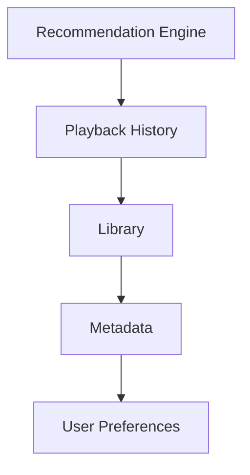

Which Aggregate owns recommendation generation?

Not:

```

Playback
```

Not:

```

Library
```

Not:

```

Metadata
```

The behaviour belongs to the business.

Not to an individual Aggregate.

This is an ideal Domain Service.

---

# Domain Service Characteristics

A Domain Service should:

- represent business behaviour
- remain stateless
- speak the ubiquitous language
- depend upon domain concepts
- return domain concepts

A Domain Service should **not**:

- persist data
- coordinate infrastructure
- expose HTTP
- publish runtime events directly
- manage transactions

Those concerns belong elsewhere.

---

# Stateless By Design

Domain Services SHOULD be stateless.

Poor.

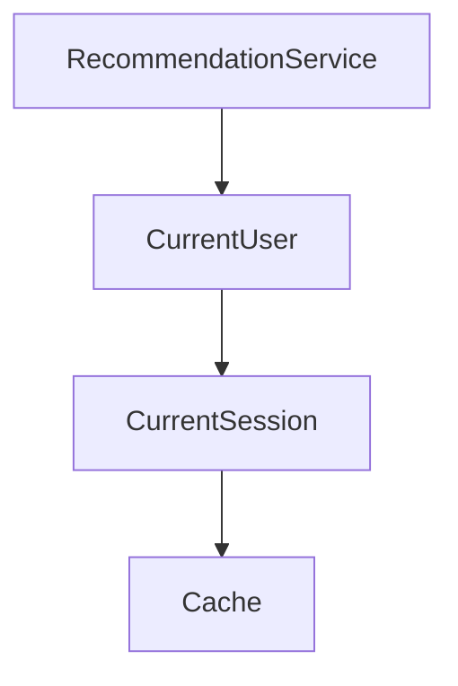

Better.

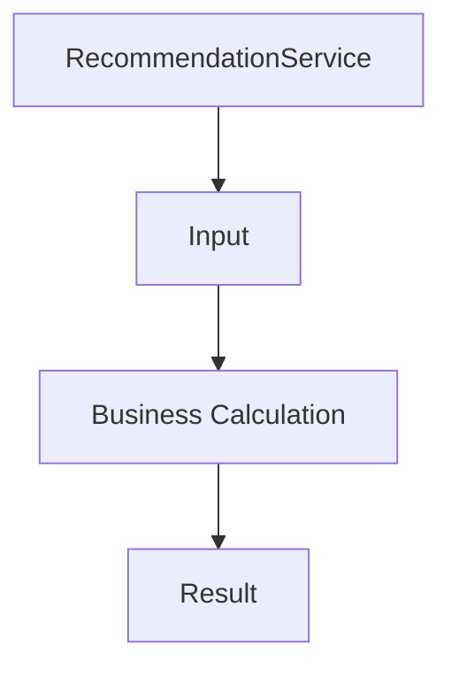

State belongs to Aggregates.

Behaviour belongs to Domain Services.

Statelessness is one of the defining characteristics of a Domain Service.  [Domain-Driven Design Guide](https://ddd-practitioners.com/home/glossary/domain-service/)

---

# Domain Services Are Not Application Services

One of the most common misunderstandings in DDD is confusing Domain Services with Application Services.

Application Service.

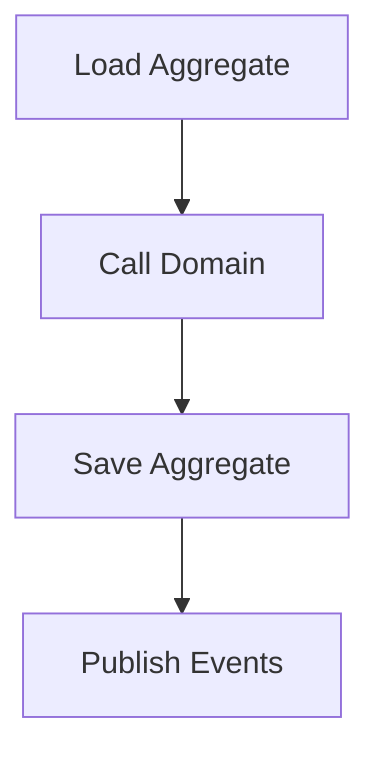

Domain Service.

```

Business Behaviour
```

Application Services coordinate.

Domain Services decide.

This distinction is fundamental.

---

# Domain Services Are Not Utility Classes

Poor.

```

MediaUtils
```

```

LibraryHelper
```

```

RecommendationUtil
```

These names communicate implementation convenience.

Not business behaviour.

Instead:

```

RecommendationEngine
```

```

DuplicateResolver
```

```

MetadataMatcher
```

The name should describe business intent.

---

# Behaviour Before Data

A Domain Service exists because of behaviour.

Not because of shared data.

Poor.

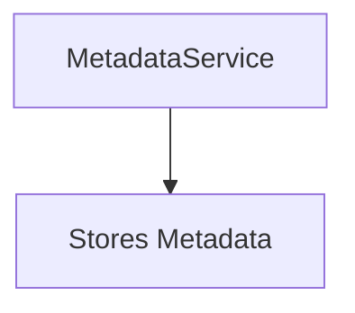

That responsibility belongs to the Metadata Aggregate.

Better.

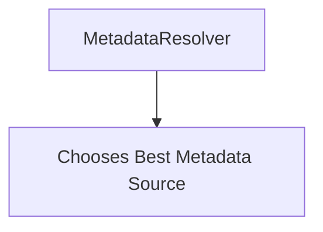

The behaviour belongs naturally to the domain.

---

# Business Language

Domain Services should reinforce the ubiquitous language.

Good.

```

DuplicateResolver
```

```

RecommendationEngine
```

```

MetadataMatcher
```

Poor.

```

BusinessProcessor
```

```

DomainManager
```

```

Coordinator
```

Names should communicate business concepts.

Not technical roles.

---

# Aggregate Collaboration

Domain Services frequently coordinate behaviour across multiple Aggregates.

Example.

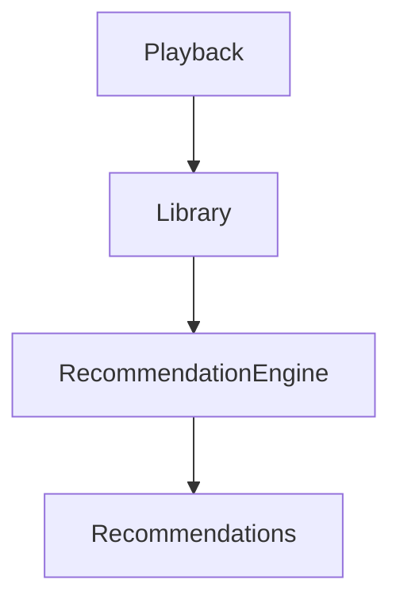

Notice:

The service does not own those Aggregates.

It merely applies business rules involving them.

---

# Domain Services Should Be Rare

Most business behaviour belongs inside Aggregates.

Ask first:

> Can this behaviour belong inside an Aggregate?

If yes:

Do that.

Only introduce a Domain Service when no Aggregate can reasonably own the behaviour.

Large numbers of Domain Services often indicate an anemic domain model.

---

# Domain Services May Depend Upon Repositories

Occasionally a Domain Service requires additional information.

Example.

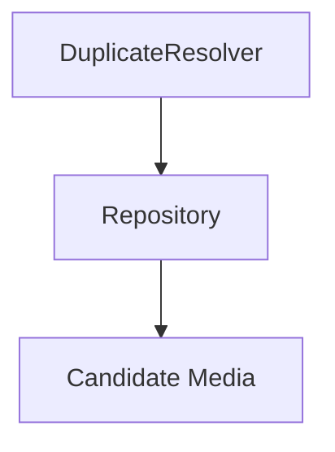

This is acceptable when:

- the repository supports domain behaviour
- the behaviour genuinely spans multiple Aggregates

However:

Repositories should support the Domain Service.

Not become the Domain Service.

---

# Domain Events

A Domain Service may cause Domain Events indirectly.

Example.

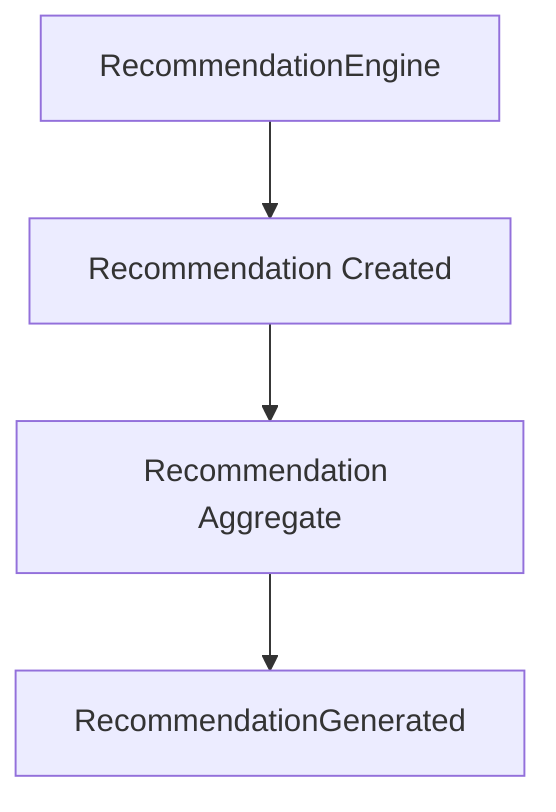

The Domain Service performs business reasoning.

The Aggregate still owns business state and Domain Events.

Business facts should originate from Aggregates whenever practical.

---

# Examples Within Mosaic

Appropriate Domain Services include:

```

MetadataMatcher
```

Determines the most appropriate metadata source.

---

```

DuplicateResolver
```

Determines whether imported media already exists.

---

```

RecommendationEngine
```

Calculates recommended media based on multiple business concepts.

---

```

CollectionOrderingPolicy
```

Determines business ordering rules for collections.

These services represent business knowledge.

Not infrastructure.

---

# What Is Not A Domain Service?

The following are **not** Domain Services.

```

HTTPService
```

```

EmailSender
```

```

DatabaseManager
```

```

EventPublisher
```

These belong to infrastructure.

Likewise.

```

UserApplicationService
```

This coordinates a use case.

It does not model business behaviour.

---

# Avoid God Services

Poor.

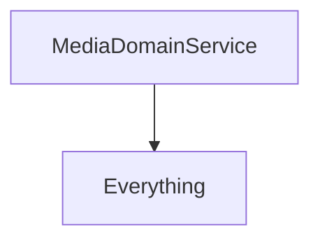

Instead.

```

MetadataMatcher
```

```

DuplicateResolver
```

```

RecommendationEngine
```

Each service should represent one business capability.

---

# Testing

Domain Services should be among the easiest components to test.

Because they are:

- stateless
- deterministic
- business focused

Tests should verify:

- business rules
- decision making
- edge cases

Infrastructure should remain outside the service.

---

# Evolution

Domain Services often emerge naturally.

Initially.

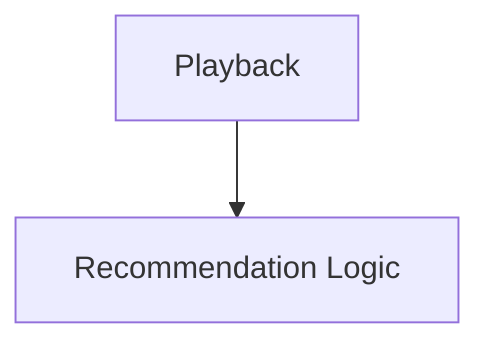

Later.

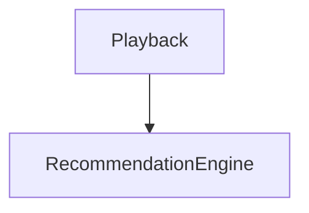

As business understanding improves, behaviour that spans multiple Aggregates naturally becomes its own concept.

Extraction should follow understanding.

Not anticipation.

---

# Anti-Patterns

The following practices are prohibited.

## Generic Services

```

BusinessService
```

```

DomainManager
```

---

## Stateful Services

Services storing mutable business state.

---

## Infrastructure Services

Publishing events.

Sending emails.

Calling HTTP.

Writing SQL.

---

## Anemic Aggregates

Moving Aggregate behaviour into Domain Services simply because "services exist."

---

## Orchestration

Loading repositories.

Saving repositories.

Managing transactions.

These belong to Application Services.

Not Domain Services.

---

# Mosaic Guidelines

Within Mosaic:

- Domain Services MUST model business behaviour.
- Domain Services SHOULD remain stateless.
- Domain Services SHOULD speak the ubiquitous language.
- Domain Services MUST NOT become application services.
- Domain Services MUST NOT own infrastructure concerns.
- Most business behaviour SHOULD remain inside Aggregates.
- Domain Services SHOULD remain rare.
- Domain Service names MUST communicate business intent.

---

# Relationship to MEG

Entities own identity.

Value Objects own value.

Aggregates own consistency.

Aggregate Roots protect consistency.

Domain Services own business behaviour that naturally spans multiple Aggregates.

The next chapter introduces **Domain Events**, the mechanism through which important business facts leave the domain and become visible to the wider platform.

---

# Summary

Domain Services exist for one reason:

> **To model important business behaviour that belongs to the domain but belongs to no individual Aggregate.**

Used sparingly, they strengthen the domain model.

Used excessively, they usually indicate the domain model itself requires improvement.

Within Mosaic, Domain Services should therefore remain focused, expressive and unmistakably business-oriented.
