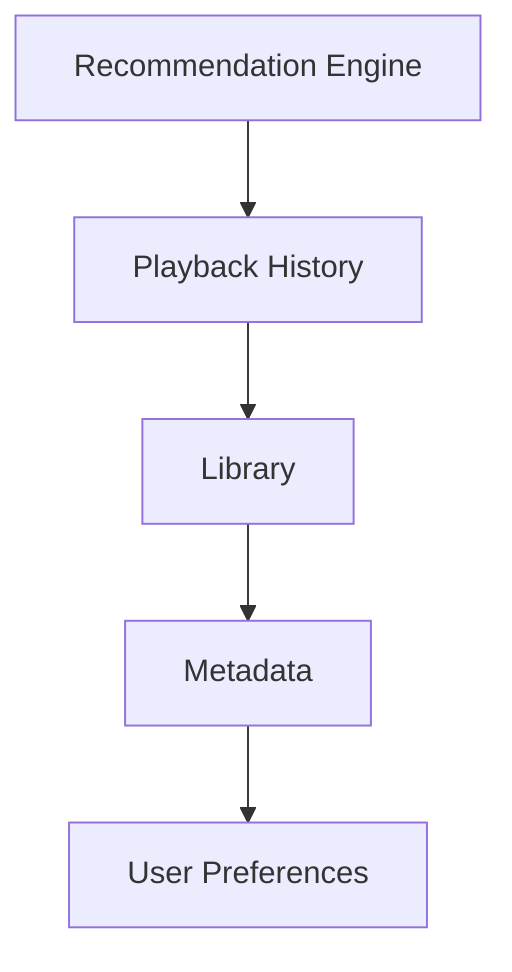
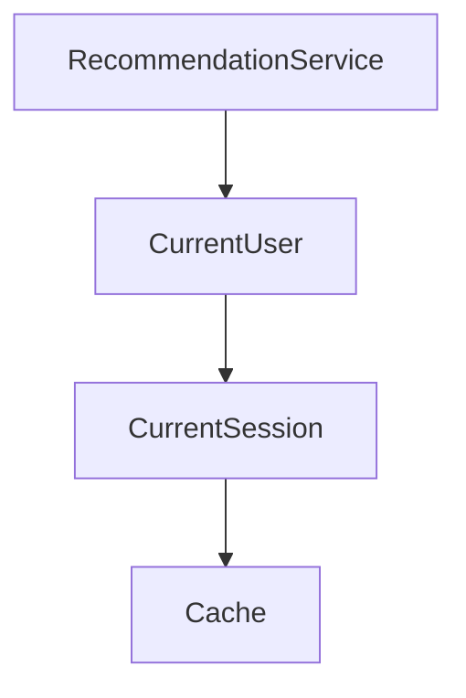
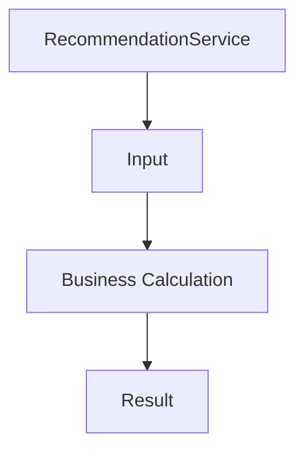
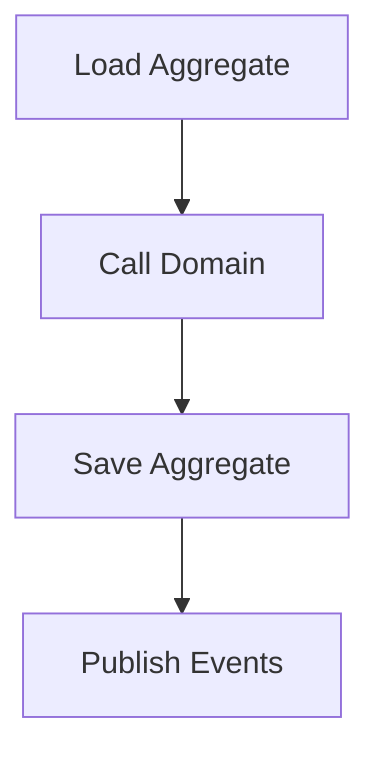
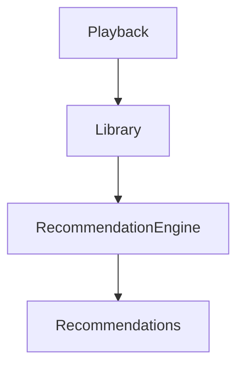
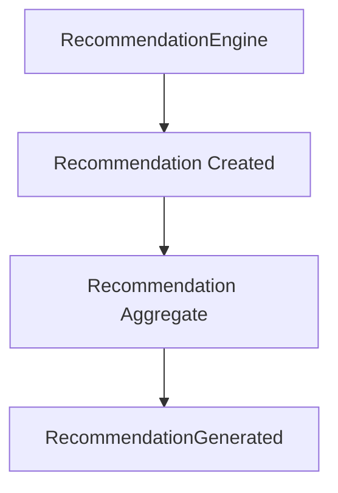

<!--
File: docs/engineering/guides/meg-003-domain-driven-design/10-domain-services.md
Document: MEG-003
Status: Draft
-->

# Domain Services

> *Not every piece of business behaviour belongs to an Entity. When important business logic spans multiple concepts but still belongs to the domain, it belongs in a Domain Service.*

---

# Purpose

Most business behaviour should belong naturally to an Entity, a Value Object or an Aggregate, and where it does, that is where it should stay. Occasionally, however, an important business operation belongs to no single domain object: matching recommendations, calculating compatibility, resolving media identity, selecting metadata providers and merging duplicate media are all part of the business domain, but none of them belongs to one Aggregate. Domain Services provide a home for this behaviour so that it remains inside the domain rather than drifting into infrastructure.

---

# Philosophy

Within Mosaic:

> **A Domain Service exists only when important business behaviour belongs to the domain but belongs to no individual Aggregate.**

That constraint is what keeps the pattern useful. A Domain Service should never become a utility class, a service layer, an orchestration layer or a collection of helper methods, because each of those turns a business concept into a convenience and the domain quietly loses behaviour it was supposed to own. It exists only to model business behaviour.

Eric Evans famously describes a Domain Service as appropriate when "it just isn't a thing." In other words, the behaviour is clearly part of the domain but does not naturally belong to an Entity or Value Object.  [O'Reilly Media](https://www.oreilly.com/library/view/implementing-domain-driven-design/9780133039900/ch07.html)

---

# What Is A Domain Service?

A Domain Service models a business operation that:

- belongs to the domain
- involves multiple Aggregates
- has no natural owner
- represents important business knowledge

It is defined by behaviour rather than by state, which is what separates it from every other domain building block.

---

# Why Domain Services Exist

Consider recommendation generation, which draws on Playback History, the Library, Metadata and User Preferences before a Recommendation Engine can produce anything at all.

Which Aggregate owns that behaviour? Not Playback, not Library and not Metadata, because the reasoning is not about any one of them — the behaviour belongs to the business rather than to an individual Aggregate. This is an ideal Domain Service.

---

# Domain Service Characteristics

A Domain Service should:

- represent business behaviour
- remain stateless
- speak the ubiquitous language
- depend upon domain concepts
- return domain concepts

A Domain Service should **not**:

- persist data
- coordinate infrastructure
- expose HTTP
- publish runtime events directly
- manage transactions

Those concerns belong elsewhere, and a Domain Service that takes them on stops being a domain concept.

---

# Stateless By Design

Domain Services should be stateless. A service that accumulates state is poor design, because it becomes a second home for business state that no Aggregate is guarding.

A stateless service is better: it receives input, performs a business calculation and returns a result, so its behaviour can be reasoned about entirely from its arguments.

State belongs to Aggregates and behaviour belongs to Domain Services, which is why statelessness is one of the defining characteristics of a Domain Service.  [Domain-Driven Design Guide](https://ddd-practitioners.com/home/glossary/domain-service/)

---

# Domain Services Are Not Application Services

One of the most common misunderstandings in DDD is confusing Domain Services with Application Services. An Application Service runs a use case from end to end: it loads the Aggregate, calls the domain, saves the Aggregate and publishes events.

A Domain Service does none of that; it contributes business behaviour and nothing else. Application Services coordinate whereas Domain Services decide, and this distinction is fundamental.

---

# Domain Services Are Not Utility Classes

Names such as MediaUtils, LibraryHelper and RecommendationUtil communicate implementation convenience rather than business behaviour, and a domain concept named for convenience will be treated as one. RecommendationEngine, DuplicateResolver and MetadataMatcher describe what the business actually asked for, so the name should describe business intent.

---

# Behaviour Before Data

A Domain Service exists because of behaviour, not because of shared data. A MetadataService that stores metadata is poor, because that responsibility belongs to the Metadata Aggregate. A MetadataResolver that chooses the best metadata source is better, because choosing between sources is behaviour that belongs naturally to the domain and to no single Aggregate.

---

# Business Language

Domain Services should reinforce the ubiquitous language. Good names — DuplicateResolver, RecommendationEngine, MetadataMatcher — name a business capability, whereas poor ones such as BusinessProcessor, DomainManager and Coordinator name a technical role and could sit in any system at all. Names should communicate business concepts rather than technical roles.

---

# Aggregate Collaboration

Domain Services frequently coordinate behaviour across multiple Aggregates. A RecommendationEngine reads Playback and Library in order to produce Recommendations.

Notice that the service does not own those Aggregates; it merely applies business rules involving them.

---

# Domain Services Should Be Rare

Most business behaviour belongs inside Aggregates, so the first question should always be:

> Can this behaviour belong inside an Aggregate?

If it can, that is where it goes. Only introduce a Domain Service when no Aggregate can reasonably own the behaviour, because large numbers of Domain Services often indicate an anemic domain model.

---

# Domain Services May Depend Upon Repositories

Occasionally a Domain Service requires additional information — a DuplicateResolver, for example, needs a Repository to retrieve Candidate Media before it can decide anything at all. This is acceptable when:

- the repository supports domain behaviour
- the behaviour genuinely spans multiple Aggregates

The direction matters, however: repositories should support the Domain Service rather than become the Domain Service.

---

# Domain Events

A Domain Service may cause Domain Events indirectly. A RecommendationEngine performs the reasoning that leads to a Recommendation Created, the Recommendation Aggregate records that outcome, and the Aggregate raises RecommendationGenerated.

The Domain Service performs business reasoning while the Aggregate still owns business state and Domain Events, so business facts should originate from Aggregates whenever practical.

---

# Examples Within Mosaic

Appropriate Domain Services include:

- MetadataMatcher, which determines the most appropriate metadata source.
- DuplicateResolver, which determines whether imported media already exists.
- RecommendationEngine, which calculates recommended media based on multiple business concepts.
- CollectionOrderingPolicy, which determines business ordering rules for collections.

These services represent business knowledge rather than infrastructure.

---

# What Is Not A Domain Service?

An HTTPService, an EmailSender, a DatabaseManager and an EventPublisher are **not** Domain Services; they belong to infrastructure, and modelling them as domain concepts would place transport and persistence inside the domain. Likewise a UserApplicationService coordinates a use case rather than modelling business behaviour, which makes it an Application Service.

---

# Avoid God Services

A single MediaDomainService that absorbs Everything is poor, because a service named after a whole subject area has no principled reason to refuse any behaviour offered to it. MetadataMatcher, DuplicateResolver and RecommendationEngine are the better shape, since each service should represent one business capability.

---

# Testing

Domain Services should be among the easiest components to test, because they are stateless, deterministic and business focused. Tests should therefore verify:

- business rules
- decision making
- edge cases

Infrastructure should remain outside the service, which is what keeps those tests free of setup.

---

# Evolution

Domain Services often emerge naturally. Recommendation Logic may begin life inside Playback, and only later, once it clearly spans more than one Aggregate, does it become a RecommendationEngine that Playback calls. As business understanding improves, behaviour that spans multiple Aggregates naturally becomes its own concept, so extraction should follow understanding rather than anticipation.

---

# Anti-Patterns

The following practices are prohibited.

## Generic Services

Naming a service BusinessService or DomainManager, which describes no business capability at all.

---

## Stateful Services

Services storing mutable business state.

---

## Infrastructure Services

Publishing events, sending emails, calling HTTP or writing SQL.

---

## Anemic Aggregates

Moving Aggregate behaviour into Domain Services simply because "services exist."

---

## Orchestration

Loading repositories, saving repositories and managing transactions, all of which belong to Application Services rather than Domain Services.

---

# Mosaic Guidelines

Within Mosaic:

- Domain Services must model business behaviour.
- Domain Services should remain stateless.
- Domain Services should speak the ubiquitous language.
- Domain Services must not become application services.
- Domain Services must not own infrastructure concerns.
- Most business behaviour should remain inside Aggregates.
- Domain Services should remain rare.
- Domain Service names must communicate business intent.

---

# Relationship to MEG

Entities own identity, Value Objects own value, Aggregates own consistency and Aggregate Roots protect consistency, whereas Domain Services own the business behaviour that naturally spans multiple Aggregates. The next chapter introduces **Domain Events**, the mechanism through which important business facts leave the domain and become visible to the wider platform.

---

# Summary

Domain Services exist for one reason:

> **To model important business behaviour that belongs to the domain but belongs to no individual Aggregate.**

Used sparingly they strengthen the domain model, but used excessively they usually indicate the domain model itself requires improvement. Within Mosaic, Domain Services should therefore remain focused, expressive and unmistakably business-oriented.
