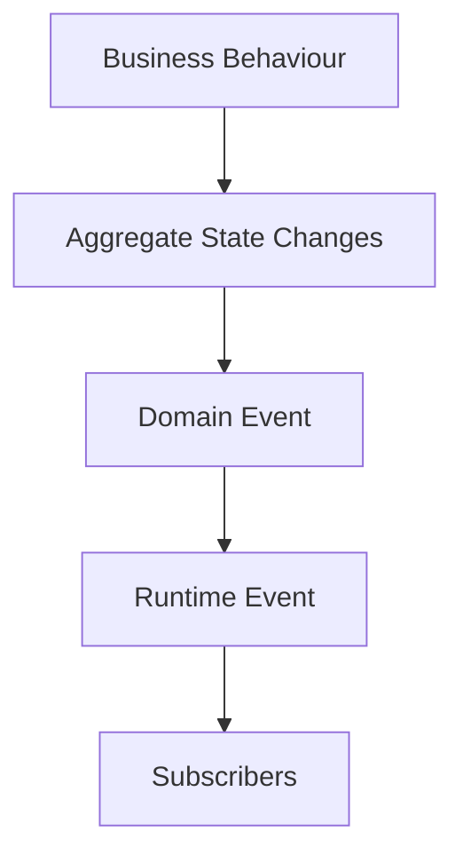
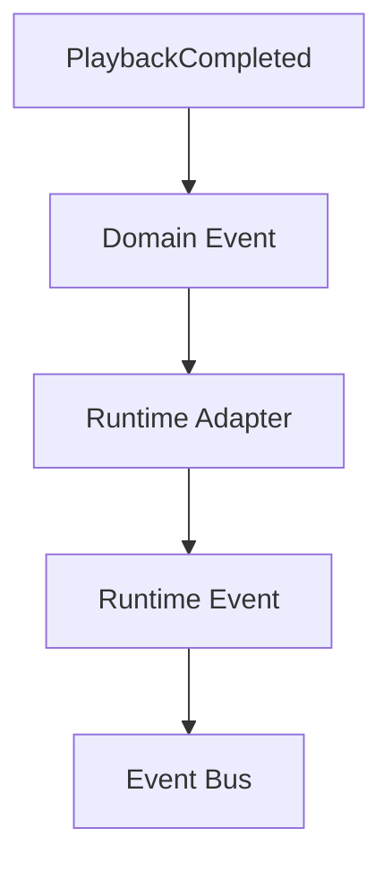
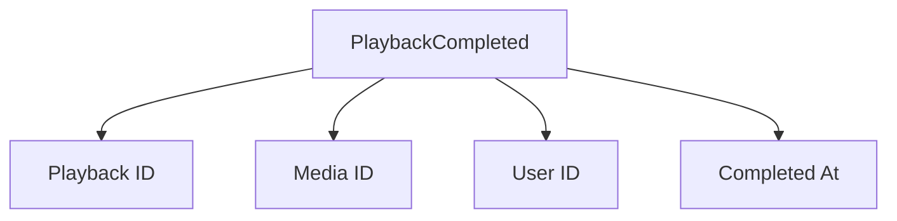
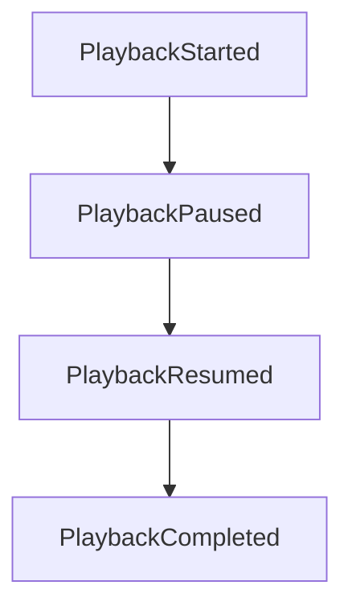
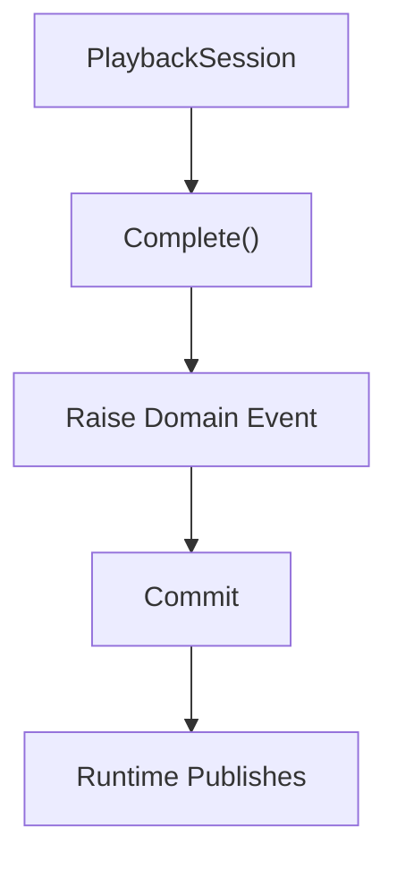
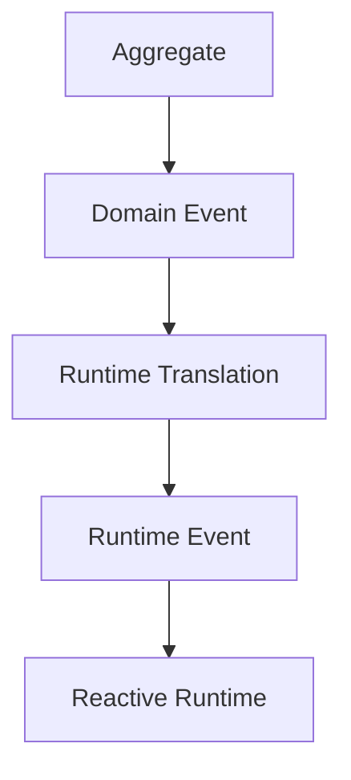

<!--
File: docs/engineering/guides/meg-003-domain-driven-design/11-domain-events.md
Document: MEG-003
Status: Draft
-->

# Domain Events

> *A Domain Event records that something important happened within the business. It is created by the domain before it becomes a runtime event.*

---

# Purpose

Business behaviour changes business state, and whenever an important business state transition occurs the domain should record that fact. These facts are known as **Domain Events**, and they represent significant moments within the business itself rather than within any technology that happens to serve it. They exist independently of event buses, messaging systems, transport protocols, workers and subscribers. This document defines how Domain Events are modelled within the Mosaic Domain Model and how they relate to the Reactive Runtime defined in [MEG-002](../meg-002-event-driven-runtime/index.md).

---

# Philosophy

Within Mosaic:

> **Business events originate in the domain. Runtime events transport them.**

This distinction is critical, because it assigns two different questions to two different layers. The domain determines:

> **What happened.**

The runtime determines:

> **How everyone else learns about it.**

The business owns facts and the runtime owns communication.

---

# What Is A Domain Event?

A Domain Event represents an important business fact. PlaybackCompleted, MediaImported, CollectionCreated and MetadataCorrected each represent a completed business transition, and each becomes part of the domain's history.

---

# Domain Events Are Business Concepts

Domain Events belong entirely to the domain, which means they should still make sense if Go did not exist, if the runtime did not exist, or if the application was rewritten tomorrow. PlaybackCompleted is meaningful under all three conditions whereas KafkaMessagePublished is not, because it names a mechanism instead of a business fact. Technology should never leak into the domain.

---

# Business Before Runtime

The lifecycle is intentionally separated, so that a business fact and its transport never occupy the same step.

Notice that the runtime appears **after** the domain. The domain therefore remains completely unaware of transport.

---

# Where Domain Events Come From

Domain Events originate from Aggregates: a PlaybackSession that runs `Complete()` raises PlaybackCompleted as part of the same behaviour. The Aggregate owns:

- business rules
- state transition
- business fact

Infrastructure merely transports the resulting event. This follows the classic DDD pattern where Aggregates raise Domain Events as part of enforcing business behaviour. ([martinfowler.com](https://martinfowler.com/eaaDev/DomainEvent.html))

---

# Domain Events Follow Behaviour

Domain Events should follow completed behaviour, so a Collection that has added media correctly raises MediaAddedToCollection. AddMediaRequested is incorrect, because it names an intention rather than an outcome — the domain records facts, not requests.

---

# One Business Transition

Every Domain Event should represent exactly one business transition. PlaybackPaused is a good event whereas PlaybackPausedAndRecommendationUpdated is a poor one, because recommendations belong to another context and folding them together makes a single event describe two histories at once. One business fact, one Domain Event.

---

# Domain Events Are Immutable

Once raised, a Domain Event must not change. If business understanding changes later, PlaybackCorrected becomes a new Domain Event rather than an edit to the original, because history is additive and is never rewritten.

---

# Domain Events Belong To The Aggregate

Only the Aggregate owning the business state should raise the Domain Event, so MediaImported is raised by the Library Aggregate and Metadata should never raise it. Ownership follows business ownership, always.

---

# Domain Events Are Internal

One of the most important distinctions within Mosaic is that a Domain Event is not a Runtime Event. The Domain Event exists inside the domain and the Runtime Event exists outside it, and although they frequently represent the same business fact, they serve different architectural purposes.

---

# Runtime Transformation

Conceptually, a PlaybackCompleted Domain Event reaches a Runtime Adapter, which turns it into a Runtime Event carried on the Event Bus.

The runtime adapter transforms domain concepts into transport concepts while the Aggregate remains completely unaware of the Event Bus, and this separation keeps the domain pure while allowing the runtime to evolve independently.

---

# Domain Events Should Be Small

Domain Events should contain only information describing the business fact, so PlaybackCompleted carries a Playback ID, a Media ID, a User ID and a Completed At value and nothing further.

Avoid:

- retry counts
- trace identifiers
- routing information
- worker identifiers

Those belong to runtime infrastructure, and carrying them inside a Domain Event would make the business fact depend upon how it happens to be delivered.

---

# Domain Events Trigger Nothing

A Domain Event should never know who receives it, whether anyone receives it, or what happens next. It simply records:

> **This happened.**

Everything afterwards belongs to the runtime.

---

# Domain Events Are Not Integration Events

The domain should not model WebhookSent, KafkaPublished or APIMessageSent, because each of those describes infrastructure rather than business. PlaybackCompleted is the domain's account of the same moment, and the runtime determines how that fact is communicated externally.

---

# Event Ordering

Domain Events follow business chronology, so a session moves from PlaybackStarted through PlaybackPaused and PlaybackResumed to PlaybackCompleted.

The domain defines this sequence, whereas the runtime may deliver the events differently. Business chronology and delivery chronology therefore remain separate concepts.

---

# Event Collection

Aggregates should collect Domain Events during business execution rather than releasing each one as it occurs.

Events should not leave the Aggregate until business consistency has been established, which naturally complements the transactional boundaries defined earlier.

---

# Domain Events And Transactions

Domain Events should only be published externally after successful persistence: the Aggregate is updated, the commit succeeds, and only then is the Runtime Event published. If persistence fails the Domain Event never leaves the Aggregate, because business facts should never describe work that never became true.

---

# Testing

Domain Events make business behaviour easy to test, because the assertion is itself a business one — complete a playback, then check that PlaybackCompleted was raised. Tests should verify:

- correct event
- correct payload
- correct timing

Testing business events is often simpler than testing infrastructure side effects.

---

# Evolution

Domain Events evolve with business understanding. PlaybackCompleted may begin as a bare record that playback finished and later carry a CompletionSource and a CompletionReason as the business language grows more precise. The event evolves with that language, but it should never become more technical.

---

# Mosaic Examples

Examples of Domain Events include MediaImported, PlaybackStarted, PlaybackPaused, PlaybackCompleted, CollectionCreated, CollectionRenamed, MetadataCorrected and RecommendationGenerated. Every one represents an important business fact.

---

# Anti-Patterns

The following practices are prohibited.

## Infrastructure Events

Naming an event KafkaPublished or WebhookDelivered, which describes delivery rather than business.

---

## Commands

Naming an event RefreshMetadata or GenerateArtwork, which requests work rather than recording it.

---

## Mutable Events

Changing an event after it has been raised.

---

## Runtime Dependencies

Aggregates importing the Event Bus, Kafka, NATS or RabbitMQ, when the domain should remain transport agnostic.

---

## Publishing Before Commit

Publishing events before business state becomes durable.

---

## Business Logic Inside Subscribers

Business behaviour should occur before the Domain Event exists, so subscribers react rather than redefine history.

---

# Mosaic Guidelines

Within Mosaic:

- Domain Events must describe completed business facts.
- Domain Events must originate from Aggregates.
- Domain Events must be immutable.
- Domain Events must remain independent of runtime infrastructure.
- Domain Events must not describe transport behaviour.
- Runtime Events should be derived from Domain Events.
- Domain Events should remain small and business focused.
- Domain Events should only leave the domain after successful persistence.

---

# Relationship to MEG

[MEG-002](../meg-002-event-driven-runtime/index.md) introduced Runtime Events, and this chapter deliberately introduces an additional layer beneath them: the Aggregate raises a Domain Event, a Runtime Translation converts it into a Runtime Event, and the Reactive Runtime carries it onward.

This separation is one of the most important architectural decisions within Mosaic, because it ensures:

- the business remains independent
- the runtime remains replaceable
- transport remains invisible to the domain

The domain owns meaning and the runtime owns delivery.

---

# Summary

Domain Events represent the moments that matter to the business. They are not messages, they are not notifications and they are not transport; they are simply immutable records that:

> **Something important became true.**

Everything else, including retries, workers, event buses and subscribers, exists solely to communicate those business facts throughout the platform. That distinction keeps the Mosaic Domain Model remarkably clean while allowing the Reactive Runtime to remain highly sophisticated.
