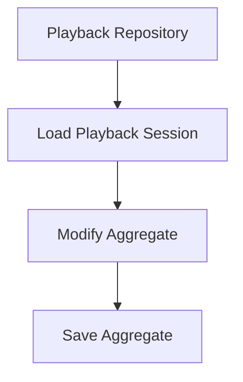
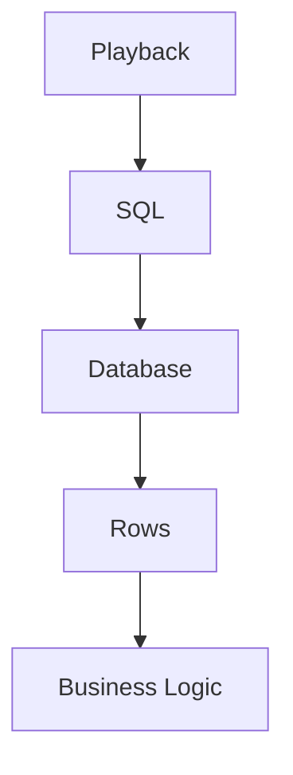
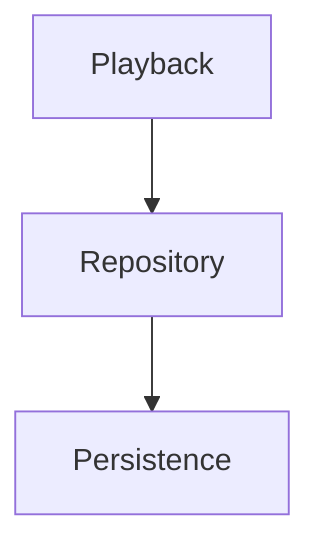
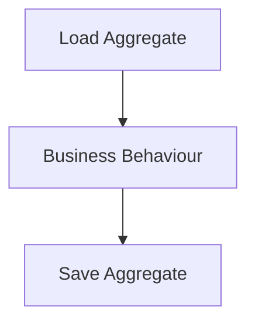
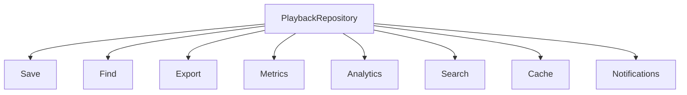
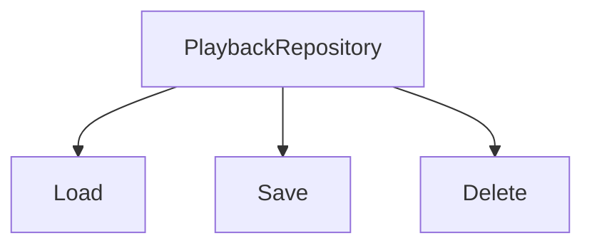
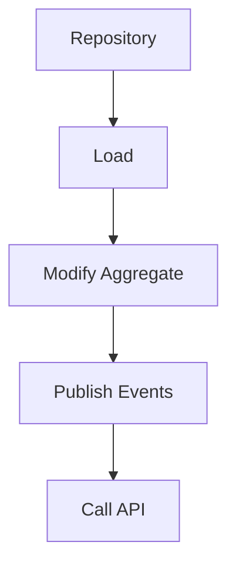

<!--
File: docs/engineering/guides/meg-003-domain-driven-design/12-repositories.md
Document: MEG-003
Status: Draft
-->

# Repositories

> *A Repository gives the illusion that Aggregates simply exist. It hides persistence so the domain can remain focused on the business.*

---

# Purpose

Business logic should never concern itself with SQL, PostgreSQL, DuckDB, Blob Storage, Redis or filesystems, because every one of those is a decision about storage rather than a decision about the business. The domain should ask only one question:

> **"Can I obtain this Aggregate?"**

Repositories answer that question, providing a collection-like abstraction over persistent storage while insulating the Domain Model from infrastructure concerns.

---

# Philosophy

Within Mosaic:

> **Repositories exist to persist Aggregates, not data.**

This distinction is fundamental, and it determines what a Repository is allowed to know. Repositories do not manage rows, tables, documents or files; they manage Aggregate Roots, and everything else is an implementation detail. This reflects the classic DDD Repository pattern, whose purpose is to isolate the domain model from persistence concerns while presenting aggregates as though they were held in an in-memory collection.  [O'Reilly Media](https://www.oreilly.com/library/view/implementing-domain-driven-design/9780133039900/ch12.html)

---

# What Is A Repository?

A Repository provides the illusion that Aggregates are stored within an in-memory collection. Conceptually the domain loads an Aggregate, works with it, and hands it back.



How that Aggregate is stored is irrelevant to the domain, which is precisely what makes the illusion valuable.

---

# Why Repositories Exist

Without Repositories the business reaches through to storage directly, and each hop teaches it something it should not know.



The business now understands infrastructure, so a change to either forces a change to the other. Introducing a Repository shortens that chain to a single contract.



The Aggregate remains infrastructure agnostic, and persistence becomes something that happens on its behalf rather than something it participates in.

---

# Repository Responsibilities

A Repository's remit is deliberately narrow, because every responsibility added to it is a responsibility taken away from the domain. Repositories are responsible for:

- loading Aggregates
- saving Aggregates
- removing Aggregates
- querying Aggregate identity

Repositories are **not** responsible for:

- business rules
- validation
- orchestration
- transactions
- event publication

The division is the same one the whole chapter rests on: business belongs to the domain, whereas persistence belongs to infrastructure.

---

# One Repository Per Aggregate

Every Aggregate Root should have one Repository, so a Playback Aggregate is reached through a PlaybackRepository and a Library Aggregate through a LibraryRepository. What should not appear is a Repository named for something inside an Aggregate, such as a PlaybackPositionRepository or a WatchProgressRepository, because those names persist implementation details rather than Aggregate boundaries. This one-repository-per-aggregate-root approach is one of the Platform foundation recommendations of DDD because repositories preserve aggregate consistency boundaries.  [Microsoft Learn](https://learn.microsoft.com/en-us/dotnet/architecture/microservices/microservice-ddd-cqrs-patterns/infrastructure-persistence-layer-design)

---

# Aggregate Roots Only

Repositories should load and save Aggregate Roots. Giving PlaybackProgress its own Repository is poor, whereas giving PlaybackSession one is preferred, because internal Entities remain internal and it is the Aggregate Root that protects consistency. A Repository that reaches past the root allows a caller to change part of an Aggregate without the root ever knowing.

---

# Collection Semantics

Repositories should feel like collections, which means operations such as Find(), Save(), Delete() and Exists() rather than database operations. Names like ExecuteSQL(), RunQuery() or UpdateRow() are poor because they reveal persistence rather than business behaviour, and a caller who can see the mechanism will eventually write to it.

---

# Domain Language

Repository APIs should speak the ubiquitous language, so `libraryRepository.FindByID(...)` and `playbackRepository.Save(...)` are good whereas `database.Select(...)` and `repository.Execute(...)` are poor. Names should communicate business intent, because the API is the point at which the domain either keeps or loses its own vocabulary.

---

# Repository Interfaces

Repository interfaces belong to the domain and implementations belong to infrastructure, so the Domain owns the PlaybackRepository Interface while Infrastructure supplies PostgresPlaybackRepository. The Domain knows nothing about PostgreSQL and Infrastructure knows everything about it. This separation preserves persistence ignorance while allowing different infrastructure implementations.  [Stack and System](https://stackandsystem.com/series/domain-driven-design/9-repositories-in-domain-driven-design)

---

# Persistence Ignorance

Aggregates should remain completely unaware of persistence, which makes `playback.Save()` poor and `repository.Save(playback)` preferred. Persistence should always occur outside the Aggregate, because the domain models business and infrastructure models storage; an Aggregate that can save itself has already taken on a second job.

---

# Transactions

Repositories participate in transactions but they do not own them. The typical flow is a short one.



The Repository persists the Aggregate, whereas the Aggregate determines what changed — which is why transaction scope is decided outside the Repository rather than within it.

---

# Queries

Repositories exist primarily for write models, so complex reporting queries often belong elsewhere. A PlaybackRepository serves the Playback Aggregate, whereas a Continue Watching View is served by a Read Model. Repositories should not become reporting engines, and this aligns naturally with CQRS where rich queries are separated from aggregate persistence.

---

# Avoid Generic Repositories

A single generic type is a tempting shortcut.

```go
type Repository[T any]
```

While technically elegant, generic repositories frequently describe persistence rather than business behaviour. Named types such as PlaybackRepository, LibraryRepository and CollectionRepository are preferred instead, because business language should always dominate technical abstraction.

---

# Repository Methods

Repositories should expose intention-revealing operations such as FindByID(), FindBySource() and Exists(), and should avoid exposing generic database operations. Repositories should describe business retrieval rather than storage mechanics, so each method name should read as a question the business would actually ask.

---

# Repository Scope

Repositories should remain small. A PlaybackRepository that has accumulated Save, Find, Export, Metrics, Analytics, Search, Cache and Notifications is poor.



Better is a Repository that does only what a Repository is for.



Business behaviour belongs elsewhere, and a Repository that grows past loading and saving has usually absorbed it.

---

# Repositories Do Not Orchestrate

A Repository that loads, modifies an Aggregate, publishes events and then calls an API is poor, because each of those steps is a decision the Repository is not entitled to make.



Repositories should simply persist Aggregates. Everything else belongs to:

- Aggregates
- Domain Services
- Application Services
- Runtime

---

# Multiple Storage Engines

One of Mosaic's defining architectural characteristics is multiple storage technologies, which include PostgreSQL, DuckDB, Blob Storage, Filesystem and MOS Files. The Domain should remain unaware of all of them, so every implementation should satisfy the same Repository contract. Changing persistence should never require changing business behaviour.

---

# Repository Lifetime

Repositories should remain lightweight. They should not:

- cache business state
- maintain sessions
- own transactions
- retain Aggregate instances

Every call should remain explicit, because Repositories are gateways rather than application state, and a Repository holding state becomes a second place where business truth lives.

---

# Testing

Repositories should be replaceable during testing, so a PlaybackRepository can be substituted by an In-Memory Repository. Business tests should not require:

- PostgreSQL
- DuckDB
- Blob Storage

The domain should remain testable independently of infrastructure, which is the practical proof that the abstraction is genuine rather than nominal.

---

# Anti-Patterns

The following practices are prohibited.

## Generic Repository

A single Repository<T> used for every Aggregate.

---

## Repository Per Entity

Repositories for child Entities.

---

## SQL In The Domain

A SELECT ... appearing within business logic.

---

## Business Logic In Repositories

Repositories deciding business behaviour.

---

## Returning Persistence Models

Repositories returning database rows rather than Aggregates.

---

## Cross-Aggregate Repositories

One Repository managing multiple unrelated Aggregate Roots.

---

# Mosaic Guidelines

Within Mosaic:

- Every Aggregate Root should have one Repository.
- Repositories must persist Aggregate Roots.
- Repository interfaces should belong to the Domain.
- Repository implementations must belong to Infrastructure.
- Repositories must speak the ubiquitous language.
- Repositories must remain persistence focused.
- Business behaviour must remain outside Repositories.
- The Domain must remain unaware of storage technologies.

---

# Relationship to MEG

Aggregates own consistency and Aggregate Roots protect it, so Repositories preserve it by refusing to persist anything smaller than a root. The next chapter introduces **Factories**, which solve the complementary problem of constructing complex Aggregates in valid business states before they are ever persisted.

---

# Summary

Repositories are one of the most misunderstood patterns in Domain-Driven Design. They are not database wrappers, they are not DAOs and they are not query builders. Within Mosaic, they exist for one purpose:

> **Provide the domain with the illusion that Aggregates simply exist, while keeping every persistence concern outside the business model.**

When implemented correctly, changing PostgreSQL to another storage engine should require changes only within infrastructure, and the business should never notice.
