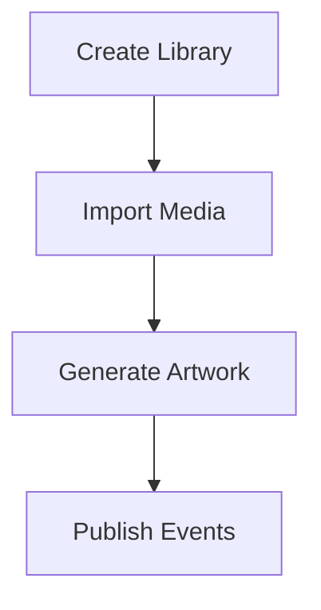
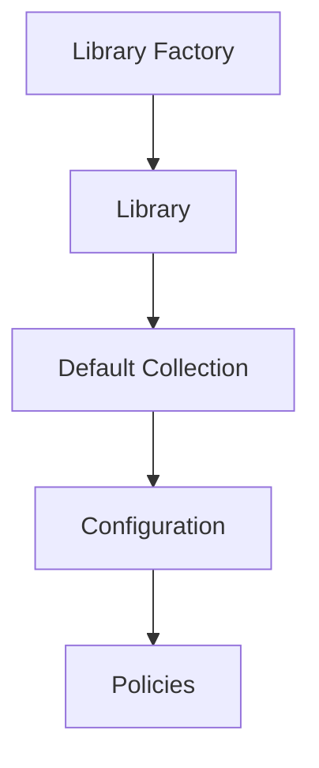
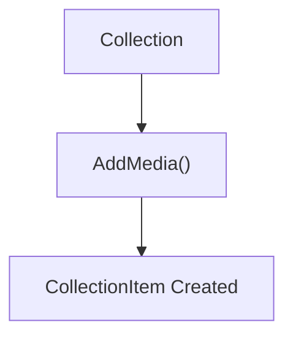
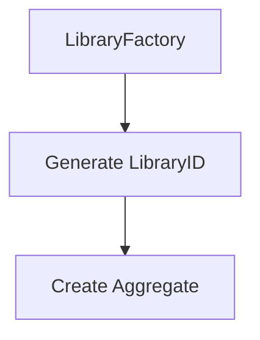
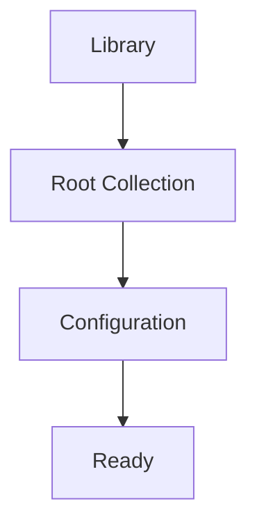
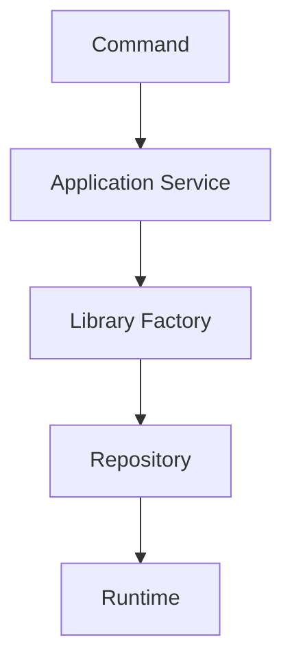
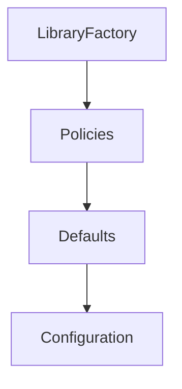

<!--
File: docs/engineering/guides/meg-003-domain-driven-design/13-factories.md
Document: MEG-003
Status: Draft
-->

# Factories

> *Construction is not business behaviour. Complex creation should be hidden so the domain begins life in a valid state.*

---

# Purpose

Some domain objects are simple to construct and others are not. Creating an Aggregate may require multiple Entities, several Value Objects, validation, business rules, default state and invariant enforcement, and embedding that logic inside constructors or Application Services quickly leads to duplicated and inconsistent creation logic. Factories solve this problem by encapsulating complex object creation while ensuring every new domain object begins life in a valid business state.

---

# Philosophy

Within Mosaic:

> **Factories create valid domain objects. They do not perform business behaviour.**

Factories exist to solve one problem:

> **How should a complex business object be created correctly?**

Because that responsibility begins and ends with construction, they should not become service layers, repositories, orchestrators, builders or workflow engines.

---

# Why Factories Exist

Consider creating a new Library, whose requirements might include a unique identifier, default settings, a root collection, default permissions and import configuration. Without a Factory, the caller assembles all of that itself.

```go
library := &Library{
    ...
}
```

The caller must then know every required field, every default and every invariant, and that knowledge becomes duplicated throughout the application. A Factory centralises it in one place. DDD factories exist specifically to separate object construction from object use while ensuring newly created Aggregates satisfy all invariants.  [O'Reilly Media](https://www.oreilly.com/library/view/implementing-domain-driven-design/9780133039900/ch11lev1sec1.html)

---

# What Is A Factory?

A Factory is responsible for creating Entities, Aggregates and occasionally Value Objects in a valid business state. A Factory does **not** own the resulting object, because ownership transfers immediately to the caller.

---

# Construction Is Not Behaviour

Factories should create objects rather than perform business operations, so creating a Library is good whereas a Factory that also imports media, generates artwork and publishes events is poor.



Creation and behaviour should remain separate, because a Factory that acts as well as constructs becomes a second home for business rules.

---

# Valid From Birth

Factories should guarantee that every created object satisfies its business invariants. Assembling an object field by field and validating afterwards is poor.

```go
library := &Library{}
library.Name = name
library.Owner = owner
library.Validate()
```

Returning a constructed object and an error together is preferred.

```go
library, err := NewLibrary(...)
```

Invalid objects should never exist, even temporarily, because anything that can observe them can act on them.

---

# Aggregate Creation

Factories are most valuable when creating Aggregates, where a single call assembles several related pieces.



The caller receives a complete Aggregate rather than a partially initialised object.

---

# Factory Or Constructor?

The simplest solution should always be preferred. Use a constructor when creation is straightforward, invariants are simple and dependencies are minimal, as with `NewDuration(...)`.

Use a Factory when multiple objects must be assembled, creation logic is complex, business rules determine construction, or Aggregate assembly becomes non-trivial. Factories should emerge naturally rather than automatically, because introducing one before the complexity exists adds a type without removing a problem.

---

# Factory Methods

Many Aggregates naturally create their own internal objects, so a Collection given AddMedia() produces a CollectionItem itself.



Here the Aggregate Root itself acts as the Factory, which is often preferable to introducing another type. Only introduce a dedicated Factory when creation logic genuinely becomes complex. Evans and Vernon both encourage using Aggregate methods as factories where the creation naturally belongs to the Aggregate itself.  [O'Reilly Media](https://www.oreilly.com/library/view/implementing-domain-driven-design/9780133039900/ch11.html)

---

# Domain Language

Factory names should communicate business intent, so LibraryFactory, PlaybackFactory and CollectionFactory are good whereas ObjectFactory, EntityBuilder and GenericFactory are poor. Names should reinforce the ubiquitous language, because a Factory named for a technical shape tells the reader nothing about what is being created.

---

# Factory Responsibilities

Factories may:

- validate creation rules
- assemble child Entities
- construct Value Objects
- assign identities
- establish defaults

Factories must not:

- persist objects
- publish events
- start workflows
- access HTTP
- perform infrastructure operations

Their responsibility ends once construction completes, and everything in the second list happens after that point.

---

# Factory Dependencies

Factories should depend only upon domain concepts, domain policies and domain services, and should never depend directly upon databases, message buses, HTTP or file systems. Construction remains a domain concern whereas persistence does not, so a Factory reaching for infrastructure has confused the two.

---

# Identities

Factories frequently create identities, assigning one as part of assembling the Aggregate.



The mechanism used to generate the identifier is an implementation concern, whereas the resulting identity is a domain concept.

---

# Value Objects

Simple Value Objects rarely require Factories, because a constructor is usually sufficient.

```go
duration := NewDuration(...)
```

Dedicated Factories for simple immutable Value Objects generally introduce unnecessary complexity.

---

# Aggregate Integrity

Factories should create complete Aggregates, so returning a Library with a missing root collection is poor. Preferred is a Library that arrives with its Root Collection and Configuration already in place and therefore Ready.



The caller should never be responsible for "finishing" Aggregate construction, because a caller who can finish it can also forget to.

---

# Application Services

Application Services frequently use Factories, and the sequence keeps each responsibility visible.



Notice that the Application Service coordinates, the Factory constructs and the Repository persists, so responsibilities remain distinct.

---

# Testing

Factories should be easy to test, and typical tests verify valid construction, invariant enforcement, default values and invalid inputs. Factories should remain deterministic, which means the same inputs should produce equivalent business objects.

---

# Evolution

Factories should evolve alongside the domain. What begins as `NewLibrary(...)` may later become a LibraryFactory that applies policies, defaults and configuration.



Complexity should move into the Factory only when it genuinely exists, so do not anticipate complexity prematurely.

---

# What Is Not A Factory?

The following are **not** Factories:

- a Repository, which retrieves and persists
- an Application Service, which coordinates use cases
- a Domain Service, which models business behaviour
- a Builder, which supports incremental object construction

The Builder is the closest of the four and still differs on the point that matters, because Factories produce complete domain objects.

---

# Mosaic Examples

Appropriate Factory responsibilities include:

- a LibraryFactory that creates a new Library Aggregate
- a CollectionFactory that creates a default Collection hierarchy
- a PlaybackFactory that creates a new Playback Session
- an ImportFactory that creates an Import Job Aggregate

Each creates a valid business object and none execute business workflows.

---

# Anti-Patterns

The following practices are prohibited.

## Partially Constructed Aggregates

Returning objects that require additional setup before becoming valid.

---

## Factory As Service

Factories performing business operations after construction.

---

## Infrastructure Inside Factories

Factories executing SQL, HTTP or message publication.

---

## Generic Factory

An ObjectFactory creating unrelated domain concepts.

---

## Builders For Everything

Introducing Builder patterns where a simple constructor or Aggregate factory method is clearer.

---

# Mosaic Guidelines

Within Mosaic:

- Factories should create valid Aggregates.
- Factories should encapsulate complex construction.
- Factories must enforce creation invariants.
- Factories must remain infrastructure independent.
- Aggregate factory methods should be preferred where creation naturally belongs to the Aggregate.
- Constructors should be preferred for simple creation.
- Factories must not perform persistence.
- Factories must not publish events.

---

# Relationship to MEG

Repositories answer:

> **How do I retrieve and persist Aggregates?**

Factories answer:

> **How do I create Aggregates correctly?**

Together they define the beginning and end of an Aggregate's lifecycle. The next chapter introduces **Domain Invariants**, the business rules that every Aggregate, Factory and Entity must protect throughout that lifecycle.

---

# Summary

Factories exist to protect one of the most important moments in a domain object's life:

> **Its creation.**

Within Mosaic, every Aggregate should begin life:

- complete
- valid
- consistent
- expressive

By encapsulating construction inside Factories, the domain remains focused on business concepts rather than construction mechanics, and every new object enters the system already satisfying the rules that define it.
