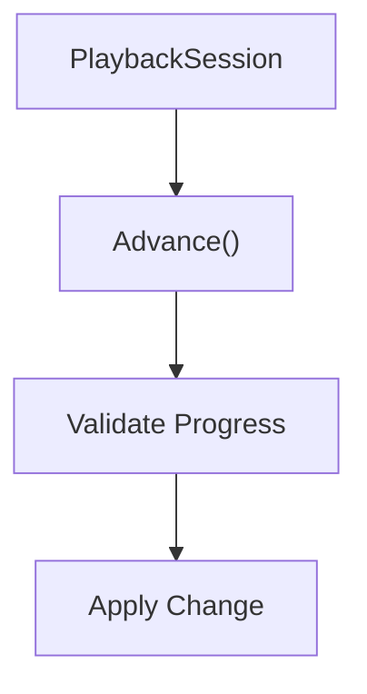
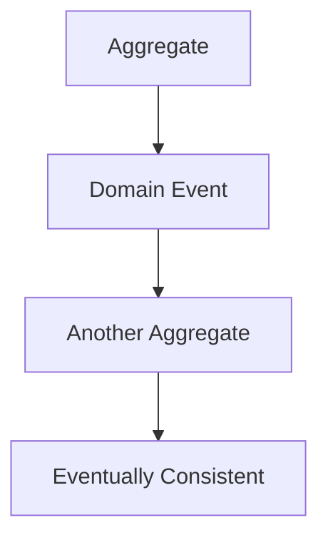
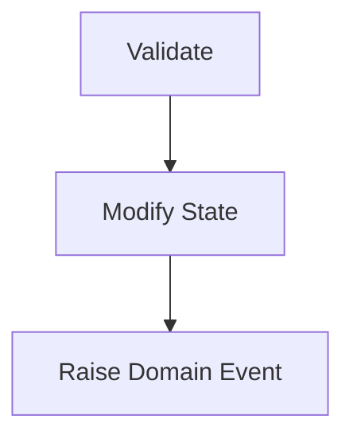
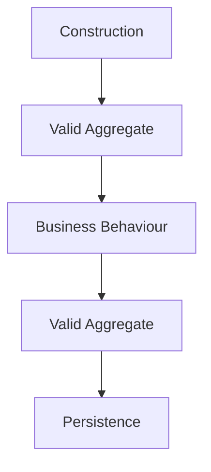

<!--
File: docs/engineering/guides/meg-003-domain-driven-design/14-domain-invariants.md
Document: MEG-003
Status: Draft
-->

# Domain Invariants

> *Business rules are not suggestions. They define what it means for the domain to be correct.*

---

# Purpose

Every business domain contains rules that must always remain true, and those rules define the integrity of the business rather than merely constraining its data. Examples include:

- A playback position cannot exceed the media duration.
- A Collection cannot contain duplicate media.
- A User cannot own another user's Library.
- Watch progress cannot be negative.

Domain-Driven Design refers to these rules as **Domain Invariants**. This document defines how Domain Invariants should be identified, protected and enforced throughout the Mosaic platform.

---

# Philosophy

Within Mosaic:

> **Invalid business state should be impossible to represent.**

The responsibility of the Domain Model is not merely to process data; its responsibility is to prevent invalid business state from ever existing. If an Aggregate can enter an invalid state, the model has failed.

---

# What Is A Domain Invariant?

A Domain Invariant is a business rule that must always be true. Playback progress remains less than or equal to media duration, a Collection holds only unique media, and a User holds a unique username. The business assumes these rules are always satisfied, so the software should enforce them accordingly.

---

# Why Invariants Exist

Without invariants a Playback record can report a duration of 90 minutes alongside a progress of 120 minutes, which means the system now contains impossible business state. Every subsequent operation becomes more complicated because every consumer must now defend against invalid data. The invalid state should instead never be constructible.

---

# Business Rules

Only genuine business rules become invariants. A required Library name is a good invariant, and so is the rule that playback cannot complete before it starts, because each describes something the business believes about itself. A limit on maximum HTTP connections or a database timeout is a poor one: infrastructure rules belong elsewhere, whereas invariants belong to the business.

---

# Invariants Belong To The Domain

Business rules should never be enforced solely by:

- controllers
- HTTP handlers
- repositories
- UI validation

The poor arrangement lets HTTP validate a request and then hand the result to the Domain, which leaves correctness dependent on whichever caller happened to arrive first. The preferred arrangement has the Domain validate, so its state is always correct however it was reached. Infrastructure may validate for convenience, but the Domain validates for correctness.

---

# Aggregate Responsibility

Aggregates own invariants, which keeps a rule and the behaviour capable of breaking it in the same place. A PlaybackSession exposing `Advance()` shows the resulting sequence.



The Aggregate protects itself, which means external callers should never be responsible for enforcing business rules.

---

# Entity Responsibility

Entities may also enforce local invariants. A Collection exposing `Rename()` enforces that the name cannot be empty, because the Entity understands the rule — it owns the concept. Business rules should live with the business object they describe.

---

# Value Objects

Value Objects frequently enforce invariants during construction rather than after it, which makes the constructor the point at which a bad value is refused:

```go
duration := NewDuration(seconds)
```

Possible rules include a non-negative value, a finite value and a valid range. If construction fails the Value Object never exists, and that is preferable to creating invalid values and validating them later.

---

# Construction

Factories should also enforce invariants, because creating the Aggregate first and validating later leaves a window in which an invalid Aggregate is already in circulation. Validating first and creating the Aggregate afterwards closes that window, so the result is always valid. Every Aggregate should begin life in a valid business state, and factories and constructors should enforce this from the outset.

---

# Protecting State

All state mutation should occur through business behaviour. Assigning to a field directly:

```go
playback.Progress = progress
```

bypasses the model entirely, whereas invoking behaviour:

```go
playback.Advance(progress)
```

routes the change through the Aggregate, which now controls:

- validation
- state transition
- invariant enforcement

Business correctness becomes automatic, because the caller no longer has the opportunity to get it wrong.

---

# Preventing Invalid State

The preferred strategy is prevention, not correction. Accepting an invalid state and planning to fix it later means every consumer must defend against it in the meantime, whereas rejecting the invalid change removes the problem at source. If invalid state never exists, downstream logic becomes dramatically simpler.

---

# Local Invariants

Some invariants exist entirely inside one Aggregate. The rule that duplicate media are prohibited within a Collection is one of them: only the Collection Aggregate needs to understand it, and no other capability participates. These invariants should remain local.

---

# Cross-Aggregate Rules

Some business rules appear to span multiple Aggregates — a Library storage quota, or subscription limits — and these should rarely be enforced through distributed transactions. One Aggregate should instead raise a Domain Event that another Aggregate consumes.



Only rules requiring immediate consistency belong inside one Aggregate, and everything else should generally become eventual consistency.

---

# Expressing Invariants

Good business behaviour makes invariants obvious. A method such as:

```go
SetCompleted(true)
```

leaves the decision with the caller, whereas:

```go
Complete()
```

leaves it with the Aggregate, which now decides whether completion is valid. Intent-revealing methods naturally reinforce business rules.

---

# Validation Order

Business behaviour should generally follow one ordering, in which validation precedes any change of state and the Domain Event comes last.



If validation fails, state does not change and no Domain Event is raised, so business history remains correct.

---

# Domain Events

Domain Events should only be raised after invariants have been satisfied. Raising the event first and discovering afterwards that validation fails records a fact that never became true, whereas validating, changing state and only then raising the event keeps the record accurate. Events describe completed truth, not attempted operations.

---

# Persistence

Repositories should never repair broken Aggregates. If an Aggregate reaches persistence in an invalid state the bug already occurred, so a repository that quietly fixes the Aggregate before the save hides the defect rather than removing it. Repositories persist correctness; they do not create it.

---

# Infrastructure Validation

UI validation, HTTP validation and JSON validation all improve user experience, but they do **not** replace Domain validation. Every business rule should still exist inside the Domain, and external validation should never be trusted alone.

---

# Testing Invariants

Every invariant should have dedicated tests: that progress cannot exceed duration, that a Collection rejects duplicates, and that an empty Library name is rejected. Those tests should verify valid behaviour, invalid behaviour and edge cases, because business correctness deserves explicit verification.

---

# Evolving Rules

Business rules change. A Collection might initially be limited to a maximum of 100 items and later permit unlimited collections, at which point the invariant changes, the Domain evolves and the implementation follows. The model should evolve with business understanding.

---

# Common Mosaic Invariants

The following examples run across the Mosaic capabilities, and they are illustrative rather than exhaustive.

- **Playback** — Progress ≥ 0, Progress ≤ Duration, and Completed implies Progress = Duration.
- **Library** — Library has an owner, and a root collection always exists.
- **Collection** — Media references are unique, and the name cannot be empty.
- **Metadata** — Primary artwork always exists, and the source provider is recorded.
- **User** — Identity is immutable, and the username is unique.

---

# Anti-Patterns

The following practices are prohibited.

## Validation Only In Controllers

Business rules enforced exclusively by HTTP, which leaves them unenforced for every caller that reaches the Domain by another route.

---

## Public Mutable State

Allowing callers to bypass business behaviour, so validation, the state transition and invariant enforcement no longer happen together.

---

## Invalid Aggregates

Allowing construction before validation, which places an Aggregate into circulation in a state the business does not permit.

---

## Repository Repair

Repositories silently fixing broken business objects, which conceals the defect that produced them rather than removing it.

---

## Duplicate Validation

Implementing business rules independently in each of:

- UI
- HTTP
- Services
- Domain

The Domain remains authoritative.

---

## Business Rules In Infrastructure

Embedding business validation inside persistence or transport layers, where it sits outside the Domain that owns the rule.

---

# Mosaic Guidelines

Within Mosaic:

- Every business invariant must be enforced by the Domain.
- Aggregates must protect Aggregate invariants.
- Value Objects should validate themselves.
- Factories must construct valid Aggregates.
- Invalid state must not be representable.
- Domain Events must only follow successful validation.
- Repositories must persist already-valid Aggregates.
- Infrastructure validation must complement, not replace, Domain validation.

---

# Relationship to MEG

Factories ensure Aggregates begin life correctly and invariants ensure they remain correct, so together they guarantee an Aggregate that is valid at construction, still valid after each business behaviour, and valid at the point of persistence.



The next chapter introduces **Modelling Guidelines**, bringing together the concepts introduced throughout MEG-003 into practical modelling advice for engineers designing new business capabilities.

---

# Summary

Domain Invariants are the rules that define business correctness. They are not optional and they are not advisory — they are the reason the Domain Model exists. Within Mosaic, every Aggregate, Entity and Value Object should actively prevent invalid business state rather than attempting to repair it afterwards, so that correctness becomes the natural outcome of the model itself.
