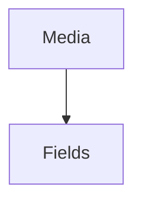
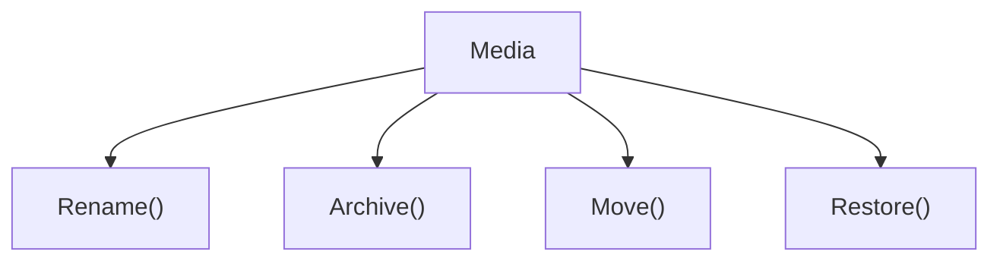
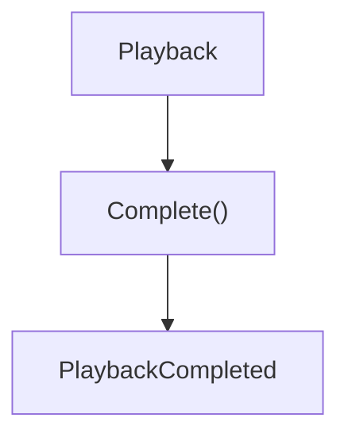
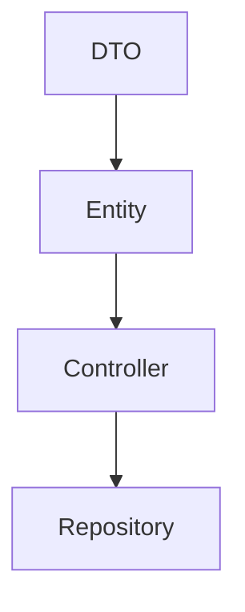
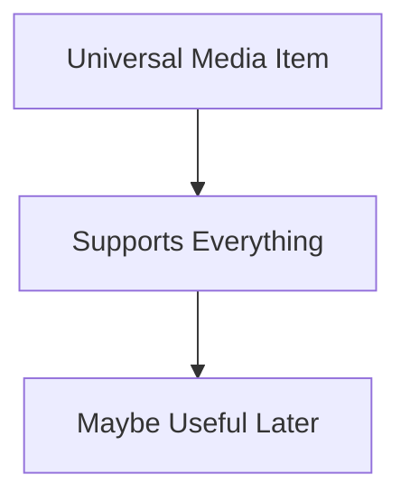
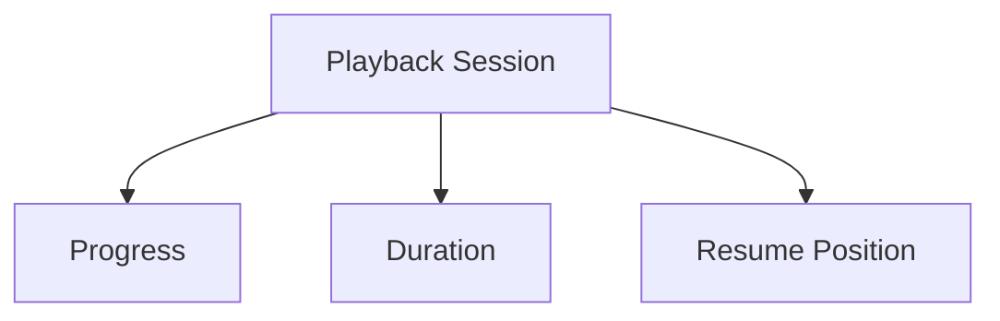

<!--
File: docs/engineering/guides/meg-003-domain-driven-design/15-modelling-guidelines.md
Document: MEG-003
Status: Draft
Version: 0.4
-->

# Modelling Guidelines

> *The purpose of modelling is not to describe software. It is to understand the business.*

---

# Purpose

The previous chapters introduced the building blocks of Domain-Driven Design:

- Ubiquitous Language
- Bounded Contexts
- Entities
- Value Objects
- Aggregates
- Aggregate Roots
- Domain Services
- Domain Events
- Repositories
- Factories
- Domain Invariants

This document brings those concepts together into practical modelling guidance.

Its purpose is to help engineers answer one question.

> **"How should I model a new business capability?"**

---

# Philosophy

Within Mosaic:

> **Model the business as it exists today. Allow tomorrow's understanding to evolve naturally.**

Good models emerge through understanding.

They are rarely designed perfectly on the first attempt.

Model discovery is continuous.

---

# Start With The Business

Every modelling exercise should begin with business questions.

Examples include:

- What problem is being solved?
- What language do users use?
- What concepts exist?
- What behaviours exist?
- What business rules always remain true?

Do not begin with:

- database tables
- HTTP endpoints
- events
- packages

Technology follows the model.

Never the reverse.

---

# Find The Ubiquitous Language

Before writing code, identify the language.

Ask:

- What nouns exist?
- What verbs exist?
- Which concepts appear repeatedly?
- Which words are ambiguous?

The ubiquitous language becomes:

- documentation
- code
- package names
- event names

Every future engineering decision builds upon this vocabulary.

---

# Identify The Bounded Context

Ask:

> **Who owns this concept?**

Every new concept belongs to one Bounded Context.

Examples.

```

Playback
```

```

Metadata
```

```

Library
```

If ownership is unclear:

Do not continue modelling.

Clarify ownership first.

---

# Identify The Aggregate

Ask:

> **What business rules must always remain consistent together?**

Not:

> **Which objects reference one another?**

Consistency determines Aggregate boundaries.

Object graphs do not.

This is one of the central heuristics for aggregate design in Domain-Driven Design. ([dddcommunity.org](https://dddcommunity.org/wp-content/uploads/files/pdf_articles/Vernon_2011_1.pdf))

---

# Find The Aggregate Root

Every Aggregate should answer:

> **Which object protects the business rules?**

The answer becomes the Aggregate Root.

Everything else remains internal.

If multiple objects appear equally important:

The Aggregate boundary probably requires refinement.

---

# Identify Entities

Ask:

> **Which concepts possess identity?**

Examples.

```

Media
```

```

Collection
```

```

Playback Session
```

Identity determines Entities.

Not storage.

---

# Identify Value Objects

Ask:

> **Which concepts are defined entirely by their value?**

Examples.

```

Duration
```

```

Language
```

```

Resolution
```

Whenever identity is unnecessary:

Prefer a Value Object.

---

# Model Behaviour

Ask:

> **What does this concept do?**

Not:

> **What fields does it contain?**

Poor.



Better.



Business behaviour should dominate the model.

---

# Protect Invariants

Every Aggregate should answer:

> **What business rules must never become false?**

Those rules become Domain Invariants.

They should be enforced:

- automatically
- consistently
- immediately

Business correctness should never depend upon callers remembering validation.

---

# Raise Domain Events

Whenever an important business fact becomes true:

Raise a Domain Event.

Example.



Do not ask:

> Should other capabilities care?

That question belongs to the runtime.

---

# Introduce Domain Services Carefully

Ask:

> **Does this behaviour naturally belong to an Aggregate?**

If yes:

Keep it there.

If no:

Consider a Domain Service.

Domain Services should remain rare.

They represent important business behaviour that has no natural owner.

---

# Introduce Repositories Last

Repositories exist only after the Domain Model exists.

Do not begin with persistence.

Model first.

Persist later.

Repositories support the Domain.

They do not define it.

---

# Model Small

Prefer:

```

Playback
```

over:

```

Media Platform
```

Prefer:

```

RecommendationEngine
```

over:

```

BusinessManager
```

Small models are:

- easier to understand
- easier to evolve
- easier to test

Large models usually hide multiple responsibilities.

---

# Evolve Continuously

Do not expect the first model to remain correct.

As understanding improves:

- rename concepts
- split Aggregates
- refine language
- move behaviour
- redefine boundaries

Changing the model is evidence of improved understanding.

Not failure.

---

# Resist Technical Thinking

Poor.



Better.


The second model communicates the business.

The first communicates implementation.

The Domain should remain free from technical vocabulary.

---

# Avoid Premature Generalisation

Do not model hypothetical future concepts.

Poor.



Instead.

```

Movie

Series

Book
```

Generalisation should emerge naturally.

Not speculatively.

---

# Draw The Model

Before implementing:

Draw.

Example.



Simple diagrams frequently reveal:

- missing concepts
- incorrect ownership
- unnecessary coupling

Visual modelling is often cheaper than implementation.

---

# Ask Better Questions

Good modelling questions include:

- What does the business call this?
- Who owns this concept?
- What happens when this changes?
- What business rules exist?
- What events naturally occur?
- What cannot be allowed to happen?

Good questions produce good models.

---

# Modelling Checklist

Before implementing a new capability ask:

- [ ] Is the ubiquitous language clear?
- [ ] Does the concept belong to one Bounded Context?
- [ ] Is ownership obvious?
- [ ] Have Entities been distinguished from Value Objects?
- [ ] Are Aggregate boundaries driven by consistency?
- [ ] Does one Aggregate Root protect the Aggregate?
- [ ] Are Domain Events identified?
- [ ] Are invariants explicit?
- [ ] Does the model avoid infrastructure concerns?
- [ ] Can another engineer explain the model in business terms?

If any answer is "no", continue modelling.

Implementation should wait.

---

# Common Modelling Mistakes

Avoid:

- modelling databases
- modelling APIs
- modelling transport
- modelling frameworks
- modelling packages

Instead model:

- behaviour
- business rules
- ownership
- identity
- language

The software should become an expression of the business.

Not the implementation.

---

# Mosaic Guidelines

Within Mosaic:

- Model the business before the software.
- Prefer rich domain models.
- Behaviour SHOULD remain inside the domain.
- Aggregates SHOULD remain small.
- Ubiquitous Language SHOULD remain consistent.
- Infrastructure MUST remain outside the domain.
- Models SHOULD evolve continuously.
- Simplicity SHOULD always be preferred over speculative flexibility.

---

# Relationship to MEG

This chapter completes the tactical modelling guidance of MEG-003.

The remaining documents describe:

- architectural reasoning (ADRs)
- contributor expectations
- terminology
- references

The next engineering specification, **[MEG-004](../meg-004-hexagonal-architecture/index.md) – Hexagonal Architecture**, will describe how these Domain Models interact with infrastructure without compromising their integrity.

Together, MEG-003 and [MEG-004](../meg-004-hexagonal-architecture/index.md) define both:

- **what** the business model is, and
- **how** it remains protected from technical concerns.

---

# Summary

Domain-Driven Design is not a collection of patterns.

It is a way of thinking.

Within Mosaic, every model should answer one simple question:

> **"Does this make the business easier to understand?"**

If the answer is yes, the model is probably improving.

If the answer is no, the implementation is almost certainly modelling technology rather than the business.

That distinction is the difference between software that merely works and software that continues to evolve gracefully for years.
