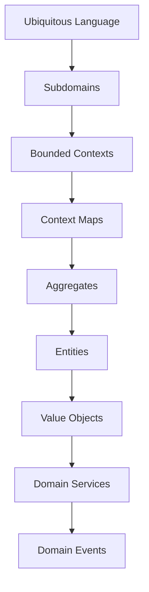

<!--
File: docs/engineering/guides/meg-003-domain-driven-design/17-contributor-guidance.md
Document: MEG-003
Status: Draft
-->

# Contributor Guidance

> *Every contribution changes the model. The question is whether it improves our understanding of the business.*

---

# Purpose

The Domain Model is the intellectual centre of the Mosaic platform. Unlike infrastructure, which changes to support the business, the Domain Model exists to describe the business itself, and every contributor therefore shares responsibility for protecting:

- business language
- business ownership
- business boundaries
- business behaviour

This document provides practical guidance for engineers contributing to the Mosaic Domain Model. It runs through the checks that apply before each kind of modelling change, and closes with the checklists that apply before merging.

---

# Philosophy

Within Mosaic:

> **Protect the model before extending it.**

Extending the model is expected, but extension must not come at the cost of what the model already expresses. Adding functionality should never weaken:

- ubiquitous language
- aggregate boundaries
- bounded contexts
- business ownership
- domain consistency

The Domain Model should become clearer over time, never more complicated.

---

# Before Writing Code

Each of these questions is owned by a chapter elsewhere in MEG-003, and answering them before writing code is cheaper than discovering the answers afterwards. Simple modelling frequently reveals missing concepts, incorrect ownership and unnecessary coupling while none of it has yet been built, so before implementing a new feature ask:

- What business problem exists?
- Which Bounded Context owns it?
- Which Aggregate protects it?
- Which business rules apply?
- Which Domain Events naturally occur?

Implementation should begin only after these questions have clear answers.

---

# Before Creating A New Domain Concept

A new concept enters the ubiquitous language, where it acquires one name, one meaning and one owner. That is a commitment across source code, documentation, events and discussion, so ask first:

- Does this concept already exist?
- Is the language consistent?
- Does another Aggregate already own this behaviour?
- Is this genuinely a new business concept?

Avoid creating duplicate concepts with different names. Synonyms create confusion whereas consistency creates understanding, and a concept modelled twice is a concept that will eventually mean two different things.

---

# Before Creating A New Bounded Context

A Bounded Context is a statement of ownership rather than a suggestion about code layout, and each one introduced acquires exactly one owner and one canonical model. A new Bounded Context should therefore only be introduced when:

- the language differs significantly
- ownership differs
- business rules differ
- independent evolution is desirable

A new package does **not** automatically justify a new Bounded Context, because Bounded Contexts represent business boundaries rather than code organisation. A boundary drawn around code instead of around ownership leaves concepts colliding and ownership unclear, and shared ownership usually indicates a poorly defined boundary.

---

# Before Creating An Entity

Identity is what separates an Entity from a Value Object, and it is the one characteristic that must remain stable while everything else about the concept changes. Ask:

> Does the business recognise this concept through its identity?

If it does, model an Entity; if it does not, consider a Value Object instead. Identity should always have business meaning, because an identifier the business does not recognise communicates nothing that the value itself does not already say.

---

# Before Creating A Value Object

Many business concepts exist purely because of the information they represent, and modelling those as Value Objects keeps the surrounding Entities smaller and more focused. Ask:

- Is identity irrelevant?
- Is the concept immutable?
- Does equality depend entirely upon value?

Where the answer to each is yes, model a Value Object and do not introduce identity unnecessarily. Leaving the concept as a bare primitive instead is the mistake Fowler names **Primitive Obsession**, where the type no longer answers what the value actually measures.

---

# Before Creating An Aggregate

An Aggregate is a consistency boundary, so its membership is decided by the rules it must protect rather than by how its objects happen to be related. Ask:

> Which business rules must always remain true together?

Do **not** ask:

> Which objects reference each other?

Consistency determines Aggregate boundaries; object relationships do not, because two objects that merely point at one another can be saved separately without breaking any rule. An Aggregate drawn around convenience rather than consistency grows large, and large Aggregates reduce concurrency, increase coupling and become increasingly difficult to evolve.

---

# Before Creating A Domain Service

A Domain Service should be the last modelling choice, because behaviour that could have belonged to a domain object and did not is behaviour the domain has quietly given up. Exhaust the alternatives first and ask:

- Can this behaviour belong to an Aggregate?
- Can it belong to a Value Object?
- Can it belong to an Entity?

Only if the answer is "no" should a Domain Service be introduced. Large numbers of Domain Services usually indicate weak Aggregate modelling. [Reddit](https://www.reddit.com/r/DomainDrivenDesign/comments/1sgqsv8/most_ddd_advice_starts_in_the_wrong_place/)

---

# Before Creating A Repository

Repositories should appear only after the Aggregate exists, the Aggregate Root is understood and persistence requirements become necessary, because a Repository is scoped to an Aggregate Root and a Repository that reaches past the root lets a caller change part of an Aggregate without the root ever knowing. Do not design repositories first: model first and persist later.

---

# Before Creating A Domain Event

A Domain Event records a completed business fact, and the domain records facts rather than requests. Ask:

- Did something important happen?
- Would the business describe this as a fact?
- Does another capability care about this fact?

The phrasing usually settles it: if the event name reads as `Do Something` it is probably a command, whereas if it reads as `Something Happened` it is probably a Domain Event. Each event should then describe exactly one business transition, because folding two together makes a single event describe two histories at once.

---

# Before Renaming A Business Concept

Changing language changes understanding, so before renaming:

- update documentation
- update diagrams
- update events
- update repositories
- update package names where appropriate

Language should evolve consistently, because the ubiquitous language is only useful while it holds together and half-completed terminology changes create architectural confusion.

---

# Before Merging

Every Domain contribution should satisfy the following checklist. It groups into business language, ownership, behaviour, events and documentation, which are the five areas the preceding sections have each protected in turn.

## Business Language

- Ubiquitous Language remains consistent.
- No duplicate terminology introduced.
- Names communicate business concepts.

---

## Ownership

- Ownership remains explicit.
- Aggregate boundaries remain clear.
- Bounded Context responsibilities remain unchanged unless intentionally modified.

---

## Behaviour

- Business behaviour remains inside the Domain.
- Aggregates enforce invariants.
- Domain Services remain focused.

---

## Events

- Domain Events describe completed facts.
- Aggregate ownership remains correct.
- Event names reinforce business language.

---

## Documentation

- MEG updated where required.
- ADR created for significant modelling changes.
- Context Maps updated where appropriate.
- Glossary updated when introducing new terminology.

The model and its documentation should evolve together, because documentation that introduces alternative names fragments the very understanding the model exists to share.

---

# Avoid Technical Thinking

Technical questions describe the machinery rather than the business, and asking them first lets the machinery decide the model. During modelling discussions avoid asking:

- Which database table?
- Which HTTP endpoint?
- Which JSON schema?

Instead ask:

- What does the business call this?
- Who owns this concept?
- What behaviour exists?
- What rules always remain true?

The domain should remain independent of implementation, because business rules belong with the business concepts they govern; where they do not, validation drifts outwards until it sits beside the transport layer.

---

# Refactor The Model

Refactoring the Domain Model is encouraged, whether that means improving terminology, refining Aggregate boundaries, simplifying Value Objects or extracting clearer concepts. Improving understanding is one of the primary goals of Domain-Driven Design, so refactoring should be viewed positively whenever it improves the model.

---

# Review Mindset

A domain review asks whether the model is right, not merely whether the code works. Domain reviews should therefore focus on:

- business correctness
- language
- ownership
- modelling clarity
- consistency
- maintainability

Questions such as:

> "Does this model better represent the business?"

are significantly more valuable than:

> "Could this be implemented differently?"

Implementation should support the model, not redefine it.

---

# Domain Tests

Business behaviour should be verified through domain tests, covering Aggregate invariants, Entity behaviour, Value Object validation, Domain Service decisions and Domain Events. The Domain should be testable without HTTP, databases or runtime infrastructure, which is what allows pure domain tests to provide the fastest feedback and the clearest business validation.

---

# Learning The Domain

Understanding terminology first dramatically improves modelling quality, so new contributors should study the Domain Model in the following order. The sequence runs from the strategic concepts that establish boundaries towards the tactical ones that live inside them, which means each stage supplies the vocabulary the next depends upon.

---

# Engineering Culture

Domain modelling should be collaborative, and contributors are encouraged to:

- question terminology
- challenge unclear ownership
- simplify concepts
- refine language
- improve documentation
- discuss business behaviour with domain experts

The Domain Model should improve through conversation rather than individual opinion, because the language it encodes has to be shared by engineers, architects, product owners, documentation and source code alike.

---

# Contributor Checklist

The following restates the preceding sections in a form that can be checked quickly. Before requesting review, confirm:

- [ ] The ubiquitous language remains consistent.
- [ ] Business ownership is explicit.
- [ ] Aggregate boundaries remain clear.
- [ ] Domain behaviour remains inside the domain.
- [ ] Invariants remain protected.
- [ ] Domain Events describe completed business facts.
- [ ] Infrastructure concerns have not leaked into the model.
- [ ] Documentation has been updated.
- [ ] The Domain Model is clearer than before.

---

# Relationship to MEG

This document explains how contributors should evolve the Domain Model established throughout MEG-003. Where the previous chapters define:

> **How the business should be modelled.**

this chapter defines:

> **How engineers should improve that model over time.**

Protecting the integrity of the Domain Model is a shared engineering responsibility.

---

# Summary

The Domain Model is not simply another layer of the application; it is the shared understanding upon which the entire platform is built. Every contribution should therefore strengthen:

- clarity
- ownership
- language
- correctness

Within Mosaic, the highest compliment a contributor can receive is not:

> "That is clever."

It is:

> **"That models the business perfectly."**
