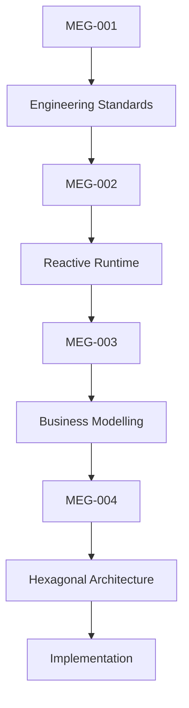
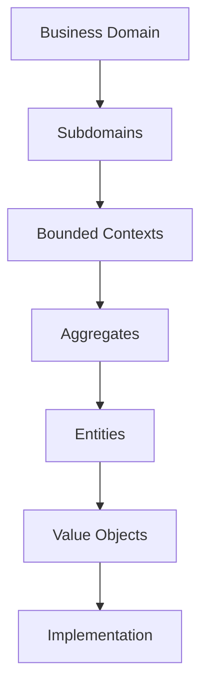

<!--
File: docs/engineering/guides/meg-003-domain-driven-design/index.md
Document: MEG-003
Status: Draft
-->

# MEG-003 — Domain-Driven Design

> *Software should model the business. The business should never model the software.*

---

# Purpose

As Mosaic grows it will encompass many independent business capabilities, and attempting to model all of those concerns within a single unified object model would inevitably produce a tightly coupled, increasingly complex platform. Domain-Driven Design (DDD) provides the architectural principles required to manage that complexity. The capabilities anticipated today are:

- Libraries
- Metadata
- Playback
- Users
- Authentication
- Modules
- Collections
- Recommendations
- Books
- Music
- Live TV

Unlike many implementations of DDD, Mosaic does **not** adopt Domain-Driven Design because it is fashionable. It adopts DDD because the approach aligns naturally with commitments the platform has already made:

- Event-Driven Runtime
- Module-first architecture
- Hexagonal Architecture
- Autonomous capabilities
- Long-term platform evolution

---

# Relationship to MEG



[MEG-001](../meg-001-go-engineering-standards/index.md) explains **how software is written** and [MEG-002](../meg-002-event-driven-runtime/index.md) explains **how software executes**. MEG-003 explains **how the business itself is modelled**, and [MEG-004](../meg-004-hexagonal-architecture/index.md) then explains how that model is protected once it exists.

---

# Scope

MEG-003 covers business modelling from the language used to describe the domain through to the rules that keep a model internally consistent. This specification defines:

- Domain philosophy
- Ubiquitous language
- Subdomains
- Core domains
- Supporting domains
- Generic domains
- Bounded contexts
- Context maps
- Entities
- Value objects
- Aggregates
- Aggregate roots
- Domain services
- Domain events
- Repositories
- Factories
- Domain invariants

The boundary matters as much as the contents. MEG-003 is a modelling specification, so it intentionally does **not** define:

- Runtime behaviour
- Event delivery
- Worker execution
- Scheduling
- Transport protocols
- Storage implementation

Those concerns are defined by other MEG specifications. Keeping them apart allows business modelling and technical implementation to evolve independently.

---

# Guiding Question

MEG-003 exists to answer one question.

> **How should the Mosaic business domain be modelled so that complexity remains understandable as the platform grows?**

---

# Domain Statement

Within Mosaic:

> **Software should reflect the language of the business, not the language of the implementation.**

That statement carries a practical test. The vocabulary of the model should be vocabulary the business already uses, which means the domain model should describe:

- media
- libraries
- playback
- users
- metadata

The same test excludes the vocabulary of the machinery underneath. The domain model should **not** describe:

- controllers
- databases
- HTTP
- workers
- SQL

Business concepts should remain independent of technical concerns. That independence is one of the central goals of Domain-Driven Design, which aims at a shared domain model expressed through a ubiquitous language understood by both domain experts and engineers.  [Google Books](https://books.google.com/books/about/Domain_Driven_Design_Reference.html?id=ccRsBgAAQBAJ)

---

# Domain Hierarchy

The Mosaic platform intentionally separates domain modelling into conceptual layers, and each layer owns exactly one responsibility.



Future chapters define every layer in detail. They work downwards from the business domain to the value objects that compose it, and only then to implementation.

---

# Expected Outcome

MEG-003 is a modelling specification rather than an implementation one. After reading it, contributors should understand:

- why Mosaic uses Domain-Driven Design
- how bounded contexts are identified
- how aggregates enforce business invariants
- how entities differ from value objects
- where domain events originate
- how repositories interact with aggregates
- how capabilities align with business domains

without discussing runtime implementation or transport infrastructure.

---

# Repository Structure

```text
engineering/
└── meg/
    └── MEG-003 Domain-Driven Design/
        README.md
        00-document-control.md
        01-domain-philosophy.md
        02-ubiquitous-language.md
        03-subdomains.md
        04-bounded-contexts.md
        05-context-maps.md
        06-entities.md
        07-value-objects.md
        08-aggregates.md
        09-aggregate-roots.md
        10-domain-services.md
        11-domain-events.md
        12-repositories.md
        13-factories.md
        14-domain-invariants.md
        15-modelling-guidelines.md
        16-adrs.md
        17-contributor-guidance.md
        references.md
        glossary.md
```

---

# Dependencies

Required reading:

- [MEG-001 — Go Engineering Standards](../meg-001-go-engineering-standards/index.md)
- [MEG-002 — Event-Driven Runtime](../meg-002-event-driven-runtime/index.md)
- [MDL-002 — Principles](../../../design/language/mdl-002-principles/index.md)
- [MDL-003 — Mental Model](../../../design/language/mdl-003-mental-model/index.md)

Future companion specifications:

- [MEG-004 — Hexagonal Architecture](../meg-004-hexagonal-architecture/index.md)
- [MEG-006 — Module Platform](../meg-006-module-platform/index.md)
- [MEG-005 — Runtime Architecture](../meg-005-runtime-architecture/index.md)

---

# Design Goals

The Domain Model is intended to produce software that is:

- Business focused
- Ubiquitous
- Cohesive
- Evolvable
- Loosely coupled
- Testable
- Expressive
- Independent of infrastructure

The model should become deeper as understanding improves. It should never become more technical.
