<!--
File: docs/engineering/guides/meg-004-hexagonal-architecture/01-hexagonal-philosophy.md
Document: MEG-004
Status: Draft
Version: 0.4
-->

# Hexagonal Philosophy

> *Technology is temporary. The business is not.*

---

# Purpose

Software inevitably changes.

Databases are replaced.

Protocols evolve.

Frameworks become obsolete.

Programming languages change.

The business, however, generally changes far more slowly.

Hexagonal Architecture exists to ensure that technological change does not force unnecessary business change.

Within Mosaic, the Domain Model should remain the most stable part of the entire platform.

Everything else exists to support it.

---

# Philosophy

Within Mosaic:

> **The Domain should know nothing about how it is used or how it is persisted.**

The Domain should not know:

- HTTP
- PostgreSQL
- DuckDB
- Blob Storage
- Event Bus
- Docker
- TMDB
- Jellyfin
- Stremio

Instead, those technologies adapt themselves to the Domain.

Never the reverse.

---

# The Problem

Traditional layered architectures frequently evolve into this.

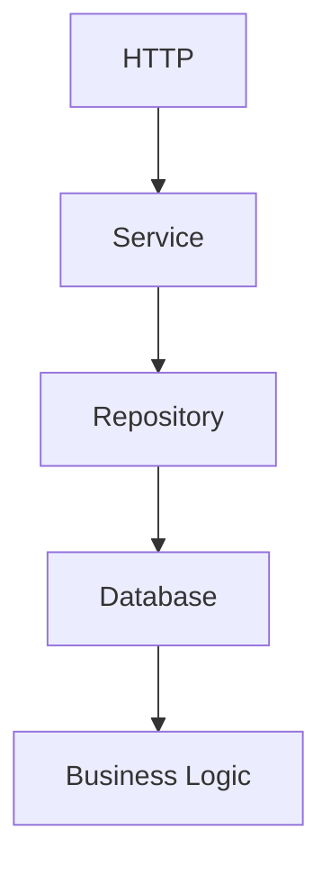

Over time the business becomes increasingly coupled to infrastructure.

Examples include:

- SQL exceptions inside business logic
- HTTP concepts inside entities
- framework annotations inside the domain
- persistence models becoming business models

Eventually:

Changing infrastructure requires changing business behaviour.

This is precisely what Hexagonal Architecture seeks to prevent.

---

# The Guiding Principle

Everything revolves around one idea.

```

Dependencies Always Point Inward
```

Not outward.

The Domain owns:

- business rules
- business language
- business behaviour

Infrastructure depends upon those concepts.

The Domain depends upon nothing external.

This inversion of dependency direction is the defining characteristic of Ports and Adapters architecture. ([alistair.cockburn.us](https://alistair.cockburn.us/hexagonal-architecture))

---

# The Hexagon

The architecture is traditionally represented as a hexagon.

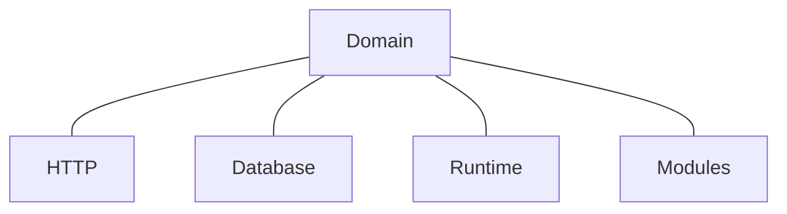

The shape itself is symbolic.

It communicates one important idea.

There is no "top" or "bottom."

Every external system is simply another adapter.

HTTP is not special.

Neither is the database.

---

# Inside The Hexagon

The inside contains only business concepts.

Examples include:

- Entities
- Value Objects
- Aggregates
- Domain Services
- Domain Events

The Domain should be understandable without mentioning any technology.

If infrastructure terminology appears inside the Domain:

The architectural boundary has already been breached.

---

# Outside The Hexagon

Everything external becomes infrastructure.

Examples include:

- HTTP
- REST
- GraphQL
- PostgreSQL
- DuckDB
- Redis
- Blob Storage
- Event Bus
- Docker
- CLI
- Mobile Applications

These technologies change frequently.

The Domain should remain unaffected.

---

# The Domain Is The Product

One of the central principles of Mosaic is:

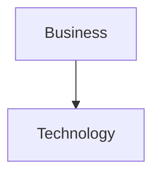

Not:

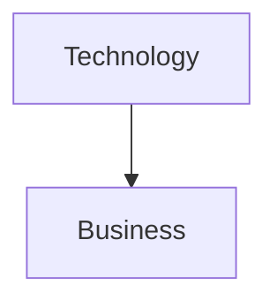

The platform exists because of:

- Libraries
- Playback
- Metadata
- Users

Not because of PostgreSQL.

Infrastructure should therefore remain replaceable.

---

# Replaceability

Suppose PostgreSQL becomes unsuitable.

Without Hexagonal Architecture.

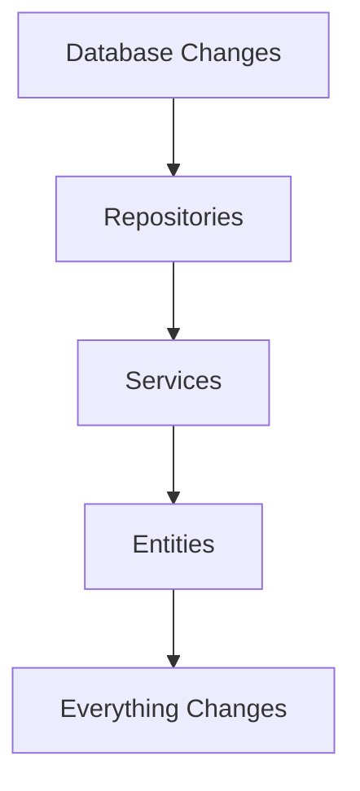

With Hexagonal Architecture.

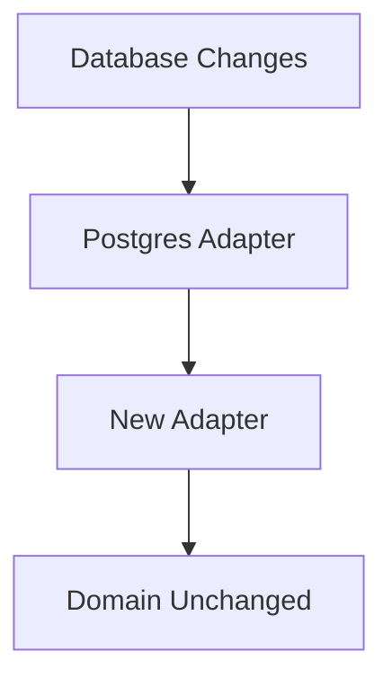

Only infrastructure changes.

The business remains stable.

---

# Runtime Independence

Likewise:

The Domain should not know the Reactive Runtime exists.

Poor.

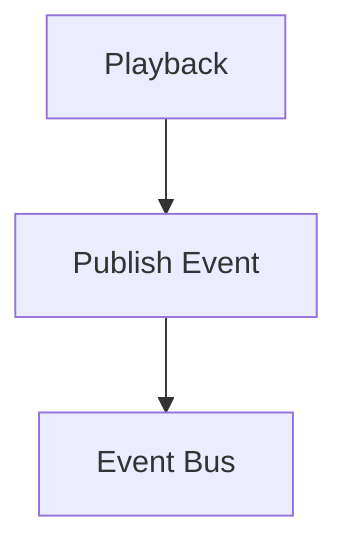

Preferred.

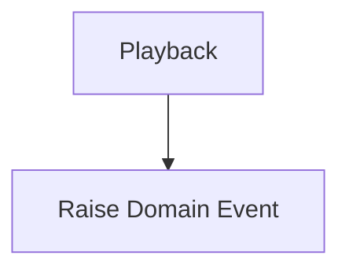

Later.

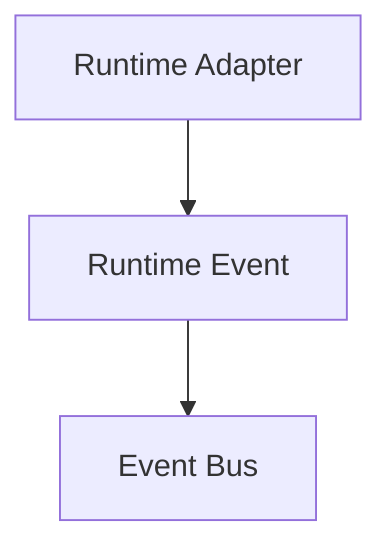

The Domain records business facts.

The Runtime communicates them.

The separation established in [MEG-002](../meg-002-event-driven-runtime/index.md) remains intact.

---

# Technology Independence

The Domain should remain capable of operating without:

- databases
- networks
- filesystems
- messaging
- containers

If a Domain Model cannot be unit tested without PostgreSQL:

The architecture has failed.

---

# The Cost Of Coupling

Infrastructure changes frequently.

Examples include:

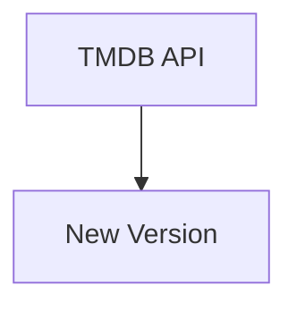

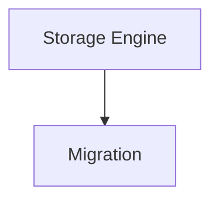

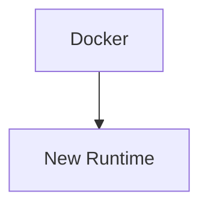

These changes should affect adapters.

Not business behaviour.

Every dependency from the Domain to infrastructure increases future maintenance cost.

---

# Business Before Infrastructure

When designing new functionality ask:

> **What is the business behaviour?**

Only afterwards ask:

> **How will the infrastructure support it?**

The second question should never influence the answer to the first.

---

# Every Technology Is Equal

One subtle but important property of the Hexagon:

```

HTTP

=

CLI

=

Worker

=

Scheduler

=

Event Bus

=

Tests
```

All are simply mechanisms for interacting with the Domain.

No technology occupies a privileged position.

The Domain remains the centre.

---

# Infrastructure Is Temporary

History demonstrates that infrastructure changes.

Examples.

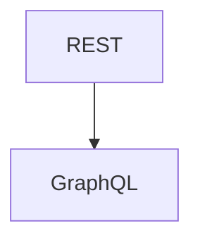

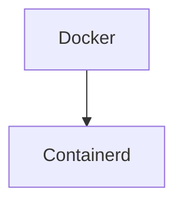

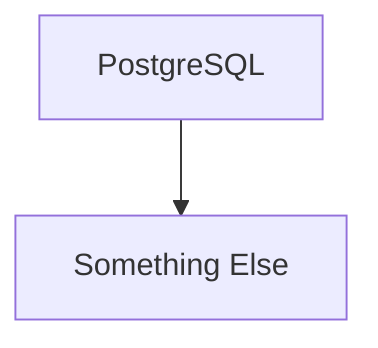

Business concepts such as:

```

Library

Playback

Collection
```

rarely disappear.

Architecture should therefore optimise for the longer-lived concepts.

---

# Ports Before Adapters

One of the defining ideas of Hexagonal Architecture is:

The Domain defines contracts.

Infrastructure satisfies them.

Never:

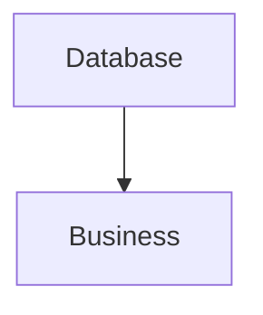

Instead.

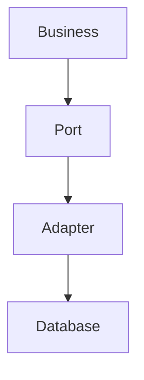

This inversion keeps the Domain in control.

---

# Simplicity

Hexagonal Architecture should simplify software.

It should not introduce unnecessary abstraction.

If a Port exists:

It should represent genuine business interaction.

Not hypothetical future flexibility.

[MEG-001](../meg-001-go-engineering-standards/index.md)'s principles still apply.

Concrete solutions remain preferable until abstraction becomes necessary.

---

# Mosaic Principles

Within Mosaic:

- The Domain owns the architecture.
- Infrastructure adapts to the Domain.
- Dependencies always point inward.
- Technology remains replaceable.
- Runtime remains infrastructure.
- Modules remain infrastructure.
- Storage remains infrastructure.
- Transport remains infrastructure.
- Business behaviour remains independent.

These principles define the architectural identity of the platform.

---

# Relationship to MEG

[MEG-003](../meg-003-domain-driven-design/index.md) established:

> **What the business is.**

MEG-004 begins answering:

> **How do we protect it?**

The remaining chapters explain the mechanisms through which Hexagonal Architecture preserves Domain independence.

The first of those mechanisms is the **Port**.

---

# Summary

Hexagonal Architecture is often misunderstood as a folder structure.

It is not.

It is a dependency philosophy.

Within Mosaic it exists for one reason:

> **To ensure the Domain remains the most stable, valuable and protected part of the entire platform.**

Everything else is expected to change.

The Domain should not.
