<!--
File: docs/engineering/guides/meg-004-hexagonal-architecture/03-driving-ports.md
Document: MEG-004
Status: Draft
Version: 0.4
-->

# Driving Ports

> *Driving Ports describe what the outside world may ask the Domain to do.*

---

# Purpose

Every business capability exposes behaviour.

Examples include:

- importing media
- starting playback
- creating collections
- updating metadata
- authenticating users

External systems require a mechanism through which they can request that behaviour.

Within Hexagonal Architecture, these contracts are known as **Driving Ports**.

Driving Ports define the public capabilities of the Domain.

They do **not** define how those capabilities are invoked.

---

# Philosophy

Within Mosaic:

> **Driving Ports express business use cases, not transport protocols.**

A Driving Port answers one question.

> **What business behaviour is available?**

It does not answer:

> **How does someone invoke it?**

Transport remains an infrastructure concern.

---

# What Is A Driving Port?

A Driving Port is an interface through which an external actor requests business behaviour.

Examples include:

- HTTP
- CLI
- Scheduler
- Event Subscriber
- Module
- Test

All interact with the Domain through the same Driving Port.

This separation allows the Domain to remain unaware of how requests arrive.

---

# Why Driving Ports Exist

Without Driving Ports:

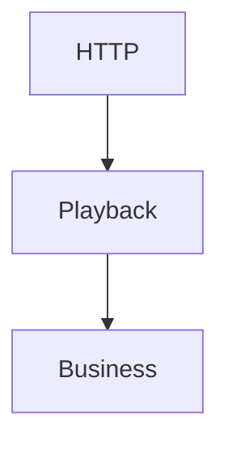

Later.

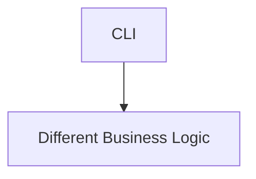

Eventually.

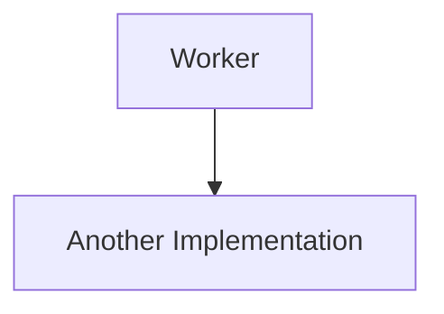

Business behaviour becomes duplicated.

Instead.

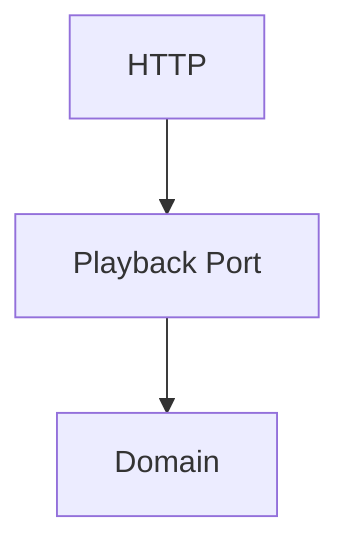

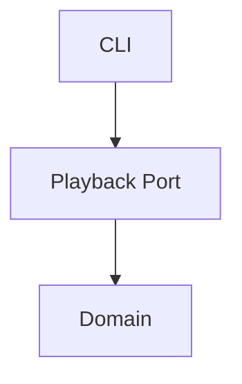

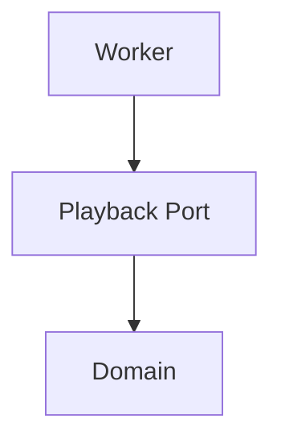

Every entry point invokes exactly the same business behaviour.

---

# The Domain Defines Behaviour

Driving Ports belong to the Application layer immediately surrounding the Domain.

They describe:

- use cases
- commands
- business operations

They do **not** describe:

- HTTP endpoints
- REST resources
- WebSocket messages
- CLI commands

Technology adapts itself to the Port.

Never the reverse.

---

# One Port Per Use Case

Driving Ports should model business capabilities.

Good.

```

PlaybackService
```

```

LibraryImporter
```

```

CollectionManager
```

Poor.

```

HTTPPlaybackController
```

```

RESTLibraryAPI
```

The business should remain unaware of transport.

---

# Use Cases

Every operation exposed by a Driving Port should correspond to a business use case.

Examples.

```

ImportMedia()
```

```

ResumePlayback()
```

```

CreateCollection()
```

```

GenerateRecommendations()
```

Notice:

These operations describe business behaviour.

Not infrastructure.

---

# Business Language

Driving Ports should reinforce the ubiquitous language.

Good.

```go
ResumePlayback(...)
```

Poor.

```go
ExecutePlaybackHandler(...)
```

The Port should read like a conversation with the business.

---

# Request Models

Driving Ports may define request objects.

Example.

```go
type ImportMediaRequest struct {

    LibraryID LibraryID

    Source Source
}
```

These request models represent business concepts.

They should not mirror:

- HTTP payloads
- JSON documents
- database schemas

Transport models should be translated before reaching the Port.

---

# Response Models

Likewise:

Driving Ports may return business responses.

Example.

```go
type ImportMediaResult struct {

    MediaID MediaID
}
```

Avoid exposing:

- HTTP status codes
- JSON responses
- protobuf messages

The Domain should return business concepts.

Transport decides how to present them.

---

# Commands

Driving Ports frequently execute commands.

Example.

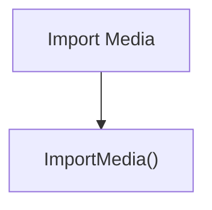

A Driving Port represents the intention to perform business work.

Successful execution may later produce Domain Events.

---

# One Behaviour

Driving Port operations should remain cohesive.

Poor.

```go
ProcessEverything()
```

Better.

```go
ImportMedia()
```

```go
CreateCollection()
```

```go
ArchiveMedia()
```

Every operation should communicate one business intention.

---

# No Infrastructure

Driving Ports MUST remain infrastructure agnostic.

Poor.

```go
ImportMedia(http.Request)
```

Better.

```go
ImportMedia(request ImportMediaRequest)
```

HTTP belongs to the Adapter.

The Port belongs to the Domain.

---

# Multiple Adapters

One Driving Port may have many Adapters.

Example.

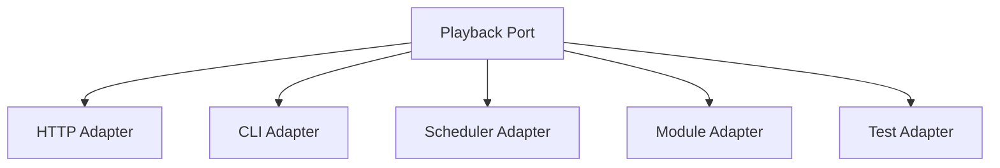

The Domain remains unchanged.

Only the Adapters differ.

This is one of the key advantages of Hexagonal Architecture.

---

# Validation

Driving Ports should receive already valid transport models.

Examples.

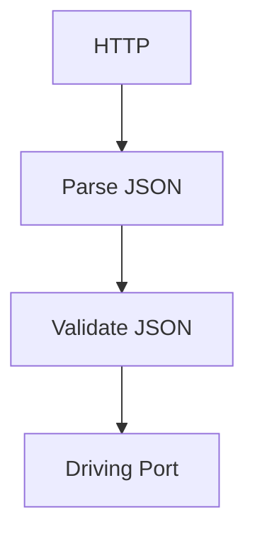

Business validation still occurs inside the Domain.

Transport validation remains outside.

The two solve different problems.

---

# Transactions

Driving Ports define business operations.

They do not own:

- database transactions
- retries
- event publication
- infrastructure coordination

Those responsibilities belong elsewhere within the architecture.

The Port simply exposes business behaviour.

---

# Testing

Driving Ports make business testing straightforward.

Example.

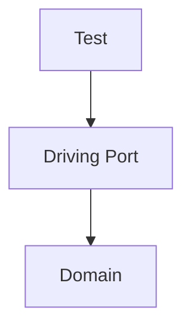

No HTTP server.

No REST.

No database.

The business can be exercised directly.

This dramatically simplifies testing.

---

# Event Subscribers

Within Mosaic's Reactive Runtime, event subscribers frequently become Driving Adapters.

Example.

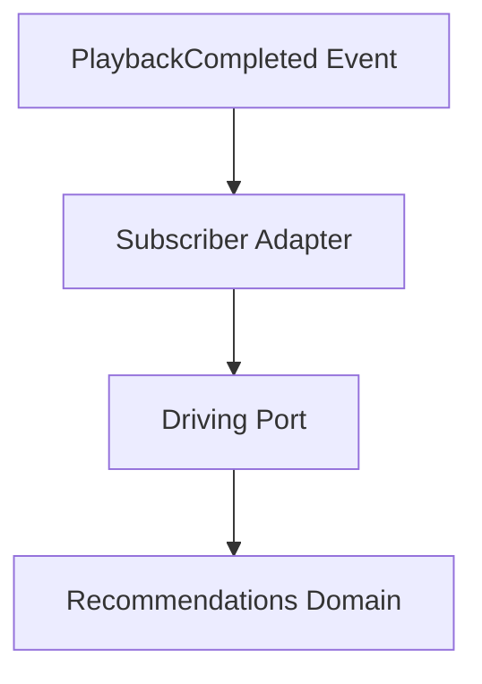

Notice:

The subscriber remains infrastructure.

The Domain still receives business requests through the Driving Port.

This cleanly integrates [MEG-002](../meg-002-event-driven-runtime/index.md) with Hexagonal Architecture.

---

# Examples Within Mosaic

Examples of Driving Ports include:

```

PlaybackService
```

```

LibraryImporter
```

```

CollectionService
```

```

MetadataManager
```

```

RecommendationEngine
```

Each exposes business behaviour.

None expose technology.

---

# Anti-Patterns

The following practices are prohibited.

## HTTP In Ports

```go
ServeHTTP(...)
```

---

## Database Models

Ports accepting SQL entities.

---

## JSON Objects

Ports exposing transport models directly.

---

## Framework Types

Ports importing:

- gin
- echo
- grpc
- protobuf

---

## Generic Methods

```

Execute()
```

```

Handle()
```

```

Process()
```

without clear business meaning.

---

# Mosaic Guidelines

Within Mosaic:

- Driving Ports MUST expose business use cases.
- Driving Ports MUST remain transport independent.
- Driving Ports SHOULD reinforce the ubiquitous language.
- Every operation SHOULD describe one business behaviour.
- Request and response models SHOULD represent business concepts.
- Multiple adapters MAY implement the same Driving Port.
- Infrastructure MUST translate before invoking the Port.
- Driving Ports MUST remain stable as transport evolves.

---

# Relationship to MEG

Ports define contracts.

Driving Ports define:

> **How the outside world requests business behaviour.**

The next chapter introduces **Driven Ports**, which define the opposite direction:

> **How the Domain requests capabilities from the outside world.**

Together they complete the communication boundary between the Domain and infrastructure.

---

# Summary

Driving Ports represent the public face of the Domain.

They describe:

- business capabilities
- business language
- business intent

They remain completely independent of:

- HTTP
- CLI
- Runtime
- Modules
- Transport

By ensuring every external interaction passes through the same business contract, Mosaic guarantees that changing how users interact with the platform never requires changing the Domain itself.
