<!--
File: docs/engineering/guides/meg-004-hexagonal-architecture/05-adapters.md
Document: MEG-004
Status: Draft
-->

# Adapters

> *If Ports define what the Domain needs, Adapters define how the outside world fulfils those needs.*

---

# Purpose

The Domain communicates exclusively through Ports.

However, Ports are only contracts.

Something must translate those contracts into real technologies such as:

- HTTP
- PostgreSQL
- DuckDB
- Blob Storage
- Event Bus
- Docker
- TMDB
- Jellyfin
- Stremio

Those translations are performed by **Adapters**.

Adapters isolate infrastructure from the Domain while allowing technologies to evolve independently.

---

# Philosophy

Within Mosaic:

> **Adapters translate. They do not decide.**

Adapters are translators.

They convert:

- transport into business requests
- business requests into infrastructure operations
- infrastructure responses into business concepts

They should never contain business rules.

Those belong to the Domain.

---

# What Is An Adapter?

An Adapter implements a Port.

Conceptually.

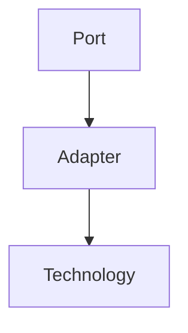

Examples include:

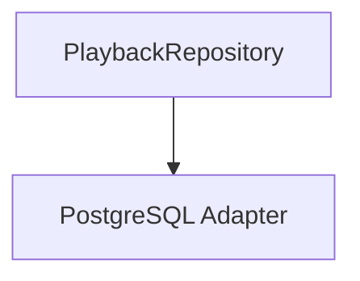

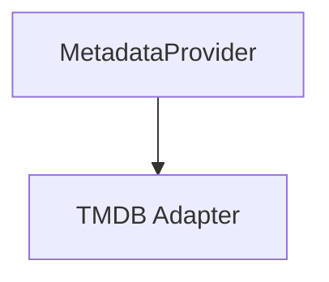

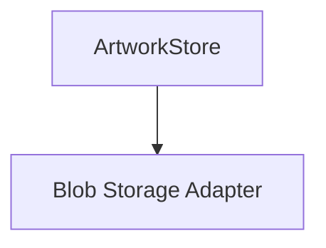

The Adapter satisfies the Port.

The Domain remains unchanged.

---

# Why Adapters Exist

Without Adapters:

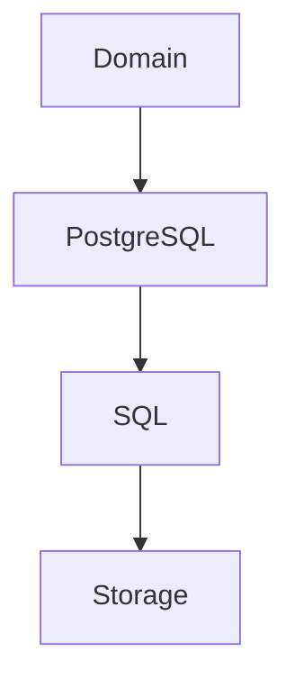

Business behaviour becomes coupled to infrastructure.

Instead:

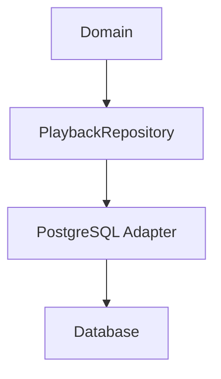

Only the Adapter understands SQL.

The Domain never does.

---

# Translation Layer

An Adapter performs translation.

Example.

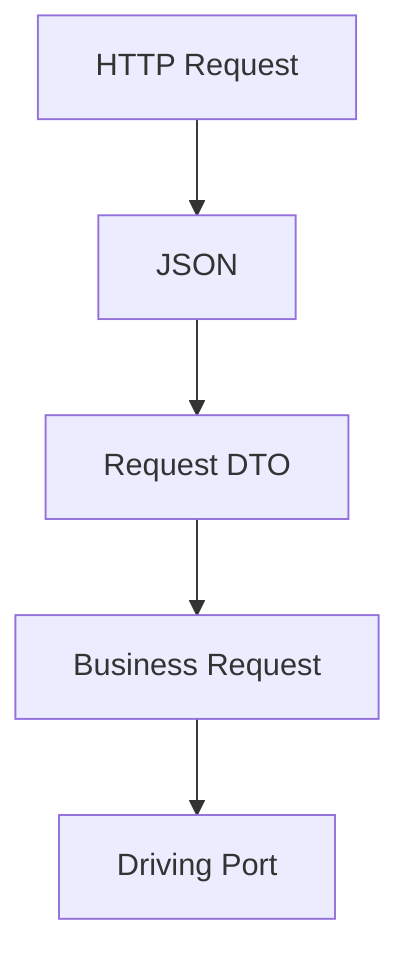

Or:

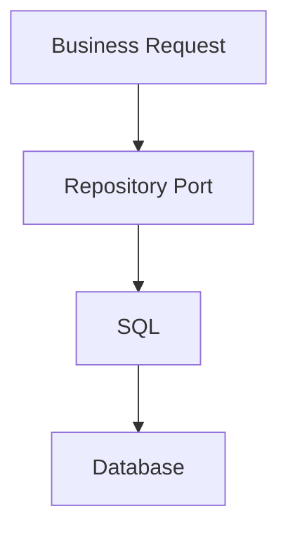

Notice:

Translation occurs only inside the Adapter.

The Domain never sees infrastructure models.

---

# Adapters Own Technology

Every technology belongs inside an Adapter.

Examples include:

- SQL
- HTTP
- GraphQL
- Redis
- Docker
- Kafka
- Blob Storage
- TMDB SDK
- Jellyfin API

If these concepts appear inside the Domain:

The architectural boundary has failed.

---

# Business Objects Stay Inside

Adapters should convert infrastructure models into Domain concepts.

Poor.

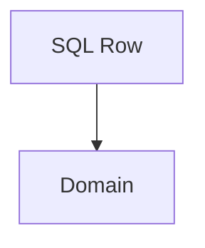

Better.

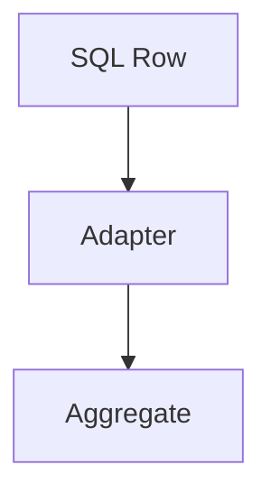

Likewise.

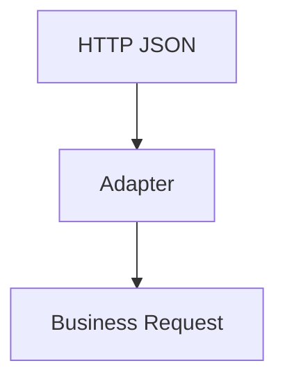

The Domain should never parse JSON.

---

# One Adapter, One Technology

Each Adapter SHOULD represent one integration.

Good.

```

TMDB Adapter
```

Poor.

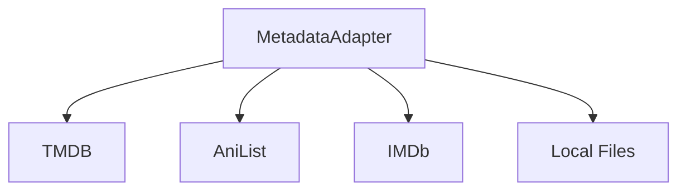

Multiple technologies should generally produce multiple Adapters implementing the same Port.

This keeps integrations isolated and independently replaceable.

---

# Multiple Adapters

One Port may have many Adapters.

Example.

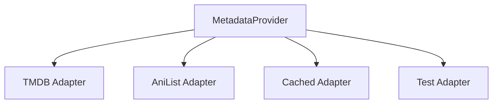

The Domain depends only upon:

```

MetadataProvider
```

Changing Adapters requires no Domain changes.

This is the Platform foundation value proposition of Ports and Adapters.  [AWS Documentation](https://docs.aws.amazon.com/prescriptive-guidance/latest/cloud-design-patterns/hexagonal-architecture.html)

---

# Adapters Are Replaceable

Adapters should be considered disposable.

Suppose:

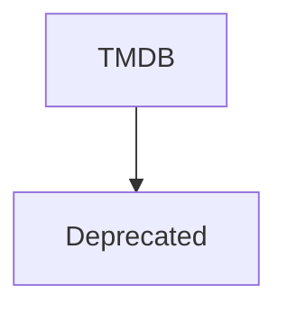

The replacement should require:

```

New Adapter
```

Not:

```

Domain Rewrite
```

Replaceability is one of the primary architectural goals.

---

# Adapters Are Thin

Adapters SHOULD remain small.

Typical responsibilities include:

- translation
- mapping
- validation
- protocol conversion
- error translation

Adapters SHOULD NOT contain:

- business rules
- workflow decisions
- Aggregate logic
- invariants

If business behaviour appears inside an Adapter:

Move it into the Domain.

---

# Error Translation

Adapters translate infrastructure failures into business concepts.

Poor.

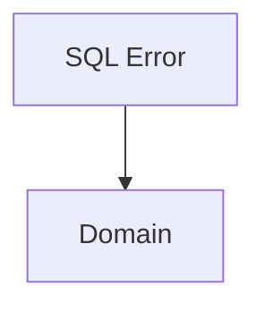

Preferred.

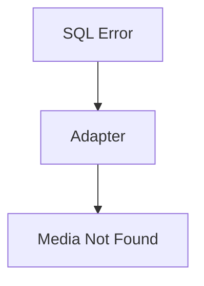

The Domain should never understand database exceptions.

---

# Mapping

Adapters frequently perform mapping.

Examples include:

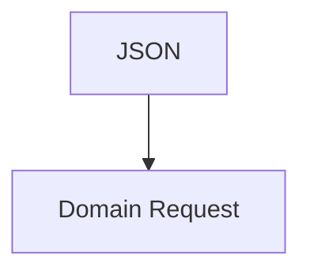

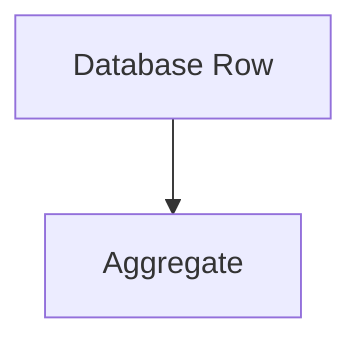

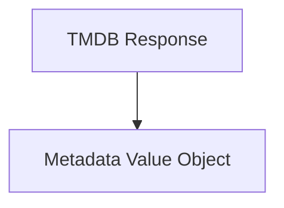

Mapping belongs entirely to infrastructure.

Not the Domain.

---

# Runtime Integration

The Reactive Runtime integrates through Adapters.

Example.

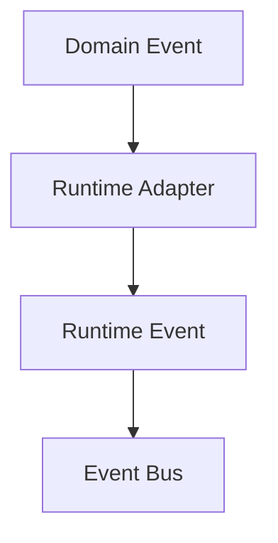

The Domain remains unaware that an Event Bus even exists.

The Adapter performs the translation.

This preserves the separation established in [MEG-002](../meg-002-event-driven-runtime/index.md).

---

# External APIs

Every external API SHOULD terminate at an Adapter.

Example.

```mermaid
flowchart TD

N1["AniList"]
N2["AniList Adapter"]
N3["MetadataProvider"]

N1 --> N2
N2 --> N3
```

The Domain should never import:

- API clients
- SDKs
- REST models

The Adapter shields the Domain from external change.

---

# Testing

Adapters are tested independently.

Typical tests verify:

- mapping correctness
- translation
- protocol handling
- infrastructure interaction

Domain tests should not require Adapter tests.

Responsibilities remain separate.

---

# Composition Root

Adapters are assembled within the Composition Root.

Example.

```mermaid
flowchart TD

N1["main()"]
N2["Postgres Adapter"]
N3["PlaybackRepository"]
N4["Playback Domain"]

N1 --> N2
N2 --> N3
N3 --> N4
```

The Domain never constructs its own Adapters.

Construction belongs entirely outside the Hexagon.

---

# Evolution

Adapters change frequently.

Examples include:

```mermaid
flowchart TD

N1["REST"]
N2["GraphQL"]

N1 --> N2
```

```mermaid
flowchart TD

N1["PostgreSQL"]
N2["CockroachDB"]

N1 --> N2
```

```mermaid
flowchart TD

N1["Blob Storage"]
N2["S3"]

N1 --> N2
```

The Adapter changes.

The Port remains.

The Domain remains.

This asymmetry is intentional.

---

# Examples Within Mosaic

Examples of Adapters include:

```

HTTP Playback Adapter
```

```

CLI Import Adapter
```

```

PostgreSQL Playback Repository
```

```

DuckDB Analytics Repository
```

```

TMDB Metadata Adapter
```

```

Jellyfin Compatibility Adapter
```

```

Stremio Integration Adapter
```

Every Adapter owns technology.

None own business behaviour.

---

# Anti-Patterns

The following practices are prohibited.

## Business Rules In Adapters

Calculating business decisions during mapping.

---

## Domain Imports Infrastructure

Entities importing:

- SQL
- HTTP
- Docker
- SDKs

---

## Fat Adapters

Adapters performing orchestration or business workflows.

---

## Shared Adapters

One Adapter implementing unrelated Ports.

---

## Technology Leaks

Returning infrastructure models directly to the Domain.

---

# Mosaic Guidelines

Within Mosaic:

- Every Adapter MUST implement one or more Ports.
- Adapters MUST own technology-specific code.
- Adapters MUST translate between infrastructure and business concepts.
- Adapters MUST remain thin.
- Adapters MUST NOT contain business rules.
- Infrastructure models MUST NOT cross the Port boundary.
- Adapters SHOULD remain independently replaceable.
- Adapters SHOULD evolve without requiring Domain changes.

---

# Relationship to MEG

Ports define:

> **What the Domain needs.**

Adapters define:

> **How those needs are fulfilled.**

The next two chapters separate Adapters into two categories:

- **Driving Adapters**, which bring requests into the Domain.
- **Driven Adapters**, which fulfil the Domain's requests to external systems.

This distinction completes the Ports and Adapters model at the heart of Hexagonal Architecture.

---

# Summary

Adapters are translators.

They isolate technology from the business by converting external representations into Domain concepts and Domain concepts back into external representations.

Within Mosaic, every infrastructure concern exists behind an Adapter.

That simple rule allows databases, APIs, runtimes and transport protocols to evolve continuously while the Domain remains stable, expressive and entirely focused on the business.
