<!--
File: docs/engineering/guides/meg-004-hexagonal-architecture/06-driving-adapters.md
Document: MEG-004
Status: Draft
Version: 0.4
-->

# Driving Adapters

> *Driving Adapters translate external requests into business behaviour. They never become part of the business themselves.*

---

# Purpose

The Domain cannot receive requests directly.

Every interaction with the outside world must first pass through an Adapter.

Examples include:

- HTTP requests
- CLI commands
- Scheduled tasks
- Runtime events
- Module calls
- Test harnesses

These external interactions differ technologically.

They should not differ architecturally.

Driving Adapters translate these external requests into calls against Driving Ports.

---

# Philosophy

Within Mosaic:

> **Driving Adapters understand technology. Driving Ports understand the business.**

Driving Adapters should answer one question.

> **How does this external system communicate with the Domain?**

They should never answer:

> **What should the business do?**

That responsibility belongs entirely to the Domain.

---

# What Is A Driving Adapter?

A Driving Adapter is an infrastructure component that invokes a Driving Port.

Conceptually:

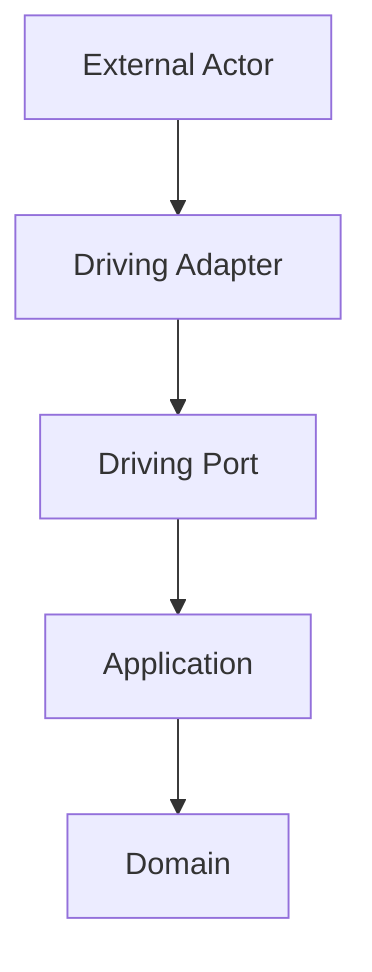

The Driving Adapter is responsible for translation.

Nothing more.

---

# External Actors

Many different systems may invoke the same business capability.

Examples include:

```

HTTP
```

```

CLI
```

```

Scheduler
```

```

Runtime Subscriber
```

```

Module
```

Every one becomes a Driving Adapter.

No transport receives special treatment.

---

# Why Driving Adapters Exist

Without Driving Adapters:

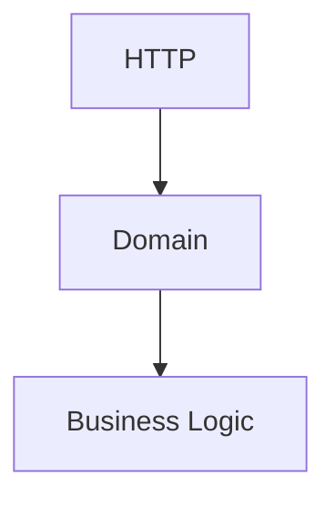

The Domain now understands HTTP.

Instead:

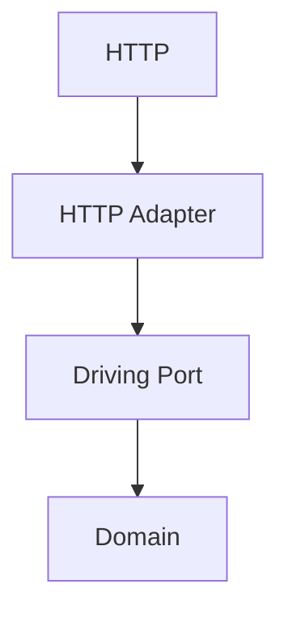

Only the Adapter understands HTTP.

The Domain remains completely transport independent.

---

# One Driving Port

Multiple Driving Adapters may invoke the same Driving Port.

Example.

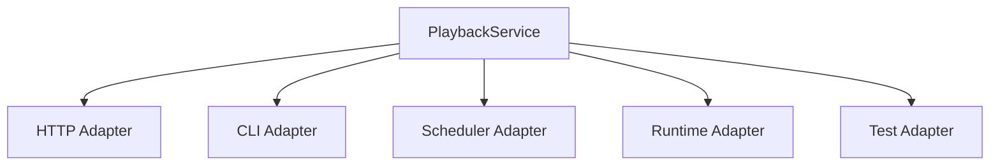

The business implementation remains identical.

Only the entry mechanism changes.

---

# Translation

Driving Adapters translate external representations into business requests.

Example.

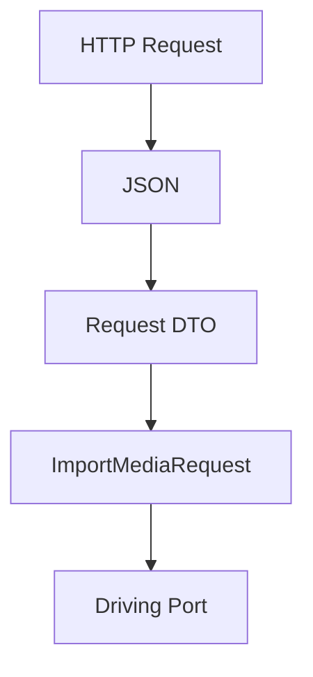

Or:

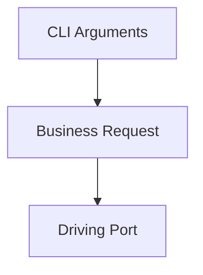

Translation ends at the Port boundary.

---

# Validation

Driving Adapters perform transport validation.

Examples include:

- malformed JSON
- missing HTTP headers
- invalid CLI syntax
- protobuf decoding
- authentication tokens

Business validation belongs to the Domain.

The two should never be confused.

Example.

Transport validation.

```

Required JSON Field Missing
```

Business validation.

```

Collection Already Exists
```

Different layers.

Different responsibilities.

---

# Authentication

Authentication belongs to the Driving Adapter layer.

Example.

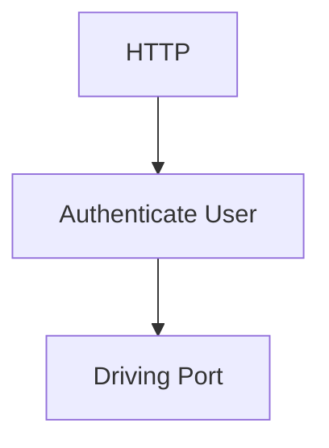

The Domain should receive:

```

Authenticated User
```

Not:

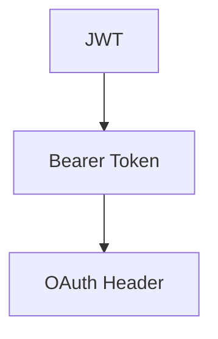

Security mechanisms remain infrastructure concerns.

Business identity remains a domain concern.

---

# Authorisation

Likewise:

Authorisation decisions should generally occur before entering the Domain.

Example.

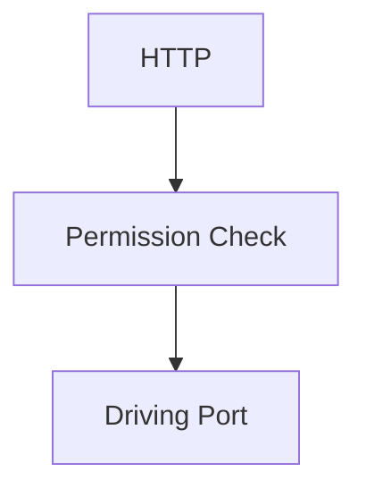

The Domain assumes:

The caller has already been authorised to invoke the requested business behaviour.

Business rules remain separate from access control.

---

# Error Translation

Driving Adapters translate Domain errors into transport errors.

Example.

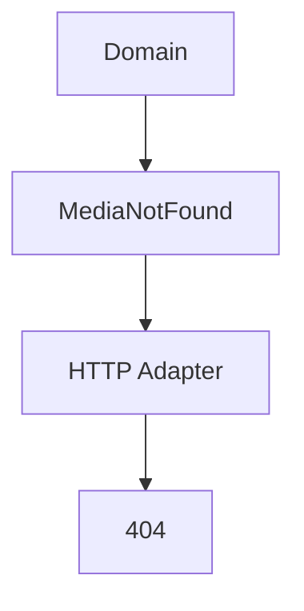

Or:

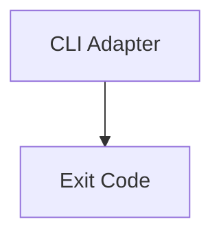

The Domain should never return:

- HTTP status codes
- CLI exit codes
- GraphQL errors

Adapters perform the translation.

---

# Runtime Events

Within the Reactive Runtime, subscribers become Driving Adapters.

Example.

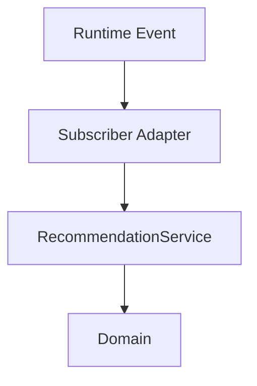

The Domain remains unaware that an Event Bus exists.

Subscribers simply translate runtime events into business requests.

This is one of the key integration points between [MEG-002](../meg-002-event-driven-runtime/index.md) and MEG-004.

---

# Scheduled Work

Scheduled tasks also become Driving Adapters.

Example.

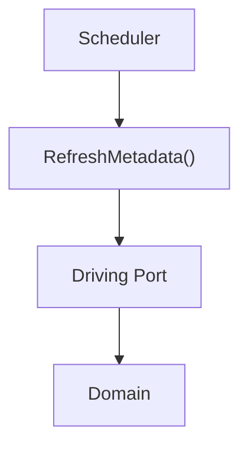

The Domain should never understand:

- timers
- cron
- scheduling

The scheduler invokes the business through the same contract as every other caller.

---

# Modules

Modules invoke the Domain through Driving Adapters.

Example.

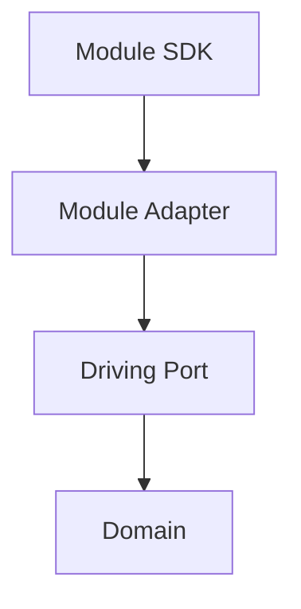

The Domain remains unaware whether the caller is:

- Platform capabilities
- Module
- Test
- CLI

All callers appear identical.

---

# Tests

Tests become Driving Adapters.

Example.

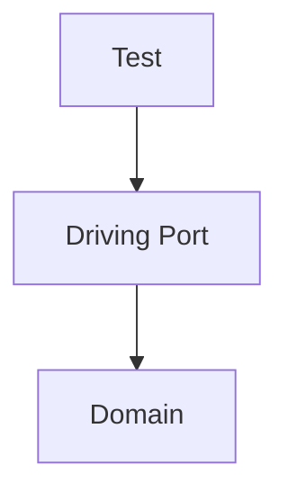

No HTTP.

No runtime.

No infrastructure.

The business remains directly testable.

This is one of the greatest practical benefits of Hexagonal Architecture.

---

# Thin Adapters

Driving Adapters SHOULD remain thin.

Typical responsibilities include:

- parsing
- authentication
- transport validation
- mapping
- error translation

They SHOULD NOT contain:

- business rules
- Aggregate manipulation
- orchestration
- persistence

Business behaviour belongs beyond the Port.

---

# Stateless

Driving Adapters SHOULD remain stateless.

They simply translate one request into another.

State belongs to:

- Aggregates
- Repositories
- Runtime

Not the Adapter itself.

---

# Examples Within Mosaic

Examples of Driving Adapters include:

```

REST API
```

```

GraphQL API
```

```

CLI
```

```

Worker Subscriber
```

```

Scheduler
```

```

Module Runtime
```

```

Integration Tests
```

Each invokes exactly the same business behaviour.

---

# Anti-Patterns

The following practices are prohibited.

## Business Rules

Determining business outcomes inside HTTP handlers.

---

## Persistence

Executing SQL directly from Driving Adapters.

---

## Runtime Logic

Managing retries.

Managing scheduling.

Managing workers.

These belong to the runtime.

---

## Aggregate Mutation

Changing Aggregate state directly.

All business behaviour must enter through the Driving Port.

---

## Technology Leakage

Passing:

- HTTP requests
- protobuf messages
- JSON documents

directly into the Domain.

---

# Mosaic Guidelines

Within Mosaic:

- Driving Adapters MUST invoke Driving Ports.
- Driving Adapters MUST remain transport specific.
- Driving Adapters MUST perform translation.
- Driving Adapters MUST perform transport validation.
- Business validation MUST remain inside the Domain.
- Driving Adapters MUST translate Domain errors into transport-specific responses.
- Driving Adapters SHOULD remain stateless.
- Every external caller SHOULD interact through a Driving Adapter.

---

# Relationship to MEG

Driving Ports define:

> **What business behaviour is available.**

Driving Adapters define:

> **How external systems invoke that behaviour.**

The next chapter introduces **Driven Adapters**, which perform the opposite role by implementing the capabilities requested by the Domain through Driven Ports.

Together they complete the two halves of the Hexagonal Architecture.

---

# Summary

Driving Adapters isolate the Domain from every external interaction.

Whether requests originate from:

- HTTP
- CLI
- Runtime Events
- Modules
- Tests

the Domain always receives the same business request through the same Driving Port.

That consistency allows Mosaic to support many interaction models without ever allowing transport concerns to leak into the business itself.
