<!--
File: docs/engineering/guides/meg-004-hexagonal-architecture/07-driven-adapters.md
Document: MEG-004
Status: Draft
Version: 0.4
-->

# Driven Adapters

> *Driven Adapters fulfil the Domain's requests by translating business intent into infrastructure operations.*

---

# Purpose

The Domain frequently requires capabilities that only infrastructure can provide.

Examples include:

- persisting Aggregates
- retrieving metadata
- storing artwork
- publishing runtime events
- generating identifiers
- obtaining the current time

The Domain expresses these requirements through Driven Ports.

Driven Adapters satisfy those requirements by implementing the corresponding Port using specific infrastructure technologies.

They form the boundary between the Domain and the external world.

---

# Philosophy

Within Mosaic:

> **Driven Adapters implement capabilities. They never define them.**

The Domain owns the contract.

The Driven Adapter owns the implementation.

This distinction allows infrastructure to evolve without requiring changes to the Domain Model.

---

# What Is A Driven Adapter?

A Driven Adapter is an infrastructure implementation of a Driven Port.

Conceptually.

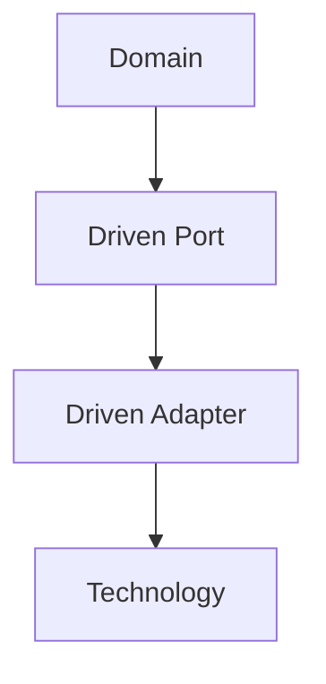

The Domain depends only upon the Port.

The Adapter depends upon the technology.

---

# Why Driven Adapters Exist

Without Driven Adapters:

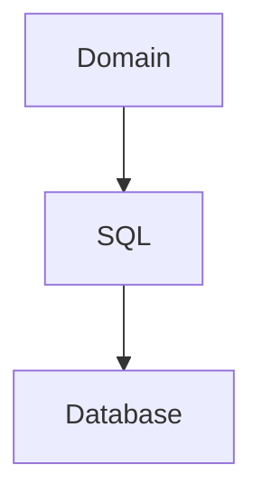

Business behaviour becomes tightly coupled to persistence.

Instead.

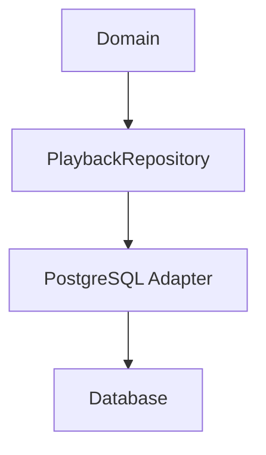

Only the Adapter understands SQL.

The Domain remains completely independent.

---

# One Port

Every Driven Adapter implements one or more Driven Ports.

Example.

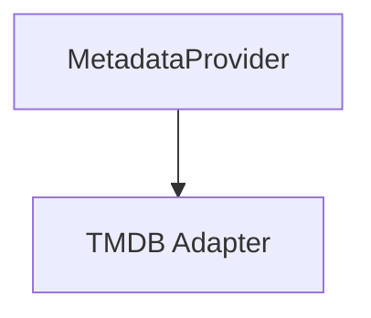

Later.

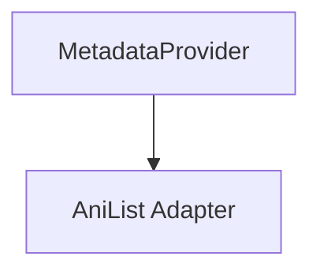

The Domain remains unchanged.

Only the Adapter changes.

---

# Infrastructure Ownership

Driven Adapters own every technology-specific concern.

Examples include:

- SQL
- HTTP clients
- SDKs
- authentication tokens
- connection pools
- file systems
- blob storage
- serialization

None of these concepts belong inside the Domain.

---

# Repository Adapters

Repository implementations are Driven Adapters.

Example.

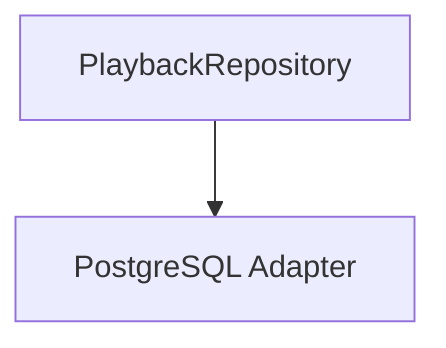

Responsibilities include:

- SQL generation
- transaction management
- persistence mapping
- Aggregate reconstruction

Business behaviour remains inside the Aggregate.

Persistence behaviour remains inside the Adapter.

---

# External Service Adapters

External services should always terminate at a Driven Adapter.

Example.

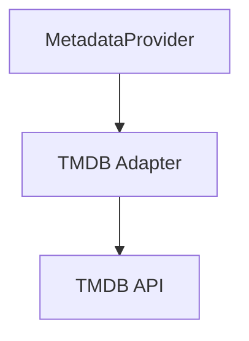

The Adapter performs:

- authentication
- request construction
- retries (where appropriate)
- response mapping
- error translation

The Domain receives only business concepts.

---

# Runtime Adapters

The Reactive Runtime is also infrastructure.

Example.

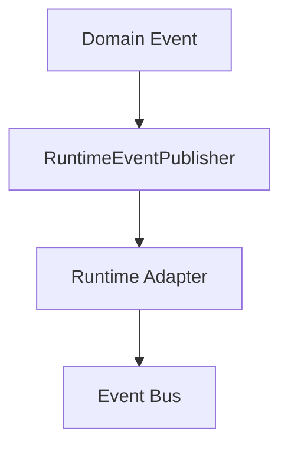

The Domain remains unaware of:

- workers
- queues
- subscribers
- delivery guarantees

Those concepts belong entirely to the runtime.

---

# Translation

Driven Adapters translate:

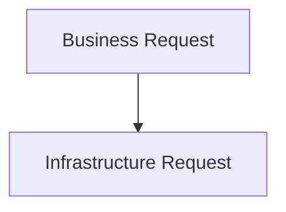

and later:

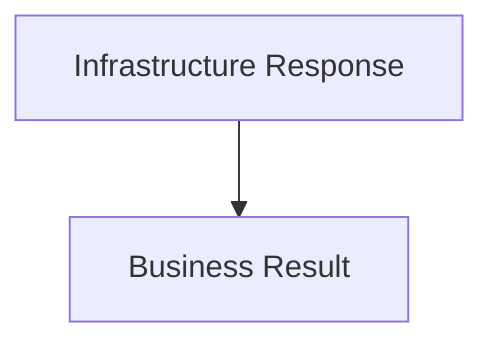

Translation occurs entirely within the Adapter.

Neither the Domain nor the infrastructure should understand one another's models directly.

---

# Mapping

Driven Adapters frequently perform mapping.

Examples include:

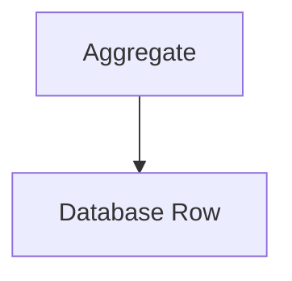

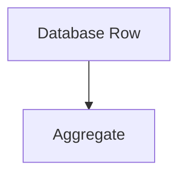

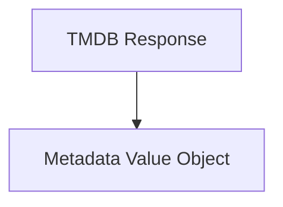

Mapping should remain symmetrical wherever practical.

Business models should never become persistence models.

---

# Error Translation

Infrastructure errors should never escape the Adapter.

Poor.

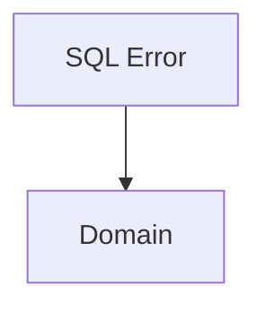

Preferred.

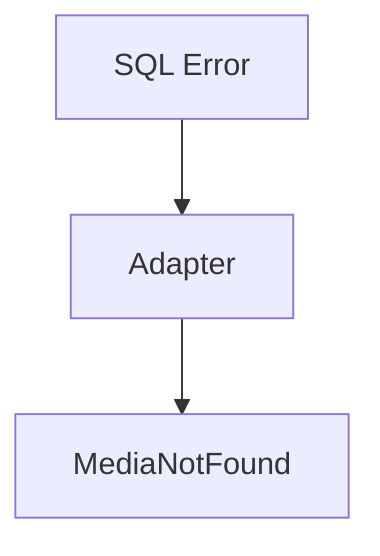

Likewise.

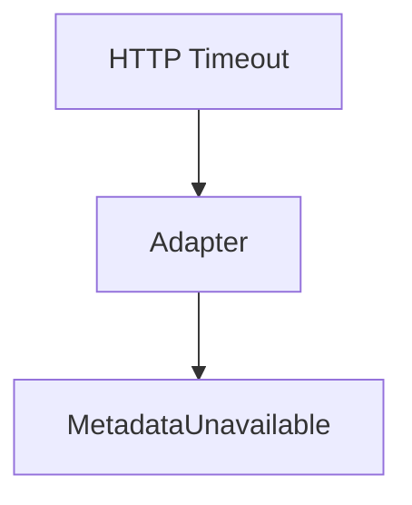

The Domain should reason about business failures.

Never infrastructure failures.

---

# Configuration

Configuration belongs to infrastructure.

Example.

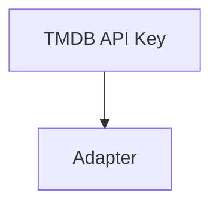

The Domain should never receive:

- API keys
- connection strings
- endpoint URLs

Configuration remains an implementation concern.

---

# Retry Behaviour

Driven Adapters may implement infrastructure retries when interacting with unreliable external systems.

Examples include:

- TMDB
- AniList
- Blob Storage

These retries differ from runtime event retries defined in [MEG-002](../meg-002-event-driven-runtime/index.md).

Infrastructure retries protect one operation.

Runtime retries protect business workflows.

The two should remain distinct.

---

# Resource Ownership

Driven Adapters own infrastructure resources.

Examples include:

- database connections
- HTTP clients
- blob clients
- caches
- SDK instances

The Domain should never manage resource lifecycles.

Construction and disposal belong to infrastructure.

---

# Composition Root

Driven Adapters are constructed within the Composition Root.

Example.

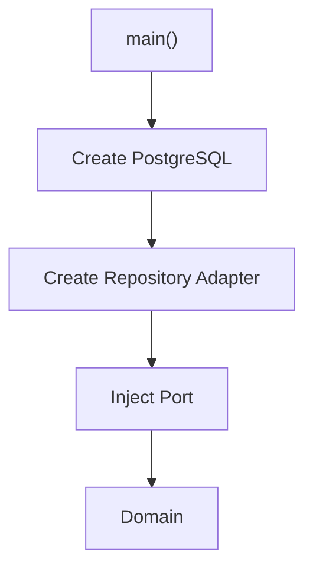

The Domain should never instantiate its own Adapters.

---

# Testing

Driven Adapters should be tested independently from the Domain.

Typical tests verify:

- SQL mapping
- HTTP translation
- serialization
- authentication
- protocol compatibility

Domain tests should replace Adapters with simple test implementations.

This separation keeps business tests fast while still validating infrastructure behaviour.

---

# Technology Replacement

Replacing infrastructure should require replacing only the Adapter.

Example.

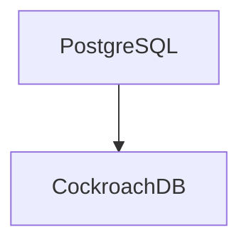

or

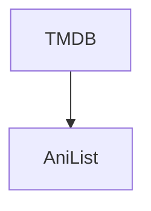

The Port remains unchanged.

The Domain remains unchanged.

Only the Adapter evolves.

This is one of the primary reasons Hexagonal Architecture scales well over time.

---

# Multiple Adapters

One Port may have multiple implementations simultaneously.

Example.

```mermaid
flowchart TD

N1["ArtworkStore"]
N2["Local Filesystem"]
N3["Blob Storage"]
N4["Memory"]
N5["Test"]

N1 --> N2
N1 --> N3
N1 --> N4
N1 --> N5
```

Selecting the implementation becomes a Composition Root decision.

Not a Domain decision.

---

# Anti-Corruption Layers

Every integration with an external system SHOULD terminate inside a Driven Adapter.

Example.

```mermaid
flowchart TD

N1["Jellyfin"]
N2["Jellyfin Adapter"]
N3["LibraryRepository"]

N1 --> N2
N2 --> N3
```

The Adapter translates:

- terminology
- identifiers
- lifecycle
- business concepts

External models should never leak into the Domain.

---

# Examples Within Mosaic

Examples of Driven Adapters include:

```

PostgreSQL Playback Repository
```

```

DuckDB Analytics Repository
```

```

TMDB Metadata Provider
```

```

AniList Metadata Provider
```

```

Blob Artwork Store
```

```

Filesystem Artwork Store
```

```

Runtime Event Publisher
```

Every Adapter owns implementation.

None own business behaviour.

---

# Anti-Patterns

The following practices are prohibited.

## Business Logic

Calculating recommendations inside a repository.

---

## Domain Models Leaking Out

Returning SQL rows directly to the Domain.

---

## Infrastructure Models Leaking In

Passing SDK objects into Aggregates.

---

## Shared Adapters

One Adapter implementing unrelated Ports.

---

## Framework Dependencies

Importing:

- HTTP
- SQL
- Docker

into Domain objects.

---

## Repository As Service

Repositories making business decisions rather than simply persisting Aggregates.

---

# Mosaic Guidelines

Within Mosaic:

- Driven Adapters MUST implement Driven Ports.
- Driven Adapters MUST own technology-specific code.
- Driven Adapters MUST translate infrastructure models into business models.
- Infrastructure errors MUST be translated into business concepts.
- Configuration MUST remain inside infrastructure.
- Domain objects MUST remain infrastructure independent.
- Driven Adapters SHOULD remain independently replaceable.
- Infrastructure changes SHOULD affect only Driven Adapters.

---

# Relationship to MEG

Driving Adapters bring business requests into the Domain.

Driven Adapters fulfil the Domain's external requirements.

Together they complete the Hexagonal Architecture.

```mermaid
flowchart TD

N1["External System"]
N2["Driving Adapter"]
N3["Driving Port"]
N4["Application"]
N5["Domain"]
N6["Driven Port"]
N7["Driven Adapter"]
N8["Infrastructure"]

N1 --> N2
N2 --> N3
N3 --> N4
N4 --> N5
N5 --> N6
N6 --> N7
N7 --> N8
```

Every dependency crossing the architectural boundary now passes through an explicit Port and Adapter.

Nothing crosses the boundary accidentally.

---

# Summary

Driven Adapters are where technology finally appears.

They isolate:

- databases
- APIs
- storage
- runtimes
- external services

from the Domain by translating business concepts into infrastructure operations and back again.

Within Mosaic, replacing an infrastructure technology should almost always mean replacing only a Driven Adapter.

If changing a database requires changing an Aggregate, the architectural boundary has been violated.
