<!--
File: docs/engineering/guides/meg-004-hexagonal-architecture/08-dependency-direction.md
Document: MEG-004
Status: Draft
Version: 0.4
-->

# Dependency Direction

> *Architecture is not defined by layers. It is defined by the direction of dependencies.*

---

# Purpose

The single most important rule within Hexagonal Architecture is:

> **Dependencies always point towards the Domain.**

Everything else in this specification exists to enforce that rule.

When dependency direction is correct:

- infrastructure becomes replaceable
- business logic remains isolated
- testing becomes simple
- long-term maintenance becomes significantly easier

When dependency direction is violated:

Technology begins shaping the business.

This document defines the dependency rules governing every Mosaic codebase.

---

# Philosophy

Within Mosaic:

> **The Domain depends upon nothing. Everything else depends upon the Domain.**

This is the architectural centre of the platform.

Every package, interface and dependency should reinforce this rule.

If an engineer is unsure where code belongs, the dependency direction should answer the question.

---

# The Dependency Rule

Every dependency points inward.

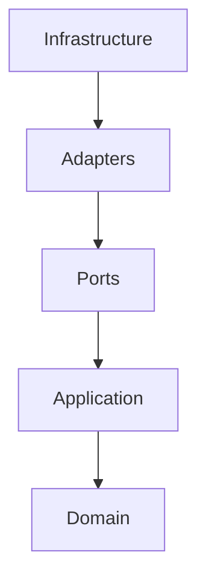

The reverse direction is prohibited.

The Domain should remain the least coupled part of the platform.

This inward dependency rule is the defining characteristic shared by Hexagonal, Onion and Clean Architecture.  [AWS Documentation](https://docs.aws.amazon.com/prescriptive-guidance/latest/hexagonal-architectures/overview.html)

---

# The Domain

The Domain sits at the centre.

It owns:

- business language
- business rules
- entities
- aggregates
- value objects
- domain services
- domain events

It depends on:

Nothing.

If the Domain imports infrastructure, the architecture has already failed.

---

# The Application Layer

The Application layer coordinates the Domain.

It may depend upon:

- Domain
- Domain Ports

It must not depend upon:

- HTTP
- SQL
- Runtime
- Blob Storage
- Frameworks

The Application layer orchestrates business use cases.

It does not implement infrastructure.

---

# Ports

Ports belong to the Domain or the Application layer.

Ports define:

```

Business Contracts
```

They never depend upon:

```

Adapters
```

Infrastructure implements Ports.

Ports never implement infrastructure.

Ownership remains with the Domain.

---

# Adapters

Adapters sit outside the Hexagon.

They depend upon:

- Ports
- Application
- Domain

They may additionally depend upon:

- HTTP
- SQL
- Docker
- SDKs
- Runtime
- Filesystems

Adapters are allowed to know technology.

The Domain is not.

---

# Infrastructure

Infrastructure is the outermost layer.

Examples include:

- PostgreSQL
- DuckDB
- Blob Storage
- HTTP Servers
- Event Bus
- Docker
- TMDB
- Jellyfin
- Trakt

Infrastructure depends upon everything inside.

Nothing inside depends upon infrastructure.

---

# Allowed Dependencies

The following dependency graph is valid.

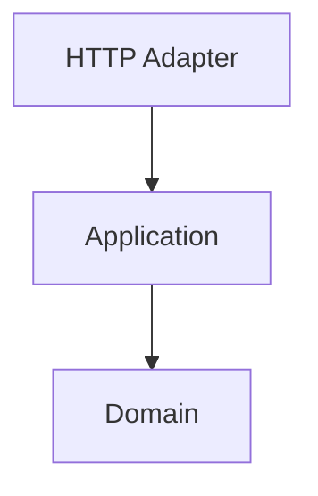

Likewise.

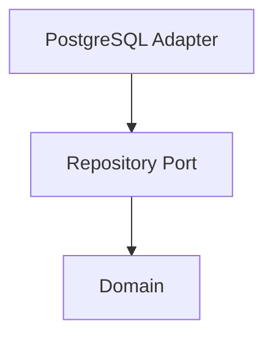

Every dependency points towards the centre.

---

# Forbidden Dependencies

The following dependency graph is prohibited.

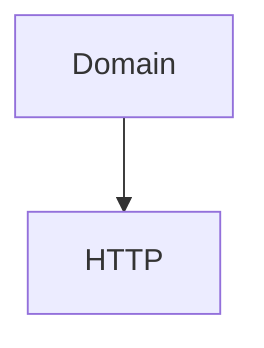

Likewise.

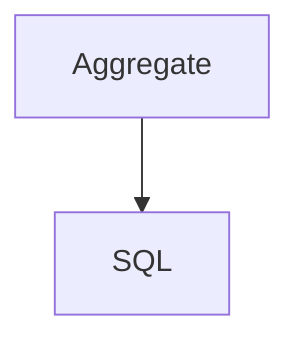

Or.

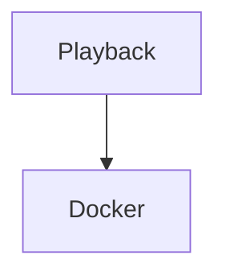

Business concepts must never depend upon implementation technologies.

---

# Runtime Dependency Direction

The Reactive Runtime is infrastructure.

Therefore:

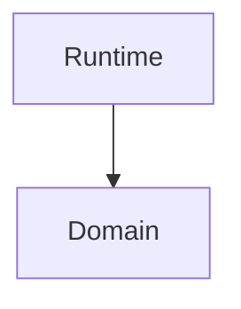

is valid.

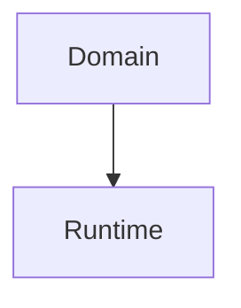

is prohibited.

Domain Events should never:

- publish themselves
- understand workers
- understand retries
- understand scheduling

The Runtime adapts to the Domain.

Not the reverse.

---

# Storage Dependencies

Storage technologies remain infrastructure.

Correct.

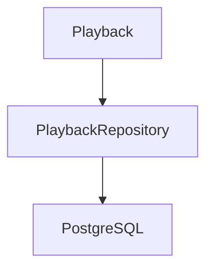

Incorrect.

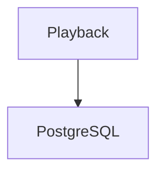

The Domain should never import:

- SQL drivers
- ORMs
- database clients

Storage remains entirely outside the Hexagon.

---

# Module Dependencies

Modules are infrastructure.

They depend upon:

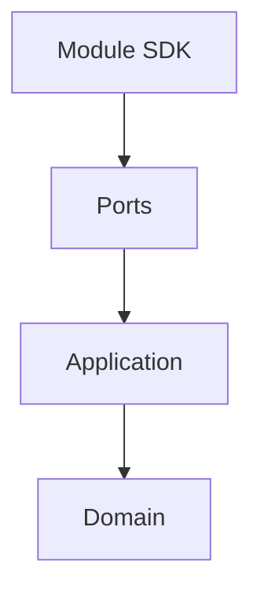

The Domain should never know:

- which modules exist
- how modules load
- where modules execute

This allows capabilities to remain stable regardless of platform composition.

---

# Dependency Inversion

Dependency Inversion frequently causes confusion.

Traditional architecture.

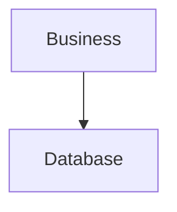

Hexagonal Architecture.

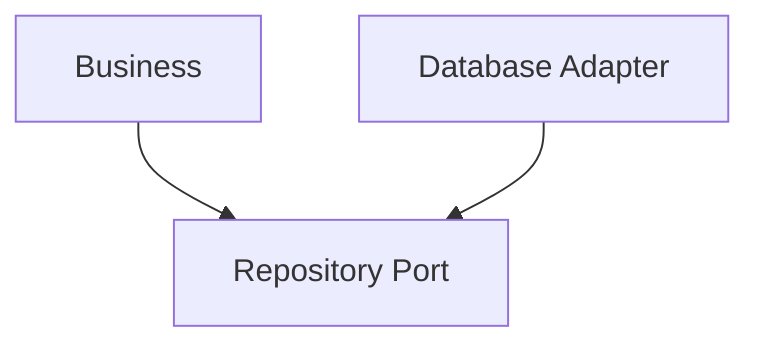

Notice:

Both depend upon the Repository Port.

The Domain owns the abstraction.

Infrastructure implements it.

This inversion allows infrastructure to remain replaceable.  [AWS Documentation](https://docs.aws.amazon.com/prescriptive-guidance/latest/cloud-design-patterns/hexagonal-architecture.html)

---

# Compile-Time Dependencies

Dependency direction is a compile-time concern.

It is determined by:

```

Imports
```

Not:

```

Function Calls
```

A Domain object may indirectly trigger database persistence.

That does not mean it imports the database.

Only imports determine dependency direction.

---

# Runtime Call Flow

Runtime execution frequently flows outward.

Example.

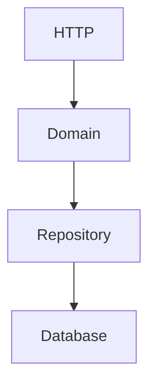

This is acceptable.

Execution direction and dependency direction are different concepts.

Execution flows both ways.

Dependencies always point inward.

This distinction is one of the most commonly misunderstood aspects of Hexagonal Architecture.

---

# Package Dependencies

Package imports should naturally reflect architectural direction.

Preferred.

```

internal/

    domain/

    application/

    adapters/

    infrastructure/
```

Dependencies.

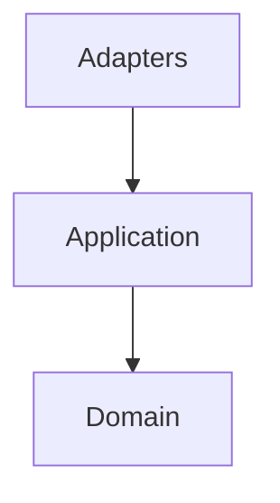

Never:

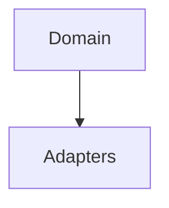

The package graph should visually reinforce the architecture.

---

# Cycles

Circular dependencies are prohibited.

Example.

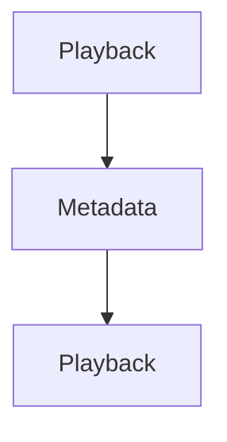

If two packages require one another:

One of three things is probably true.

- ownership is unclear
- a Port is missing
- the model requires refinement

Circular dependencies are architectural feedback.

Not compiler inconvenience.

---

# Composition Root

The Composition Root is the only place where:

- concrete implementations
- adapters
- infrastructure

meet the Domain.

Example.

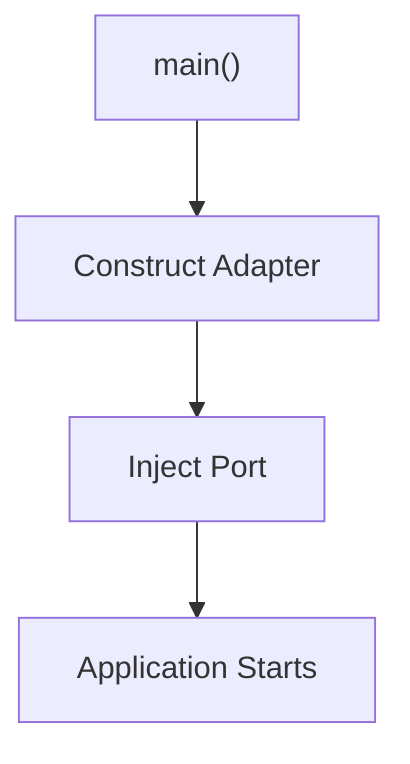

Every other part of the application should remain unaware of concrete implementations.

---

# Testing

Dependency direction naturally enables testing.

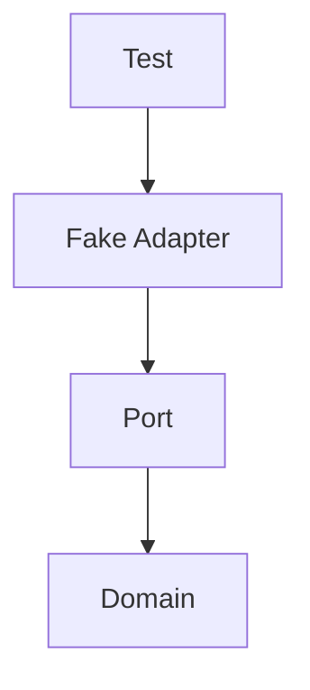

The Domain never knows.

Tests simply provide another Adapter.

This is one of the major practical advantages of the architecture.

---

# Dependency Checklist

Before introducing a dependency ask:

- Does this dependency point inward?
- Does the Domain know about infrastructure?
- Does this import introduce technology into the Domain?
- Does this dependency reinforce or weaken the architecture?
- Could this become a Port instead?

If uncertainty exists:

The dependency probably requires reconsideration.

---

# Anti-Patterns

The following practices are prohibited.

## Domain Imports Infrastructure

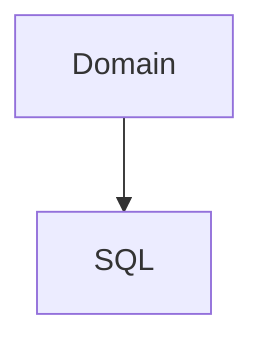

---

## Runtime Imports

```mermaid
flowchart TD

N1["Domain"]
N2["Event Bus"]

N1 --> N2
```

---

## Framework Dependencies

Entities importing:

- gin
- echo
- grpc
- ORM libraries

---

## Shared Infrastructure Models

Passing infrastructure models directly into the Domain.

---

## Circular Dependencies

Any package cycle between architectural layers.

---

## Dependency Convenience

Importing infrastructure "because it is easier."

Convenience should never override architecture.

---

# Mosaic Guidelines

Within Mosaic:

- Dependencies MUST always point towards the Domain.
- The Domain MUST remain infrastructure independent.
- Ports MUST be owned by the Domain or Application.
- Adapters MUST implement Ports.
- Infrastructure MUST remain replaceable.
- Runtime MUST remain outside the Domain.
- Package imports MUST reinforce architectural direction.
- Circular dependencies MUST NOT exist.
- The Composition Root MUST assemble the application.

---

# Relationship to MEG

Previous chapters introduced:

- Ports
- Driving Ports
- Driven Ports
- Adapters

This chapter defines the rule connecting them all.

The next chapter introduces the **Composition Root**, the single location where the entire dependency graph is assembled before the application begins execution.

---

# Summary

Every architectural decision within Hexagonal Architecture ultimately reduces to one rule:

> **Dependencies point inward.**

Everything else:

- Ports
- Adapters
- Dependency Inversion
- Replaceable Infrastructure
- Testability

is simply a consequence of consistently following that principle.

Within Mosaic, preserving dependency direction is one of the primary mechanisms protecting the Domain from the inevitable evolution of technology.
