<!--
File: docs/engineering/guides/meg-004-hexagonal-architecture/09-composition-root.md
Document: MEG-004
Status: Draft
-->

# Composition Root

> *The Composition Root is the only place in the application where concrete implementations know about one another.*

---

# Purpose

Throughout the previous chapters we have established that:

- the Domain owns Ports
- Adapters implement Ports
- dependencies point inward

Eventually, however, the application must actually run.

Concrete implementations must be created.

Dependencies must be connected.

The HTTP server must receive a Service.

Repositories must receive database connections.

The Runtime must receive Event Publishers.

This assembly occurs in one place.

The **Composition Root**.

---

# Philosophy

Within Mosaic:

> **Construction is centralised. Behaviour is distributed.**

The Composition Root is the only location where:

- infrastructure knows about the Domain
- Adapters know about each other
- concrete implementations are selected
- object graphs are assembled

Every other part of the application remains unaware of concrete implementations.

The Composition Root is a single, logical location where an application's object graph is assembled.  [R2 Dev](https://pub-979cff47d4d84105ade2d75c354ef020.r2.dev/Dependency%20Injection%20Principles.pdf)

---

# What Is A Composition Root?

A Composition Root is the application's entry point.

Typical examples include:

```

cmd/server/main.go
```

```

cmd/worker/main.go
```

```

cmd/migrate/main.go
```

Every executable has exactly one Composition Root.

Everything else receives dependencies.

Nothing else constructs them.

---

# Why A Composition Root Exists

Without a Composition Root:

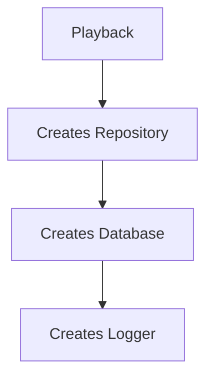

Construction becomes distributed.

Dependencies become hidden.

Testing becomes difficult.

Instead:

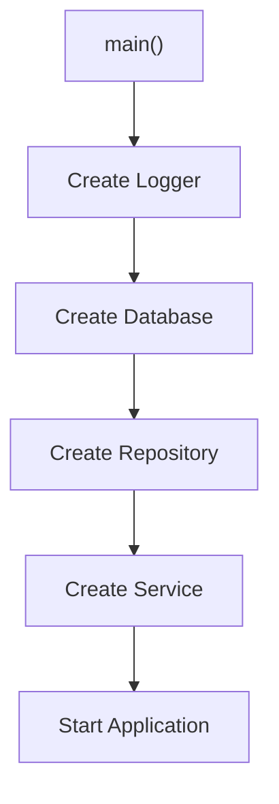

Construction is obvious.

Behaviour remains isolated.

---

# Responsibilities

The Composition Root owns:

- configuration loading
- logger construction
- infrastructure construction
- adapter construction
- dependency wiring
- runtime startup
- graceful shutdown

It intentionally does **not** own:

- business behaviour
- business rules
- orchestration
- validation

Once construction completes, its work is finished.

---

# Dependency Graph

The Composition Root assembles dependencies from the outside in.

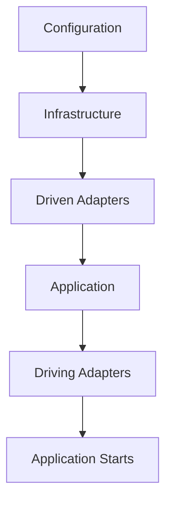

Notice:

Dependencies are created in the opposite order to dependency direction.

Construction begins outside.

Knowledge still points inward.

---

# Manual Dependency Injection

Within Mosaic, dependencies are assembled explicitly.

Example.

```go
db := postgres.New(...)

repo := postgres.NewPlaybackRepository(db)

service := playback.NewService(repo)

handler := http.NewPlaybackHandler(service)
```

Every dependency is visible.

Nothing is hidden.

Go's explicit construction style naturally complements Hexagonal Architecture.

---

# No Dependency Injection Container

Mosaic intentionally avoids dependency injection containers.

Examples include:

- Spring
- Guice
- Dig
- Wire at runtime

The Composition Root should remain ordinary Go code.

Explicit construction is:

- easier to debug
- easier to understand
- easier to test

The Go ecosystem generally favours explicit wiring over runtime dependency injection containers.  [R2 Dev](https://pub-979cff47d4d84105ade2d75c354ef020.r2.dev/Dependency%20Injection%20Principles.pdf)

---

# Infrastructure Assembly

Infrastructure should be constructed first.

Example.

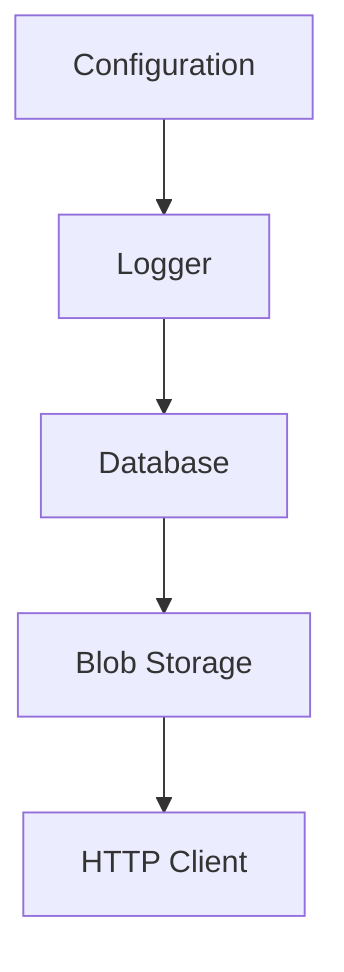

These components become dependencies for Adapters.

They should not be created lazily inside business code.

---

# Adapter Assembly

Adapters are constructed after infrastructure.

Example.

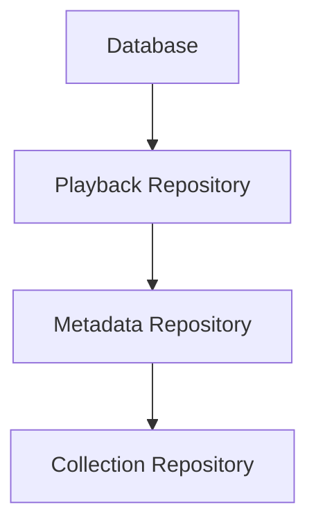

Each Adapter implements a Port.

The Composition Root decides which implementation to use.

---

# Application Assembly

Application Services receive Ports.

Example.

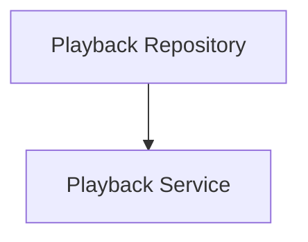

Notice:

The Service knows only about the Port.

It remains unaware of PostgreSQL.

---

# Driving Adapter Assembly

Driving Adapters are constructed last.

Example.

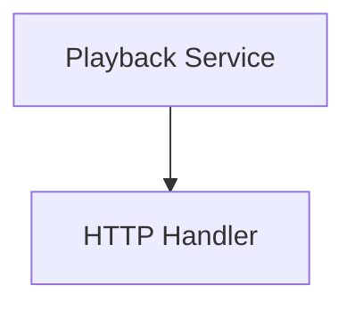

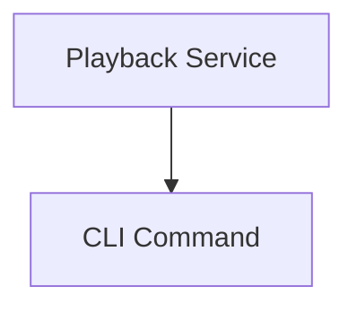

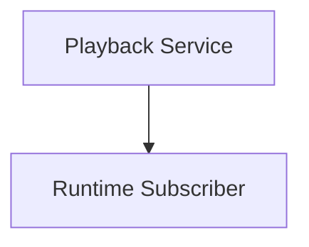

Every entry point receives the same business capability.

---

# Runtime Assembly

The Reactive Runtime is assembled exactly the same way.

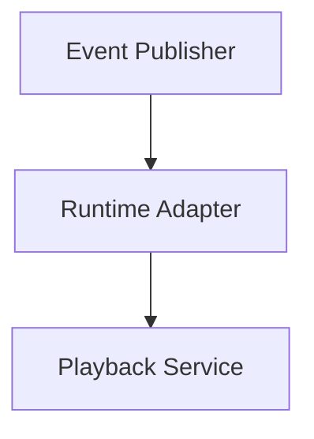

or

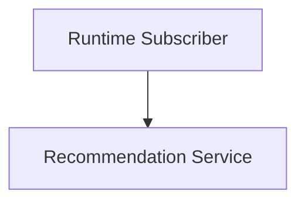

The Runtime remains infrastructure.

It is assembled outside the Domain.

---

# Configuration

Configuration belongs exclusively to the Composition Root.

Poor.

```go
os.Getenv(...)
```

inside the Domain.

Preferred.

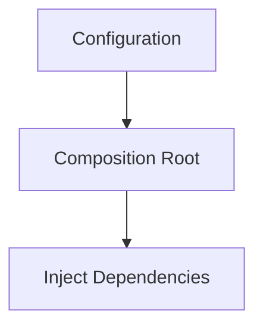

Business behaviour should never read environment variables directly.

---

# Environment Selection

The Composition Root selects implementations.

Example.

Development.

```

Filesystem Artwork Store
```

Production.

```

Blob Artwork Store
```

Testing.

```

InMemory Artwork Store
```

The Domain remains unchanged.

Only the Composition Root changes.

---

# Testing

Tests frequently create their own miniature Composition Roots.

Example.

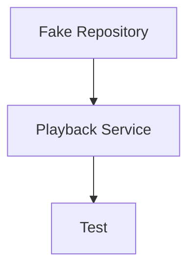

Notice:

The test still assembles the dependency graph.

It simply chooses different Adapters.

This is another consequence of explicit dependency construction.

---

# One Composition Root

Each executable should have one Composition Root.

Poor.

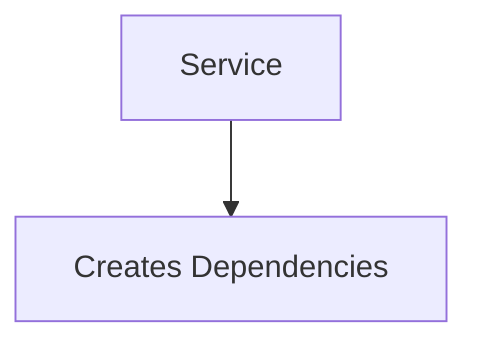

Good.

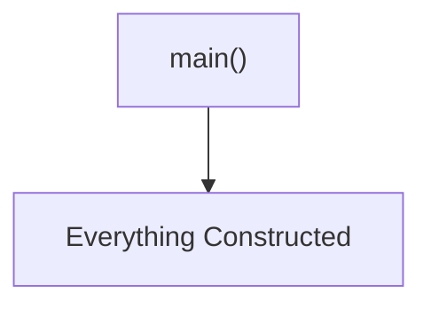

Distributed construction eventually becomes a Service Locator.

That architectural pattern is prohibited throughout Mosaic.

---

# Lifecycle Ownership

The Composition Root owns long-lived resources.

Examples include:

- database pools
- HTTP servers
- runtime
- schedulers
- worker pools

It is therefore responsible for:

- startup
- shutdown
- disposal

Ownership should never become ambiguous.

---

# Composition Should Be Boring

Reading `main.go` should feel predictable.

Typical flow.

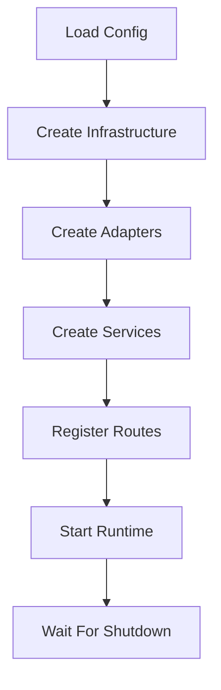

No surprises.

No hidden construction.

No runtime discovery.

---

# Anti-Patterns

The following practices are prohibited.

## Distributed Construction

Creating dependencies throughout the application.

---

## Service Locator

```

container.Resolve(...)
```

inside business code.

---

## Infrastructure In The Domain

Entities constructing repositories.

---

## Runtime Discovery

Reflection-based dependency resolution during normal execution.

---

## Multiple Composition Roots

One executable assembling dependencies in several unrelated locations.

---

## Hidden Singletons

Global mutable dependencies accessible from anywhere.

---

# Mosaic Guidelines

Within Mosaic:

- Every executable MUST have one Composition Root.
- The Composition Root MUST assemble the complete dependency graph.
- Dependencies MUST be injected explicitly.
- Configuration MUST remain outside the Domain.
- Infrastructure MUST be created before Adapters.
- Adapters MUST be created before Application Services.
- Driving Adapters MUST be assembled last.
- Business code MUST NEVER construct infrastructure.
- Dependency injection containers SHOULD NOT be used.

---

# Relationship to MEG

Previous chapters established:

- Ports
- Adapters
- Dependency Direction

The Composition Root is where those concepts finally become a running application.

The next chapter introduces **Application Services**, the layer responsible for coordinating use cases while preserving the integrity of the Domain Model.

---

# Summary

The Composition Root is one of the simplest files in the application.

It should also be one of the most important.

It answers one question:

> **How is this application assembled?**

Within Mosaic, the answer should always be visible, explicit and unsurprising.

Once construction completes, the Composition Root steps aside.

The rest of the application simply performs business behaviour.
