<!--
File: docs/engineering/guides/meg-004-hexagonal-architecture/10-application-services.md
Document: MEG-004
Status: Draft
Version: 0.4
-->

# Application Services

> *Application Services coordinate business behaviour. They never contain it.*

---

# Purpose

The Domain Model defines:

- business rules
- business behaviour
- business invariants

However, external requests frequently require more than invoking a single Aggregate.

Examples include:

- loading an Aggregate
- invoking business behaviour
- persisting changes
- publishing Domain Events

This coordination belongs to the **Application Layer**.

Application Services orchestrate business use cases while ensuring the Domain remains focused exclusively on business decisions.

---

# Philosophy

Within Mosaic:

> **Application Services coordinate. The Domain decides.**

An Application Service should answer one question.

> **How should this business use case be executed?**

It should never answer:

> **What business rule applies?**

Business rules belong to:

- Aggregates
- Entities
- Value Objects
- Domain Services

Never the Application Service.

Application services are widely described as thin orchestration layers that load aggregates, invoke domain behaviour and persist the results without containing domain logic themselves.  [Protean Docs](https://docs.proteanhq.com/concepts/building-blocks/application-services/)

---

# What Is An Application Service?

An Application Service represents a business use case.

Examples include:

```

Import Media
```

```

Resume Playback
```

```

Create Collection
```

```

Generate Recommendations
```

Each Application Service coordinates work required to fulfil one business objective.

---

# Position Within The Hexagon

Application Services sit immediately outside the Domain.

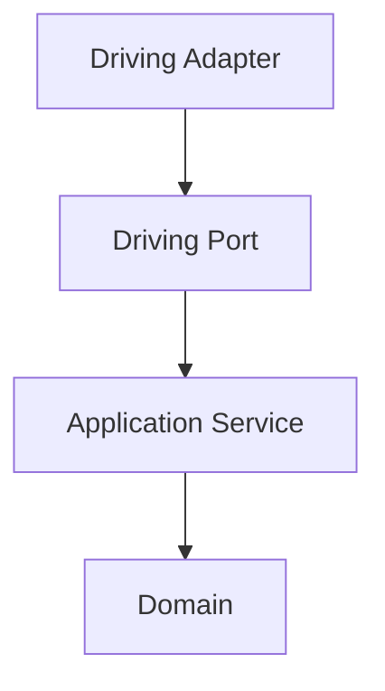

They form the bridge between:

- infrastructure
- business

Without allowing infrastructure to enter the Domain.

---

# Responsibilities

Application Services are responsible for:

- coordinating use cases
- loading Aggregates
- invoking business behaviour
- persisting Aggregates
- returning business results

They are **not** responsible for:

- business rules
- infrastructure
- transport
- runtime orchestration
- persistence implementation

Responsibilities remain intentionally narrow.

---

# Typical Lifecycle

A typical Application Service follows this sequence.

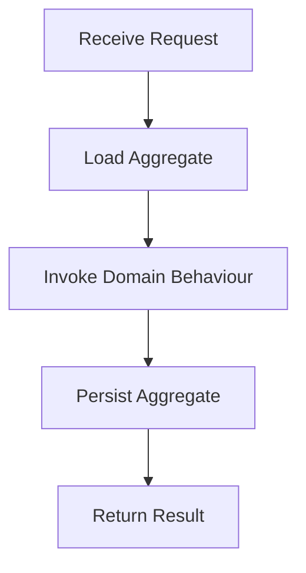

Notice:

The Application Service performs no business decision making.

It simply coordinates.

---

# Example

Conceptually.

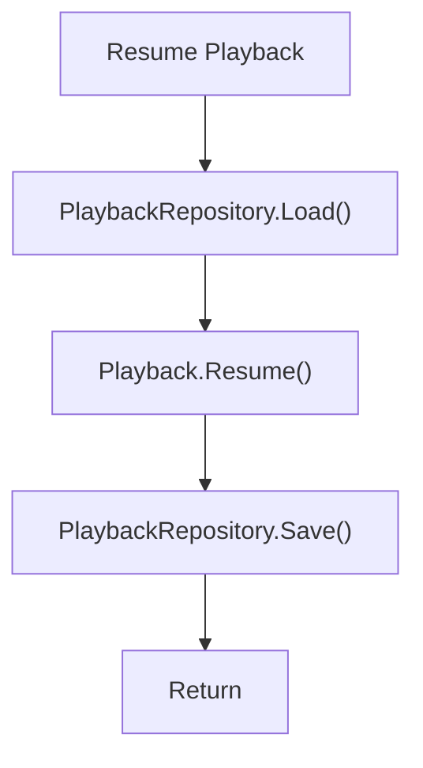

The business decision:

```

Can playback resume?
```

belongs entirely to:

```

Playback Aggregate
```

---

# Business Logic Belongs Elsewhere

Poor.

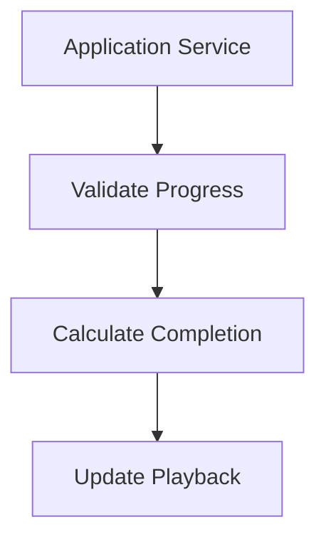

Preferred.

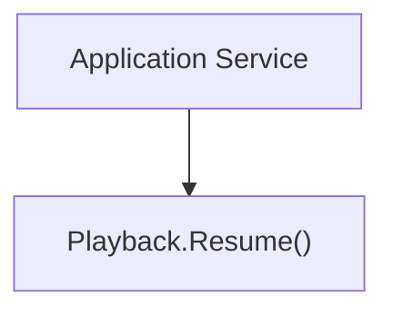

The Aggregate performs:

- validation
- invariants
- state transitions
- Domain Events

The Application Service merely invokes it.

---

# Transactions

Application Services frequently define transaction boundaries.

Conceptually.

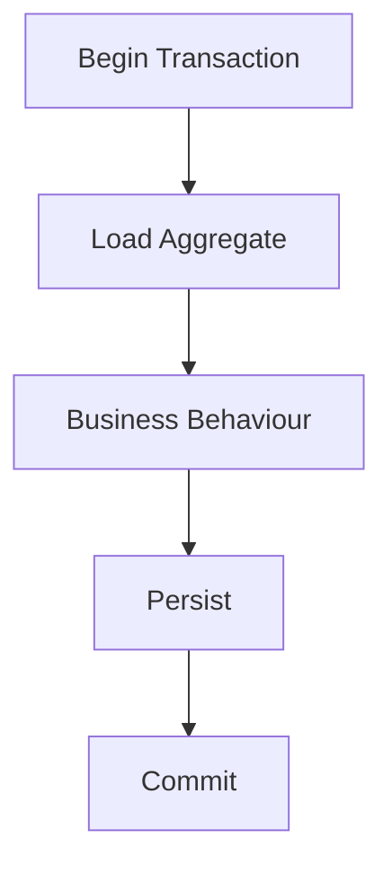

Transaction management belongs here because it coordinates infrastructure.

It does not belong inside the Domain.

---

# Domain Events

Application Services frequently bridge the Domain and the Runtime.

Example.

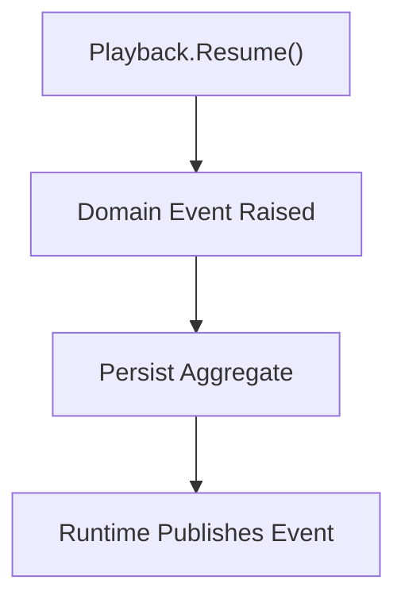

Notice:

The Application Service does **not** create the Domain Event.

The Aggregate already did.

It simply ensures the event leaves the Domain after successful persistence.

---

# Ports

Application Services depend only upon Ports.

Example.

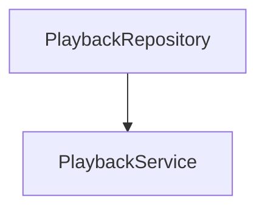

Never.

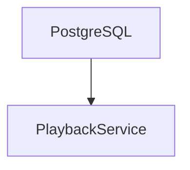

Concrete infrastructure remains invisible.

---

# Stateless

Application Services SHOULD remain stateless.

Poor.

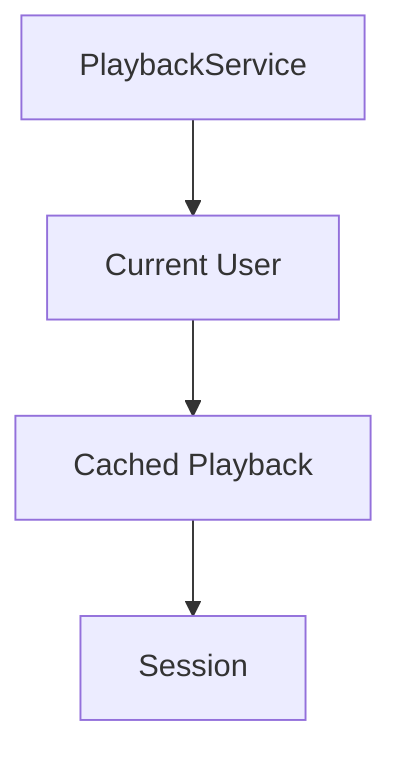

Preferred.

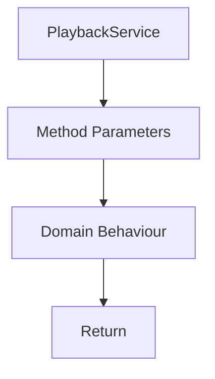

State belongs to the Domain.

Not orchestration.

---

# One Use Case Per Method

Every public method SHOULD represent one business use case.

Good.

```go
ResumePlayback(...)
```

```go
ArchiveMedia(...)
```

Poor.

```go
Process(...)
```

Methods should reinforce the ubiquitous language.

They should describe outcomes.

Not mechanisms.

---

# Request Models

Application Services may receive request objects.

Example.

```go
type ResumePlaybackRequest struct {

    PlaybackID PlaybackID

    Position PlaybackPosition
}
```

These models represent business requests.

They should not mirror:

- HTTP payloads
- JSON documents
- protobuf messages

Driving Adapters perform that translation.

---

# Return Values

Application Services should return:

- Aggregates
- Value Objects
- business result objects

They should not return:

- HTTP responses
- JSON
- SQL rows
- infrastructure models

The caller decides how to present the result.

---

# Runtime Independence

Application Services remain unaware of:

- workers
- retries
- scheduling
- event delivery
- subscribers

These concerns belong to the Reactive Runtime.

The Application Service coordinates business behaviour.

Nothing more.

---

# Testing

Application Services should be straightforward to test.

Typical tests verify:

- correct Aggregate loaded
- correct business behaviour invoked
- correct persistence performed

Business rules themselves should be tested at the Domain level.

Application Services verify orchestration.

Not business correctness.

---

# Evolution

Application Services should evolve slowly.

When a method becomes increasingly complicated ask:

> Has business logic leaked into the Application Service?

If yes:

Move it:

- into the Aggregate
- into a Domain Service
- into a Value Object

Application Services should become thinner over time.

Not thicker.

---

# Examples Within Mosaic

Examples include:

```

ImportMediaService
```

```

PlaybackService
```

```

CollectionService
```

```

RecommendationService
```

Each represents:

One business capability.

Each coordinates.

None make business decisions.

---

# Anti-Patterns

The following practices are prohibited.

## Business Logic

Calculating business rules inside the Application Service.

---

## Infrastructure Dependencies

Importing:

- SQL
- HTTP
- Docker

directly.

---

## Fat Services

Application Services containing hundreds of lines of business behaviour.

---

## Shared Mutable State

Application Services storing request-specific information.

---

## Aggregate Bypass

Updating persistence directly without invoking the Aggregate.

---

## Runtime Logic

Managing retries.

Managing workers.

Publishing runtime events directly.

These belong elsewhere.

---

# Mosaic Guidelines

Within Mosaic:

- Application Services MUST coordinate business use cases.
- Application Services MUST remain stateless.
- Business rules MUST remain inside the Domain.
- Application Services MUST depend only upon Ports.
- Application Services SHOULD represent one use case per method.
- Request and response models SHOULD remain business focused.
- Domain Events SHOULD originate inside Aggregates.
- Application Services SHOULD remain thin.

---

# Relationship to MEG

The previous chapters established:

- Ports
- Adapters
- Dependency Direction
- Composition Root

Application Services now complete the centre of the Hexagon.

The next chapter explains how the **Reactive Runtime** integrates with Hexagonal Architecture while preserving the Domain's independence.

This is where [MEG-002](../meg-002-event-driven-runtime/index.md) and MEG-004 finally converge.

---

# Summary

Application Services are frequently misunderstood as another place to write business logic.

Within Mosaic they exist for a much narrower purpose.

They:

- coordinate
- load
- invoke
- persist

The Domain:

- decides
- validates
- protects
- evolves

Keeping these responsibilities separate allows the Domain Model to remain expressive while the Application Layer remains remarkably simple.
