<!--
File: docs/engineering/guides/meg-004-hexagonal-architecture/12-testing-the-hexagon.md
Document: MEG-004
Status: Draft
-->

# Testing the Hexagon

> *The greatest proof that a Hexagonal Architecture is correct is that the business can be tested without any infrastructure.*

---

# Purpose

One of the primary motivations behind Hexagonal Architecture is testability.

A correctly implemented Hexagon allows the Domain and Application layers to be exercised without requiring:

- PostgreSQL
- DuckDB
- HTTP
- Blob Storage
- Docker
- Event Bus
- External APIs

Testing should become a natural consequence of the architecture.

Not an afterthought.

This document defines how each architectural layer within Mosaic should be tested.

---

# Philosophy

Within Mosaic:

> **Test business behaviour independently of technology.**

Every architectural boundary exists for two reasons:

- replaceability
- testability

If the Domain requires infrastructure to execute, the boundary has failed.

---

# Testing Strategy

Every layer should be tested independently.

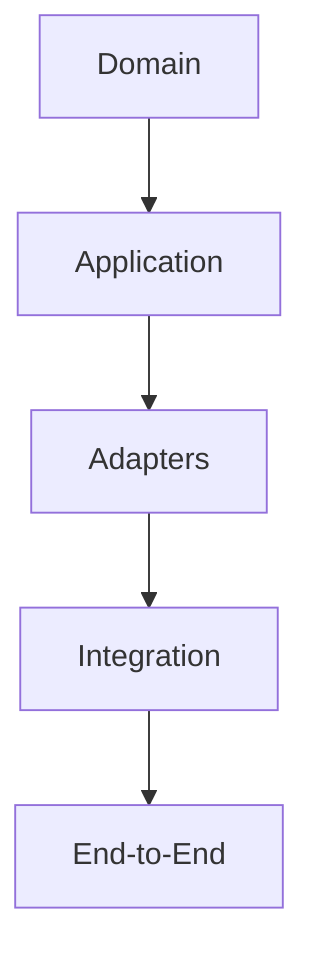

Each layer answers different questions.

No layer replaces another.

---

# The Testing Pyramid

Hexagonal Architecture naturally supports the following pyramid.

```
          End-to-End

        Integration Tests

     Adapter Contract Tests

   Application Service Tests

       Domain Tests
```

The majority of tests should exist at the Domain level.

Business logic should receive the highest testing investment.

This isolation is one of the primary benefits of the Ports and Adapters pattern.  [AWS Documentation](https://docs.aws.amazon.com/prescriptive-guidance/latest/cloud-design-patterns/hexagonal-architecture.html)

---

# Domain Tests

Domain tests verify:

- business rules
- Aggregate behaviour
- Value Objects
- Domain Services
- Domain Events
- invariants

Domain tests MUST NOT require:

- databases
- HTTP
- event buses
- runtime
- filesystem

Example.

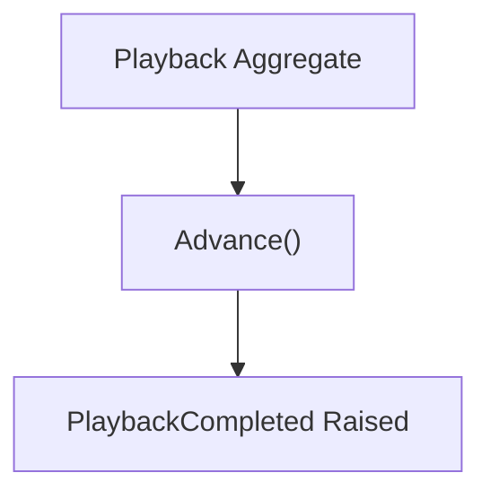

The business should execute entirely in memory.

---

# Application Service Tests

Application Services coordinate use cases.

Tests should verify:

- Aggregate loaded
- Domain behaviour invoked
- Aggregate persisted
- Domain Events collected

They should use:

- fake repositories
- fake clocks
- fake identity generators

Infrastructure remains unnecessary.

---

# Adapter Tests

Adapters should be tested independently.

Typical Adapter tests verify:

- request mapping
- response mapping
- SQL generation
- JSON serialization
- API integration
- error translation

Business rules should not appear inside Adapter tests.

The Adapter's responsibility is translation.

Nothing more.

---

# Contract Tests

Every Adapter implements a Port.

Contract tests verify:

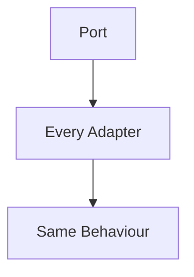

Example.

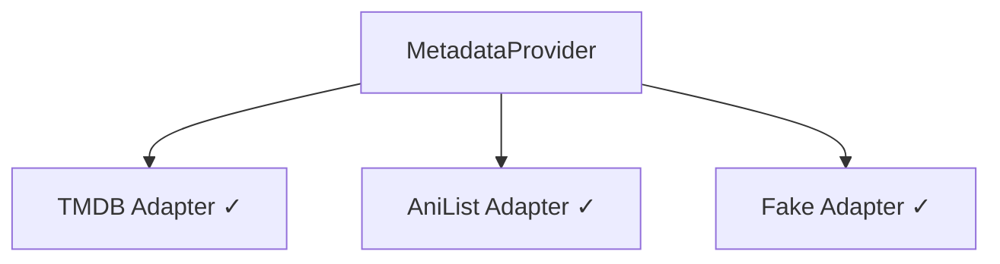

Each implementation should satisfy the same behavioural contract.

This ensures infrastructure remains safely replaceable.

---

# Infrastructure Tests

Infrastructure should be tested using real infrastructure.

Examples include:

- PostgreSQL
- DuckDB
- Blob Storage
- Redis
- HTTP APIs

These tests verify:

- configuration
- connectivity
- persistence
- protocol correctness

They do not verify business behaviour.

---

# Runtime Tests

The Reactive Runtime should be tested separately.

Examples include:

- worker execution
- retries
- scheduling
- backpressure
- graceful shutdown
- event delivery

Runtime tests should not re-test business rules.

Business correctness belongs to Domain tests.

---

# End-to-End Tests

End-to-end tests verify complete workflows.

Example.

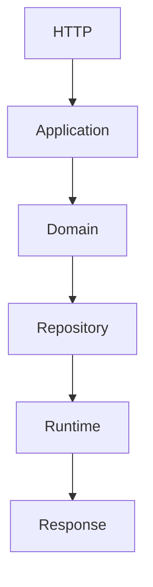

These tests provide confidence that architectural boundaries collaborate correctly.

They should remain focused upon important user journeys.

---

# Fake Adapters

The preferred testing strategy is replacing infrastructure with fake Adapters.

Example.

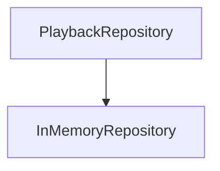

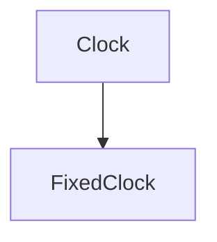

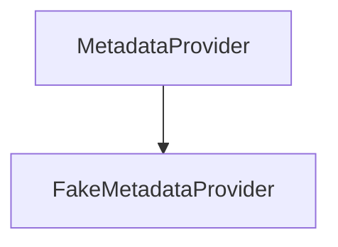

The Domain remains unaware.

Business behaviour remains unchanged.

---

# Test Composition Root

Tests frequently construct a miniature Composition Root.

Example.

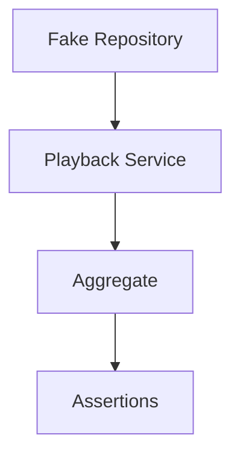

This mirrors production assembly.

Only the Adapter implementations differ.

---

# Domain Isolation

A useful architectural test is:

> **Can the Domain execute with every infrastructure dependency replaced by a fake?**

If the answer is no:

Technology has leaked into the Domain.

The architecture should be reconsidered.

---

# Adapter Isolation

Likewise:

Adapters should be testable independently of business behaviour.

Example.

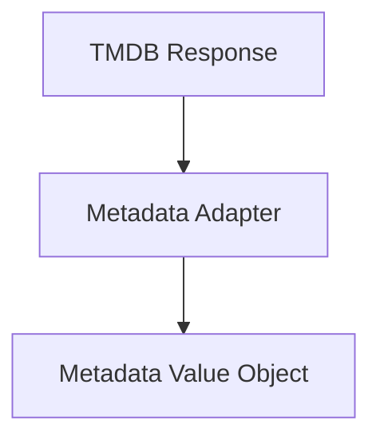

No Aggregate behaviour should be required.

---

# Error Testing

Errors should be tested at the correct layer.

Domain.

```

Invalid Business Rule
```

Adapter.

```

HTTP Timeout
```

Runtime.

```

Retry Exhausted
```

Every layer owns its own failure semantics.

---

# Mutation Safety

Domain tests should verify that invariants cannot be violated.

Example.

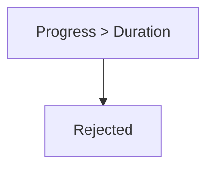

Testing invalid business state is often more valuable than testing successful behaviour.

---

# Event Testing

Domain tests verify:

```

PlaybackCompleted Raised
```

Runtime tests verify:

```

PlaybackCompleted Delivered
```

These are different concerns.

They should remain independently testable.

---

# Mocking

Within Mosaic:

Prefer:

- fake repositories
- in-memory implementations
- deterministic adapters

Avoid excessive mocking frameworks.

Hexagonal Architecture naturally reduces the need for complex mocks because Ports already provide clean substitution points.  [AWS Documentation](https://docs.aws.amazon.com/prescriptive-guidance/latest/cloud-design-patterns/hexagonal-architecture.html)

---

# Test Data

Business test data should use business terminology.

Good.

```

Library

Playback

Collection
```

Poor.

```

Row1

ObjectA

DTO2
```

The ubiquitous language should remain consistent inside tests.

Tests are executable documentation.

---

# Architecture Verification

A useful question is:

> **Can I delete every Adapter and still execute the Domain?**

If yes:

The Hexagon has been preserved.

If no:

Infrastructure has become coupled to business behaviour.

---

# Anti-Patterns

The following practices are prohibited.

## Domain Tests Using Databases

---

## HTTP Required For Business Tests

---

## Runtime Required For Aggregate Tests

---

## SQL Assertions Inside Domain Tests

---

## Infrastructure Models Inside Domain Tests

---

## Business Logic Inside Adapter Tests

---

# Mosaic Guidelines

Within Mosaic:

- Domain tests MUST remain infrastructure independent.
- Application Services SHOULD use fake Ports.
- Adapters SHOULD be tested independently.
- Contract tests SHOULD verify Port implementations.
- Runtime SHOULD be tested separately from business logic.
- End-to-end tests SHOULD validate complete workflows.
- Fake Adapters SHOULD be preferred over complex mocks.
- Every architectural layer SHOULD own its own tests.

---

# Relationship to MEG

Hexagonal Architecture exists partly to make testing a natural property of the design.

The previous chapters explained:

- dependency direction
- Ports
- Adapters
- Composition

This chapter demonstrates the practical result.

Good architecture naturally produces good tests.

The next chapter provides practical modelling guidance for engineers implementing Hexagonal Architecture throughout the Mosaic platform.

---

# Summary

Testing is one of the strongest indicators of architectural quality.

Within Mosaic:

- the Domain should run without infrastructure
- Application Services should coordinate without technology
- Adapters should be independently replaceable
- the Runtime should be independently verifiable

When every layer can be tested in isolation, the architecture has successfully separated business from technology.

That is the real promise of Hexagonal Architecture.
