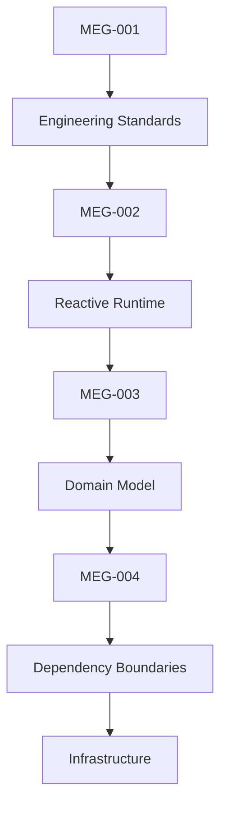
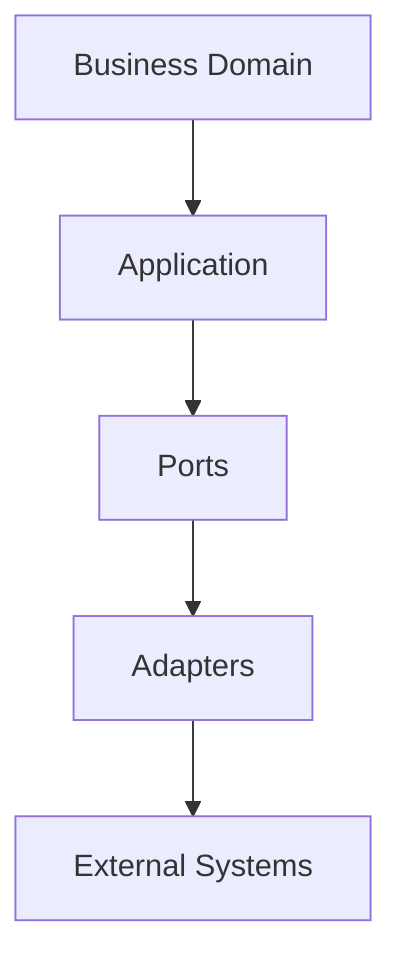

<!--
File: docs/engineering/guides/meg-004-hexagonal-architecture/index.md
Document: MEG-004
Status: Draft
-->

# MEG-004 — Hexagonal Architecture

> *The Domain should know nothing about the outside world. The outside world should adapt itself to the Domain.*

---

# Purpose

Mosaic is designed to evolve for many years.

During that time:

- databases will change
- APIs will change
- protocols will change
- storage engines will change
- modules will change
- user interfaces will change

The business, however, should remain stable.

Hexagonal Architecture provides the structural rules that allow the Domain Model to remain independent of every external technology.

Unlike traditional layered architectures, Hexagonal Architecture does not organise software around technical layers.

Instead, it organises software around **dependencies**.

Everything outside the Domain adapts to it.

The Domain adapts to nothing.

---

# Relationship to MEG



[MEG-001](../meg-001-go-engineering-standards/index.md) defines **how software is written.**

[MEG-002](../meg-002-event-driven-runtime/index.md) defines **how software executes.**

[MEG-003](../meg-003-domain-driven-design/index.md) defines **what the business is.**

MEG-004 defines **how the business is protected from technology.**

---

# Scope

This specification defines:

- Hexagonal philosophy
- Ports
- Adapters
- Driving adapters
- Driven adapters
- Dependency inversion
- Composition root
- Dependency direction
- Application services
- Infrastructure boundaries
- External systems
- Runtime integration
- Testing boundaries

This specification intentionally does **not** define:

- Business models
- Domain behaviour
- Runtime semantics
- Storage implementation
- Deployment architecture

Those concerns are defined by other MEG specifications.

---

# Guiding Question

MEG-004 exists to answer one question.

> **How should the Mosaic Domain Model remain completely independent of infrastructure while still interacting with the outside world?**

---

# Architectural Statement

Within Mosaic:

> **The Domain owns the contracts. Infrastructure provides the implementations.**

Everything external to the Domain is replaceable.

The Domain is not.

The Domain should never depend upon:

- PostgreSQL
- DuckDB
- HTTP
- REST
- GraphQL
- WebSockets
- Docker
- Jellyfin
- TMDB
- Stremio
- Trakt
- Message Brokers

Instead, those technologies adapt themselves to the Domain through Ports and Adapters.

Hexagonal Architecture (also known as Ports and Adapters) exists specifically to isolate business logic from external technologies through dependency inversion.  [AWS Documentation](https://docs.aws.amazon.com/prescriptive-guidance/latest/cloud-design-patterns/hexagonal-architecture.html)

---

# Architectural Hierarchy

The Mosaic Architecture intentionally separates concerns into distinct conceptual layers.



Notice:

Dependencies flow **upwards**.

Knowledge flows **inwards**.

Infrastructure never leaks into the Domain.

---

# Expected Outcome

After reading MEG-004 contributors should understand:

- why Hexagonal Architecture exists
- what Ports represent
- what Adapters implement
- how dependencies flow
- how infrastructure integrates with the Domain
- how runtime and domain remain independent
- how new technologies are introduced without modifying business logic

without discussing any specific database, transport protocol or framework.

---

# Repository Structure

```

engineering/

└── meg/

    └── MEG-004 Hexagonal Architecture/

        README.md

        00-document-control.md

        01-hexagonal-philosophy.md

        02-ports.md

        03-driving-ports.md

        04-driven-ports.md

        05-adapters.md

        06-driving-adapters.md

        07-driven-adapters.md

        08-dependency-direction.md

        09-composition-root.md

        10-application-services.md

        11-runtime-boundary.md

        12-testing-the-hexagon.md

        13-modelling-guidelines.md

        14-adrs.md

        15-contributor-guidance.md

        references.md

        glossary.md
```

---

# Dependencies

Required reading:

- [MEG-001 — Go Engineering Standards](../meg-001-go-engineering-standards/index.md)
- [MEG-002 — Event-Driven Runtime](../meg-002-event-driven-runtime/index.md)
- [MEG-003 — Domain-Driven Design](../meg-003-domain-driven-design/index.md)

Future companion specifications:

- [MEG-006 — Module Platform](../meg-006-module-platform/index.md)
- [MEG-005 — Runtime Architecture](../meg-005-runtime-architecture/index.md)
- [MEG-007 — Storage Architecture](../meg-007-storage-architecture/index.md)

---

# Design Goals

The Hexagonal Architecture is intended to produce software that is:

- Technology independent
- Testable
- Evolvable
- Replaceable
- Decoupled
- Domain centric
- Explicit
- Maintainable

The architecture should ensure that changing infrastructure never requires changing the Domain Model.
