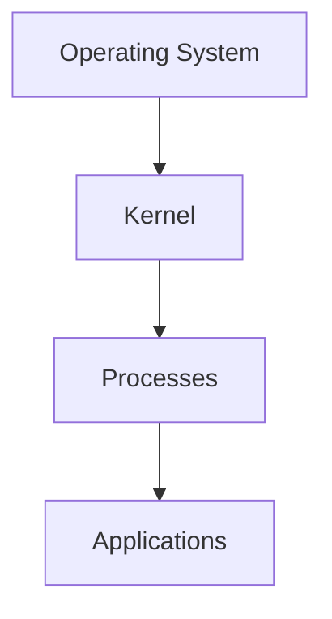
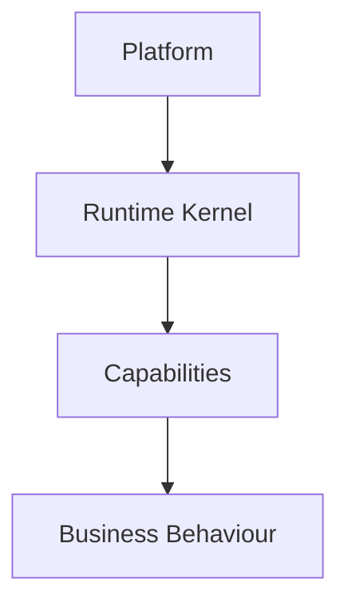
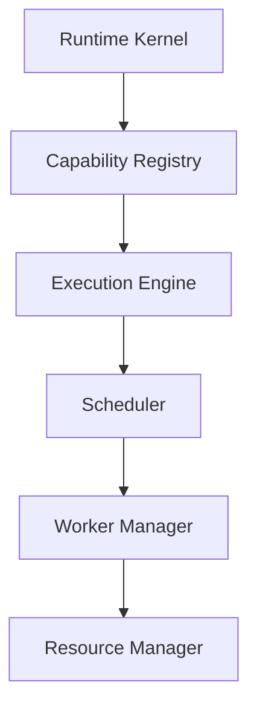
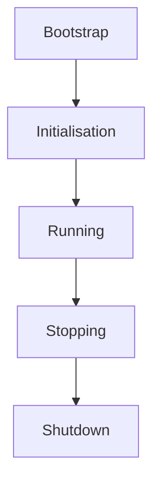
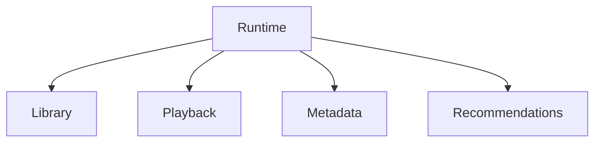
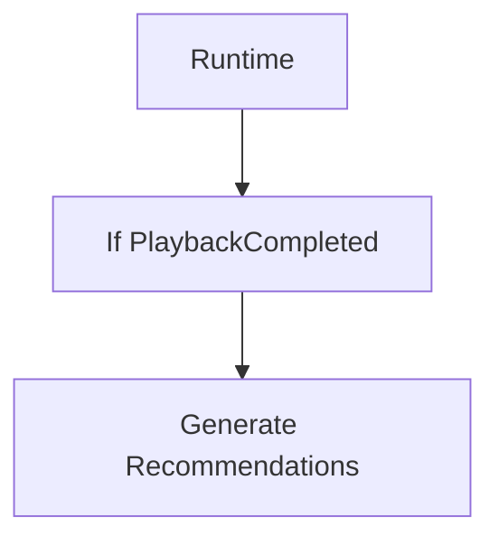
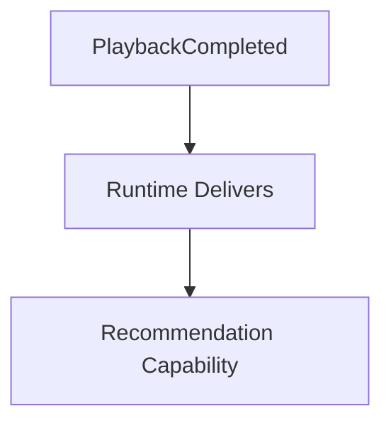

<!--
File: docs/engineering/guides/meg-005-runtime-architecture/01-runtime-philosophy.md
Document: MEG-005
Status: Draft
-->

# Runtime Philosophy

> *The Runtime exists to provide an execution environment for capabilities. It should feel less like an application and more like an operating system.*

---

# Purpose

The Mosaic Runtime is frequently described as an event-driven runtime. That description is true but incomplete, because the Runtime is responsible for significantly more than event delivery. It provides:

- execution
- lifecycle
- scheduling
- dependency composition
- capability discovery
- resource ownership
- observability
- fault isolation

Understanding the Runtime therefore requires a different mental model. The Runtime should be viewed as the operating system of the Mosaic platform, with capabilities as the applications running upon it.

---

# Philosophy

Within Mosaic:

> **The Runtime owns execution. Capabilities own behaviour.**

This separation is fundamental, and it cuts in both directions. The Runtime should never understand playback, metadata, collections, recommendations or libraries, whereas capabilities should never understand workers, queues, schedulers, retries or dependency graphs. Each layer owns one concern.

---

# The Runtime Is Not The Platform

The Runtime enables the platform without being the platform itself. Users install Mosaic because of Playback, Library, Metadata and Modules, not because a Worker Manager, a Scheduler or an Event Bus exists. Those components are means rather than ends, and the Runtime exists to make capabilities possible — nothing more.

---

# The Runtime As An Operating System

The closest architectural analogy is a modern operating system. An operating system layers a kernel beneath its processes, and processes beneath the applications a user actually cares about.

Mosaic layers itself the same way, placing the Runtime Kernel beneath capabilities and capabilities beneath business behaviour.

Applications on a conventional operating system do not concern themselves with process scheduling, resource allocation, startup or shutdown, and Mosaic capabilities should likewise ignore worker allocation, retries, dependency resolution and scheduling. The Runtime owns those responsibilities on their behalf. Modern operating systems separate resource management from application logic, allowing applications to focus on their own behaviour while the kernel manages execution, scheduling and resources.  [Operating Systems](https://operatingsystemsauthority.com/operating-system-kernel)

---

# Runtime Responsibilities

The Runtime owns platform-wide concerns. These include:

- capability discovery
- dependency composition
- worker allocation
- scheduler execution
- lifecycle management
- health monitoring
- observability
- graceful shutdown

It intentionally does **not** own media management, metadata, playback, collections or recommendations, because business belongs elsewhere.

---

# Capabilities

Capabilities are analogous to applications: each one owns business behaviour, owns business state and owns domain events. The Runtime, for its part, provides execution, coordination and services. The relationship runs in one direction only — capabilities consume Runtime services, but the Runtime never consumes business behaviour.

---

# Runtime Kernel

At the centre of the Runtime sits the Runtime Kernel.

Every other Runtime component builds upon this foundation, and future chapters define each component individually.

---

# Runtime Services

The Runtime exposes platform services, among them the Scheduler, the Worker Manager, the Resource Manager and the Capability Registry. These services exist solely to support capability execution, so they should remain generic, reusable and business agnostic.

---

# Runtime Is Domain Agnostic

The Runtime should never understand business terminology, and the naming of runtime components is where that rule is most easily broken. A Playback Queue is poor because it names a business concern; a Task Queue is preferred. A Metadata Worker is poor for the same reason, whereas a plain Worker is preferred. Capabilities provide meaning and the Runtime provides execution, so this distinction should remain visible throughout the architecture.

---

# Runtime State

The Runtime owns operational state. Examples include:

- active workers
- queue depth
- scheduler state
- loaded capabilities
- resource usage

It does **not** own playback progress, metadata, collections or user preferences, because operational state belongs to the Runtime whereas business state belongs to capabilities.

---

# Runtime Lifecycle

The Runtime itself follows a lifecycle.

Capabilities participate in this lifecycle but they do not control it, because lifecycle ownership belongs to the Runtime.

---

# Runtime Contracts

Capabilities interact with the Runtime through well-defined contracts such as lifecycle notifications, scheduling requests, runtime services and capability registration. Capabilities should never communicate with Runtime internals directly, because it is the contracts rather than the internals that preserve long-term stability.

---

# Runtime Independence

The Runtime should evolve independently from capabilities. Suppose the Scheduler is rewritten: capabilities should remain unchanged. Likewise, if the Worker Manager is optimised, business behaviour should remain identical. This separation allows operational improvements without affecting domain correctness.

---

# Runtime Simplicity

Despite its responsibilities, the Runtime should remain conceptually simple. It should answer only questions such as:

- What should execute?
- When should it execute?
- Which resources are available?
- Which capabilities are loaded?

It should never answer whether playback should resume, whether metadata should refresh or whether recommendations should update, because those are business questions.

---

# Fault Isolation

Failures should remain isolated. When a Recommendation Capability suffers a failure, the Runtime should ensure that Playback continues, Metadata continues and Library continues. The Runtime protects the platform from individual capability failures, so capabilities should never destabilise one another.

---

# Progressive Growth

The Runtime should support growth without architectural change. Initially the Runtime hosts nothing but Library, and later it fans out across several capabilities at once.

Later still the same shape carries hundreds of capabilities without changing, because the Runtime should scale through composition rather than through increasing complexity.

---

# Runtime Does Not Become The Business

Perhaps the greatest long-term risk is allowing business behaviour to migrate into the Runtime. The poor arrangement puts the decision inside the Runtime itself, so that the Runtime inspects an event and chooses what should happen next.

The preferred arrangement leaves the decision with the capability and reduces the Runtime to delivery.

The Runtime coordinates and capabilities decide, and this boundary should never blur.

---

# Mosaic Principles

Within Mosaic:

- The Runtime owns execution.
- Capabilities own behaviour.
- The Runtime remains business agnostic.
- Operational state remains separate from business state.
- Capabilities consume Runtime services.
- The Runtime protects capability isolation.
- The Runtime evolves independently of business capabilities.
- Complexity should emerge through composition rather than centralisation.

These principles define the architectural identity of the Mosaic Runtime.

---

# Relationship to MEG

[MEG-002](../meg-002-event-driven-runtime/index.md) defined:

> **How the Runtime behaves.**

MEG-005 now begins defining:

> **What the Runtime actually is.**

The remaining chapters describe each Runtime subsystem individually, beginning with the **Runtime Kernel**, the component responsible for coordinating every other Runtime service.

---

# Summary

The Mosaic Runtime should not be viewed as another backend service but as a lightweight operating system, and its purpose is remarkably simple: to provide a stable, observable and resilient execution environment in which independently developed capabilities can execute safely.

The Runtime exists to make business possible. It should never become the business itself.
