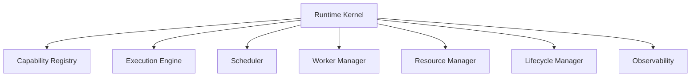
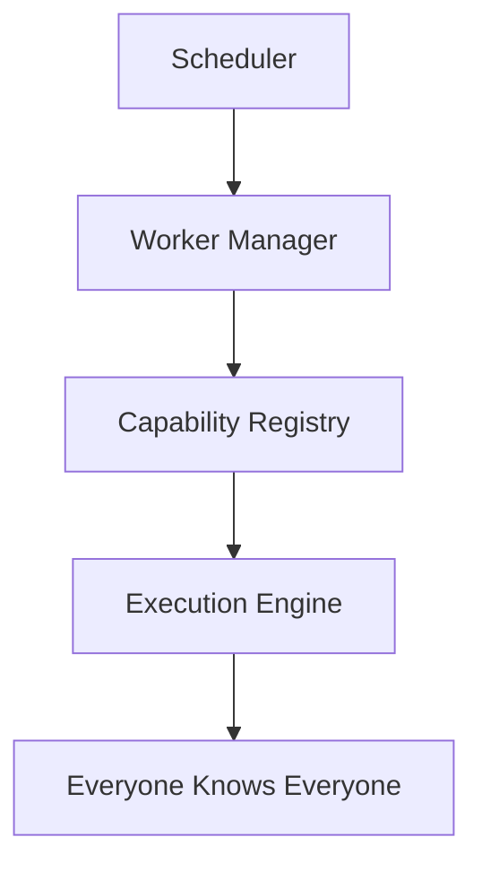
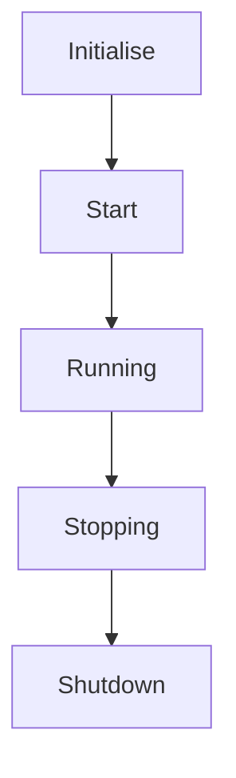
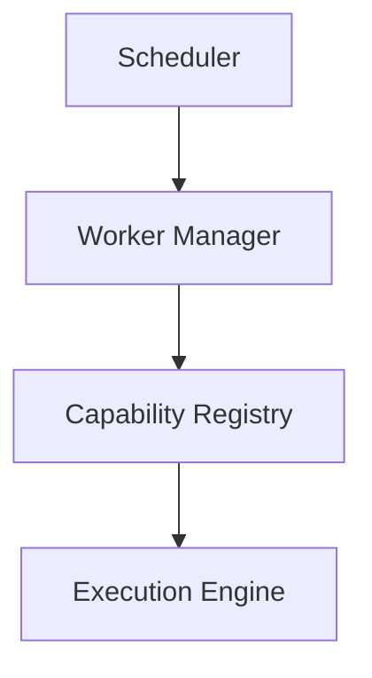
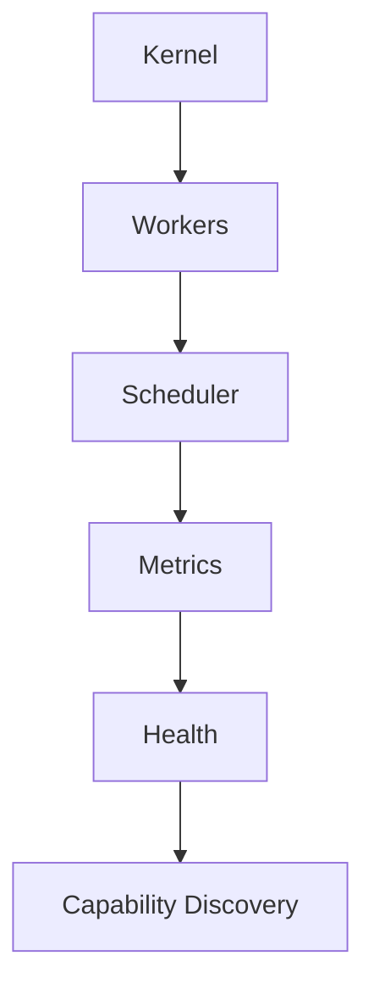
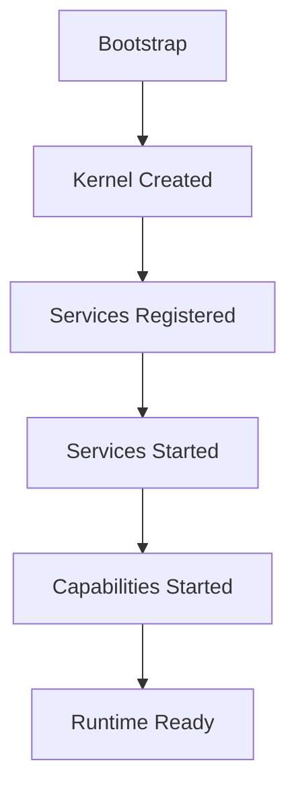
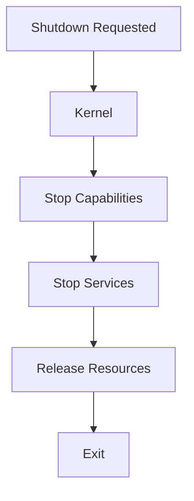

<!--
File: docs/engineering/guides/meg-005-runtime-architecture/02-runtime-kernel.md
Document: MEG-005
Status: Draft
-->

# Runtime Kernel

> *The Runtime Kernel owns the platform itself. Every other runtime component exists because the Kernel allows it to.*

---

# Purpose

The Runtime consists of many independent subsystems, and something must own the coordination between them. Within Mosaic that responsibility belongs to the **Runtime Kernel**. The subsystems it coordinates include:

- Capability Registry
- Execution Engine
- Worker Manager
- Scheduler
- Resource Manager
- Lifecycle Manager

The Kernel is the architectural centre of the Runtime, owning lifecycle, coordination, service registration, the dependency graph and runtime state, and it intentionally owns no business behaviour.

---

# Philosophy

Within Mosaic:

> **The Runtime Kernel coordinates runtime services. It never becomes one.**

The Runtime Kernel should remain extremely small, providing only the minimum capabilities required for the Runtime to function so that everything else becomes a Runtime Service. This mirrors microkernel operating system design, where the kernel retains only essential responsibilities while higher-level services are implemented separately.  [Operating Systems](https://operatingsystemsauthority.com/operating-system-kernel)

---

# What Is The Runtime Kernel?

The Runtime Kernel is the root object of the Mosaic Runtime. Conceptually it sits above every other runtime component and owns each of them, whereas those components do not own one another.

---

# Why A Kernel Exists

Without a Runtime Kernel, every subsystem ends up knowing every other subsystem.

Eventually dependencies become circular, lifecycle becomes inconsistent and ownership becomes unclear. Where the Kernel coordinates the Runtime Services instead, dependencies remain explicit and responsibilities remain isolated.

---

# Kernel Responsibilities

The Kernel's own responsibilities are deliberately few. All of them concern the Runtime rather than the business. The Runtime Kernel owns:

- runtime bootstrap
- service registration
- lifecycle coordination
- dependency graph construction
- runtime state
- service discovery
- shutdown coordination

Just as deliberately, the Runtime Kernel does **not** own the following, because each belongs to a dedicated Runtime Service:

- scheduling
- worker execution
- event delivery
- business behaviour
- persistence

---

# Runtime Composition

Every Runtime Service is composed through the Kernel during bootstrap, and the capabilities those services support are composed in turn. The Kernel is therefore the root of the Runtime object graph.

---

# Runtime Registry

The Kernel maintains a registry of Runtime Services, registering the Scheduler, the Worker Manager, the Resource Manager and every other service that participates in the Runtime. That registry exists solely for Runtime coordination and is **not** a Service Locator, so Runtime Services should still receive explicit dependencies through construction.

---

# Lifecycle Ownership

The Runtime Kernel owns lifecycle transitions. Every Runtime Service participates in the sequence below and none should transition independently, because lifecycle ownership remains centralised.

---

# Runtime State

The Kernel owns operational state, which describes the Runtime and nothing else. Business state remains entirely outside the Runtime. The Kernel therefore tracks only:

- runtime status
- registered services
- loaded capabilities
- startup progress
- shutdown progress

---

# Runtime Contracts

Runtime Services interact with the Kernel through contracts such as `LifecycleService`, `CapabilityRegistry` and `ExecutionEngine`. Services should never depend upon Kernel implementation details, only upon Kernel contracts.

---

# Kernel Simplicity

The Runtime Kernel should remain intentionally small, and a useful question when weighing a new responsibility is:

> **Could this responsibility become its own Runtime Service?**

If the answer is yes, then it probably should, because the Kernel exists to coordinate rather than to accumulate functionality.

---

# Runtime Services

The Runtime should resemble a Kernel surrounded by small services rather than a Kernel containing large internal modules. Large kernels become difficult to evolve. Small Runtime Services instead provide:

- replaceability
- testability
- isolation
- observability

---

# Capability Independence

Capabilities should never communicate directly with the Kernel; a capability talks to a Runtime Service, and that service talks to the Kernel. The Kernel therefore remains an internal Runtime concern, and capabilities interact only with published Runtime contracts.

---

# Fault Isolation

Suppose the Scheduler fails. The Scheduler should not attempt to restart itself, because operational coordination belongs to the Kernel. The Runtime Kernel should instead:

- detect failure
- report failure
- coordinate recovery

---

# Service Independence

Runtime Services should remain unaware of one another wherever practical. The poor arrangement chains them together directly.

The preferred arrangement has the Scheduler reach the Worker Manager through the Kernel instead. The Kernel coordinates communication, so Runtime Services remain independent.

---

# Runtime Growth

As Mosaic evolves, new Runtime Services should integrate naturally. Initially the Runtime is small, carrying little beyond the Kernel, Workers and a Scheduler. Later it carries considerably more, and the Kernel should grow through composition rather than through increasing internal complexity.

---

# Startup

During startup the Kernel owns the ordering. That order should never be implicit, so the Kernel drives the sequence explicitly.

---

# Shutdown

Shutdown follows the same principle. Every Runtime Service follows the same lifecycle, and the Kernel coordinates it.

---

# Testing

The Runtime Kernel should be testable independently. Business capabilities should not be required, because the Kernel exists independently of the business. Typical tests verify:

- lifecycle ordering
- service registration
- dependency graph
- startup
- shutdown

---

# Anti-Patterns

The following practices are prohibited.

## Business Logic

The Runtime Kernel making business decisions.

---

## Service Locator

Runtime Services requesting arbitrary services dynamically.

---

## Large Kernel

Moving every Runtime feature into the Kernel.

---

## Circular Runtime Services

Runtime Services depending directly upon one another.

---

## Capability Awareness

The Kernel understanding playback, metadata or collections. The Kernel coordinates execution; it never understands the business.

---

# Mosaic Guidelines

Within Mosaic:

- The Runtime Kernel must remain small.
- The Runtime Kernel must own lifecycle coordination.
- Runtime Services must remain independently replaceable.
- The Runtime Kernel must not contain business behaviour.
- Runtime Services should communicate through Kernel contracts.
- Startup and shutdown must be coordinated by the Kernel.
- Runtime growth should occur through composition.
- The Runtime Kernel should resemble a microkernel rather than a monolith.

---

# Relationship to MEG

The Runtime Philosophy established:

> **What the Runtime is.**

The Runtime Kernel establishes:

> **Which component owns the Runtime itself.**

The next chapter introduces the **Capability Registry**, the subsystem responsible for discovering, registering and exposing every capability participating in the Mosaic platform.

---

# Summary

The Runtime Kernel is the smallest yet most important component within the Runtime. It owns:

- coordination
- lifecycle
- composition

It intentionally avoids owning:

- business
- execution
- scheduling
- persistence

By remaining small, explicit and stable, the Kernel allows the Runtime to continue evolving through independently replaceable services rather than accumulating complexity at its centre.
