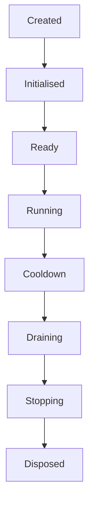
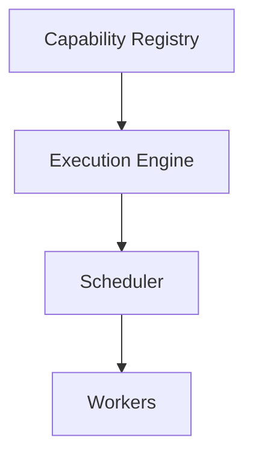
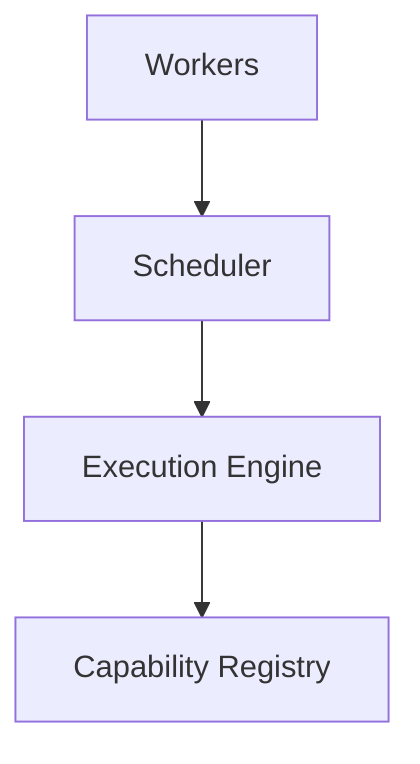
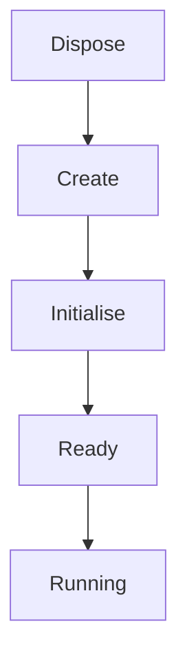

<!--
File: docs/engineering/guides/meg-005-runtime-architecture/04-service-lifecycle.md
Document: MEG-005
Status: Draft
-->

# Service Lifecycle

> *Every Runtime Service should know how to begin, how to become ready, how to stop accepting work and how to shut down cleanly.*

---

# Purpose

The Mosaic Runtime is not a single process but a collection of many independent Runtime Services, each owning a distinct concern. Examples include:

- Capability Registry
- Scheduler
- Worker Manager
- Execution Engine
- Resource Manager
- Observability

These services are long-lived: they are created once and typically remain active for the lifetime of the Runtime, so the way they begin and end matters as much as the work they perform in between. Without a well-defined lifecycle:

- startup order becomes unpredictable
- shutdown becomes unsafe
- dependencies become ambiguous
- failures become difficult to recover from

Each of those failures is a coordination problem rather than a coding problem, which means no individual service can solve it alone. This document therefore defines the canonical lifecycle followed by every Runtime Service.

---

# Philosophy

Within Mosaic:

> **Every Runtime Service follows the same lifecycle.**

Consistency here is worth more than flexibility, because a service that invents its own lifecycle buys local convenience at the cost of platform-wide coordination. Every Runtime Service should therefore behave identically with respect to:

- startup
- readiness
- execution
- shutdown
- disposal

That uniformity is what allows the Runtime Kernel to coordinate every service without special-case logic. A Kernel obliged to remember which services drain and which merely stop would end up encoding every service's quirks in a single place, which is precisely the coupling a shared lifecycle exists to prevent.

---

# Runtime Lifecycle

Every Runtime Service progresses through the following lifecycle.



Each state has exactly one responsibility, which is what keeps the sequence predictable enough for the Kernel to drive. No Runtime Service should invent additional lifecycle stages without architectural justification.

---

# Created

The service has been constructed, and only construction has occurred. At this point the service:

- has received dependencies
- has not performed work
- has not allocated resources

Construction should therefore remain inexpensive. Heavy initialisation belongs to the state that follows, so a constructor that allocates resources or starts background work has already left the lifecycle before the Kernel has had any say in it.

---

# Initialised

During initialisation, the service prepares itself. Typical work includes:

- validating configuration
- allocating resources
- constructing internal state
- registering dependencies

The service should still reject external work throughout. Initialisation prepares the service without activating it, and the distinction matters because work accepted here would be accepted before the service's own dependencies are guaranteed to be operational.

---

# Ready

A Ready service has completed initialisation and is now capable of accepting work: the Scheduler is ready to schedule, the Worker Manager is ready to execute and the Capability Registry is ready to register. Readiness indicates operational capability, not active execution. Separating "ready" from "running" is a common lifecycle pattern because it allows dependencies to initialise before accepting external work.  [Shelter Design](https://design.shelter.org.uk/digital-framework/the-digital-lifecycle)

---

# Running

The Runtime Service is now operational. Examples include:

- accepting requests
- scheduling work
- allocating workers
- exposing health
- publishing metrics

This represents the normal operational state, and most services remain in it for the majority of their lifetime. Everything preceding it is preparation and everything following it is withdrawal.

---

# Cooldown

Cooldown is the first shutdown phase, and unlike every state before it, it is defined by what the service stops doing rather than by what it begins. Its purpose is simple.

> **Stop accepting new work.**

In practice that means the Scheduler stops scheduling, the Execution Engine rejects new tasks and the Worker Manager stops allocating workers. Existing work continues; only new work is rejected. Separating admission control from shutdown greatly simplifies graceful termination of long-running systems.  [Reddit](https://www.reddit.com/r/node/comments/1s4x8gp/application_lifecycle_is_one_of_the_most_ignored/)

---

# Draining

During draining no new work enters while existing work completes, so a Worker Pool runs its current tasks through to complete until the pool is empty. The set of work to be drained is exactly the set Cooldown stopped adding to, which is why that phase precedes this one. The Runtime should prefer graceful completion over abrupt cancellation wherever practical.

---

# Stopping

Once all work has completed, the service begins shutdown. Typical work includes:

- unregistering listeners
- stopping background loops
- closing channels
- notifying dependants

The service should now perform no additional business work. Everything that remains is the teardown of machinery the service built for itself during initialisation.

---

# Disposed

All owned resources have been released. Examples include:

- database pools
- timers
- network sockets
- file handles

The service no longer participates in the Runtime. Disposed services must not be restarted, because the resources a restart would rely upon have deliberately been given up; a new instance should be created instead.

---

# Lifecycle Ownership

The Runtime Kernel owns lifecycle transitions for every service it manages, including the Scheduler, the Worker Manager and the Execution Engine. Individual Runtime Services should never transition themselves independently, because lifecycle coordination belongs exclusively to the Kernel.

---

# Lifecycle Dependencies

Services should start in dependency order.



Shutdown occurs in reverse.



This ordering prevents services depending upon components that have already stopped. Reversal is a consequence rather than a convention: a service that needed another in order to start still needs it while it winds down.

---

# Lifecycle Events

The Runtime may publish lifecycle events such as `ServiceInitialised`, `ServiceReady`, `ServiceStarted`, `ServiceStopping` and `ServiceDisposed`. These are Runtime Events rather than Domain Events, so they improve observability without leaking infrastructure into the Domain.

---

# Health

Lifecycle state and health are related but not identical: a service that is Running may be Healthy, and it may equally be Degraded, because a service may be operational while experiencing reduced capability. Health describes operational quality, whereas lifecycle describes operational state. Collapsing the two would leave the Kernel unable to distinguish a service that has stopped from one that is merely struggling.

---

# Restartability

Runtime Services should be restartable, and because disposal is final, a restart is a fresh pass through the lifecycle rather than a resumption of the previous one.



Services should not depend upon previous process state. Explicit lifecycles naturally support recovery after failure, because a service that can be disposed and rebuilt is one the Kernel can restart without restarting the Runtime around it.

---

# Failure During Startup

Suppose initialisation fails, so the service moves from Created to Initialised and then reaches Failure. The Runtime Kernel should:

- report the failure
- stop dependent services
- terminate startup

Partial startup should not continue unless explicitly supported. A Runtime that is half-started is considerably harder to reason about than one that refused to start at all, because nothing then distinguishes a service that is missing from one that is merely slow.

---

# Failure During Execution

Suppose a service fails while Running, moving directly from Running to Failure. The Runtime Kernel then determines whether the response is:

- restart
- shutdown
- degraded operation

The failing service should not make that decision itself, because it cannot see which other services depend upon it. That view exists only in the Kernel, which is also the component that would have to carry out whichever response is chosen.

---

# Resource Ownership

Every Runtime Service owns its own resources and is therefore responsible for releasing those resources during disposal. Ownership should never become ambiguous, because resource cleanup follows lifecycle ownership.

---

# Lifecycle Contracts

Every Runtime Service should implement the same lifecycle contract, one operation per state. Conceptually:

```text
Initialise()
Ready()
Start()
Cooldown()
Drain()
Stop()
Dispose()
```

This allows the Runtime Kernel to manage all services uniformly. The exact implementation is less important than the behavioural consistency, which is what the Kernel actually relies upon when it sequences one service against another.

---

# Testing

Lifecycle behaviour should be tested independently. Typical tests verify:

- startup ordering
- readiness
- cooldown
- draining
- shutdown
- resource disposal

Lifecycle correctness is an architectural concern, not merely an operational one. A service that leaks a timer on disposal has broken the architecture as surely as one that begins accepting work before its dependencies are operational.

---

# Anti-Patterns

The following practices are prohibited.

## Hidden Startup

Constructors starting background work automatically. Construction is meant to leave the service inert, so anything a constructor sets running is running before the Kernel has decided that it should be.

---

## Immediate Shutdown

Stopping services without cooldown or draining. Work already admitted is abandoned rather than completed, which is the precise outcome those two phases exist to prevent.

---

## Resource Leaks

Disposal is the point at which a service returns everything it took, which makes it the point at which omissions become permanent. Resource leaks occur when a disposed service retains:

- timers
- workers
- sockets
- goroutines

---

## Independent Lifecycle

Services starting and stopping themselves without Kernel coordination. Each service may transition correctly when considered alone, but the ordering between them is exactly what is lost.

---

## Startup Side Effects

Services performing business work during initialisation. Initialisation prepares a service, so work performed there necessarily happens before readiness and therefore before any dependency is guaranteed to be available.

---

## Skipping Readiness

Accepting work before dependencies become operational. The Ready state exists to mark the moment at which accepting work becomes safe, so bypassing it discards the guarantee that state was introduced to provide.

---

# Mosaic Guidelines

Within Mosaic:

- Every Runtime Service must follow the canonical lifecycle.
- The Runtime Kernel must coordinate lifecycle transitions.
- Services must initialise before becoming ready.
- Services must stop accepting new work before stopping existing work.
- Draining should complete existing work where practical.
- Services must release owned resources before disposal.
- Lifecycle should remain observable.
- Startup should follow dependency order.
- Shutdown should occur in reverse dependency order.

---

# Relationship to MEG

The Runtime Kernel owns:

> **Who participates in the Runtime.**

The Service Lifecycle defines:

> **How every Runtime Service participates throughout its lifetime.**

The next chapter introduces the **Dependency Graph**, describing how Runtime Services and Capabilities are wired together while preserving explicit ownership and deterministic startup. Where this chapter followed a single service through time, the next describes how many services stand in relation to one another at once.

---

# Summary

A Runtime Service should never simply:

> **Start.**

Nor should it simply:

> **Stop.**

It should instead progress through a deliberate, observable lifecycle that makes startup predictable, execution reliable and shutdown graceful. Within Mosaic every Runtime Service follows the same lifecycle, so the Runtime Kernel can coordinate the entire platform with consistency rather than special cases.
