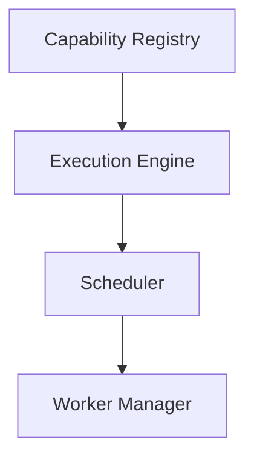
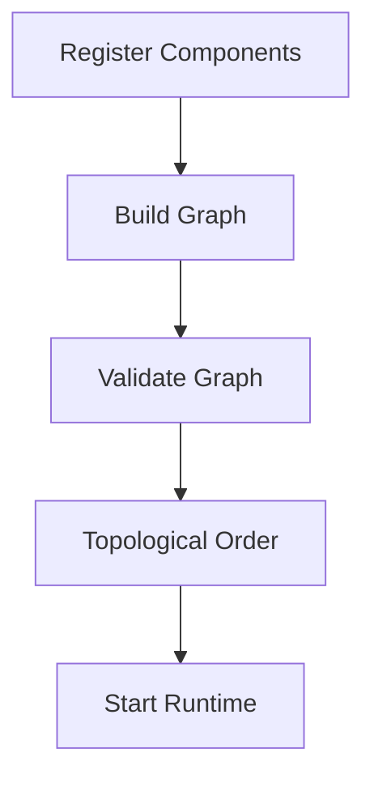

<!--
File: docs/engineering/guides/meg-005-runtime-architecture/05-dependency-graph.md
Document: MEG-005
Status: Draft
-->

# Dependency Graph

> *The Runtime should understand every dependency before execution begins. Execution order should emerge from the graph, not from hard-coded startup sequences.*

---

# Purpose

The Mosaic Runtime is composed of many Runtime Services and Capabilities, and the set is large enough that their relationships cannot be held in any one component's head. Examples include:

- Capability Registry
- Execution Engine
- Scheduler
- Worker Manager
- Metadata
- Playback
- Library
- Recommendations

These components frequently depend upon one another, and those dependencies have to be recorded somewhere before startup can be made deterministic. Without an explicit dependency model:

- startup becomes fragile
- shutdown becomes unpredictable
- cycles emerge
- architectural drift becomes inevitable

None of those failures announce themselves at the point the dependency is introduced; they surface later, during startup or in production. This document therefore defines the Dependency Graph that governs the construction, startup and shutdown of the Runtime.

---

# Philosophy

Within Mosaic:

> **Dependencies should be declared. The Runtime should determine execution order.**

No component should manually decide:

> "Start this service first."

Instead, every component declares its dependencies and the Runtime constructs a dependency graph from those declarations. Execution order then follows from the graph, which means ordering becomes something the Runtime derives rather than something an engineer maintains.

---

# What Is The Dependency Graph?

The Dependency Graph is a directed graph describing relationships between Runtime components. Its structure is deliberately plain, because everything the Runtime needs to know about ordering can be read from nodes and edges alone.



Every node represents a Runtime component and every edge represents a dependency. The Runtime uses this graph to determine:

- startup order
- shutdown order
- readiness
- dependency validation

---

# Runtime Source Of Truth

The Dependency Graph is the authoritative description of Runtime relationships, which makes it the single place the Runtime consults when ordering is in question. It answers questions such as:

- What depends on this service?
- What must start first?
- What can start in parallel?
- What must stop last?

No Runtime Service should independently answer these questions. A service knows only what it declared, so any answer it produced would reflect its own corner of the graph rather than the whole.

---

# Declared Dependencies

Every Runtime component should explicitly declare its dependencies — the Scheduler declares its relationship to the Execution Engine — rather than merely calling the Execution Engine when it needs it, which leaves the dependency hidden until execution. Dependencies should be visible before execution begins, because a dependency the Runtime cannot see is one it cannot order, validate or report on.

---

# Directed Graph

Dependencies are directional. An edge drawn from the Scheduler to the Execution Engine means the Scheduler depends upon the Execution Engine, not the reverse. Direction should always communicate dependency, never execution.

---

# Directed Acyclic Graph

The Runtime Dependency Graph must remain acyclic. A chain running from the Capability Registry through the Execution Engine and the Scheduler to the Worker Manager is valid, whereas a relationship running from the Scheduler through the Worker Manager and back to the Scheduler is prohibited, because cycles prevent deterministic startup. A dependency graph without cycles forms a Directed Acyclic Graph (DAG), allowing a valid execution order to be derived using topological sorting.  [Wikipedia](https://en.wikipedia.org/wiki/Dependency_graph)

---

# Topological Startup

Startup order should be derived automatically by applying a topological sort to the Dependency Graph to produce the startup order. The Runtime should never rely upon manually maintained startup sequences, because such a sequence records an ordering that was true when it was written rather than one that follows from the dependencies as they now stand. The graph should determine ordering.

---

# Parallel Startup

Independent components should start in parallel. A Capability Registry and Execution Engine pairing and Observability may initialise simultaneously if no dependency exists between them, so the Runtime should maximise parallelism without violating dependency order. This naturally improves startup performance.

---

# Shutdown Order

Shutdown follows the reverse dependency order. Where startup runs from the Capability Registry through the Execution Engine to the Scheduler, shutdown runs from the Scheduler back through the Execution Engine to the Capability Registry. Components should never outlive their dependencies.

---

# Capability Dependencies

Capabilities participate in the same graph, so Recommendations depends upon Playback and Playback depends upon Metadata in exactly the same way Runtime Services depend upon one another. The Runtime should validate capability dependencies before activation, and missing dependencies should prevent startup rather than failing later during execution.

---

# Runtime Services

Runtime Services also participate: the Worker Manager depends upon the Execution Engine, and the Execution Engine depends upon the Capability Registry. The graph therefore contains both:

- Runtime Services
- Capabilities

The Runtime should reason about both uniformly, because the ordering problem is identical in each case.

---

# Dependency Validation

Validation is what turns a declared graph into a trustworthy one, so the Runtime should perform it before anything starts. Before startup, the Runtime should validate:

- missing dependencies
- duplicate registrations
- circular dependencies
- incompatible versions

Invalid dependency graphs should fail during startup rather than during execution. Early validation dramatically reduces operational complexity, because a graph rejected at startup produces one clear failure instead of a scattering of unrelated symptoms later.

---

# Optional Dependencies

Some dependencies may be optional: Recommendations may declare a dependency upon a Machine Learning Module that is marked optional, and if that module is unavailable, Recommendations continue. Capabilities should therefore explicitly distinguish between:

- required dependencies
- optional dependencies

The Runtime should never guess. An absent dependency that was required and an absent dependency that was optional are indistinguishable at startup unless the declaring component said which it was.

---

# Dynamic Dependencies

Dependencies should remain stable during execution, so runtime mutation of the dependency graph should be rare. Examples where it may occur include:

- module installation
- module removal
- runtime upgrades

Even then, the Runtime should validate the resulting graph before activating new components. A mutation is simply a new graph, and it deserves the same scrutiny the original received.

---

# Dependency Metadata

Edges within the graph may contain metadata. Examples include:

- required
- optional
- version constraints
- lifecycle relationship

This allows the Runtime to reason about compatibility as well as ordering. An edge that records only that one component needs another says nothing about whether the version it finds is one it can actually use.

---

# Observability

The Dependency Graph should be observable, because a model that governs startup is of limited use to the people operating the Runtime if they cannot inspect it. Operators should be able to answer:

- Which services depend upon this capability?
- What prevents startup?
- Which components are blocked?
- What will stop if this service fails?

The graph should become an operational tool, not merely an implementation detail. Those are questions asked during an incident, and the graph already holds every answer.

---

# Runtime Diagnostics

The Runtime should expose the Dependency Graph through diagnostics, turning the graph into a visualisation operators can inspect directly. This greatly simplifies:

- debugging
- onboarding
- architecture reviews
- operational support

Understanding the Runtime should not require reading source code.

---

# Dependency Ownership

Every component owns only its outgoing dependencies, so the Scheduler declares its dependency upon the Execution Engine while the Execution Engine does not maintain a list of dependants. The Runtime derives reverse relationships automatically, which keeps ownership simple.

---

# Dependency Resolution

The Runtime Kernel resolves dependencies before startup, and it does so in a fixed sequence that ends with a graph nothing further needs to modify.



Resolution occurs once, after which execution simply follows the resulting graph. Startup therefore has a single decision point rather than a decision at every step.

---

# Anti-Patterns

The following practices are prohibited.

## Manual Startup Order

```go
startRegistry()
startExecution()
startScheduler()
```

Hard-coded ordering should be replaced by graph resolution. A sequence written by hand states a conclusion without the dependencies that justify it, so nothing detects when the two fall out of step.

---

## Hidden Dependencies

Components discovering dependencies during execution. A dependency that appears only once the component runs cannot participate in validation or ordering, which is where it would have done the most good.

---

## Circular Dependencies

Any cycle between Runtime components or Capabilities. No topological order exists over a cycle, so there is no correct answer to the question of which member should start first.

---

## Runtime Service Locator

Resolving arbitrary dependencies dynamically instead of declaring them. The dependency still exists; it is simply invisible to the graph that is supposed to govern it.

---

## Startup Guesswork

Starting components without validating dependency availability. Failure is deferred rather than avoided, and it surfaces as a runtime error some distance from the missing declaration that caused it.

---

## Duplicate Dependency Graphs

Multiple Runtime components maintaining separate dependency models. The Runtime should own exactly one dependency graph, because two models that disagree offer no way of telling which one is right.

---

# Mosaic Guidelines

Within Mosaic:

- Every Runtime component must declare its dependencies.
- The Runtime must construct one dependency graph.
- The Dependency Graph must remain acyclic.
- Startup order must be derived from the graph.
- Shutdown order must be the reverse of startup.
- Independent components should start in parallel.
- Dependency validation must occur before execution.
- The Dependency Graph should remain observable.
- Components must not discover hidden dependencies at runtime.

---

# Relationship to MEG

The Capability Registry answers:

> **What exists?**

The Dependency Graph answers:

> **How do those things depend upon one another?**

The next chapter introduces the **Execution Engine**, the Runtime subsystem responsible for turning this validated dependency graph into running capability execution. The graph establishes what may run and in what order; the Execution Engine is what actually runs it.

---

# Summary

The Dependency Graph transforms Runtime startup from a collection of hard-coded initialisation steps into a deterministic architectural process. Ordering stops being something engineers assert and becomes something the Runtime derives.

By making dependencies:

- explicit
- observable
- validated
- acyclic

the Runtime becomes easier to:

- understand
- evolve
- debug
- extend

Most importantly, startup order becomes a property of the architecture itself rather than an implementation detail hidden inside bootstrap code. Changing what depends upon what becomes a change to a declaration, not a change to a startup sequence someone has to remember to update.
