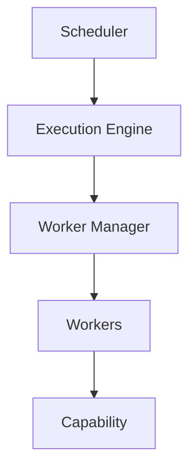
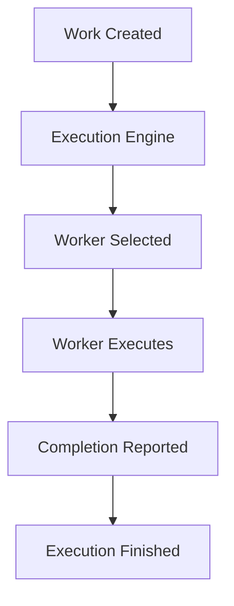
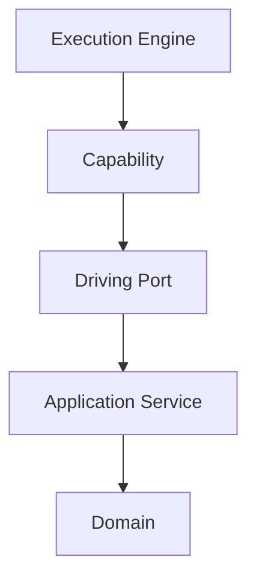
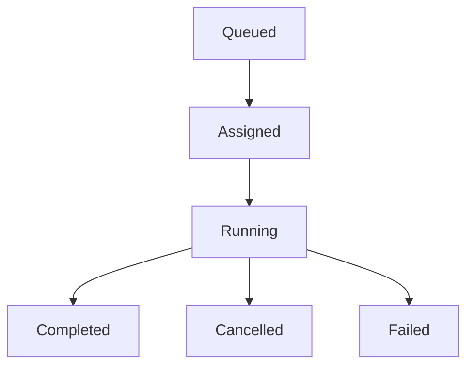

<!--
File: docs/engineering/guides/meg-005-runtime-architecture/06-execution-engine.md
Document: MEG-005
Status: Draft
-->

# Execution Engine

> *The Scheduler decides when work should execute. The Worker executes it. The Execution Engine ensures that the correct work reaches the correct execution environment.*

---

# Purpose

The Runtime contains many components responsible for execution:

- Scheduler
- Worker Manager
- Capability Registry
- Resource Manager

None of these components actually coordinate the execution of work, and that responsibility belongs instead to the **Execution Engine**. The Execution Engine transforms abstract units of work into running execution, sitting at the centre of the Runtime and coordinating work dispatch, execution routing, worker allocation, execution state and execution completion without understanding any business behaviour.

---

# Philosophy

Within Mosaic:

> **The Execution Engine executes work. It never understands the work it executes.**

Execution is an operational concern whereas business meaning belongs entirely to capabilities, so the Execution Engine should remain completely business agnostic.

---

# What Is The Execution Engine?

The Execution Engine is the Runtime component responsible for coordinating executable work. Conceptually it sits between the Scheduler and the capability that eventually runs.

It acts as the bridge between work creation and work execution: the Scheduler decides *when*, and the Execution Engine decides *how*.

---

# Responsibilities

The Execution Engine owns:

- task dispatch
- execution routing
- worker assignment
- execution tracking
- execution completion
- execution cancellation

It intentionally does **not** own scheduling, retries, business workflows, event routing or persistence, because those responsibilities belong elsewhere in the Runtime.

---

# Work Units

Everything executed by the Runtime becomes a Work Unit. Examples include:

- Runtime Events
- Scheduled Tasks
- Module Calls
- Maintenance Tasks
- Background Jobs

The Execution Engine treats every Work Unit identically, which means business meaning remains invisible to it.

---

# Execution Pipeline

Every Work Unit follows the same pipeline.

The pipeline should remain deterministic, so every Work Unit should follow the same lifecycle regardless of what it represents.

---

# Execution Is Stateless

The Execution Engine should remain stateless. It owns execution coordination, but it does **not** own business state, runtime state or worker state. Long-lived state belongs to the Capability Registry, the Worker Manager and the Resource Manager, whereas the Execution Engine simply coordinates.

---

# Worker Selection

The Execution Engine delegates worker selection to the Worker Manager, which selects the Worker that will run the work. The Execution Engine should therefore never understand thread allocation, worker pools or scheduling policies; it simply requests execution and the Worker Manager fulfils that request.

---

# Scheduler Integration

The Scheduler produces executable work, turning its decisions into a Work Unit that the Execution Engine then dispatches. The Scheduler does not execute and the Execution Engine does not schedule, because those responsibilities remain intentionally separate.

---

# Capability Execution

The Execution Engine executes capabilities. It does **not** execute business logic directly; conceptually, execution passes inwards through the layers a capability exposes.

The Execution Engine remains unaware of Aggregates, Entities and Domain Events, because it simply executes registered capabilities.

---

# Parallel Execution

Independent Work Units should execute concurrently. A Metadata Refresh submitted to the Execution Engine can run on Worker A while an Artwork Download runs on Worker B, so concurrency emerges naturally from independent work rather than from special handling. The Execution Engine should maximise utilisation while respecting Runtime limits.

Modern execution engines typically coordinate worker pools rather than executing work directly, allowing scheduling and execution responsibilities to remain separate.  [DeepWiki](https://deepwiki.com/taskflow/taskflow/2.2-executor-and-workers)

---

# Execution State

Every Work Unit progresses through the same execution lifecycle.

The Execution Engine owns this execution state, whereas business state remains elsewhere.

---

# Cancellation

The Execution Engine coordinates cancellation: a Cancellation Requested for running work reaches the Worker, execution ends, and completion is reported like any other outcome. Business logic determines how to leave business state consistent, while the Execution Engine simply coordinates execution termination.

---

# Failure Handling

Execution failure does not imply business failure. A Worker Crash produces an Execution Failed result, which the Runtime may answer with a Runtime Retry, and the Execution Engine reports that failure rather than resolving it. The Runtime decides whether to retry, dead letter or shut down, because execution and recovery remain separate concerns.

---

# Capability Isolation

Every capability executes independently, so a Failure within Metadata must leave Playback Unaffected. Execution isolation is one of the Runtime's primary responsibilities.

---

# Execution Contracts

The Execution Engine communicates through Runtime contracts. Examples include:

- Work Submission
- Worker Allocation
- Execution Result
- Cancellation

The engine should never communicate directly with databases, HTTP, event buses or business services, because everything passes through Runtime abstractions.

---

# Resource Awareness

The Execution Engine should remain aware of Runtime resource constraints. Examples include:

- available workers
- queue pressure
- execution limits
- resource exhaustion

It should cooperate with the Worker Manager and the Resource Manager to understand those constraints, but it should never allocate resources itself.

---

# Observability

Every execution should be observable. Useful metrics include:

- queued work
- active work
- completed work
- failed work
- execution latency
- worker utilisation

The Execution Engine should become one of the most observable Runtime components, because operators should always understand:

> What is currently executing?

---

# Runtime Independence

The Execution Engine should remain independent from worker implementation, scheduling algorithms and execution strategies. Changing the Worker Pool should not require changing the Execution Engine, which keeps both responsibilities replaceable.

---

# Testing

The Execution Engine should be tested independently. Typical tests verify:

- dispatch
- cancellation
- completion
- routing
- execution ordering
- worker selection contracts

Business capabilities should not be required for any of these, so the engine should be testable using fake workers.

---

# Anti-Patterns

The following practices are prohibited.

## Business Logic

The Execution Engine deciding business behaviour.

---

## Scheduling

The Execution Engine determining when work should execute.

---

## Resource Ownership

The Execution Engine managing thread pools directly.

---

## Worker Awareness

Business capabilities interacting with worker implementations.

---

## Runtime Coupling

The Execution Engine depending directly upon Scheduler implementation details.

---

## Technology Leakage

Execution behaviour depending upon infrastructure-specific implementation details.

---

# Mosaic Guidelines

Within Mosaic:

- The Execution Engine must remain business agnostic.
- Every executable task must become a Work Unit.
- The Execution Engine must coordinate execution rather than perform work.
- Worker allocation must remain the responsibility of the Worker Manager.
- Scheduling must remain separate from execution.
- Execution should maximise safe parallelism.
- Execution state must remain observable.
- The Execution Engine should remain independently replaceable.

---

# Relationship to MEG

The Dependency Graph determines:

> **What can execute.**

The Execution Engine determines:

> **How that execution occurs.**

The next chapter introduces the **Worker Manager**, the Runtime subsystem responsible for providing, supervising and balancing the worker pool that performs execution on behalf of the Execution Engine.

---

# Summary

The Execution Engine is the Runtime's dispatcher. It does not schedule, retry, own resources or understand business behaviour; instead it transforms abstract Work Units into running execution by coordinating the Runtime components responsible for carrying out that work.

By keeping execution separate from scheduling, worker management and business logic, the Mosaic Runtime remains modular, scalable and remarkably easy to reason about.
