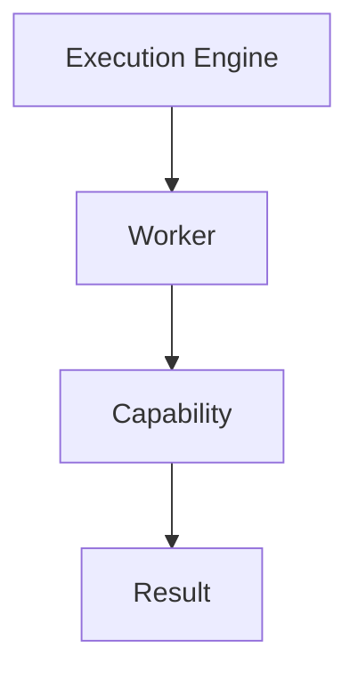
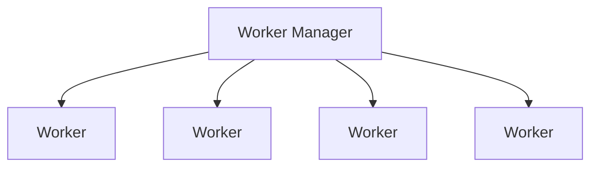
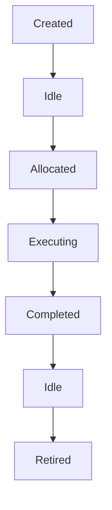
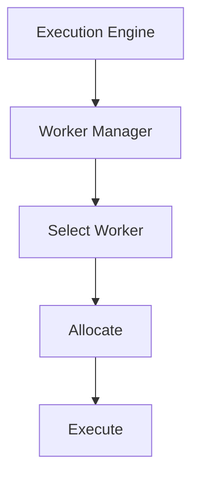
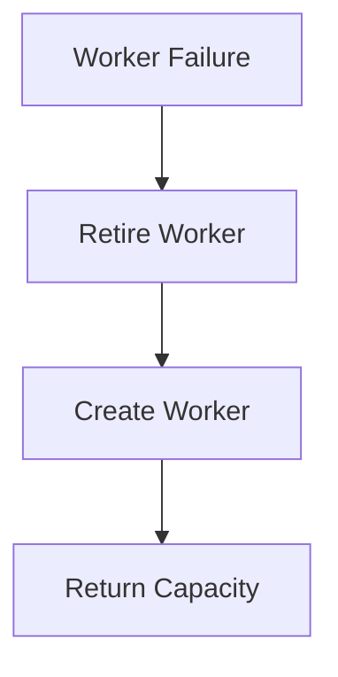

<!--
File: docs/engineering/guides/meg-005-runtime-architecture/07-worker-manager.md
Document: MEG-005
Status: Draft
-->

# Worker Manager

> *The Execution Engine decides what should execute. The Worker Manager decides where it executes.*

---

# Purpose

Execution requires workers, and within Mosaic those workers execute:

- Runtime Events
- Scheduled Tasks
- Capability Operations
- Maintenance Jobs
- Background Processing

Workers themselves require management, however, because they must be created, monitored, allocated, retired, replaced and observed. Within the Mosaic Runtime these responsibilities belong to the **Worker Manager**, which owns the lifecycle and utilisation of every worker participating in the Runtime.

---

# Philosophy

Within Mosaic:

> **Workers are Runtime resources. The Worker Manager owns those resources.**

Workers should never create themselves, destroy themselves, schedule themselves or coordinate themselves. The Worker Manager owns worker lifecycle, worker allocation, worker health and worker capacity, which leaves workers free to simply execute work.

---

# What Is A Worker?

A Worker is an isolated execution environment capable of executing one Work Unit at a time. Conceptually it stands between the Execution Engine and the capability whose result it returns.

Workers understand execution, cancellation and completion, but they do not understand playback, metadata, libraries or recommendations, because business meaning remains invisible to them.

---

# Why A Worker Manager Exists

Without a Worker Manager the Execution Engine would have to create the worker, manage the worker and destroy the worker itself, which couples execution and resource management tightly together. Instead the Execution Engine asks the Worker Manager, and the Worker Manager provides the Worker, so execution remains independent and resource ownership remains explicit.

---

# Responsibilities

The Worker Manager owns:

- worker creation
- worker allocation
- worker retirement
- worker health
- worker utilisation
- worker replacement
- worker pool management

It intentionally does **not** own scheduling, execution routing, retries or business behaviour, because those concerns belong elsewhere.

---

# Worker Pool

Workers exist within managed pools.

The Worker Manager should view workers as a pool of interchangeable execution resources, which means individual workers should rarely matter. Worker pools are a well-established concurrency pattern because they bound resource usage while allowing work to be processed concurrently.  [Buntime](https://buntime.djalmajr.dev/concepts/worker-pool/)

---

# Worker Lifecycle

Every worker follows the same lifecycle.

The Worker Manager owns every transition, so workers should never transition independently.

---

# Worker Allocation

When execution is requested, allocation follows a fixed sequence.

Selection policies are implementation details of the Worker Manager, which means the Execution Engine should simply request execution.

---

# Idle Workers

Idle workers represent available capacity, so a Worker that is Idle is Ready. Idle workers should consume minimal resources while remaining immediately available for work, and they should never busy-wait.

---

# Busy Workers

A busy worker is one that is Executing, and it owns exactly one active Work Unit. By default one worker executes one Work Unit, so parallelism is achieved by increasing worker count rather than by increasing worker complexity.

---

# Worker Ownership

Every worker has exactly one owner: the Runtime Kernel owns the Worker Manager, and the Worker Manager owns the Worker. Ownership answers who created the worker, who retires it, who monitors it and who replaces it, and it should never become ambiguous.

---

# Worker Identity

Workers should possess Runtime identity — a name such as Worker-17 — because identity supports diagnostics, tracing, metrics and debugging. Business capabilities should remain unaware of worker identity, which belongs exclusively to the Runtime.

---

# Worker Health

The Worker Manager should continuously monitor worker health. Examples include:

- responsive
- idle
- executing
- degraded
- failed

Health determines operational readiness rather than business correctness.

---

# Worker Failure

Suppose a Worker suffers a Crash. The Worker Manager should then:

- detect failure
- retire worker
- create replacement
- notify Runtime

The Execution Engine simply observes that execution failed, because worker recovery belongs entirely to the Worker Manager. This separation mirrors the classic manager/worker pattern, where the manager owns worker lifecycle while workers focus solely on execution.  [fprime.jpl.nasa.gov](https://fprime.jpl.nasa.gov/latest/docs/user-manual/design-patterns/manager-worker/)

---

# Worker Capacity

Workers represent finite Runtime capacity. Examples include:

- available workers
- active workers
- idle workers
- maximum workers

Capacity information should be exposed to the Scheduler, the Execution Engine and the Resource Manager, and the Worker Manager owns these metrics.

---

# Scaling

Worker pools should scale deliberately, and possible strategies include Static, Adaptive and Configured pools. Regardless of strategy, scaling should remain bounded: unlimited worker creation is prohibited, so that resource usage remains predictable.

---

# Worker Retirement

Workers should not exist indefinitely. Retirement may occur because of:

- shutdown
- failure
- resource pressure
- maintenance
- runtime upgrade

Retired workers should complete cleanup, resource release and metric publication before disposal.

---

# Worker Replacement

Worker replacement should be automatic.

Capabilities should remain unaware that replacement occurred, because operational resilience belongs entirely to the Runtime.

---

# Worker Affinity

The Runtime should avoid unnecessary worker affinity. Binding a Capability to Always Worker 7 is poor practice, whereas routing that Capability to any Available Worker is preferred. Workers should therefore remain interchangeable wherever practical, and affinity should exist only where technically justified.

---

# Worker Isolation

Workers should remain isolated, so failure within one worker should not affect neighbouring workers, unrelated capabilities or Runtime stability. Isolation improves resilience and simplifies recovery.

---

# Worker Metrics

The Worker Manager should expose:

- worker count
- idle workers
- active workers
- utilisation
- replacement count
- failures
- average execution time

These metrics provide insight into Runtime capacity.

---

# Worker Observability

Operators should be able to answer:

- Which workers are active?
- Which workers are idle?
- Which workers failed?
- How heavily utilised is the pool?

The Worker Manager should expose this information without additional instrumentation.

---

# Worker Creation

Workers should generally be created during Runtime startup, and later expansion should occur only when justified by Runtime policy. Worker creation should therefore remain predictable rather than reactive to every temporary workload spike.

---

# Anti-Patterns

The following practices are prohibited.

## Self-Managing Workers

Workers creating additional workers.

---

## Unlimited Worker Creation

Creating workers without Runtime limits.

---

## Worker-Owned Scheduling

Workers determining future execution.

---

## Business Logic

Workers making business decisions.

---

## Worker Affinity By Default

Binding capabilities permanently to specific workers.

---

## Hidden Worker Pools

Capabilities creating private worker pools outside Runtime control.

---

# Mosaic Guidelines

Within Mosaic:

- The Worker Manager must own every worker.
- Workers must remain interchangeable by default.
- Worker pools must remain bounded.
- Worker lifecycle must be centrally managed.
- Worker failures must trigger controlled replacement.
- Worker health must remain observable.
- Worker metrics must be exposed.
- Capabilities must not create their own workers.
- Business behaviour must remain completely independent of worker implementation.

---

# Relationship to MEG

The Execution Engine answers:

> **What should execute?**

The Worker Manager answers:

> **Which execution resource should perform that work?**

The next chapter introduces the **Scheduler Architecture**, the Runtime subsystem responsible for determining **when** work should become executable. Together these three subsystems divide the problem cleanly:

- Scheduler decides **when**.
- Execution Engine decides **how**.
- Worker Manager decides **where**.

---

# Summary

The Worker Manager transforms workers from implementation details into managed Runtime resources, owning their lifecycle, health, capacity, allocation and replacement. By centralising worker management, the Mosaic Runtime gains predictable resource usage, resilience, observability and scalability.

Workers remain simple, and the Worker Manager makes them reliable.
