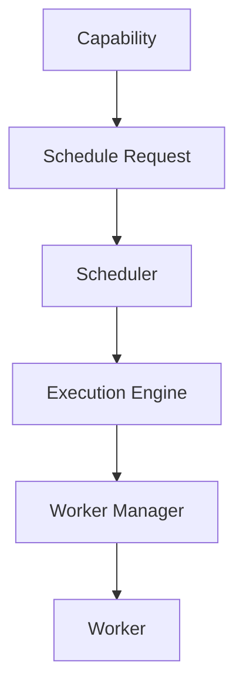
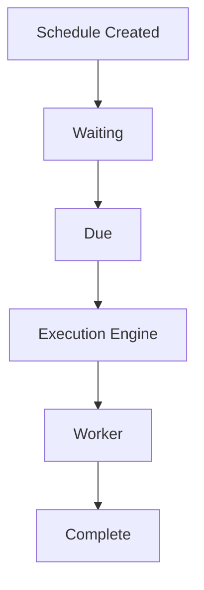
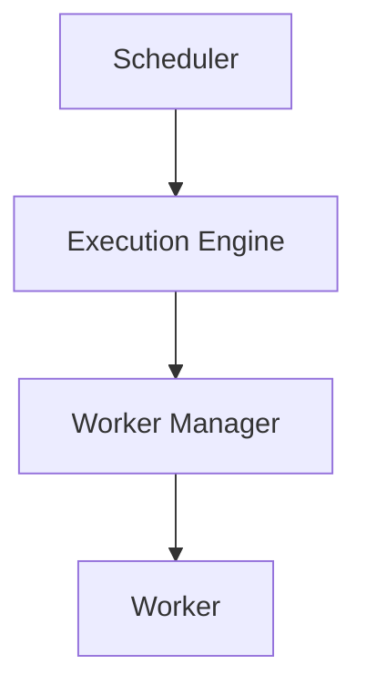
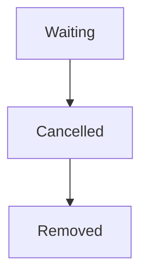
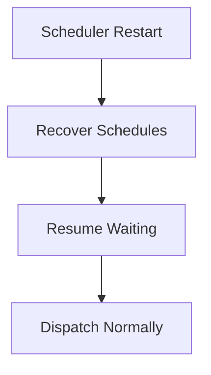

<!--
File: docs/engineering/guides/meg-005-runtime-architecture/08-scheduler-architecture.md
Document: MEG-005
Status: Draft
-->

# Scheduler Architecture

> *The Scheduler decides when work becomes executable. It never executes the work itself.*

---

# Purpose

Many Runtime operations do not execute immediately. Scheduled capability operations, delayed retries, recurring maintenance, cache refresh, metadata synchronisation, module maintenance and health verification all sit waiting until some condition of time is met, which means the Runtime needs a component capable of answering one question.

> **Is this work ready to execute?**

Within Mosaic, that responsibility belongs exclusively to the **Scheduler**. The Scheduler determines *when* work should execute, but it determines neither where, nor how, nor by whom; those responsibilities belong to other Runtime components.

---

# Philosophy

Within Mosaic:

> **The Scheduler owns time. It does not own execution.**

The Scheduler should remain intentionally small, because its purpose is narrow: it transforms Future Work into Executable Work and does nothing else. Once work becomes executable, responsibility transfers immediately to the Execution Engine.

---

# What Is The Scheduler?

The Scheduler is a Runtime Service responsible for managing temporal execution. Conceptually, a Capability issues a Schedule Request to the Scheduler, and when the time arrives the work travels onward through the Execution Engine and the Worker Manager to a Worker.



Notice that the Scheduler appears only at the front of that chain. It never executes work; it merely decides:

> **Now.**

---

# Responsibilities

The Scheduler owns:

- delayed execution
- recurring execution
- retry timing
- execution deadlines
- execution windows
- schedule persistence
- schedule cancellation

It intentionally does **not** own:

- worker allocation
- execution routing
- retries
- business behaviour

These concerns remain elsewhere.

---

# Scheduler Pipeline

Every scheduled operation follows the same lifecycle, and the Scheduler's responsibility ends the moment a schedule becomes due.



---

# Time Ownership

One of the defining principles of the Runtime is that Time belongs to the Scheduler, so business capabilities should never determine execution timing themselves. A capability that calls

```go
time.Sleep(...)
```

inside its own logic has taken ownership of something that is not its own. The preferred alternative is for the Capability to issue a Schedule Request and let the Scheduler decide when the moment arrives. The Runtime owns time, whereas capabilities own only intent.

---

# Delayed Execution

The Scheduler supports delayed execution. When Retry Metadata needs to run again thirty seconds later, the delay belongs to the Scheduler and the Metadata capability remains completely unaware that any waiting took place.

---

# Recurring Execution

Recurring work is treated as a first-class Runtime concept, so any operation that repeats on a fixed interval is expressed as a schedule rather than a loop:

- a Library Scan every 6 hours
- a Module Health Check every minute
- a Metrics Snapshot every 30 seconds

Recurring schedules should produce new executable Work Units rather than execute work directly.

---

# Execution Handoff

When work becomes due the Scheduler hands it onward and takes no further part in it.



The Scheduler should not know worker count, worker availability or execution strategy, because execution begins only after handoff. This separation between scheduling and execution allows each subsystem to scale and evolve independently.  [System Design Handbook](https://www.systemdesignhandbook.com/guides/design-a-distributed-job-scheduler/)

---

# Schedule Storage

Schedules should remain durable. Typical schedule information includes:

- capability
- operation
- execution time
- recurrence
- priority
- owner
- metadata

Persistence allows schedules to survive restart, upgrade and failure, and because the Scheduler owns schedule durability, capabilities never have to.

---

# Schedule Identity

Every schedule should possess a unique Runtime identifier such as `schedule-42`. Identity is what makes cancellation, diagnostics, replay and metrics possible at all, so schedule identity belongs to Runtime infrastructure rather than to business behaviour.

---

# Schedule Ownership

Every schedule has exactly one owner. The Metadata Capability, for example, owns its Refresh Schedule: the owning capability requests the schedule while the Scheduler owns its execution lifecycle. Ownership should remain explicit.

---

# Priority

The Scheduler may assign execution priority. High priority covers user interaction, playback and authentication; normal priority covers metadata refresh and recommendation generation; low priority covers cleanup, analytics and maintenance.

The Scheduler determines *when* work enters execution, whereas the Execution Engine still determines *how* it executes. Priority therefore influences admission, not business semantics.

---

# Cancellation

Schedules should remain cancellable, and cancellation follows its own short lifecycle.



Cancelled schedules should never reach the Execution Engine, because cancellation remains a scheduling concern.

---

# Dependency Awareness

The Scheduler should respect Runtime state. If a Capability is Disabled then its Scheduled Work must not be dispatched, so the Scheduler should consult the Capability Registry before dispatching work and should never execute work for unavailable capabilities.

---

# Scheduler Simplicity

The Scheduler should answer only two questions — is this work due, and can this work execute? It should never answer whether a given business behaviour should happen, because business decisions remain outside the Runtime.

---

# Scaling

The Scheduler should remain lightweight, determining execution time and enqueuing executable work without ever executing capability logic. That restraint is what allows Scheduler scaling and Execution scaling to occur independently. The separation is widely used in distributed schedulers because it keeps scheduling lightweight while worker fleets scale horizontally.  [System Design Handbook](https://www.systemdesignhandbook.com/guides/design-a-distributed-job-scheduler/)

---

# Failure Recovery

Suppose the Scheduler fails. On restart it recovers its schedules, resumes waiting and dispatches normally.



Schedules should survive failure so that capabilities never recreate them manually. The Runtime owns recovery.

---

# Observability

The Scheduler should expose:

- active schedules
- waiting schedules
- recurring schedules
- execution latency
- missed schedules
- cancelled schedules

Operators should always understand:

> **What is waiting to execute?**

---

# Scheduler Independence

The Scheduler should remain independent from worker implementation, execution strategy, storage implementation and business capabilities. Changing the Execution Engine should not require changing the Scheduler, and likewise changing storage should not alter scheduling semantics.

---

# Anti-Patterns

The following practices are prohibited.

## Executing Work

The Scheduler directly invoking capabilities.

---

## Worker Allocation

The Scheduler selecting workers.

---

## Business Decisions

The Scheduler determining business behaviour.

---

## Sleeping Capabilities

Capabilities delaying themselves.

---

## Runtime Polling Loops

Capabilities implementing their own scheduling infrastructure.

---

## Hard-Coded Timers

Embedding recurring timing directly inside business logic.

---

# Mosaic Guidelines

Within Mosaic:

- The Scheduler must own all temporal execution.
- The Scheduler must not execute work directly.
- The Scheduler must remain independent of worker allocation.
- Schedules should remain durable.
- Schedule identity must remain unique.
- Capabilities must request scheduling rather than implement it.
- The Scheduler should expose operational metrics.
- The Scheduler should remain lightweight and deterministic.
- Execution must begin only after handoff to the Execution Engine.

---

# Relationship to MEG

Where the Worker Manager answers:

> **Where does work execute?**

the Scheduler answers:

> **When does work become executable?**

The next chapter introduces the **Resource Manager**, the Runtime subsystem responsible for managing finite Runtime resources such as memory, worker capacity and infrastructure allocations.

---

# Summary

The Scheduler is the Runtime's keeper of time. It transforms future work into executable work while remaining completely unaware of:

- business behaviour
- execution strategy
- worker implementation

By separating scheduling from execution, the Mosaic Runtime gains:

- independent scalability
- deterministic timing
- operational simplicity
- clean architectural boundaries

Time belongs to the Scheduler, execution belongs to the Runtime, and business belongs to capabilities.
