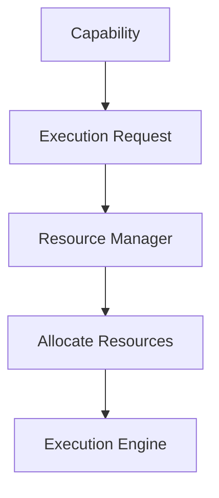
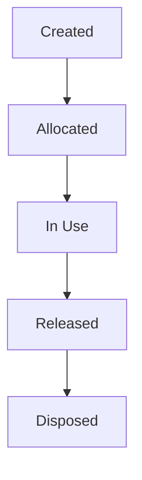
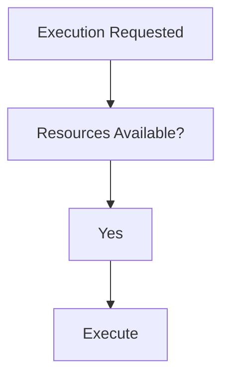
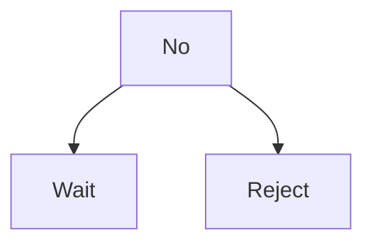

<!--
File: docs/engineering/guides/meg-005-runtime-architecture/09-resource-management.md
Document: MEG-005
Status: Draft
-->

# Resource Management

> *Resources are finite. The Runtime exists to allocate them deliberately rather than accidentally.*

---

# Purpose

Every long-running platform operates within finite constraints, and the Mosaic Runtime is no exception. CPU, memory, worker capacity, database connections, blob storage, network bandwidth and file handles all run out eventually, so the Runtime is responsible for ensuring these resources are:

- allocated
- monitored
- protected
- reclaimed

Business capabilities should never concern themselves with resource management. They should simply request execution, and the Runtime determines whether sufficient resources exist.

---

# Philosophy

Within Mosaic:

> **Capabilities consume resources. The Runtime owns them.**

Resources belong to the Runtime and capabilities merely borrow them, which ensures that business behaviour remains independent of operational constraints. Operating systems are commonly described as resource managers for the same reason: they allocate finite resources while protecting overall system stability.  [cis.temple.edu](https://cis.temple.edu/~giorgio/cis307/readings/intro.html)

---

# What Is A Resource?

Within the Runtime, a resource is anything with finite availability. Examples include:

- workers
- memory
- CPU time
- database pools
- blob storage clients
- HTTP clients
- scheduler capacity
- queue capacity

Resources should be treated consistently regardless of implementation.

---

# Resource Ownership

Every Runtime resource has exactly one owner. The Worker Manager owns Workers, the Scheduler owns Schedules, the Execution Engine owns Execution State, and the Capability Registry owns Capability Metadata.

Ownership answers who allocates, who monitors, who releases and who reports health, which is precisely why shared ownership should be avoided — four unanswerable questions replace four answerable ones.

---

# Resource Allocation

Resources should be allocated explicitly. Conceptually, a Capability issues an Execution Request, the Resource Manager allocates resources against it, and only then does the Execution Engine take over.

Capabilities should never allocate Runtime resources directly.

---

# Resource Lifetime

Every resource follows the same conceptual lifecycle.

Resources should never remain allocated indefinitely, because ownership implies responsibility for release.

---

# Resource Pools

Finite resources should generally be managed through pools — Database Connections, HTTP Clients, Blob Clients and Workers are the common examples. Pooling improves predictability, reuse and observability, and it removes the need to create a resource for every request.

---

# Resource Limits

Every managed resource should have explicit limits, such as Maximum Workers, Maximum Queue Size, Maximum Connections and Maximum Concurrent Imports. Unlimited resources are prohibited, because only finite limits enable predictable Runtime behaviour.

---

# Resource Admission

Before execution begins, the Runtime should determine whether sufficient resources exist. Conceptually, execution is requested, availability is tested, and work proceeds only when the answer is yes.

When the answer is no, the Runtime chooses between two outcomes rather than proceeding regardless.

Admission control protects overall Runtime stability.

---

# Resource Exhaustion

Suppose the Worker Pool is full. The Runtime should queue work, apply backpressure and expose metrics; it should not create unlimited workers, ignore limits or exhaust memory. Graceful degradation is always preferable to uncontrolled growth.

---

# Memory

Memory is a shared Runtime resource, so capabilities should avoid retaining unnecessary state, caching indefinitely or allocating unbounded collections. Long-lived allocations should remain visible to the Runtime, and memory ownership should always be explicit.

---

# Connection Management

External connections belong to infrastructure, whether to PostgreSQL, Redis, TMDB or Blob Storage. Such connections should be pooled, reused, monitored and released, which means capabilities should consume abstractions rather than connections.

---

# Resource Isolation

Capabilities should never monopolise Runtime resources: a Recommendation Capability that consumes 100% of the Worker Pool has starved everything else. The Runtime should therefore ensure fair allocation across capabilities so that no single capability can destabilise the platform.

---

# Resource Accounting

Every significant resource should be measurable. Examples include:

- allocated workers
- active executions
- queue utilisation
- database pool usage
- memory usage

Operators should always understand where Runtime resources are being consumed.

---

# Resource Reclamation

Unused resources should be reclaimed automatically, including idle workers, expired schedules, abandoned execution state and unused connections. The Runtime should minimise resource leakage over long periods of execution.

---

# Capability Quotas

The Runtime may impose capability-level quotas on maximum concurrent executions, maximum scheduled work, memory budgets and worker allocation limits. Quotas prevent one capability from exhausting shared Runtime resources.

---

# Resource Health

Every managed resource should expose health information, reporting itself as Healthy, Near Capacity or Exhausted. Health should influence Runtime decisions before failures occur.

---

# Observability

Resource Management should expose:

- resource utilisation
- allocation rate
- release rate
- exhaustion events
- queue growth
- capacity trends

Resource usage should become one of the most observable aspects of the Runtime.

---

# Resource Policies

Allocation policies should remain configurable, whether fair sharing, priority-based allocation, reserved capacity or adaptive scaling. Policies should evolve independently from business capabilities, because capabilities request execution whereas policies decide resource allocation.

---

# Resource Independence

The Resource Manager should remain independent from scheduling, worker implementation and execution strategy. It provides resource information and other Runtime components consume it, so responsibilities remain intentionally separated.

---

# Anti-Patterns

The following practices are prohibited.

## Unlimited Allocation

Allocating resources without defined limits.

---

## Capability-Owned Resources

Capabilities creating and managing shared Runtime resources.

---

## Hidden Pools

Private connection pools outside Runtime management.

---

## Resource Leaks

Failing to release owned resources after execution completes.

---

## Ignoring Resource Pressure

Continuing to admit work despite exhausted Runtime capacity.

---

## Shared Ownership

Multiple Runtime components claiming responsibility for the same resource.

---

# Mosaic Guidelines

Within Mosaic:

- Every Runtime resource must have one owner.
- Resources must remain finite.
- Resource allocation must remain explicit.
- Resource pools should be preferred for reusable infrastructure.
- Resources must be released after use.
- Capability quotas may be applied where appropriate.
- Resource usage must remain observable.
- Resource exhaustion must trigger graceful degradation rather than uncontrolled growth.
- Business capabilities must remain unaware of Runtime resource management.

---

# Relationship to MEG

Where the Scheduler determines:

> **When work becomes executable.**

the Resource Manager determines:

> **Whether sufficient Runtime resources exist to execute that work safely.**

The next chapter introduces **Startup**, describing how the Runtime Kernel transforms a collection of Runtime Services and Capabilities into a fully operational platform.

---

# Summary

Resource Management is one of the Runtime's primary responsibilities. It ensures that:

- finite resources remain available
- capabilities coexist fairly
- Runtime stability is preserved
- operational behaviour remains predictable

Within Mosaic, business capabilities should never think about resource allocation; they should simply perform business behaviour, and the Runtime exists to ensure the necessary resources are available to make that possible.
