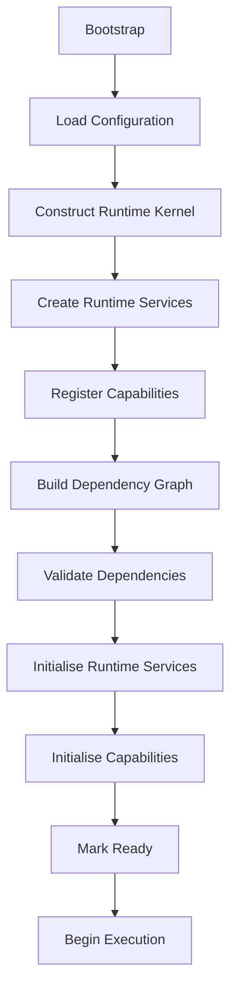
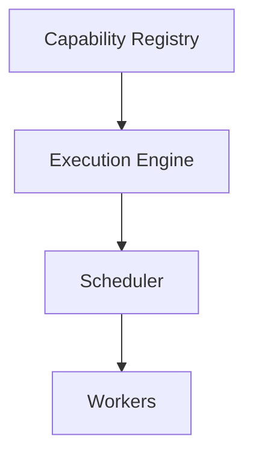

<!--
File: docs/engineering/guides/meg-005-runtime-architecture/10-startup.md
Document: MEG-005
Status: Draft
-->

# Startup

> *Startup should not be a sequence of function calls. It should be the controlled transition of a Runtime from potential to operation.*

---

# Purpose

Starting the Mosaic Runtime is significantly more complex than simply calling:

```go
main()
```

That call is only the entry point. Before any business work can begin, the Runtime must:

- validate configuration
- construct infrastructure
- build the dependency graph
- register capabilities
- initialise runtime services
- verify dependencies
- expose health
- begin execution

Every step depends upon the previous one, so the order in which they happen is itself architecture rather than an implementation detail. This document therefore defines the canonical startup sequence of the Mosaic Runtime.

---

# Philosophy

Within Mosaic:

> **Startup is deterministic, observable and dependency driven.**

Determinism here is as much a set of prohibitions as it is a property. The Runtime should never rely upon:

- hidden initialisation
- implicit ordering
- global state
- startup side effects

Every startup transition should instead be explicit, repeatable and observable. Those three properties together are what make the Runtime always start the same way.

---

# Startup Goals

Startup exists to produce an operational platform, not merely a running process. A successful startup should produce a Runtime that is:

- fully initialised
- dependency validated
- operationally healthy
- ready to execute work

No business capability should begin execution until every one of these conditions has been satisfied, because a capability starting earlier would be depending on a Runtime that has not yet established them.

---

# Startup Sequence

Every Runtime instance follows the same high-level sequence, and every stage within it owns exactly one responsibility. Nothing in a later stage may assume work that an earlier stage has not yet completed.



The shape of this sequence is not novel. It mirrors the startup sequence of mature operating systems, where the kernel, foundational services and applications initialise in dependency order.  [QNX](https://qnx.com/developers/docs/7.1/com.qnx.doc.neutrino.fastboot/topic/fb_system_startup_architecture.html)

---

# Stage 1 — Bootstrap

The executable begins, and none of the machinery that later stages depend upon exists yet. Responsibilities at this point are limited to:

- process creation
- signal registration
- initial logging
- panic handling

That leaves only the bootstrap environment. No Runtime Services exist yet, and none may be constructed until the Runtime Kernel does.

---

# Stage 2 — Configuration

Configuration is loaded before any Runtime component exists, which makes it the first thing startup can get wrong and the cheapest place to discover it. Examples include:

- database configuration
- worker limits
- scheduler configuration
- capability configuration
- module configuration

Configuration should be validated immediately, because invalid configuration should terminate startup rather than execution. Nothing has yet been constructed that a failure here would have to unwind.

---

# Stage 3 — Runtime Kernel

The Runtime Kernel is constructed, and at this point it exists and nothing else does. The Kernel becomes responsible for coordinating every remaining startup stage, which is why no Runtime Service should exist before it.

---

# Stage 4 — Runtime Services

With the Kernel in place to coordinate them, Platform Runtime Services are constructed. Construction here means only that the services exist, not that they are yet able to do anything. Examples include:

- Capability Registry
- Execution Engine
- Worker Manager
- Scheduler
- Resource Manager

Construction should remain lightweight, because heavy initialisation belongs later. A service that acquired resources at this stage would be acquiring them before the dependency graph had been validated at all.

---

# Stage 5 — Capability Registration

Capabilities register themselves with the Runtime, each presenting itself to the Capability Registry constructed in the previous stage. Registration is a declaration rather than a start, and it should collect:

- identity
- version
- dependencies
- lifecycle
- metadata

Capabilities should not begin execution yet, because the Runtime has no way of knowing whether what they have just declared can actually be satisfied.

---

# Stage 6 — Dependency Graph

The Runtime constructs the dependency graph from the registered Capabilities and the Runtime Services they rely upon. That graph becomes the authoritative startup model, which means startup order should emerge from the graph rather than from handwritten code.

---

# Stage 7 — Validation

The dependency graph is now complete, so the Runtime can interrogate it before anything acts upon it. Before any execution begins, the Runtime validates:

- dependency cycles
- missing dependencies
- version compatibility
- configuration completeness
- capability conflicts

Failure should terminate startup immediately, because partial Runtime startup is discouraged. Failing fast during startup is generally preferable to discovering dependency failures during execution.  [QNX](https://qnx.com/developers/docs/7.1/com.qnx.doc.neutrino.fastboot/topic/fb_system_startup_architecture.html)

---

# Stage 8 — Initialisation

Validation has established that the graph can be satisfied, so initialisation may now do the heavy work that construction deliberately deferred. Runtime Services initialise first, and examples include:

- creating worker pools
- opening connection pools
- preparing schedulers
- allocating resources

Capabilities then initialise, in the order the dependency graph dictates. Initialisation prepares the Runtime but does not begin execution.

---

# Stage 9 — Readiness

Every Runtime Service reports readiness, and the Runtime Kernel waits until all required services are ready before the Runtime may become operational. Readiness should be explicit and never assumed.

---

# Stage 10 — Execution

The Runtime enters the Running state, and the components that have so far only been prepared begin to act. Examples include:

- scheduler begins scheduling
- execution engine accepts work
- workers begin processing
- capabilities become operational

Startup is now complete, and the Runtime transitions into its steady operational state.

---

# Startup Ordering

Ordering should always be dependency driven. The graph rather than the author produces a sequence such as this.



The same order should not be arrived at by writing it down.

```go
StartRegistry()

StartScheduler()

StartWorkers()
```

Manual ordering should be avoided wherever practical, because a hand-written sequence records the dependencies as they stood when it was written and nothing updates it when they change.

---

# Parallel Initialisation

Independent components should initialise concurrently. Observability and Blob Storage, for example, may initialise simultaneously if neither depends upon the other, because the dependency graph determines safe parallelism.

---

# Capability Initialisation

Capabilities initialise after Runtime Services. Conceptually the Runtime becomes ready, capability initialisation then runs, and each capability in turn reaches capability ready. Capabilities should therefore assume that every required Runtime Service already exists.

---

# Startup Failure

Suppose the Scheduler reports a failed initialisation. Startup cannot continue, so the Runtime should:

- abort startup
- dispose initialised services
- release resources
- exit cleanly

Continuing with a partially initialised Runtime should generally be prohibited. The services that did initialise have already taken resources, and nothing would subsequently return them.

---

# Startup Recovery

Startup should be repeatable, so every startup attempt should produce identical behaviour given identical configuration. It should never depend upon:

- previous execution
- cached Runtime state
- hidden globals

Determinism simplifies both operations and debugging, because a Runtime that starts identically every time can be reasoned about from its configuration alone.

---

# Startup Observability

Startup is otherwise opaque while it is happening, which matters most when it is slow or has stalled. Every stage should therefore emit structured Runtime events, and examples include:

- RuntimeBootstrapping
- CapabilityRegistered
- DependencyGraphValidated
- RuntimeReady

Taken together, these events let operators always understand:

> **Where is startup currently?**

---

# Startup Timing

The Runtime should expose startup metrics so that slow startup becomes measurable rather than merely felt. Examples include:

- total startup duration
- dependency validation time
- capability registration time
- service initialisation time

Optimisation should follow evidence. Without per-stage timings the only remedy available to an engineer is guesswork.

---

# Startup Extensibility

Adding a new Runtime Service should require registration and dependency declaration, and nothing beyond them. It should **not** require rewriting startup logic, because the dependency graph should naturally integrate new Runtime Services.

---

# Anti-Patterns

The following practices are prohibited.

## Hidden Initialisation

Constructors performing heavy work automatically. Initialisation then happens wherever a value is created rather than at the stage that owns it.

---

## Manual Startup Ordering

Hard-coded service startup sequences. Startup ordering must follow the dependency graph, and a sequence written by hand follows nothing.

---

## Partial Runtime

Continuing execution despite failed dependency validation. Dependency validation must complete before execution begins.

---

## Capability Startup Before Runtime

Capabilities executing before Runtime Services become ready. Runtime Services must initialise before capabilities, so a capability that starts early depends upon something that may not yet exist.

---

## Global Mutable Startup State

Sharing startup information through package globals. Startup should never depend upon hidden globals, because they make ordering implicit once again.

---

## Silent Startup Failure

Suppressing startup failures and attempting recovery without operator visibility. Startup must remain observable, and that obligation applies most strongly when startup fails.

---

# Mosaic Guidelines

Within Mosaic:

- Startup must be deterministic.
- Configuration must be validated before Runtime construction.
- Runtime Services must initialise before capabilities.
- Dependency validation must complete before execution begins.
- Startup ordering must follow the dependency graph.
- Startup should maximise safe parallelism.
- Startup must remain observable.
- Startup failures should terminate the Runtime cleanly.
- The Runtime must become fully ready before accepting work.

---

# Relationship to MEG

The Resource Manager determines:

> **Whether sufficient Runtime resources exist.**

Startup determines:

> **How those resources, Runtime Services and Capabilities become one operational platform.**

The next chapter introduces **Shutdown**, describing the symmetrical process through which the Runtime safely transitions from execution back to a fully stopped state.

---

# Summary

Startup is the Runtime's first responsibility, and every later Runtime behaviour depends upon it having established a correct operational foundation. A successful startup produces a Runtime that is:

- complete
- validated
- observable
- deterministic

Within Mosaic, startup should therefore feel less like launching an application and more like booting an operating system.
