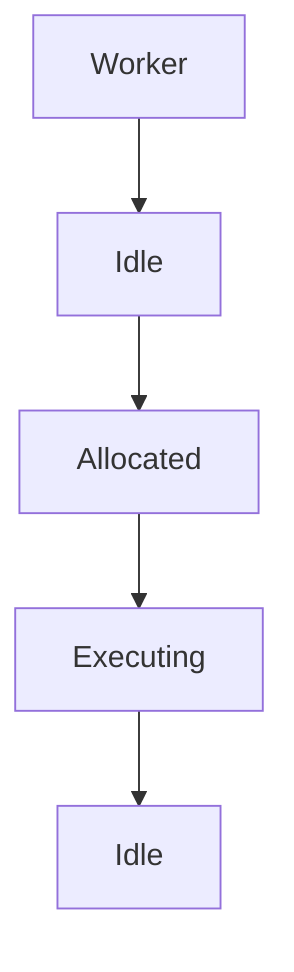
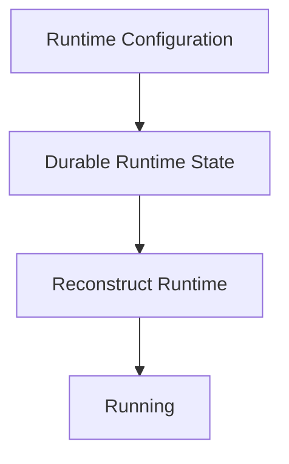

<!--
File: docs/engineering/guides/meg-005-runtime-architecture/12-runtime-state.md
Document: MEG-005
Status: Draft
-->

# Runtime State

> *Business state belongs to capabilities. Runtime state belongs to the Runtime. The two should never be confused.*

---

# Purpose

The Mosaic Runtime continuously maintains information describing its own operational condition, including loaded capabilities, worker utilisation, scheduler status, execution queues, the dependency graph, health and lifecycle. This information is essential for operating the platform, but it is **not** business information. This document defines the Runtime State maintained by the Mosaic Runtime and establishes the boundary between operational state and business state.

---

# Philosophy

Within Mosaic:

> **The Runtime knows how the platform is operating. Capabilities know what the platform is doing.**

The Runtime should therefore never own playback progress, library contents, metadata or recommendations, and capabilities should never own worker state, scheduler state, execution queues or lifecycle state. Each model remains independent.

---

# What Is Runtime State?

Runtime State is the operational state required for the Runtime to function, such as service lifecycle, worker allocation, active executions, queue depth, resource utilisation and capability registration. It describes:

> **The execution environment.**

It does not describe:

> **The business.**

---

# Runtime State Categories

Runtime State naturally separates into several categories — lifecycle, execution, resources, capabilities, health and observability — and each category represents one operational concern. The Runtime should avoid mixing unrelated state, because a category that absorbs a neighbouring concern loses the single owner that makes it operable.

---

# Lifecycle State

Lifecycle State records where Runtime components currently exist within their lifecycle, moving through Created, Ready, Running, Stopping and Disposed. This information belongs exclusively to the Runtime; capabilities participate in the lifecycle but they do not own it.

---

# Execution State

Execution State describes currently executing work: active Work Units, queued work, running workers, execution latency and execution completion. It exists only while work is executing, which means it should never become business state.

---

# Capability State

The Runtime maintains capability metadata — whether a capability is registered, enabled, disabled, healthy or failed, and which version it is. This state describes Capability Availability rather than Capability Business State.

The difference is easiest to see by example. Recording that Playback is Healthy is Runtime State, whereas recording that Playback Progress is 37 Minutes is business state. The distinction should remain absolute.

---

# Resource State

Resource State describes Runtime resource usage: worker pool utilisation, memory allocation, queue capacity, connection pools and scheduler capacity. The Runtime owns these resources and business capabilities simply consume them.

---

# Dependency State

The Runtime maintains the dependency graph, covering dependency resolution, blocked capabilities, startup ordering and shutdown ordering. This state enables deterministic Runtime behaviour, but it has no business meaning.

---

# Health State

Health represents operational readiness, and a component is either Healthy, Degraded or Unavailable. Health answers:

> **Can this component currently perform its operational responsibilities?**

It does not answer:

> **Is the business correct?**

Those are different questions, and conflating them makes operational signals unreadable.

---

# Observability State

The Runtime also maintains operational telemetry: traces, metrics, structured logs, execution history and queue history. Observability supports operators, so it should never influence business behaviour.

---

# Runtime State Ownership

Every category of Runtime State has exactly one owner:

- Worker State belongs to the Worker Manager.
- Schedule State belongs to the Scheduler.
- Execution State belongs to the Execution Engine.
- Capability State belongs to the Capability Registry.

Shared ownership is prohibited, because ownership determines mutation, persistence and observability, and none of those can be decided consistently by two components at once.

---

# Runtime State Is Ephemeral

Most Runtime State is temporary — Queue Depth, Worker Allocation and Active Execution all describe a moment rather than a fact — so if the Runtime restarts this state naturally disappears. Only durable Runtime State should survive restart.

---

# Durable Runtime State

Some Runtime State should survive restart, notably recurring schedules, capability configuration, dependency metadata and runtime configuration. This information allows the Runtime to resume normal operation after restart. Durability should remain deliberate rather than automatic.

---

# Business State

Business State belongs exclusively to capabilities, and it includes Playback Progress, Metadata, Library Contents and Collection Membership. The Runtime should never mutate, persist or interpret business state; it merely provides the environment in which capabilities manage it.

---

# Runtime State Transitions

Runtime State changes frequently. A worker, for example, cycles continuously between availability and work.

These transitions should remain deterministic, observable and inexpensive, because operational correctness depends upon them.

---

# Runtime Snapshots

The Runtime may expose snapshots of operational state, describing Capabilities, Workers, Queues and Resources as a single Runtime Snapshot. Snapshots assist diagnostics, support, monitoring and debugging, and they should remain read-only: they describe the Runtime rather than control it.

---

# Runtime State Is Not Configuration

Configuration describes:

> **How the Runtime should operate.**

Runtime State describes:

> **How the Runtime is currently operating.**

These concepts should remain separate because they change on entirely different timescales — configuration changes are infrequent, whereas Runtime State changes continuously.

---

# Runtime State Is Not Cache

Likewise, Runtime State is not a Business Cache. Business caching belongs to capabilities, whereas Runtime State exists solely to support Runtime operation, so the two should never be conflated.

---

# Runtime State Recovery

Following restart, the Runtime rebuilds itself from what it deliberately kept.

Temporary Runtime State should not be restored unnecessarily, because only operationally valuable state should persist.

---

# Observability

Runtime State should be observable, which means operators should be able to answer:

- What is running?
- What is waiting?
- Which capabilities exist?
- Which workers are active?
- Which resources are constrained?

The Runtime should explain itself continuously.

---

# Anti-Patterns

The following practices are prohibited.

## Business State Inside Runtime

Holding Playback Progress inside the Runtime.

---

## Runtime State Inside Domain

Aggregates storing:

- worker IDs
- queue depth
- scheduler metadata

---

## Shared Ownership

Multiple Runtime components mutating the same Runtime State.

---

## Permanent Execution State

Persisting transient execution information unnecessarily.

---

## Runtime Decisions Using Business State

The Runtime should remain operationally focused, because business decisions belong to capabilities.

---

## Capabilities Reading Runtime Internals

Capabilities depending upon queue depth or worker allocation.

---

# Mosaic Guidelines

Within Mosaic:

- Runtime State must remain operational.
- Business State must remain inside capabilities.
- Every Runtime State category must have one owner.
- Runtime State should remain observable.
- Temporary Runtime State should remain ephemeral.
- Durable Runtime State should be explicitly identified.
- Runtime State must not leak into the Domain.
- Configuration must remain separate from Runtime State.
- Runtime State should describe execution, not business.

---

# Relationship to MEG

Startup and Shutdown define:

> **How the Runtime begins and ends.**

Runtime State defines:

> **What the Runtime knows about itself while it exists.**

The next chapter provides practical Runtime Architecture guidance for contributors implementing new Runtime Services and evolving the Runtime over time.

---

# Summary

The Runtime maintains one model and capabilities maintain another. The Runtime's model describes execution, resources, health and lifecycle, whereas capabilities describe business, behaviour, users and media.

Maintaining this separation is one of the most important architectural decisions within Mosaic, because it allows the Runtime to evolve operationally without ever becoming responsible for the business itself.  [Wikipedia](https://en.wikipedia.org/wiki/Architectural_state)
