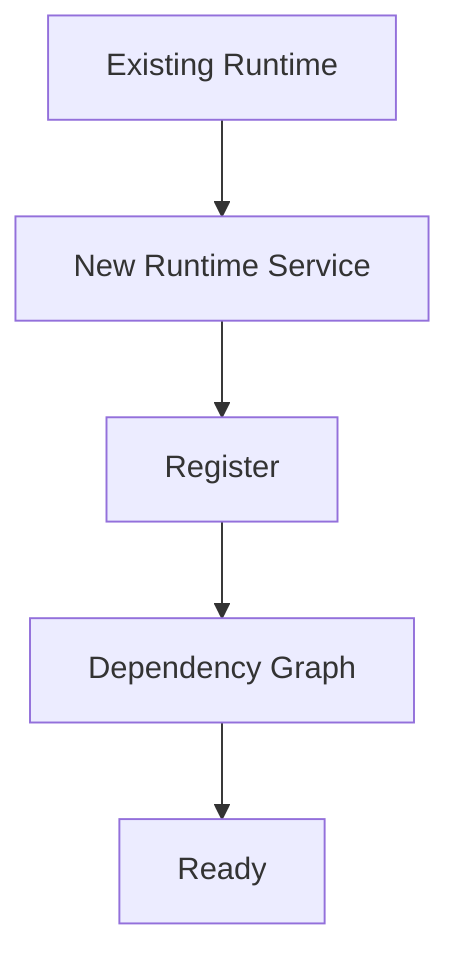
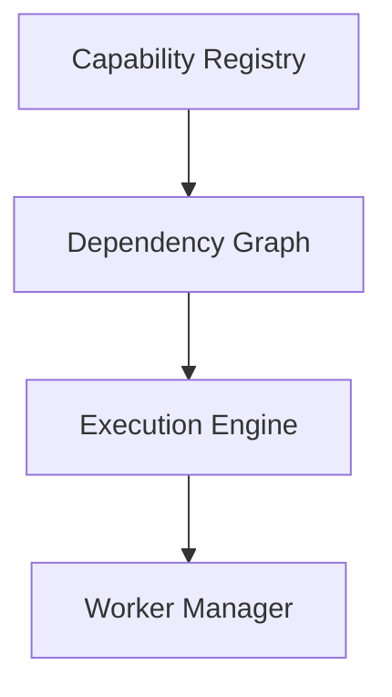

<!--
File: docs/engineering/guides/meg-005-runtime-architecture/13-runtime-modelling-guidelines.md
Document: MEG-005
Status: Draft
-->

# Runtime Modelling Guidelines

> *A Runtime should grow by adding capabilities, not by increasing complexity.*

---

# Purpose

The previous chapters introduced the structural building blocks of the Mosaic Runtime:

- Runtime Kernel
- Capability Registry
- Dependency Graph
- Execution Engine
- Worker Manager
- Scheduler
- Resource Manager

This document brings those concepts together into practical modelling guidance, so that engineers can answer one question.

> **"Where does this Runtime component belong?"**

---

# Philosophy

Within Mosaic:

> **The Runtime should provide execution, not accumulate business behaviour.**

Every Runtime component should exist because it enables capabilities, not because it implements them. As the platform grows the Runtime should therefore become more capable without becoming more complicated.

---

# Start With Responsibility

Before introducing a new Runtime component ask:

> **What single Runtime responsibility does this component own?**

Good answers name one concern — scheduling, worker allocation, capability discovery or dependency validation. Avoid introducing components that own multiple unrelated responsibilities, because small Runtime Services compose more effectively than large ones.

---

# Distinguish Runtime From Business

A useful question is:

> **Would this concept still exist if every business capability disappeared?**

If the answer is Yes it probably belongs in the Runtime, as with the Worker Pool, the Scheduler and the Resource Manager. If the answer is No it probably belongs to a capability, as with Playback, Library, Metadata and Recommendations. This distinction should remain one of the strongest modelling heuristics within Mosaic.

---

# Prefer Runtime Services

Whenever new operational behaviour appears ask:

> **Can this become an independent Runtime Service?**

The preferred shape is a Runtime Kernel that delegates to distinct services such as the Scheduler, the Execution Engine and the Resource Manager, rather than a Runtime Kernel that absorbs Everything. The Kernel should coordinate, whereas Runtime Services should perform the work.

---

# Protect The Kernel

The Runtime Kernel should remain intentionally small, so before adding functionality ask:

> **Does the Kernel really need to know this?**

If another Runtime Service could own the responsibility, move it there. The Kernel should evolve slowly while Runtime Services evolve freely.

---

# Model Capabilities

The Runtime executes capabilities and should never execute arbitrary business objects. The preferred path runs from a Capability, through an Operation, to the Execution Engine; passing a Random Function directly to the Runtime is to be avoided. Everything executable within Mosaic should ultimately belong to a registered capability, which reinforces the platform's capability-oriented architecture.

---

# Runtime Contracts

Every Runtime interaction should occur through explicit contracts, covering Lifecycle, Scheduling, Execution, Resource Allocation and Capability Registration. Avoid hidden communication between Runtime Services, because contracts are what make Runtime relationships obvious.

---

# Avoid Runtime Shortcuts

Suppose the Scheduler Needs Worker capacity. Reaching straight for the Worker Pool is poor practice; the preferred route runs from the Scheduler through the Execution Engine to the Worker Manager. The Runtime architecture should remain layered, because bypassing Runtime Services usually creates long-term coupling.

---

# Dependency Direction

Every Runtime dependency should point towards the Runtime Kernel: conceptually the Worker Manager, the Scheduler and the Execution Engine each depend upon the Kernel rather than upon one another. Runtime Services should not form complex dependency meshes, so that the Dependency Graph remains understandable.

---

# Runtime State

Before introducing new Runtime state ask:

> **Who owns this information?**

The answer should always be a single component: worker utilisation belongs to the Worker Manager, capability metadata to the Capability Registry, and execution progress to the Execution Engine. Ownership should always remain singular.

---

# Build For Replacement

Every Runtime Service should be replaceable, so ask:

> **Could another implementation satisfy the same contract?**

Scheduler V1 should give way to Scheduler V2, and Worker Pool A to Worker Pool B, without disturbance elsewhere. If replacing the component requires changing the Runtime Kernel, the abstraction probably needs refinement.

---

# Runtime Growth

The preferred Runtime growth pattern adds rather than rewrites.

Avoid modifying existing Runtime Services unnecessarily, because growth should occur primarily through composition rather than modification.

---

# Runtime Services Should Not Discover Each Other

It is poor practice for the Scheduler to Find Worker Manager and then Execute against it directly. The preferred route sends the Scheduler through a Kernel Contract to the Execution Engine. The Runtime should remain explicitly composed, because hidden service discovery weakens architectural clarity.

---

# Prefer Determinism

Runtime behaviour should remain deterministic. Given identical:

- configuration
- capabilities
- dependency graph

the Runtime should produce identical startup, execution and shutdown behaviour. Determinism dramatically simplifies:

- debugging
- testing
- operations

---

# Runtime Models

Every Runtime component should answer:

- What do I own?
- What do I expose?
- What do I require?
- Who depends upon me?

If these questions cannot be answered clearly, the Runtime model probably requires refinement.

---

# Runtime Diagrams

Before implementing a Runtime Service, draw it.

Simple diagrams frequently reveal circular dependencies, ownership confusion and unnecessary coupling, so architecture should become obvious before code exists. Good architecture documentation should clearly communicate component responsibilities and interactions while remaining easy to evolve alongside the system.  [Qt](https://www.qt.io/software-insights/best-practices-for-architecture-documentation)

---

# Runtime Review Checklist

Before implementing a Runtime Service ask:

- [ ] Does it own one Runtime responsibility?
- [ ] Does it remain business agnostic?
- [ ] Could it become its own Runtime Service?
- [ ] Does it expose explicit contracts?
- [ ] Does it preserve dependency direction?
- [ ] Is ownership obvious?
- [ ] Is Runtime state clearly owned?
- [ ] Can it be replaced independently?
- [ ] Does it strengthen the Runtime rather than complicate it?

If any answer is "no", continue modelling; implementation should wait.

---

# Common Runtime Modelling Mistakes

Avoid:

- adding business behaviour to the Runtime
- creating "manager" services that own unrelated responsibilities
- introducing hidden dependencies
- bypassing Runtime Services
- centralising every operational concern inside the Kernel
- sharing Runtime state between components

These patterns inevitably produce Runtime monoliths.

---

# Mosaic Guidelines

Within Mosaic:

- Every Runtime component must own one responsibility.
- Runtime growth should occur through composition.
- The Runtime Kernel must remain small.
- Runtime Services should communicate through contracts.
- Runtime state must have explicit ownership.
- Capabilities must remain separate from Runtime infrastructure.
- Runtime behaviour should remain deterministic.
- Architectural clarity should always outweigh implementation convenience.

---

# Relationship to MEG

This chapter completes the practical Runtime Architecture guidance of MEG-005.

The remaining documents describe:

- supervisor authority
- architectural reasoning (ADRs)
- contributor expectations
- terminology
- references

The next specification, **[MEG-006](../meg-006-module-platform/index.md) – Module Platform**, will build directly upon this Runtime Architecture by defining how third-party capabilities integrate into the Runtime without modifying it.

---

# Summary

A well-designed Runtime should disappear into the background, so that engineers spend their time building capabilities rather than extending the Runtime itself. Within Mosaic, every Runtime component should make one thing easier:

> **Building independently evolving capabilities.**

When that remains the guiding principle, the Runtime grows into a platform rather than a framework.
