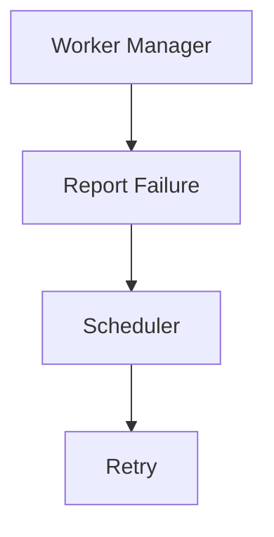

<!--
File: docs/engineering/guides/meg-005-runtime-architecture/16-contributor-guidance.md
Document: MEG-005
Status: Draft
-->

# Contributor Guidance

> *Every Runtime contribution should make the platform simpler to operate, not merely more capable.*

---

# Purpose

The Mosaic Runtime is the execution platform upon which every capability depends, which gives Runtime changes a blast radius that ordinary business changes do not have. A change to a single capability is contained by that capability, whereas a change to the Runtime affects:

- every capability
- every module
- every deployment
- every operator

This document therefore provides practical guidance for engineers contributing to the Runtime Architecture. Its purpose is to ensure the Runtime continues to evolve without accumulating unnecessary complexity, because complexity added here is paid for everywhere.

---

# Philosophy

Within Mosaic:

> **Protect the Runtime before extending it.**

The Runtime should evolve because the platform requires new execution capabilities, and it should never evolve because business behaviour has leaked into infrastructure. The two motives can be hard to tell apart in review, since both arrive as a plausible feature that something genuinely needs. Whenever they conflict the Runtime remains generic and business remains within capabilities.

---

# Before Writing Runtime Code

Runtime complexity usually arrives one reasonable-looking feature at a time, so the placement question is worth asking before the code exists rather than during review. Before implementing a Runtime feature ask:

- Does this belong in the Runtime?
- Or does it belong in a capability?
- Does this improve execution?
- Or does it implement business behaviour?

If the answer involves playback, metadata, libraries or recommendations, it almost certainly belongs outside the Runtime. Those are business concerns, and placing them in infrastructure makes them harder to change precisely because the Runtime is the layer that must stay stable.

---

# Before Creating A Runtime Service

A Runtime Service is only as useful as the boundary it draws, so every Runtime Service should answer one question.

> **What single Runtime responsibility do I own?**

The Scheduler, the Worker Manager and the Capability Registry each answer it in a single clause, which is why they work as services. A service that needs a paragraph to describe its responsibility has usually absorbed two. Avoid creating services that answer:

> **Everything.**

Responsibilities should remain narrow, because a narrow service can be reasoned about, replaced and tested on its own.

---

# Before Modifying The Kernel

The Runtime Kernel should change rarely, and the strongest evidence that a Kernel change is unnecessary is usually that some other component could carry the same responsibility. Before modifying it ask:

- Can this responsibility become a Runtime Service?
- Does the Kernel genuinely require this knowledge?
- Would another component own this more naturally?

The Kernel should remain stable throughout the lifetime of the platform, so knowledge that could live outside it should. Every addition makes the layer beneath everything else harder to reason about and harder to leave alone.

---

# Before Adding A Dependency

Dependencies between Runtime components are the mechanism by which a modular Runtime quietly becomes a monolithic one, so each new edge deserves a question:

> **Does this dependency improve Runtime coordination or introduce Runtime coupling?**

Runtime Services should depend upon contracts, Runtime abstractions and explicit interfaces rather than upon each other, so avoid direct dependencies between Runtime Services wherever practical. The Dependency Graph should remain obvious, and a graph that needs explaining has already stopped being obvious.

---

# Before Adding Runtime State

State is easier to add than to remove, and shared or ambiguously owned state is the hardest kind to remove later. Ask:

- Who owns this state?
- Is it operational?
- Does another Runtime Service already own it?

Runtime State should remain explicit, singularly owned and operational, because business state belongs elsewhere. Two components that both believe they own a value will eventually disagree about it.

---

# Before Introducing Scheduling

Scheduling belongs only inside the Scheduler. A Worker Manager that decides to schedule retry has absorbed a responsibility it does not own; it should instead report failure to the Scheduler and let the Scheduler own the retry.

Responsibilities should remain clearly separated, because retry behaviour spread across several components cannot be reasoned about or changed in one place.

---

# Before Introducing Workers

Capabilities should never create workers, because only the Worker Manager owns worker lifecycle. A capability that creates its own workers puts execution resources outside the Runtime's view, where the Runtime can neither observe them nor include them in shutdown draining. Ask:

- Can existing workers execute this?
- Does the Worker Manager need enhancement?
- Does this belong in execution rather than business?

The Runtime should retain ownership of execution resources.

---

# Before Modifying Startup

Startup should remain deterministic, dependency driven and observable, which means avoiding hidden initialisation, implicit ordering and startup side effects. Those three are tempting because they usually work on the machine where they were written, but each converts a stated dependency into an assumed one and turns a startup failure into a puzzle for whoever meets it next. Every startup change should preserve the canonical startup sequence.

---

# Before Modifying Shutdown

Shutdown should preserve cooldown, draining, resource cleanup and dependency ordering, and it should never be optimised by sacrificing business correctness. It is the easiest lifecycle stage in which to cut corners, because a shutdown that discards work still looks like it succeeded. Graceful shutdown is more valuable than rapid shutdown.

---

# Before Adding Observability

Telemetry follows the same ownership rule as everything else in the Runtime, so ask:

> **Is this Runtime information or business information?**

Worker utilisation, queue depth, scheduler latency and capability lifecycle are Runtime telemetry, whereas playback completion, media imported and recommendations generated are business telemetry. The Runtime should observe itself and capabilities observe the business, which keeps each set of signals meaningful to the people who act on it.

---

# Runtime Reviews

A Runtime review is the last point at which a boundary problem is still cheap to fix, so reviews should focus on:

- ownership
- dependency direction
- lifecycle
- modularity
- observability
- operational simplicity

Performance improvements should never weaken Runtime architecture. A faster Runtime with unclear ownership is a worse Runtime, because the structural cost outlives the measurement that justified it.

---

# Runtime Refactoring

Refactoring the Runtime is an opportunity to remove structure rather than rearrange it, so when refactoring ask:

- Can this Runtime Service become smaller?
- Can this responsibility move outward?
- Can this contract become clearer?
- Can this dependency disappear?

Runtime refactoring should generally reduce complexity, not merely rearrange it. Work that leaves the same concepts in different files has spent review effort without making the platform easier to operate.

---

# Runtime Testing

Runtime tests exist to prove that execution behaves predictably under conditions operators cannot easily reproduce, so every Runtime contribution should include tests for:

- lifecycle
- startup
- shutdown
- dependency validation
- execution
- resource ownership
- observability

Runtime tests verify Runtime behaviour, so business tests belong elsewhere. A Runtime test that depends on playback or metadata behaviour has usually found a boundary violation rather than a missing test.

---

# Runtime Documentation

Runtime documentation should evolve alongside implementation, because documentation that lags the Runtime is worse than absent documentation — it is believed. Whenever introducing:

- Runtime Service
- Runtime contract
- lifecycle stage
- dependency relationship

consider updating:

- MEG-005
- Runtime diagrams
- ADRs
- contributor documentation

Architecture should never become tribal knowledge. The Runtime affects every operator, and most of them will never be able to ask the engineer who made the change.

---

# Runtime Checklist

Before requesting review, confirm each of the following. The checklist restates the guidance above in the order a reviewer tends to encounter it.

## Runtime Structure

- [ ] One responsibility per Runtime Service.
- [ ] Runtime Kernel remains small.
- [ ] Dependencies remain explicit.

---

## Execution

- [ ] Scheduler remains independent.
- [ ] Execution Engine remains business agnostic.
- [ ] Worker Manager retains ownership of workers.

---

## Runtime State

- [ ] Ownership remains explicit.
- [ ] Business state has not entered the Runtime.
- [ ] Runtime state remains observable.

---

## Lifecycle

- [ ] Startup remains dependency driven.
- [ ] Shutdown remains graceful.
- [ ] Lifecycle remains deterministic.

---

## Documentation

- [ ] MEG updated where required.
- [ ] ADR created where appropriate.
- [ ] Diagrams remain accurate.
- [ ] Runtime contracts documented.

Every Runtime change should strengthen both the implementation and the documentation, since a correct Runtime that nobody can explain will not stay correct.

---

# Common Runtime Mistakes

The recurring mistakes share a shape: each trades a small amount of immediate convenience for a lasting structural cost. Avoid:

- adding business behaviour to Runtime Services
- growing the Runtime Kernel
- introducing hidden dependencies
- bypassing Runtime contracts
- creating private worker pools
- embedding scheduling inside capabilities
- storing business state in Runtime components

These decisions often seem convenient initially, but they become expensive later, and they are rarely undone by the engineer who made them.

---

# Engineering Culture

Guidance of this kind only holds when contributors share the instincts behind it, so Runtime contributors should strive to:

- simplify execution
- clarify ownership
- improve observability
- reduce coupling
- preserve replaceability
- question unnecessary complexity

The Runtime should become easier to understand as it grows, not harder. That is an unusual property for infrastructure, and it survives only where it is treated as a requirement rather than an aspiration.

---

# Relationship to MEG

This document explains how contributors should evolve the Runtime Architecture established throughout MEG-005. The previous chapters define:

> **How the Runtime is structured.**

This chapter defines:

> **How engineers should preserve that structure over time.**

Structure is easier to describe than to keep, which is why protecting Runtime Architecture is a shared engineering responsibility rather than a single review step.

---

# Summary

The Runtime should feel dependable, predictable and boring, and that is not a criticism. Infrastructure succeeds when engineers rarely think about it because it consistently behaves exactly as expected, so within Mosaic every Runtime contribution should strengthen that property by making the execution platform:

- simpler
- clearer
- more modular
- more observable

Capabilities create value, and the Runtime quietly makes that value possible.
