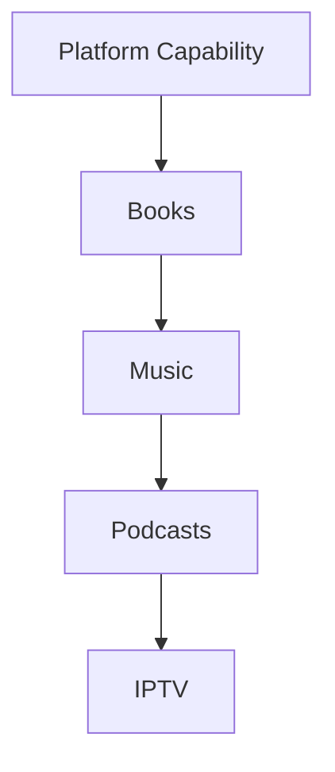
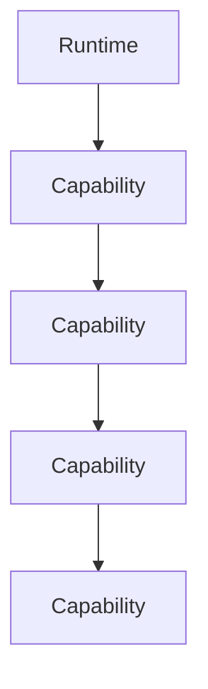
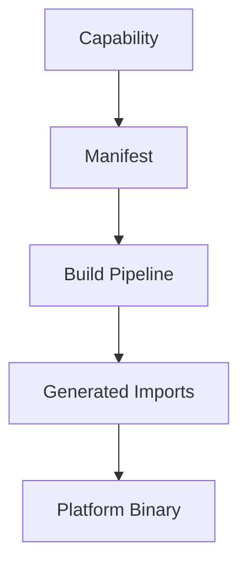
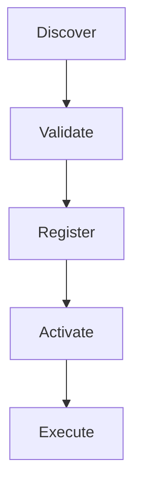
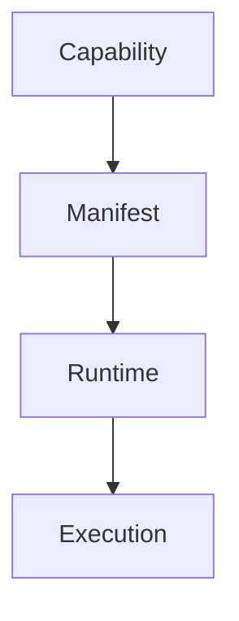

<!--
File: docs/engineering/guides/meg-006-module-platform/01-module-philosophy.md
Document: MEG-006
Status: Draft
-->

# Module Philosophy

> *The Runtime should never need to know what tomorrow's capabilities look like. It should simply know how to host them.*

---

# Purpose

Traditional software grows by modifying the Platform foundation. Every new feature requires new services, new modules, new dependencies and new deployment, so the foundation becomes increasingly complex as the product succeeds. Mosaic intentionally rejects this approach: the Runtime remains small, and the platform grows by adding capabilities rather than by enlarging the thing that runs them. This document establishes the architectural philosophy behind the Mosaic Module Platform.

---

# Philosophy

Within Mosaic:

> **The Platform evolves through build-time capability composition, not through Runtime plugin loading.**

Every new business feature should ideally be introduced by adding a capability, registering it and allowing the Runtime to execute it, rather than by modifying the Runtime itself. The Runtime should therefore become increasingly capable without becoming increasingly complicated.

Mosaic consequently does not support runtime plugins, because Modules are ordinary Go libraries that are statically linked into a Platform Binary. Nor does Mosaic use RPC between local Modules, since local Module collaboration occurs through Platform capabilities, Capability Managers and the Event Bus.

---

# Why Modules Exist

Consider adding support for Books, Comics, Audiobooks, Music, Podcasts and IPTV. Traditional architecture absorbs each of these into the base application.



Eventually the base application owns every business concept, which means each new media type enlarges the very thing every other media type depends upon. Mosaic instead treats each of them as a capability hosted by the Runtime.



The Runtime remains unchanged, and only capabilities increase.

---

# Capabilities Before Features

Within Mosaic, features are not architectural units — capabilities are. Naming the work *Add Podcast Feature* is the poor formulation and *Podcast Capability* is preferred, and the distinction matters because capabilities possess:

- lifecycle
- dependencies
- contracts
- manifests
- ownership

Features do not.

---

# The Runtime Is Complete

One of the most important ideas within Mosaic is that the Runtime should already contain everything required to execute future capabilities. Adding a capability should **not** require Runtime modification or Runtime redesign, although it does require producing a new Platform package for the selected Generation. The stable Runtime foundation remains unchanged while the composed Platform Binary changes.

The composition flow therefore runs from the capability itself through to the binary that hosts it:



The Runtime should recognise statically registered capabilities at startup.

---

# No Runtime Plugins

Mosaic intentionally avoids runtime plugin mechanisms, so Modules are not plugin framework artefacts, dynamic libraries, DLLs, RPC services, reflection-discovered packages or runtime-loaded extensions. They are normal Go libraries, laid out like any other Go project.

```text
module-anilist/

    go.mod
    module.go
    metadata.go
    artwork.go
```

The final Runtime is a single statically linked Go executable, which means that to the finished binary there is no meaningful distinction between Platform code and Module code. There is only Go code selected for the current Platform package.

---

# What Is A Module?

A Module is a normal Go project, structured exactly as its authors would structure any other library.

```text
module-anilist/

    go.mod
    module.go
    metadata.go
    artwork.go
    graphql.go
```

There is no special runtime container, DLL boundary, reflection registration layer or RPC sidecar. The Module depends on the Mosaic SDK, implements Platform-owned contracts, and is compiled into the selected Platform Binary.

---

# Module Responsibilities

A Module may contribute one or more Platform capabilities, and the range of contribution is deliberately wide:

- Metadata Provider
- Artwork Provider
- Media Provider
- Search Provider
- Authentication Provider
- GraphQL Schema
- Event Handlers
- Scheduled Jobs

A Module never modifies the Platform; it contributes implementations for Platform-owned contracts.

---

# Built-In Capabilities Are Not Special

Architecturally, Platform capabilities should be treated exactly like module capabilities. Playback, Metadata and Library are all capabilities, and the only distinction between them and anything a Module delivers is delivery itself: Platform capabilities ship with the Runtime, whereas Modules ship independently. Execution should remain identical.

This module-first philosophy keeps the Platform foundation small and stable by giving built-in and module-delivered capabilities the same architectural model.  [Bifrost](https://docs.getbifrost.ai/architecture/platform/plugins)

---

# Runtime Neutrality

The Runtime should remain neutral, which means it should not know about Anime, Movies, Books, Jellyfin, Stremio or TMDB. It should know only that something is a Capability, because everything else belongs to the capability itself.

---

# Platform Growth

The preferred growth model adds a New Capability alongside an unchanged Runtime, rather than requiring the platform to Modify Runtime before it can Add Feature. The platform therefore grows by composition, not by accumulation.

---

# Discovery Before Execution

One of the defining characteristics of the Module Platform is that every capability passes through a fixed sequence before any of its code runs:



The Runtime should completely understand a capability before executing any of its code, so discovery should be metadata driven and execution should come later. Mosaic separates **manifest resolution** from **build-time composition**, allowing validation before executable code becomes part of an activated Generation.

---

# Manifest First

Every capability begins with a manifest, which describes its identity, dependencies, permissions, contracts, configuration and capabilities. The Supervisor and Build Pipeline should understand that manifest before the implementation becomes part of a Platform package, which is why the manifest becomes the Supervisor's primary source of truth for Module composition.

---

# Capabilities Are Products

Capabilities should be developed as independently evolving products, and each capability owns its own business behaviour, documentation, lifecycle, testing and versioning. Capabilities should not depend upon private Runtime implementation, because the Runtime provides the platform and capabilities provide value.

---

# Runtime Contracts

Every interaction with the Runtime should occur through stable contracts, covering lifecycle, execution, configuration, scheduling and permissions. Capabilities should never depend upon Runtime internals, which is what allows the Runtime to evolve independently.

---

# Replaceability

Capabilities should remain replaceable. Suppose a Metadata Capability is superseded by a Version 2: the Runtime should require Manifest Validation, then Activation, and the replacement is Ready — nothing else. Capabilities should be interchangeable wherever practical.

---

# Capability Isolation

Every capability should execute independently. Suppose a Recommendation Capability reaches Failure; the Runtime should ensure that the Playback Capability is Unaffected, because capability failures should never destabilise the platform. Isolation is one of the defining responsibilities of the Runtime.

---

# Runtime Evolution

The Runtime evolves by improving execution, whereas capabilities evolve by improving business behaviour, and these concerns should remain independent. Runtime improvement looks like a faster scheduler, improved worker pools and better observability; capability improvement looks like better metadata, improved playback and smarter recommendations. Neither should require modifying the other.

---

# Module Equality

The Runtime should never distinguish between Platform capabilities, First-party capabilities and Third-party capabilities. Every capability should satisfy the same Runtime contracts and participate equally in lifecycle, discovery, execution and observability, because architectural equality greatly simplifies the platform.

---

# Marketplace Thinking

The Runtime should eventually support an ecosystem, and that ecosystem depends upon predictable contracts, stable manifests, manifest resolution, build-time composition and version compatibility. The Runtime should therefore be designed for capabilities that have not yet been written.

Platform ecosystems thrive when the host defines stable module boundaries and capabilities register through manifests rather than bespoke integration code.  [arc42 Quality Model](https://quality.arc42.org/approaches/plugin-architecture)

---

# Simplicity

The Module Platform should remain conceptually simple, and everything reduces to one sentence:



Everything else is implementation.

---

# Mosaic Principles

Within Mosaic:

- The Runtime grows through capabilities.
- Capabilities are first-class architectural units.
- Built-in and module-delivered capabilities are architectural equals.
- Discovery precedes execution.
- Manifests define Runtime contracts.
- Runtime neutrality must be preserved.
- Capabilities remain independently deployable.
- Runtime evolution and capability evolution remain independent.

These principles define the identity of the Module Platform.

---

# Relationship to MEG

[MEG-005](../meg-005-runtime-architecture/index.md) defined:

> **How the Runtime executes capabilities.**

MEG-006 now begins defining:

> **How capabilities become part of the Runtime.**

The next chapter introduces the **Capability Manifest**, the machine-readable contract through which every capability describes itself to the platform.

---

# Summary

The Module Platform exists for one purpose.

> **Allow the platform to grow forever without growing the Runtime.**

The Runtime should become increasingly powerful by hosting more capabilities, not by accumulating more business behaviour, and that distinction is what transforms Mosaic from an application into a platform.
